# CME 211 Lecture 2: Introduction to Python

## Python

* Python is a high level language that runs in an *interpreter*
* An *interpreter* is a program (see `$ python`) that executes statements from a
  high level language
* Examples of high level interpreted languages: Python, R, Matlab, Perl,
  JavaScript
* The most widely used Python interpreter is called **CPython**.  It is written
  in C.  There are others, for example **Jython** and **IronPython**.  It is
  fairly easy (with experience) to access code written in C from **CPython**.
* Python now has a long history.  Version 1.0 was released in 1994.
* This class will use Python 2.  However, we will use the syntax most compatible
  with Python 3 and discuss differences along the way.

The "working directory" is where your
shell is currently focued.  To see what your "working directory" is:

```py
$ pwd
/afs/ir/users/n/w/nwh
```

### Python as a calculator

The Python interpreter uses `>>>` as a command prompt (by default).  It is often
useful to use the Python interpreter as a simple calculator:

```py
>>> 4+7
11
>>> 55*2
110
>>> 9-1.4
7.6
>>> 2/4
0
>>> 2//4
0
>>> 2.0/4
0.5
>>> 2.0//4
0.0
>>>
```

## Integers and floating point

In CME 212, we will discuss in detail the computer representation of integers
and floating point numbers.  For now:

- It is best to think of integers as being represented exactly over a fixed
  range.  (This is not really true in current versions of Python, but will be
  true in C++)

- Floating point numbers are *approximations* of real numbers over a limited
  range.

- Floating point number range is not continuous.  There are gaps between
  floating point numbers that depend on the scale.  The gap between `1.0` and
  the next representable floating point number is smaller than the gap between
  `1.0e50` and the next representable floating point number.

### Some more examples

```py
>>> 1.0
1.0
>>> 3/5
0
>>> 3./5
0.6
>>> 3/5.
0.6
>>> 3%5 #`%` operator returns the remainder for integer division.
3
>>>
```
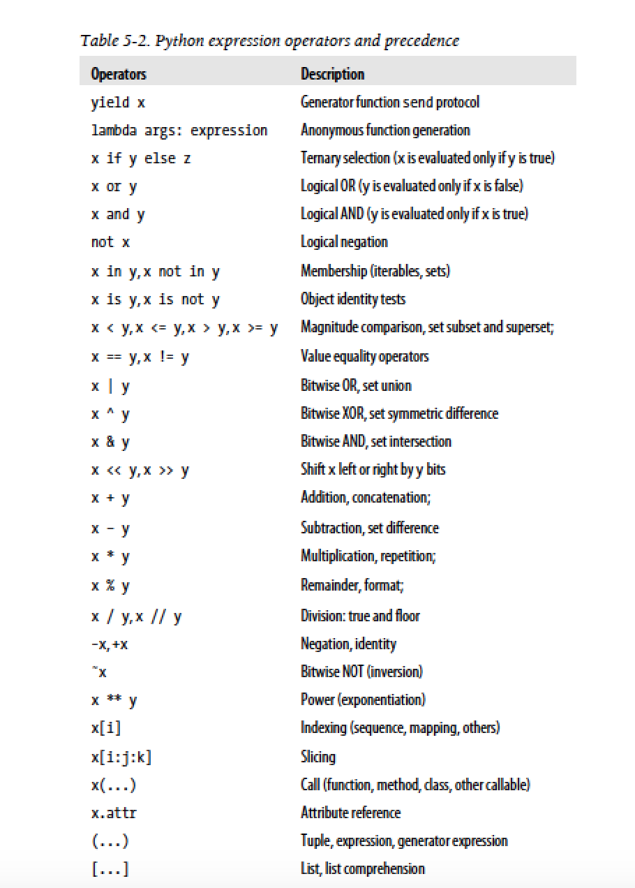

### Rounding and Truncation
For truncation, can use int(N) or math.trunc(N):
```py
>>> N=34.7184
>>> int(N)
34
>>> math.trunc(N)
34
```
For rounding, can use round(N,digits)
```py
>>> N=34.7184
>>> round(N)
35.0
>>> round(N,2)
34.72
```
Misc: Floor or Ceiling
```py
>>> N=34.7184
>>> math.floor(N)
34.0
>>> math.ceil(N)
35.0
```

## Modules

* A module is a collection of Python resources (functions, variables, objects,
  classes) that can be easily loaded into Python via `import` statements

* Modules allow for easy code reuse and organization

* Modules allow the programmer to keep various functionality in different
  namespaces.

* There are a large number of modules in the Python Standard Library:
  https://docs.python.org/2/library/index.html

* It is often useful to explore the Python documentation in the interpreter:

```py
>>> import math
>>> help(math)
# pager opened
>>> help(math.sqrt)
# pager opened
```

## Variables

Variables may be assigned to data and may also come from modules:

```py
>>> math.pi
3.141592653589793
>>> radius = 4.82
>>> circ = 2*math.pi*radius
>>> print(circ)
30.2849531806
>>>
```

## Variable naming

* The name associated with a variable is refered to as an *identifier*
* Variables names must start with a letter or an underscore, such as
    * `_underscore`
    * `underscore_`
* The remainder of your variable name may consist of letters, numbers and underscores
    * `password1`
    * `n00b`
    * `un_der_scores`
* Names are case sensitive
    * `case_sensitive`, `CASE_SENSITIVE`, and `Case_Sensitive` are each a
      different variable.

## Variable naming style

* too short: `a`, `b`, `c`
* too long: `number_of_particles_in_target_region`
* better: `num_target_particles`
* CamelCase: `numTargetParticles`

This is quite important for code readability.  People think about this a lot.
See: <https://www.python.org/dev/peps/pep-0008/#naming-conventions>

## Important: don't override built-in names

```py
>>> abs(-7)
7
>>> abs = 'must do sit-ups'
>>> abs(-4)
Traceback (most recent call last):
  File "<stdin>", line 1, in <module>
TypeError: 'str' object is not callable
>>>
```

## Strings

Strings are a very important data type in all languages.  In Python, strings may
be quoted several ways:

```py
>>> inputfile = "data.txt"
>>> outputfule = 'output.txt'
>>> triplequotes = """woah!
... split lines"""
>>> print(triplequotes)
woah!
split lines
>>>
```

## Strings versus numbers

```py
>>> a = 5
>>> b = '5'
>>> a
5
>>> b
'5'
>>> print b
5
>>> a + b
Traceback (most recent call last):
File "<stdin>", line 1, in <module>
TypeError: unsupported operand type(s) for +: 'int' and 'str'
>>> type(a)
<type 'int'>
>>> type(b)
<type 'str'>
>>>
```

## String slicing

```py
>>> quote = """That's all folks!"""
>>> quote[2]
'a'
>>> quote[7:10]
'all'
>>> quote[:4]
'That'
>>> quote[7:]
'all folks!'
>>> quote[:-7]
"That's all"

>>> name = 'Leland'
>>> upToLast = name[:-1]
>>> upToLast
'Lelan'
>>> lastFour = name[-4:]
>>> lastFour
'land'
>>> name2=name[:] <-- top level copy (same value, but distinct memory)
>>> name2
'Leland'
>>> name2=name[1::2] <-- s[i,j,k] takes from i to j, every k letter
>>> name2
'ead'
>>> s='hello'   <-- reverse order string
>>> s[::-1]
'olleh'

>>>
```

## Strings are immutable

```py
>>> a = 'hello'
>>> a[0]

'h'
>>> a[0] = 'j'
Traceback (most recent call last):
File "<stdin>", line 1, in <module>
TypeError: 'str' object does not support item assignment
>>>
```

## String functions / methods 	
lower, upper, find, rstrip, strip, split, replace, list, join, isalnum, isalpha
```py
>>> name = 'Leland'
>>> len(name)
6
>>> for char in name:
...    print(char)
...
L
e
l
a
n
d
>>> name.lower()  #change to all lowercase
'leland'
>>> name.upper() #change to all uppercase
'LELAND'
>>> name.find('lan') #find string and return first index
2
>>> name.find('lan', 1, 4)  #looks at 1 up to but not including 4
-1
>>> name*3   #repeat
'LelandLelandLeland'
```
Other methods (strip, split, replace):
```py
>>> string='   hello i am Karen\n'
>>> string.rstrip()           #remove whitespace at end of line
'   hello i am Karen'
>>> string.strip()           #remove whitespace at beg and end of line
'hello i am Karen'
>>> string.replace('hello','goodbye') #replace string with something else
'   goodbye i am Karen\n'
>>> string.split()               #can also split by commas, like .split(',')
['hello', 'i', 'am', 'Karen']
>>> 'hello' in string     #see if string is in another string
True
>>> 'a$b$c$'.replace('$','HI') #replace multiple
'aHIbHIcHI'
```
Changing String by making it into a list:
```py
>>> string='hello'       #string is immutable
>>> a = list(string)     #break up letters into list so it's mutable
['h', 'e', 'l', 'l', 'o']
>>> a[2]='x'
>>> a[3]='x'
>>> string=''.join(a)   #put string back together
>>> string
'hexxo'
```

Concatenate strings with +
and check if string is a number or character (pg 211)
```py
>>> b = 'j' + a[1:]
>>> b
'jello'

>>> s='2'    
>>> s.isalnum()
True
>>> s.isalpha()
False
```
## String formatting Learning Python pg 225
String formatting:

```py
>>> print("the area of a circle of radius 1 is {}.".format(2*math.pi))
the area of a circle of radius 1 is 6.28318530718.
```
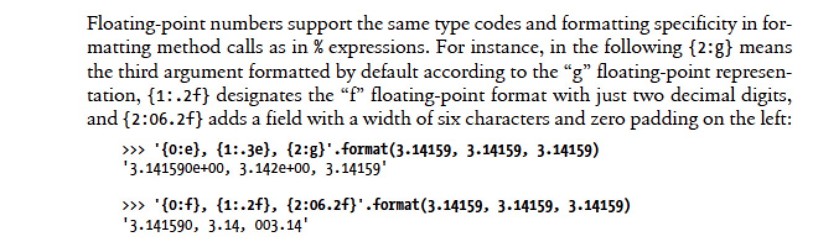
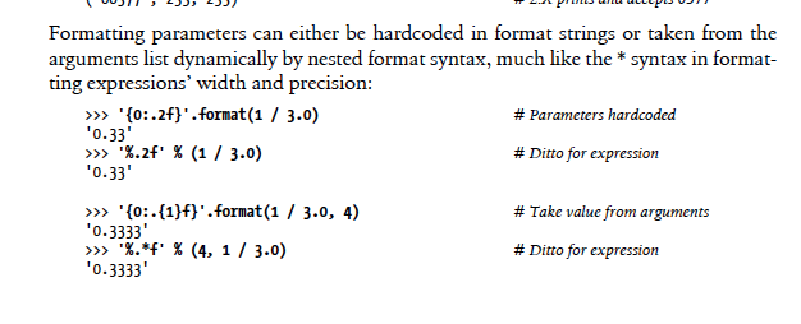
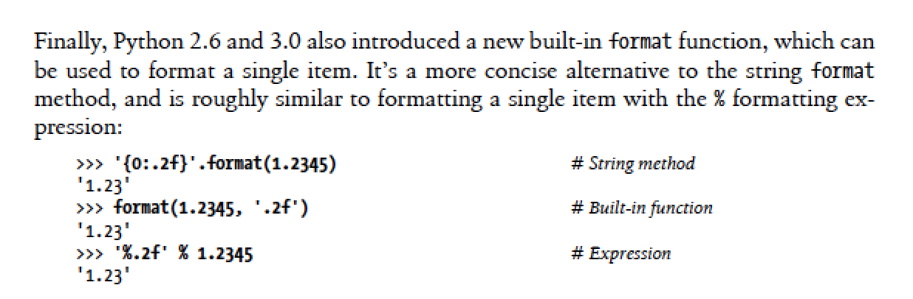
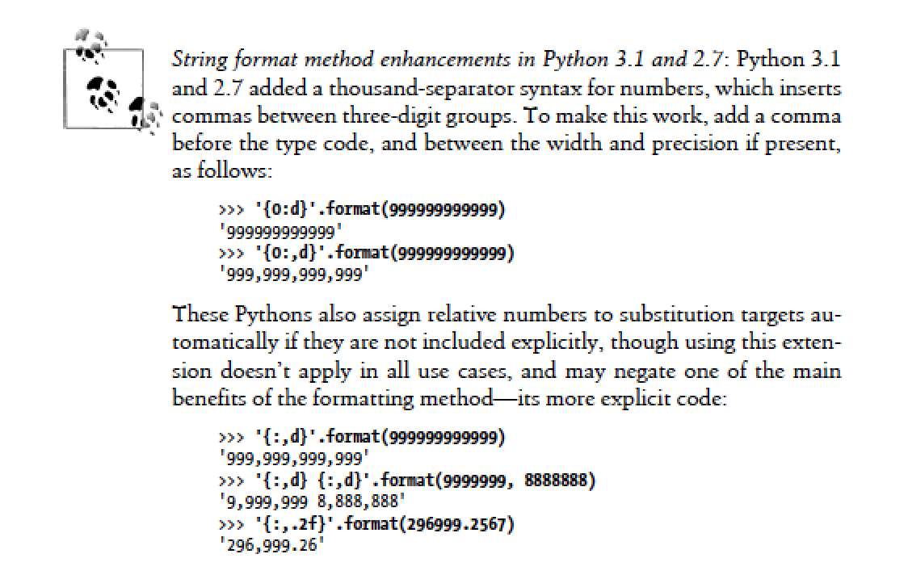
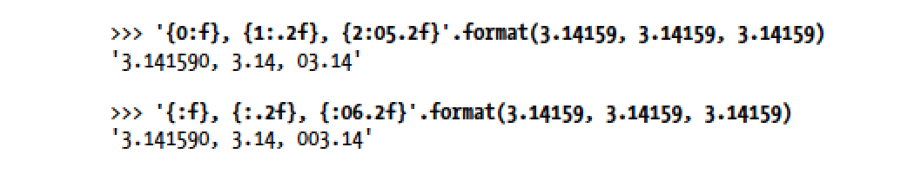

## Looping
```py
>>> for i in range(5):
...     # loop body
...     print(i)
...
0
1
2
3
4
>>> i
4
>>>
```
## `range()`

`range()` returns a sequence of integers and can be used in a few different
ways:

```py
>>> range(7)
[0, 1, 2, 3, 4, 5, 6]
>>> range(4,11)
[4, 5, 6, 7, 8, 9, 10]
>>> range(4,16,3)
[4, 7, 10, 13]
```
## `for` loop 	
* The `for i in <sequence>:` can be interpreted as doing the following:
    * assign the loop counter, `n`, the first value in `<sequence>`
    * execute the body of the loop
    * assign the loop counter variable the next value in the sequence and repeat
```py
for <target> in <sequence>:
    #statements
else:
    #statements
```
* can also iterate over strings and tuples:
```py
#string
>>> S='hello'
>>> for x in S: print(x)
...
h
e
l
l
o
#tuple
>>> T=('Ka','May','Wang')
>>> for i in T:
...   print(i)
...
Ka
May
Wang
```
* can assign two values to loop over (like looking for key,values in dict):
```py
#list
>>> T=[(1,2),(3,4),(5,6)]
>>> for (a,b) in T:
...    print(a,b)
...
(1, 2)
(3, 4)
(5, 6)
#dictionary
>>> D={'a':1,'b':2,'c':3}
>>> D.items()
[('a', 1), ('c', 3), ('b', 2)]
>>> for (key,value) in D.items():
...    print(key,'=>',value)
...
('a', '=>', 1)
('c', '=>', 3)
('b', '=>', 2)
```
* Nested `for` loop:
```py
>>> L1=[1,2,3,4]
>>> L2=[3,4,5,6]
#Method 1:
>>> for items in L1:
...     for stuff in L2:
...        if stuff == items:
...           print('matched!')
...           break
...     else:
...        print(items,'not found!')
...
(1, 'not found!')
(2, 'not found!')
matched!
matched!
#Method 2:
>>> for items in L1:
...    if items in L2: #make use of the in method, which searches through the list
...       print('matched!')
...    else:
...       print(items,'not found!')
...
(1, 'not found!')
(2, 'not found!')
matched!
matched!
```
* traveling with `for` loops in parallel: using the zip() or map() function:
```py
>>> L1=[1,2,3,4]
>>> L2=[5,6,7,8]
>>> zip(L1,L2)
[(1, 5), (2, 6), (3, 7), (4, 8)]
>>> for (x,y) in zip(L1,L2):
...    print(x,y)
...
(1, 5)
(2, 6)
(3, 7)
(4, 8)
#Map assigns none
>>> L1=[1,2,3,4]
>>> L2=[5,6,7,8,9]
>>> map(None,L1,L2)
[(1, 5), (2, 6), (3, 7), (4, 8), (None, 9)]

```
## Summing numbers

```py
>>> summation = 0
>>> for n in range(1,101):
...
summation += n
...
>>> print(summation)
5050
>>>
```

## Conditional statments

We might want to test the summation example:

```py
if summation != 100*(100+1)/2:
    print("Sorry, wrong answer!")
```

```py
if summation != 100*(100+1)/2:
    print("Sorry, wrong answer!")
else:
    print "Congratulations!"

```
Two ways to do this:
```py
if X:
  A = Y
else:
  A = Z
###OR###
A = Y if X else Z

## Boolean logic 	

```py
>>> a = 2
>>> b = 3
>>> a == 2 and b == 3
True
>>> a == 2 or b == 4
True
>>>
```

## Boolean logic and numbers 	

```py
>>> a = 2
>>> b = 0
>>> if a:
...     print("True")
...
True
>>> if b:
...     print("True")
...
>>>
```

## Boolean logic and strings 	

```py
#if there is a message, print
>>> msg = "Hello!"
>>> if msg:
...     print("Evaluated True")
...
Evaluated True
#if there is a message, print
>>> msg = ""
>>> if msg:
...     print("Evaluated True")
...
>>>
#evaluates left to right and returns first True object
#note: both 2 and 3 are True since they are nonzero
>>> 2 or 3
2
>>> 3 or 2
3
>>> [] or 3 #[] empty list is false, so returns 3
3
>>> [] or {} #because [] is false, returns {}
{}
#evalues left to right and returns last True object
>>> 2 and 3
3
>>> [] and {} #because [] is false, returns []
[]
>>> 3 and [] #[] empty list is false, so returns []
[]
```


## else if: `elif`

If you need to handle more than an `if` and `else` case use one or more `elif`:

```py
if summation < 5050:
    print("Too low")
elif summation > 5050:
    print("Too high")
else:
    print("Just right")
```

## `while` loop 	

* The `for` loop is associated with executing a loop body a **known** number of times

* What if we’re unsure how many times we’ll need to execute the loop?

```py
while condition:
    # loop body
else:  #optional else
   #statements run if didn't exit loop with break
```

## Bisection

```py
tol = 1e-4
fa = f(a)
fb = f(b)
while abs(a-b) >= tol:
    c = 0.5*(a+b)
    fc = f(c)
    if math.copysign(1,fa) == math.copysign(1,fc):
        a = c
        fa = fc
    else:
        b = c
        fb = fc
```

## Better design

It is a good idea to set a max on the trip count through a while loop:

```py
tol = 1e-4
fa = f(a)
fb = f(b)
niter = 0
while abs(a-b) >= tol and niter < maxiter:
    c = 0.5*(a+b)
    fc = f(c)
    if math.copysign(1,fa) == math.copysign(1,fc):
        a = c
        fa = fc
    else:
        b = c
        fb = fc
    niter += 1
```

## Infinite loops

```py
>>> while True:
...     pass
...
^CTraceback (most recent call last):
  File "<stdin>", line 2, in <module>
KeyboardInterrupt
```

Use `ctrl-c` to interrupt the interpreter!

## Nesting loops 	

```py
>>> for i in range(5):
...     for j in range(i):
...         print(j),
...     print()
...

0
0 1
0 1 2
0 1 2 3
>>>
```

## Nesting loops and logic

```py
>>> for i in range(8):
...     for j in range(i):
...         print(j),
...     print()

0 1
0 1 2 3
0 1 2 3 4 5
>>>
```
## `pass`
Does nothing at all: it's an empty statement placeholder
```py
def func1():
  pass #add real code here Later
  ```

## `continue`

The continue statement allows you to skip the remainder of a loop body and
continue with the next iteration. Jumps to top of loop's header line:
```py
>>> for n in range(10):
...   if n>3:
...     continue
...   print n
...
0
1
2
3

#printing even numbers
>>> while x:
...   x=x-1
...   if x%2 != 0: continue
...   print(x)
...
8
6
4
2
0
```
## `break`

The break statement allows one to immediately
exit from a for or while loop

```py
>>>> for n in range(10):
...    if n>3:
...      break
...    print n
...
0
1
2
3
```
## Innermost loop

`continue` and `break` only apply to the innermost loop being executed:

```py
for i in range(2):
    print("i = {}".format(i))
    for j in range(2):
        break
        print("j = {}".format(j))
        for k in range(2):
            print("k = {}".format(k))
```

Output:

```
i = 0
i = 1
```
If break was in the innermost k loop, output:
```
i=0
j=0
j=1
i=1
j=0
j=1
```

## Loop `else`

* An `else` can be used with a `for` or `while` loop

* The `else` is only executed if the loop runs to completion, not when a `break`
statement is executed

Code:

```py
for i in range(4):
    print(i)
else:
print("all done")
```

Output:

```
0
1
2
3
all done
```

Code:

```py
for i in range(7):
    print(i)
    if i > 3:
        break
else:
    print("all done")
```

Output:

```
0
1
2
3
4
```
## Line Continuation
- Open syntatic pair (like () or {} or [])
- add a backslash at end
- triple quotes
- Use ; for compound statements

# CME 211 Lecture 3: Lists, file input and output

Friday, September 25, 2015

    * Chapter 5: Numeric Types
    * Chapter 7: String Fundamentals
    * Chapter 8: Lists and Dictionaries (you can ignore Dictionaries for now)
    * Chapter 9: Tuples, Files, and Everything Else
    * Chapter 11: Assignments, Expressions, and Prints
    * Chapter 12: if Tests and Syntax Rules
    * Chapter 13: while and for Loops

* Chapter 4 (Introducing Python Object Types) has a summary of the object types


## Big picture

To complete a task in any programming language, the software developer must
consider the following:

* Data and it's representation
* Operations: modifying or computing things from data
* Flow of control: selecting which operations to run

With the combination of these things, we can write programs that tell a computer
what to do.  A computer program is a form of imperative or procedural knowledge.
Most programming today is done in this style.  This is different from
declarative knowledge.  An example of this difference from mathematics is a
system of equations vs. an algorithm to find a solution to the system of
equations.  The algorithm tells a specific procedure so that we can find the
quantity we are interested in.

### Data

Python has many built-in types.  The ones that we have seen so far are:

* Integers
* Floating point numbers
* Strings

Other important types are:

* Files!
* Complex numbers
* Unicode strings (which can represent text from ALL languages)

To perform useful tasks more efficiently, we need to combine the above types in
various ways.  For this, Python allows us to store data in various
*containers*.  In simple terms, *containers* contain data and there are various
sorts.

**Sequential containers** store data items in a specified order.  Think elements
of a vector, names in a list of people that you want to invite to your
birthday party.  The most fundamental Python data type for this is called a
`list`.  Later in the course we will learn about containers that are more
appropriate (and faster) for numerical data that come from NumPy.

Example Python code:

```py
cme211_tas = ["josh", "evan", "oliver", "swaroop"]
cme211_tas.append("loek")
print(cme211_tas)
for ta in cme211_tas:
    print("{} is an awesome ta".format(ta))
print("cme211 has {} tas".format(len(cme211_tas)))
```

Output:

```
['josh', 'evan', 'oliver', 'swaroop', 'loek']
josh is an awesome ta
evan is an awesome ta
oliver is an awesome ta
swaroop is an awesome ta
loek is an awesome ta
cme211 has 5 tas
```

**Associative container** store data, organized by a unique *key*.  Think of a
dictionary of word definitions.  They unique *key* is a word, the value
associated with the key is the definition.  In Python, this is represented with
the built-in `dict` or Dictionary type.  You will soon learn the greatness of
dictionaries in Python.

```py
emails = dict()
emails['loek'] = 'loek@mail.com'
emails['nick'] = 'nwh@stanford.net'
print(emails)
```

```
{'nick': 'nwh@stanford.net', 'loek': 'loek@mail.com'}
```

**Set containers** store unique data items.  They are related to dictionaries,
because dictionaries require the keys to be unique.

```py
dinos = set()
dinos.add('triceratops')
dinos.add('t-rex')
dinos.add('raptor')
print(dinos)
dinos.add('pterodactyl')
dinos.add('t-rex')
print(dinos)
```

```
set(['triceratops', 'raptor', 't-rex'])
set(['pterodactyl', 'triceratops', 'raptor', 't-rex'])
```

## Lists

Python lists are a very useful data container.  They may contain any python
object.  Here is a list containing some numbers and strings:

```py
>>> my_list = [4, 9.4, 'some text', 55]
```

Python lists (and other sequential data types) use 0-base indexing.  Data in a
list may be accessed via a slice:

Note: Slicing creates a new list

```py
>>> my_list[0]
4
>>> my_list[1:2]
[9.4]
>>> my_list[1:3]
[9.4, 'some text']
>>> my_list[1:4]
[9.4, 'some text', 55]
>>> my_list[1:]
[9.4, 'some text', 55]

>>> L = ['hi','hello','yo']
>>> L[-2]
'hello'
>>> L[2]
'yo'
```
Clever slicing
```py
#add to front of list
>>> A=[1,2,3]
>>> L=[4,5,6]
>>> L[:0]=A
>>> L
[1, 2, 3, 4, 5, 6]

#Use L[i:j]=[] (includes i,j) to get portion of list
>>> L=['B','C','Z']
>>> L[2:]=[]
>>> L
['B', 'C']
```

Multiplication and concatenation also works:
**Note that concatenation of list creates NEW object, while append() method changes list in place**

```py
>>> list=[1,2,3]
>>> list+list
[1, 2, 3, 1, 2, 3]
>>> list*3
[1, 2, 3, 1, 2, 3, 1, 2, 3]

#can preallocate list
>>> list=[0]*3
>>> list
[0, 0, 0]
```

Check values in a list:
```py
>>> s=[1,2,3]
>>> 3 in s
True
```
Print items in list:
```py
>>> for n in s:
...    print(n)
...
1
2
3
```
Lists are mutable.  You may change the elements in a list:

```py
>>> my_list[2] = 'some different text'
>>> my_list
[4, 9.4, 'some different text', 55]
```

You can get the length of a list with:

```py
>>> len(my_list)
4
```

See `help(list)` from the Python interpreter for summary of methods that can
operate on a list.

## List methods

See `>>> help(list)` to get a list of the list methods.  This should open a
"pager" in your python interpreter.  The "pager" allows you to view the help text
one page at a time.  On my computer the pager is the `less` program.  Hitting
the key `g` goes back to the top of the help text.  Hitting the space bar moves
one page forward in the help documentation.  For reference here are the built-in
methods for Python `list` objects:
```
append(...)
    L.append(object) -- append object to end

count(...)
    L.count(value) -> integer -- return number of occurrences of value

extend(...)
    L.extend(iterable) -- extend list by appending elements from the iterable

index(...)
    L.index(value, [start, [stop]]) -> integer -- return first index of value.
    Raises ValueError if the value is not present.

insert(...)
    L.insert(index, object) -- insert object before index

pop(...)
    L.pop([index]) -> item -- remove and return item at index (default last).
    Raises IndexError if list is empty or index is out of range.

remove(...)
    L.remove(value) -- remove first occurrence of value.
    Raises ValueError if the value is not present.

reverse(...)
    L.reverse() -- reverse *IN PLACE*

sort(...)
    L.sort(cmp=None, key=None, reverse=False) -- stable sort *IN PLACE*;
    cmp(x, y) -> -1, 0, 1
```

The methods in the help documentation that start and end with underscores (for
example, `__add__`) refer to methods that are called through python operators.
The `__add__` method is called when the `+` operator is called on lists:

```py
>>> cme211_tas + ['loek']
['josh', 'evan', 'oliver', 'swaroop', 'loek']
>>> cme211_tas.__add__(['loek'])
['josh', 'evan', 'oliver', 'swaroop', 'loek']
>>>
```
## Example of above methods

```py
>>> L=[4,1,9]
>>> L.extend([10,3]) #extend list
>>> L
[4, 1, 9, 10, 3]
>>> L.append(8)    #add 8 to end of list

>>> L=[1,2,3,4,5]
>>> L.insert(2,'hi')  #insert at index 2
>>> L
[1, 2, 'hi', 3, 4, 5]

>>> L=[1,2,3,4]
>>> L.pop()     #return last item in list
4
>>> grades
['A', 'A+', 'A', 'A-']
>>> grades.pop(3)      #returns item in index 3
'A-'


>>> grades=['A','C','A+','A','A-']
>>> grades.index('C')  #returns first index found
1
>>> grades.remove('C')
>>> grades
['A', 'A+', 'A', 'A-']

>>> grades=['A','C','A+','A','A-']
>>> grades.count('A')
2

>>> L=[1,2,3,4]
>>> L.reverse()  #in place reverse
>>> L
[4, 3, 2, 1]

>>> L
[1, 2, 3, 4]
>>> list(reversed(L)) #can assign to an object
[4, 3, 2, 1]
```
More on sorting IN PLACE:
```py
>>> L
[4, 1, 9, 10, 3, 8]
>>> L.sort()         
>>> L
[1, 3, 4, 8, 9, 10]

>>> L=['e','z','a','Y']
>>> L.sort()    
>>> L
['Y', 'a', 'e', 'z']     #upper case goes first

>>> L=['e','z','a','Y']
>>> L.sort(key=str.lower)  #sort by lower case

>>> L.sort(key=str.lower,reverse=True)
>>> L
['z', 'Y', 'e', 'a']
```
More on sorting METHOD (new reference):
```py
>>> L=['abc','ABD','aBe']
>>> sorted(L,key=str.lower)
['abc', 'ABD', 'aBe']
>>> sorted([x.lower() for x in L])
['abc', 'abd', 'abe']
```
## Python's data model

Variables in Python are actually a reference to an object in memory.  Here is a
simple example to demonstrate this property:

```py
>>> a = [1,2,3,4]
>>> b = a
>>> b[1] = 55
>>> print(b)
[1, 55, 3, 4]
>>> print(a)
[1, 55, 3, 4]
```

In this example, we assigned `a` to `b` via `b = a`.  This did not copy the
data, it only copied the *reference* to the list object in memory.

## Notes on Identity and Equivalence
You can inspect object ids in Python with:

```py
#numbers refer to memory addresses.
>>> id(a)
140672544197304
>>> id(b)
140672544197304
```
Can check equivalence and identity:
```py
>>> L1=[3,1,5]
>>> L2=[3,1,5]
>>> L1 == L2  #compares all nested objects recursively
True
>>> L1 is L2 #test if two are same object (live in same memory)
False
>>> id(L1) #check memory address
2920400
>>> id(L2) #check memory address
2916600
```
Python shares identity for short strings:
```py
>>> a='hello'
>>> b='hello'
>>> id(a),id(b)
(2901952, 2901952)
```
But not for longer strings:
```py
>>> a='a longer string'
>>> b='a longer string'
>>> id(a),id(b)
(2945136, 2945176)
```
Python shares identity for integers -5 to 256:
```py
>>> a=256
>>> b=256
>>> id(a),id(b)
(8469276,8469276) #same location in mem

>>> a=257
>>> b=257
>>> id(a),id(b)
(8468652, 8468640) #not the same
```
More on this "gotcha" type things on page 308
## Copying data

If you need to make a new copy of a list you may use the `copy` function in the
`copy` module:

```py
>>> import copy
>>> a = [5,2,7,0,'abc']
>>> b = copy.copy(a)
>>> b[4] = 'xyz'
>>> print(b)
[5, 2, 7, 0, 'xyz']
>>> print(a)
[5, 2, 7, 0, 'abc']

#Note for sets and dictionaries, don't need copy module
#sets
>>> a
set([1, 2, 3])
>>> b=a.copy()
>>> b
set([1, 2, 3])
#dict
>>> a={'Me':3,'You':1}
>>> b=a.copy()
>>> b
{'Me': 3, 'You': 1}
```
See what happens since everything is a reference to memory:
```py
>>> L=[1,2,3,4]
>>> A=L           #A points to same object as L, so if you change A, L changes too
>>> A[2]=100
>>> L
[1, 2, 100, 4]
```
Instead, use copy.copy() or L[:] to prevent this from happening. Note that these only make
**TOP level copies**, so nested data structures aren't copied
```py
>>> L=[1,2,3,4]
>>> A=copy.copy(L) #copy.copy() method
>>> A[2]=100
>>> A
[1, 2, 100, 4]
>>> B=L[:]       #L[:] method
>>> B[2]=100
>>> B
[1, 2, 100, 4]
>>> L
[1, 2, 3, 4]

```

Note that elements in a list are also references to memory location.  For
example if your list contains a list, this will happen when using `copy.copy()`:

```py
>>> a = [2, 'string', [1,2,3]]
>>> b = copy.copy(a)
>>> b[2][0] = 55
>>> print(b)
[2, 'string', [55, 2, 3]]
>>> print(a)
[2, 'string', [55, 2, 3]]
```

Here, the element for the sub-list `[55, 2, 3]` is actually a memory reference.
So, when we copy the outer list, only references for the contained objects are
copied.  Thus in this case modifying the copy (`b`) modifies the original
(`a`).  

The function **`copy.deepcopy()`** copies all nested lists:

```py
import copy
>>> a = [2, 'string', [1,2,3]]
>>> b = copy.deepcopy(a)
>>> b[2][0] = 99
>>> print(b)
[2, 'string', [99, 2, 3]]
>>> print(a)
[2, 'string', [1, 2, 3]]
```

## Control flow

Control flow in imperative programming languages boils down to 3 main
constructs:

* Repeated execution or iteration: `for` and `while` loops

* Conditional execution: `if` statements

* Functions to encapsulate code, defined in python with the keyword `def`.
  Python is an object-oriented language and objects often have associated
  *methods*.  *Methods* are just functions that operate on a specific object.

Note that `while` loops are a combination repeated and conditional execution.

See Chapter 13 in learning Python.  I expect you to understand the full looping
syntax, including loop `else` blocks.  Be sure to read pages 387-402.

### Python `if` statements

`if` statements control the flow of code execution based on a conditional
statement.  Here are some examples:

```py
>>> a = 1
>>> if a == 1:
...     print("a is equal to one")
...
a is equal to one
```

```py
>>> b = 4
>>> if b == 1:
...     print("b is equal to one")
...
```

```py
>>> c = 55
>>> if c == 20:
...     print('c is equal to twenty')
... else:
...     print('c is not equal to twenty')
...
c is not equal to twenty
```

```py
>>> d = 99
>>> if d == 1:
...     print("d is 1")
... elif d == 99:
...     print("d is 99")
... else:
...     print("I have no idea what d is")
...
d is 99
```

Read Chapter 12 of **Learning Python** for a complete picture of Python's `if`
statement.  Specifically, look at page 381, which specifies all of the rules on
how Python statements evaluate to `True` and `False`.

```py
>>> if "":
...     print('an empty string evaluates to False')
...
>>> if "hi nick":
...     print('a non-empty string evaluates to True')
...
a non-empty string evaluates to True
```

### Python `for` loops

Let's start with an example:

```py
>>> for i in range(5):
...     print("i = {}".format(i))
...
i = 0
i = 1
i = 2
i = 3
i = 4
```

The anatomy of a `for` loop is:

```py
for loop_var in sequence:
    loop_body()
```

Components:

1. a loop starts with the `for` keyword
2. followed by the loop variable, `loop_var` in this case
3. followed by the `in` keyword
4. followed by some form of sequence
5. followed by a `:`
6. followed by an **indented** loop body.  (Please use 4 spaces here)

In Python 2, the `range` function returns a list:

```py
>>> range(5)
[0, 1, 2, 3, 4]
>>> range(4,8)
[4, 5, 6, 7]
>>> range(4,20,3)
[4, 7, 10, 13, 16, 19]
```

Likewise, we can use a list as the sequence to iterate (loop) over:

```py
>>> languages = ['python', 'c', 'c++', 'r', 'java', 'matlab', 'julia']
>>> for lang in languages:
...     print('{} is a pretty good language'.format(lang))
...
python is a pretty good language
c is a pretty good language
c++ is a pretty good language
r is a pretty good language
java is a pretty good language
matlab is a pretty good language
julia is a pretty good language
```

### Python `while` loops

Let's start with an example:

```py
>>> i = 0
>>> while i <= 10:
...     i += 1
...
>>> print("i = {}".format(i))
i = 11
```

The anatomy of a Python `while` loop is:

```py
while conditional:
    loop_body()
```

Components:

1. starts with the `while` keyword

2. followed by a conditional statement

    * a conditional statement is something that Python knows to be true or false

3. followed by a colon `:`

4. followed by an indented loop body

### `continue` and `break` statements

The `continue` and `break` control execution of a loop from within the loop
body.  Here is an example with `break`:

```py
>>> i = 0
>>> while i < 10:
...     print("in loop, i = {}".format(i))
...     i += 1
...     if i == 4:
...             break
...
in loop, i = 0
in loop, i = 1
in loop, i = 2
in loop, i = 3
>>> print(i)
4
```

If a loop body encounters a `break` statement, the loop is terminated.

If a loop body encounters a `continue` statement, control moves to the next
iteration.  For example:

```py
>>> for i in range(100):
...     if i < 92:
...             continue
...     print("i = {}".format(i))
...
i = 92
i = 93
i = 94
i = 95
i = 96
i = 97
i = 98
i = 99
```

## File input output

Files are one way to get data into Python for process and out of python for
saving or sending (over a network).  In CME 211, we will mostly work with text
files.  This set of lecture notes is written in a text file `lecture-3.md` in
[Markdown format](https://daringfireball.net/projects/markdown/).  As a
side note, Markdown is a format that makes it easy to write text and convert it
to other formats.  If you are viewing this file via GitHub, you will likely be
looking at an HTML render of the file.  Python scripts are text files and by
convention have a `.py` extension.  On unix systems we can dump a text file to
the terminal with:

```
$ cat hello.py
# run me from the command line with
# $ python hello.py

print("hello sweet world!")
```

For run, try dumping a binary file to the terminal with `$ cat /bin/ls`.  What
happens?

In Python it is very easy to open, read from, and write to a text file.  Let's
see how it works.

See Chapter 9 in **Learning Python** for information on accessing files with
Python.  The relevant information starts on page 282.

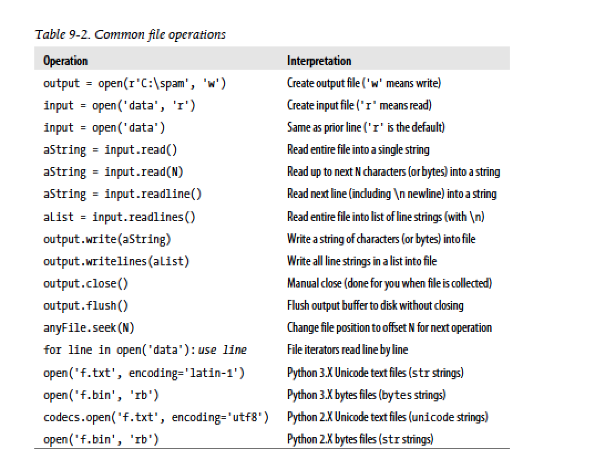

### Open a file

We open a file with the built-in `open` function:

```py
>>> f = open("humpty-dumpty.txt","r")
>>> f
<open file 'humpty-dumpty.txt', mode 'r' at 0x7f475ec18390>
```

The syntax is `open(filename,mode)` where `filename` is a string with the
filename to open and `mode` is the mode to open the file.  For now, the mode
should be `'r'` for reading a file and `'w'` for writing a file.  The `open`
function returns a *file object*, which we will use to read and write data.

### Reading from files

Use the **`readline()`** method to read lines from a file:

```py
>>> f = open("humpty-dumpty.txt","r")
>>> f.readline()
'Humpty Dumpty sat on a wall,\n'
>>> f.readline()
'Humpty Dumpty had a great fall.\n'
>>> f.close()
```

You can read an entire file at once with the **`read()`** method:
```py
>>> f = open("humpty-dumpty.txt","r")
>>> poem = f.read()
>>> print(poem)
Humpty Dumpty sat on a wall,
Humpty Dumpty had a great fall.
All the king's horses and all the king's men
Couldn't put Humpty together again.
>>> f.close()
```
You can very easily **iterate** over lines in a file with:
```py
>>> f = open("humpty-dumpty.txt","r")
>>> for line in f:
...     print(line)
...
Humpty Dumpty sat on a wall,

Humpty Dumpty had a great fall.

All the king's horses and all the king's men

Couldn't put Humpty together again.

>>> f.close()
```
To suppress the extra newline character generated:  
- slicing `line` with `print(line[:-1])`
- or do line.strip().  

Note that `line` is a variable name.  

Let's say we wanted to process all words in a file.  The following example would
get us started:

```py
f = open("humpty-dumpty.txt","r")
for line in f:
    for word in line.split():
        # use strip() method to remove extra newline characters
        print(word.strip())
f.close()
```

### Writing to files

To open a file for writing and write a single line:

**Note: when writing out, everything MUST be a string**

```py
>>> f = open("output.txt","w")
>>> f.write("blah blah blah\n")
>>> f.close()
>>> exit()
$ cat output.txt
blah blah blah
```

Note that the `write` method will not insert a newline character.  To get a new
line, you must add `'\n'` in the string that is passed to `write`.

To write multiple lines to a file at once, use the `writelines` method:

```py
>>> f = open("output.txt","w")
>>> f.writelines(["a mighty fine day\n","ends with a great big party\n","thank you, it's friday\n"])
>>> f.close()
>>> exit()
$ cat output.txt
a mighty fine day
ends with a great big party
thank you, it's friday
```
Note, the `\n` is still required in the strings that make up the list passed to
`writelines`.  The `"w"` file mode will overwrite the file you open, deleting
all of the old data.  Be careful!  

##If you would like to append to an existing file use the `"a"` mode.
```py
f=open("output.txt","a")
```
## Playing Around

```py
>>> a,b,c=1,2,3
>>> D={'x':32,'y':100}
>>> L=[10,11,12]

>>> fout = open('Playing','w')
>>> fout.write("{} {} {}".format(a,b,c))
>>> fout.write('\n')
>>> fout.write(str(D)+'\n')
>>> fout.write(str(L)+'\n')
>>> fout.write('write out list again\n')
>>> fout.write('{} {} {}'.format(L[0],L[1],L[2]))
>>> fout.close()
```
Shows up as:
cat Playing
```
1 2 3
{'y': 100, 'x': 32}
[10, 11, 12]
write out list again
10 11 12
```
```py
>>> fout=open('Playing','a')
>>> fout.write('write out dict\n')
>>> fout.write('{} {}, {} {}'.format(D.keys()[0],D.values()[0],D.keys()[1],D.values()[1]))
>>> fout.close()
```
Show up as:
cat Playing
```
1 2 3
{'y': 100, 'x': 32}
[10, 11, 12]
write out list again
10 11 12write out dict
y 100, x 32
```
# CME 211 Lecture 4: Python containers

Monday, September 28, 2015

## Container review

- *Containers* are objects that contain one or more other objects

- *Containers* are sometimes called "collections" or "data structures"


## Dictionaries

- Dictionaries are an *associative container*.  They contain *keys* with
  associated *values*

- Dictionaries in Python are denoted by curly braces

    - Create an empty dictionary: `empty_dict = {}`

    - Create a dictionary with some data: `ages = {"brad": 51, "angelina": 40}`

- Values can be **any** python object: numbers, strings, lists, other dictionaries, tuples, sets

- Keys can be any **immutable** object: numbers, strings, tuples (containing
  immutable data), NO SETS

- No sense of order in a python dictionary.  When used in a loop, the key-value
  pairs may come out in any order.

- Access values associated with a key with square brackets:
  `value = dictionary[key]`

### Create a dictionary

Use {}, zip, fromkeys

```py
>>> ages = {} # or ages = dict()
>>> ages['brad'] = 51
>>> ages['angelina'] = 40
>>> ages['leo'] = 40
>>> ages['bruce'] = 60
>>> ages
{'bruce': 60, 'angelina': 40, 'leo': 40, 'brad': 51}

>>> keyslist=['Bob','Kyle','Sally']   #make dict form keys,values lists
>>> valueslist=[1,54,2]
>>> dict(zip(keyslist,valueslist))
{'Bob': 1, 'Sally': 2, 'Kyle': 54}

>>> keyslist
['Bob', 'Kyle', 'Sally']
>>> dict.fromkeys(keyslist)      #initialize dict from a keys list
{'Bob': None, 'Sally': None, 'Kyle': None} #can do fromkeys(keyslist,0) to initialize everything to 0
```

### Access items

```py
>>> ages['leo']
40

>>> B={'movies':{'A':'Land of Dead','B':'Dinos'}} #access in nested dict
>>> B['movies']['A']
'Land of Dead'
```

Or you can use the `get()`,'pop()',or 'popitem()' methods:

```py
>>> temp = ages.get('brad') #returns NONE if key doesn't exist instead of giving error
>>> print(temp)
51
>>> temp = ages.get('helen')
>>> print(temp)
None
>>> D
{'Bob': 1, 'Sally': 2, 'Kyle': 54}
>>> D.get('Karen',0)     #if not there, return 0
0

>>> D
{'Karen': 20, 'Bob': 1, 'Sally': 2, 'Kyle': 54}
>>> D.pop('Karen')  #can also use pop, although it removes key from dict, can pop last thing from dict by just pop()
20
>>> D
{'Bob': 1, 'Sally': 2, 'Kyle': 54}

>>> D
{'Karen': 20, 'Bob': 1, 'Sally': 2, 'Kyle': 54} #returns tuple of key,value pair and removes from dict
>>> D.popitem()
('Karen', 20)
>>> D
{'Bob': 1, 'Sally': 2, 'Kyle': 54}
```
## Other Functions
key in dict, keys(), values(), items(), clear(), update(), del
```py
>>> D  #check if key is in dict
{'Bob': 1, 'Sally': 2, 'Kyle': 54}
>>> 'Bob' in D
True
>>> D.keys() #get keys only
['Bob', 'Sally', 'Kyle']
>>> D.values() #get values only
[1, 2, 54]
>>> D.items() #get key,value tuples
[('Bob', 1), ('Sally', 2), ('Kyle', 54)]

>>> Z
{'Bob': 1, 'Sally': 2, 'Kyle': 54}
>>> Z.clear() #clear everything in dict
>>> Z
{}

>>> D
{'Bob': 1, 'Sally': 2, 'Kyle': 54}
>>> Z={'Karen':20}
>>> D.update(Z)   #merge a dictionary to another dictionary (overwrites values if there is same key)
>>> D
{'Karen': 20, 'Bob': 1, 'Sally': 2, 'Kyle': 54}

>>> D
{'Karen': 20, 'Bob': 1, 'Sally': 2, 'Kyle': 54}
>>> del D['Karen']    #delete entries by key
>>> D
{'Bob': 1, 'Sally': 2, 'Kyle': 54}

```

## Copy
Copy
```py
#top level copy or shallow copy
>>> B=D.copy()  
>>> B
{'Bob': 1, 'Sally': 2, 'Kyle': 54}
>>> B['Bob'] = 5
>>> B
{'Bob': 5, 'Sally': 2, 'Kyle': 54}
>>> D
{'Bob': 1, 'Sally': 2, 'Kyle': 54}
#top level copy or shallow copy
>>> alist=[1,2]
>>> blist=[3,4]
>>> C={'A':alist,'B':blist}
>>> C
{'A': [1, 2], 'B': [3, 4]} #this is what C is
>>> B=C.copy()             #made a shallow copy into B
>>> B['A'][1]=20           #changed B value
>>> C
{'A': [1, 20], 'B': [3, 4]} #but then C value changed as well!
```
### Find Key from value
```py
#Method 1
>>> D
{'Bob': 1, 'Sally': 2, 'Kyle': 54}
>>> want=D['Bob']
>>> want
1
>>> [key for (key,value) in D.items() if value == want]
['Bob']

#Method 2
>>> D
{'Bob': 1, 'Sally': 2, 'Kyle': 54}
>>> want=D['Bob']
>>> want
1
>>> [key for key in D.keys() if D[key] == want]
['Bob']

### Iteration

Iterate through the keys with:

```py
>>> for key in ages:
...     print("{} = {}".format(key,ages[key]))
...
bruce = 60
angelina = 40
leo = 40
brad = 51
>>>
```

Iterate through key-values pairs with:

```py
>>> for k, v in ages.items():
...     print('{} = {}'.format(k,v))
...
bruce = 60
angelina = 40
leo = 40
brad = 51
```

The above syntax is more efficient in Python 3.  To achieve equivalent
performance in Python 2, it is best to ask for an *iterator* over the key-value
pairs:

```py
>>> for k, v in ages.iteritems():
...     print('{} = {}'.format(k,v))
...
bruce = 60
angelina = 40
leo = 40
brad = 51
```

We will discuss *iterators* in more detail later.  In Python 2 the dictionary
`items()` method returns a newly-created list of *tuples*:

```py
>>> ages.items()
[('bruce', 60), ('angelina', 40), ('leo', 40), ('brad', 51)]
```

This requires memory allocation and data copying.  The `iteritems()` method (or
`items()` method in Python 3) returns an *iterator*:

```py
>>> ages.iteritems()
<dictionary-itemiterator object at 0x7f509e06d260>
```

This is a Python object that provides access to the data in a container in a
sequential fashion **without** requiring the creation of a new data structure
and copying of data.

### Dictionary methods

See `help(dict)` to get a summary of all dictionary methods:

```
clear(...)
    D.clear() -> None.  Remove all items from D.

copy(...)
    D.copy() -> a shallow copy of D

fromkeys(...)
    dict.fromkeys(S[,v]) -> New dict with keys from S and values equal to v.
    v defaults to None.

get(...)
    D.get(k[,d]) -> D[k] if k in D, else d.  d defaults to None.

has_key(...)
    D.has_key(k) -> True if D has a key k, else False

items(...)
    D.items() -> list of D's (key, value) pairs, as 2-tuples

iteritems(...)
    D.iteritems() -> an iterator over the (key, value) items of D

iterkeys(...)
    D.iterkeys() -> an iterator over the keys of D

itervalues(...)
    D.itervalues() -> an iterator over the values of D

keys(...)
    D.keys() -> list of D's keys

pop(...)
    D.pop(k[,d]) -> v, remove specified key and return the corresponding value.
    If key is not found, d is returned if given, otherwise KeyError is raised

popitem(...)
    D.popitem() -> (k, v), remove and return some (key, value) pair as a
    2-tuple; but raise KeyError if D is empty.

setdefault(...)
    D.setdefault(k[,d]) -> D.get(k,d), also set D[k]=d if k not in D

update(...)
    D.update([E, ]**F) -> None.  Update D from dict/iterable E and F.
    If E present and has a .keys() method, does:     for k in E: D[k] = E[k]
    If E present and lacks .keys() method, does:     for (k, v) in E: D[k] = v
    In either case, this is followed by: for k in F: D[k] = F[k]

values(...)
    D.values() -> list of D's values

viewitems(...)
    D.viewitems() -> a set-like object providing a view on D's items

viewkeys(...)
    D.viewkeys() -> a set-like object providing a view on D's keys

viewvalues(...)
    D.viewvalues() -> an object providing a view on D's values
```

## Tuples

- Tuples are essentially immutable lists

- Tuples are denoted with parentheses: `tup = (1,2,3)`

- Tuples store data in order

- Items in tuples are accessed via indexing and slicing

- Tuple items may not be changed.  (However, if a tuple contains a modifiable
object such as a list, the contained object may be modified)

### Tuple examples

Note: concatenation (+), repitition (\*), and slicing still work

Basic usage:

```py
>>> days = ('Su', 'M', 'Tu', 'W', 'Th', 'F', 'Sa')
>>> days[5]
'F'
>>> days[3:6]
('W', 'Th', 'F')
>>> days[1] = 'C'
Traceback (most recent call last):
  File "<stdin>", line 1, in <module>
TypeError: 'tuple' object does not support item assignment
>>>
```

Modifiable objects contained in a tuple are still modifiable:

```py
>>> my_tup = (2, 'a string', [1,3,8])
>>> my_tup[2]
[1, 3, 8]
>>> my_tup[2] = 'something else'
Traceback (most recent call last):
  File "<stdin>", line 1, in <module>
TypeError: 'tuple' object does not support item assignment
>>> my_tup[2][0] = 'new data'
>>> my_tup
(2, 'a string', ['new data', 3, 8])
>>>
```

### Tuple modifiability diagram

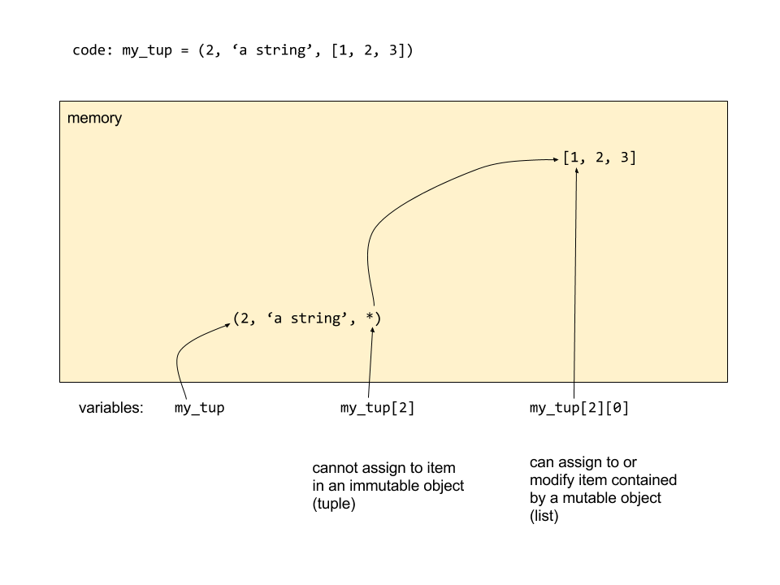

### Tuple/list conversion
```py
#Tuple to List
>>> T=('a','d','c')
>>> list(T)
['a', 'd', 'c']

#List to Tuple
>>> L=[1,2,3]
>>> tuple(L)
(1, 2, 3)
```
### Other Methods
Index(), count()
```py
>>> T=('A','B','A','C')
>>> T.index('C')   #find index of an element
3
>>> T.count('A')  #how many A's are there in the tuple?
2
```

### A note on (im)mutability

It is natural to wonder why have immutable objects at all.  One answer to this
is practical: in Python, only immutable objects are allowed as keys in a
dictionary or items in a set.

The more detailed answer requires knowledge of the underlying data structure
behind Python dictionary and set objects.  In the context of a Python
dictionary, the memory location for a key-value pair is computed from a *hash*
of the key.  If the key were modified, the *hash* would change, likely requiring
a move of the data in memory.  Thus, Python requires immutable keys to prevent
unnecessary movement of data.

It is possible to associate a value with a new key with the following code:

```py
>>> ages
{'bruce': 60, 'angelina': 40, 'leo': 40, 'brad': 51}
>>> ages['mike'] = ages['bruce']
>>> del ages['bruce']
>>> ages
{'mike': 60, 'angelina': 40, 'leo': 40, 'brad': 51}
>>>
```

## Python sets

- A `set` is an unordered, mutable collection of unique items
- Items in Python set must be immutable (for the same reason keys in a
  dictionary must be immutable)
- Create a set with: `>>> my_set = set([1, 2, 3])`
- We can test for existence in a set and perform set operations
- used to FILTER OUT DUPLICATES and ISOLATE DIFFERENCES

### Set examples
add(), intersection(), union(), update(), remove(), issubset()

```py
>>> myclasses = set(['math','chem','eng'])   #initialize set1
>>> yourclasses = set()                      #another way to initialize set2
>>> yourclasses.add('phys')
>>> yourclasses.add('gym')
>>> yourclasses.add('math')
>>> yourclasses
set(['gym', 'phys', 'math'])

>>> 'gym' in myclasses
False
>>> 'gym' in yourclasses
True
>>> myclasses & yourclasses   #intersection
set(['math'])
>>> myclasses | yourclasses
set(['phys', 'eng', 'gym', 'chem', 'math']) #union
#or, can merge using
>>> myclasses.update(yourclasses)
>>> myclasses
set(['phys', 'eng', 'gym', 'chem', 'math']) #merge

#remove item
>>> myclasses
set(['phys', 'eng', 'gym', 'chem', 'math'])
>>> myclasses.remove('phys')
>>> myclasses
set(['eng', 'gym', 'chem', 'math'])

#check if it is a subset
>>> myclasses
set(['eng', 'gym', 'chem', 'math'])
>>> sub=set(['gym','chem'])
>>> sub.issubset(myclasses)
True
```
### Isolating Differences

```py
>>> myclasses
set(['eng', 'gym', 'chem', 'math'])
>>> yourclasses
set(['gym', 'phys', 'math'])
>>> myclasses-yourclasses
set(['chem', 'eng'])         #we are left with the differences (what myclasses has but yourclasses doesnt)

>>> S1 = set([1,3,5,7])
>>> S2 = set([1,2,4,5,6])
>>> S1-S2                 #left with what set1 has that s2 doesn't
set([3, 7])
```
## Order Neutral Equality
```py
>>> L1, L2 = [1, 3, 5, 2, 4], [2, 5, 3, 4, 1]
>>> L1 == L2 # Order matters for the list
>>> set(L1) == set(L2) # Order-neutral equality
True
#or, can sort the list
>>> sorted(L1) == sorted(L2) # Similar but results ordered
True
```
## Subsets and Supersets
```py
>>> Engineers = set({'Bob','Karen','Ali','Vince'})
>>> {'Bob','Karen'} < Engineers #are bob and karen subsets of engineers?
True

>>> Workers
set(['Diana', 'Bob', 'Vince', 'Erica'])
>>> Engineers
set(['Karen', 'Ali', 'Diana', 'Bob', 'Vince', 'Erica'])
>>> Engineers > Workers  #all workers are engineers
True
>>> Workers > Engineers #all engineers are workers
False
```

### Set methods

See `help(set)`:

```
add(...)
    Add an element to a set.

    This has no effect if the element is already present.

clear(...)
    Remove all elements from this set.

copy(...)
    Return a shallow copy of a set.

difference(...)
    Return the difference of two or more sets as a new set.

    (i.e. all elements that are in this set but not the others.)

difference_update(...)
    Remove all elements of another set from this set.

discard(...)
    Remove an element from a set if it is a member.

    If the element is not a member, do nothing.

intersection(...)
    Return the intersection of two or more sets as a new set.

    (i.e. elements that are common to all of the sets.)

intersection_update(...)
    Update a set with the intersection of itself and another.

isdisjoint(...)
    Return True if two sets have a null intersection.

issubset(...)
    Report whether another set contains this set.

issuperset(...)
    Report whether this set contains another set.

pop(...)
    Remove and return an arbitrary set element.
    Raises KeyError if the set is empty.

remove(...)
    Remove an element from a set; it must be a member.

    If the element is not a member, raise a KeyError.

symmetric_difference(...)
    Return the symmetric difference of two sets as a new set.

    (i.e. all elements that are in exactly one of the sets.)

symmetric_difference_update(...)
    Update a set with the symmetric difference of itself and another.

union(...)
    Return the union of sets as a new set.

    (i.e. all elements that are in either set.)

update(...)
    Update a set with the union of itself and others.
```

http://www.stanford.edu/~plegresl/CME211/Lecture04.tar

## Example looking at 1990 first name data from US Census

Thanks to Patrick LeGresley for this example.

Goal: write program to predict *male* or *female* given name

Algorithm:

1. If input name is in list of males, return `"M"`
2. Else if input name is in list of females, return `"F"`
3. Otherwise, return `"NA"`

### Look at the files

```
[nwh@icme-nwh cme211-notes] $ pwd
/home/nwh/git/cme211-notes
[nwh@icme-nwh cme211-notes] $ cd lecture-4/
[nwh@icme-nwh lecture-4] $ ls -1
dist.female.first
dist.male.first
name1a.py
name1b.py
name2.py
[nwh@icme-nwh lecture-4] $ head dist.female.first
MARY           2.629  2.629      1
PATRICIA       1.073  3.702      2
LINDA          1.035  4.736      3
BARBARA        0.980  5.716      4
ELIZABETH      0.937  6.653      5
JENNIFER       0.932  7.586      6
MARIA          0.828  8.414      7
SUSAN          0.794  9.209      8
MARGARET       0.768  9.976      9
DOROTHY        0.727 10.703     10
```

Notes:

- the unix `head` command prints out the first 10 lines of a text file
- first column of the data file contains the name in uppercase
- following columns contain frequency data and rank, which we won't use today.

### Using sets

See `code/name1a.py`:

```py
# Create sets for female and male names
female = set()
f = open("dist.female.first")
for line in f:
    female.add(line.split()[0])
f.close()

male = set()
f = open("dist.male.first")
for line in f:
    male.add(line.split()[0])
f.close()

# Summarize information about the reference data
print("There are {} female names and {} male names.".format(len(female),len(male)))
print("There are {} names that appear in both sets.".format(len(female & male)))

# Test data
names = ["PETER", "LOIS", "STEWIE", "BRIAN", "MEG", "CHRIS"]

# Try our algorithm
for name in names:
    if name in male:
        ret = "M"
    elif name in female:
        ret = "F"
    else:
        ret = "NA"
    print("{}: {}".format(name, ret))
```

Run the code:

```
[nwh@icme-nwh lecture-4] $ python name1a.py
There are 4275 female names and 1219 male names.
There are 331 names that appear in both sets.
PETER: M
LOIS: F
STEWIE: NA
BRIAN: M
MEG: F
CHRIS: M
```

Run the code and get interpreter after completion:

```
[nwh@icme-nwh lecture-4] $ python -i name1a.py
There are 4275 female names and 1219 male names.
There are 331 names that appear in both sets.
PETER: M
LOIS: F
STEWIE: NA
BRIAN: M
MEG: F
CHRIS: M
>>> names
['PETER', 'LOIS', 'STEWIE', 'BRIAN', 'MEG', 'CHRIS']
>>> len(male)
1219
>>> len(female)
4275
>>>
```

### Using lists

See `code/name1b.py`

```py
# Create sets for female and male names
female = list()
f = open("dist.female.first")
for line in f:
    female.append(line.split()[0])
f.close()

male = list()
f = open("dist.male.first")
for line in f:
    male.append(line.split()[0])
f.close()

# Summarize information about the reference data
print("There are {} female names and {} male names.".format(len(female),len(male)))

# need to implement intersection
nboth = 0
for name in female:
    if name in male:
        nboth = nboth + 1

print("There are {} names that appear in both sets.".format(nboth))
```

### Second algorithm

Some names appear in both **male** and **female** lists.  Some names might not
appear in either list.  Let's write a new algorithm to handle this uncertainty:

Given an input name:
- return `0.0` if male
- return `1.0` if female
- return `0.5` if uncertain or name does not appear in dataset

### Solution

Use a Python dictionary with keys as first names and values as specified above.

See `code/name2.py`:

```py
# Create dictionary with name data
names = {}
f = open("dist.female.first")
for line in f:
    names[line.split()[0]] = 1.
f.close()

f = open("dist.male.first")
for line in f:
    name = line.split()[0]
    if name in names:
        # Just assume a 50/50 distribution for names on both lists
        names[name] = 0.5
    else:
        names[name] = 0.
f.close()

# Summary information about our reference data
print("There are {} names in our reference data.".format(len(names)))

# Test data
testdata = ["PETER", "LOIS", "STEWIE", "BRIAN", "MEG", "CHRIS", "NICK"]

# Try our algorithm
for name in testdata:
    if name in names:
        ret = names[name]
    else:
        ret = 0.5
    print("{}: {}".format(name, ret))
```

## Summary of objects
Object Type:       Mutable?
numbers            no
strings            no
lists              yes
dictionaries       yes
tuples             no
files              n/a
sets               yes


# CME 211 Lecture 5: Complexity Analysis

Wednesday, September 30, 2015

### Create a local directory structure for the class

1. Open your terminal program (`Terminal.app` on OSX).

2. Follow the sequence of commands:

```
nwh-mbpro:~ nwh$ cd
nwh-mbpro:~ nwh$ pwd
/Users/nwh
nwh-mbpro:~ nwh$ mkdir CME211    <- this makes a directory
nwh-mbpro:~ nwh$ cd CME211/
nwh-mbpro:CME211 nwh$ mkdir lec5
nwh-mbpro:CME211 nwh$ cd lec5/
nwh-mbpro:lec5 nwh$ pwd         <- print out current working directory
/Users/nwh/CME211/lec5
```
### Exercise

Let's write a short python script to count unique words in a data file.  The
data file will have one word per line.

### Create a data file

Open your favorite text editor and create the file `~/CME211/lec5/words.txt`.
Enter the following contents:

```
this
is
a
short
file
this
is
also
a
rainy
day
```
### Create a python script to count words

```py
# file name uses relative path
data_file = "words.txt"

f = open(data_file,"r")

# dictionary to store unique words as keys and counts as values
word_dict = dict()

# count the words
for line in f:
    # remove the new line character
    word = line.strip()
    if word in word_dict:
        # word is in dictionary, increment count
        word_dict[word] += 1
    else:
        # word is not yet in dictionary, set count to 1
        word_dict[word] = 1

# print the word counts
for word, count in word_dict.items():
    print("'{}' appeared {} time(s)".format(word,count))
```

### Test the script locally:

make sure your scripts can run on farmshare

```
nwh-mbpro:lec5 nwh$ python count_words.py
'a' appeared 2 time(s)
'rainy' appeared 1 time(s)
'short' appeared 1 time(s)
'this' appeared 2 time(s)
'is' appeared 2 time(s)
'also' appeared 1 time(s)
'file' appeared 1 time(s)
'day' appeared 1 time(s)
```

### Other method to copy files: `scp`

```
nwh-mbpro:lec5 nwh$ scp test.txt nwh@corn.stanford.edu:~/CME211/lec5/
Warning: Permanently added the RSA host key for IP address '171.67.215.107' to the listAuthenticated with partial success.
Duo two-factor login for nwh

Enter a passcode or select one of the following options:

 1. Duo Push to XXX-XXX-2441
 2. Phone call to XXX-XXX-2441
 3. SMS passcodes to XXX-XXX-2441

Passcode or option (1-3): 1
test.txt                                              100%   50     0.1KB/s   00:00
nwh-mbpro:lec5 nwh$
```

See `$ man scp`

### Other method to copy files: `sftp`

```
nwh-mbpro:lec5 nwh$ sftp nwh@corn.stanford.edu
nwh@corn.stanford.edu's password:
Authenticated with partial success.
Duo two-factor login for nwh

Enter a passcode or select one of the following options:

 1. Duo Push to XXX-XXX-2441
 2. Phone call to XXX-XXX-2441
 3. SMS passcodes to XXX-XXX-2441

Passcode or option (1-3): 1
Connected to corn.stanford.edu.
```

### Other software

See <https://itservices.stanford.edu/service/ess/> for Mac and Windows SFTP and
AFS clients.

### Learn more about unix systems and interacting with the shell

William E. Shotts, Jr. has a very nice online book called **The Linux Command
Line**.  See the book online:

* <http://linuxcommand.org/lc3_learning_the_shell.php>

Only need to focus on "Learning the Shell".  In CME 211, we are not concerned
with writing shell scripts.

## A note on Python variables

It is bad practice to define a variable inside of a conditional or loop body and
then reference it outside:

```py
>>> name = "Nick"
>>> if name == "Nick":
...     age = 45
...
>>> print("Nick's age is {}".format(age))
Nick's age is 45
>>>
```

If `name` holds a different name, the following will happen:

```py
>>> name = "Bob"
>>> if name == "Nick":
...     age = 45
...
>>> print("Nick's age is {}".format(age))
Traceback (most recent call last):
  File "<stdin>", line 1, in <module>
NameError: name 'age' is not defined
>>>
```
Bad programming practice since the variable isn't defined if the "if" statement isn't executed

Good practice to define/initialize variables at the same level they will be
used:

```py
>>> name = "Bob"
>>> age = None
>>> if name == "Nick":
...     age = 45
...
>>> print("Nick's age is {}".format(age))
Nick's age is None
>>>
```
None is a python type representing nothing. For strings, create an empty string using
```py
>>> a = ""
```

Note in the above example, it may be more appropriate to initialize the `age`
variable to a more meaningful value.

We will learn about *scope* when we talk about functions on Friday.

## Analysis of algorithms

Key questions when considering the performance of algorithms:

* **Time complexity**: How does the number of operations in an algorithm scale with
the size of the input?

* **Space complexity**: How do the storage requirements of the algorithm scale?

## Empirical approach

Let's measure the running time of Pythons `sort` method on a random list of
integers.  See `code/listsort.py`:

```py
import random
import sys
import time

if len(sys.argv) < 2:
print 'Usage:'
print ' %s nvalues' % sys.argv[0]

n = int(sys.argv[1])

# Setup a list of random values and record the time required to sort it
v = random.sample(xrange(n), n)
t0 = time.time()
v.sort()
t1 = time.time()

print "Sorting %d values took %.3f seconds." % (n, t1-t0)
```

## Empirical approach

Let's run the script with increasing list length:

```
[nwh@icme-nwh lecture-5] $ python listsort.py
Usage:
 listsort.py nvalues
[nwh@icme-nwh lecture-5] $ python listsort.py 1000000
Sorting %d values took %.3f seconds.
[nwh@icme-nwh lecture-5] $ python listsort.py 2000000
Sorting 2000000 values took 1.12 seconds.
[nwh@icme-nwh lecture-5] $ python listsort.py 4000000
Sorting 4000000 values took 2.49 seconds.
[nwh@icme-nwh lecture-5] $ python listsort.py 8000000
Sorting 8000000 values took 5.41 seconds.
[nwh@icme-nwh lecture-5] $ python listsort.py 16000000
Sorting 16000000 values took 11.9 seconds.
[nwh@icme-nwh lecture-5] $
```

## Problems with empirical

Empirical performance testing is an important endeavor.  It is an aspect of
"profiling" your code to see what parts take longer.  Empirical performance
testing has some drawbacks, namely:

* Results are computer dependent

* You need to have the code before you can do the analysis

## Time complexity

* Estimate of the number of operations as a function of the input size (usually
  denoted as `n`)

* Input size examples:

    * length of list

    * for an `m` by `m` matrix, we say the input size is `m` even though the
      matrix as `m^2` entries

    * number of non-zero entries in a sparse matrix

    * number of nodes in a graph or network structure

* Typically characterized in terms of Big O notation, e.g. an algorithm is
  `O(n log n)` or `O(n^2)`.

```
| order notation | in English          |
|----------------+---------------------|
| O(1)           | Constant time       |
| O(log n)       | Logarithmic time    |
| O(n)           | Linear time         |
| O(n log n)     | Linearithmitic time |
| O(n^2)         | Quadratic time      |
```

## Visualization

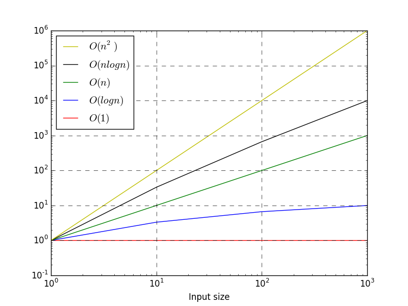
O(1) run time is independent of input size. For the algorithm, O(n^2) is the worst. As you go up on the chart, complexity of algorithm is greater.

## Big O notation

* Big O notation represents growth rate of a function in the limit of argument
  going to infinity

* Excludes coefficients and lower order terms

```
2n^2 + 64n -> O(n^2)
```
Take highest order and ignore constants (asymptotic behavior)
* Often some simplifying assumptions will need to be made about the nature of
  the input data in order to carry out analysis

## Linear algebra examples
There is a cost from
 1. reading from memory
 2. addition to the sum
 3. n writes
 Memory access is expensive. Flops are almost free nowadays.
* Adding two vectors? `O(n)`
```py
# c = a + b
# assume all the same length
n = len(a)
for i in xrange(n):
    c[i] = a[i] + b[i]
```

* Multiplying two matrices? Assuming the matrices are both `n x n`, it's
  `O(n^3)`

```py
# assume all matrices are n x n
# indexing notation below comes from numpy
# this will not work with standard python
# C = A*B
for i in xrange(n):
    for j in xrange(n):
        C[i,j] = 0
        for k in xrange(n):
            C[i,j] += A[i,k]*B[k,j]
```


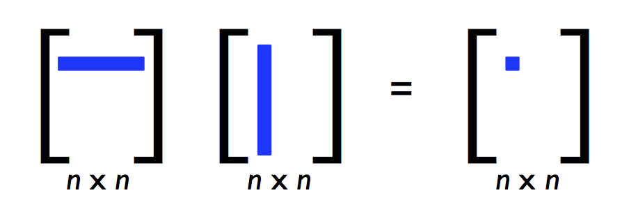

Computing one value in the output matrix requires `O(n)`
operations, and there are `n^2` values in the output matrix.

Used for training for neural networks (dense matrix-matrix multiplication)

use xrange(1000) for a more efficient way of doing range(1000)

## Linear search
Start at the first item, check, and then keep going. This is O(n) since there are n elements in the list and we go one at a time

*Linear search* is searching through a sequential data container for a specified
item.  An example of this is finding the start index of a given sub-string in a
longer string.

Exercise: Find the number `x` in your data:

```
|---+----+-----+----+-----+----+-----+-----|
| 4 | 17 | 100 | 73 | 120 | 42 | 999 | -17 |
|---+----+-----+----+-----+----+-----+-----|
```

Is it `O(1)`, or `O(n)`, or something else?
O(n)

## Linear search: best and worst case

```
|---+----+-----+----+-----+----+-----+-----|
| 4 | 17 | 100 | 73 | 120 | 42 | 999 | -17 |
|---+----+-----+----+-----+----+-----+-----|

  ^                                     ^
  |                                     |
 O(1)                                  O(n)
```

* Best case: `x = 4` and we find the index with only one comparison

* Worst case: `x = -17` and we scan the entire list to find the last element

## Linear search: average case


```
|---+----+-----+----+-----+----+-----+-----|
| 4 | 17 | 100 | 73 | 120 | 42 | 999 | -17 |
|---+----+-----+----+-----+----+-----+-----|

                    ^
                    |
                  O(n/2)
```

Given random data and a random input (in the range of the data) we can **on
average** expect to search through half of the list.  This would be `O(n/2)`.
Remember that Big O notation is not concerned with constant terms, so this
becomes `O(n)`.

We want best, worst, and average case performances. Average is for random behavior in the data.

## Binary search algorithm

I we know that the list is sorted, we can apply binary search.  Let's look at an example

**Goal**: Find the index of `17` in the following list:

```
|-----+---+----+----+----+-----+-----+-----|
| -17 | 4 | 17 | 42 | 73 | 100 | 120 | 999 |
|-----+---+----+----+----+-----+-----+-----|
```

Start by looking half way through the list:

```
|-----+---+----+----+----+-----+-----+-----|
| -17 | 4 | 17 | 42 | 73 | 100 | 120 | 999 |
|-----+---+----+----+----+-----+-----+-----|
                  ^
                  U
```

`42` is not `17`, but `42` is greater than `17` so continue searching the left
(lower) part of the list.  The index associated with `42` becomes an upper bound
on the search.

```
|-----+---+----+----+----+-----+-----+-----|
| -17 | 4 | 17 | 42 | 73 | 100 | 120 | 999 |
|-----+---+----+----+----+-----+-----+-----|
        ^         ^
        L         U
```

`4` is not `17`, but `4` is less than `17` so continue searching to the right
part of the list up to the upper bound.  Turns out in this example that we only
have one entry to inspect:

```
|-----+---+----+----+----+-----+-----+-----|
| -17 | 4 | 17 | 42 | 73 | 100 | 120 | 999 |
|-----+---+----+----+----+-----+-----+-----|
        ^   ^     ^
        L   *     U
```

We have found `17`.  It is time to celebrate and return the index of `2`.
(Remember Python uses 0-based indexing.)

## Summary: Binary search

* Requires that the data first be sorted, but then:

    * Best case: `O(1)`

    * Average case: `O(log n)`

    * Worst case: `O(log n)`

    Number of times you can split the list is about log(n). In this case, it's base 2 (since we're splitting list by half every time), but doesn't really matter if it's base 2 or 10 anyways since it's the same order of magnitude.


## Sorting algorithms

There are many sorting algorithms and this is a worthy area of study.  Here are
few examples of names of sorting algorithms:

* Quicksort

* Merge sort

* Heapsort

* Timsort

* Bubble sort

* Radix sorts

* Etc.

The internet is full of examples of how sorting algorithms work

* <http://www.youtube.com/watch?v=lyZQPjUT5B4>

* <http://www.youtube.com/user/AlgoRythmics>


## Sorting algorithms

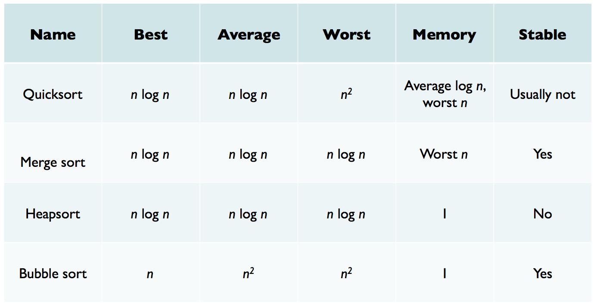

See: <https://en.wikipedia.org/wiki/Sorting_algorithm#Comparison_of_algorithms>

Don't have to know all these sort algorithms for the class. Just need to know the complexity.

## Finding the maximum

What's the order of the algorithm to find the maximum value in an *unordered*
list?

```
|----+------+----+-----+----+----+-----+-----+---|
| 17 | 1325 | -3 | 346 | 73 | 19 | 999 | 120 | 0 |
|----+------+----+-----+----+----+-----+-----+---|
```

### Idea: let's sort

* Sort the list ascending / descending and take the last / first value

* Cost of the algorithm will be the cost of the sorting plus one more operation
to take the last / first value

* Sorting algorithms are typically `O(n log n)` or `O(n^2)`

* Overall order of algorithm will clearly be the order of the sorting algorithm

### Idea: linear search

Algorithm:

* scan through the list sequentially
* keep track of max element seen so far
* compare each element and update if needed

Step 1:

```
|----+------+----+-----+----+----+-----+-----+---|
| 17 | 1325 | -3 | 346 | 73 | 19 | 999 | 120 | 0 |
|----+------+----+-----+----+----+-----+-----+---|
  ^
  |
 17
```

Step 2: move to next element, compare and update

```
|----+------+----+-----+----+----+-----+-----+---|
| 17 | 1325 | -3 | 346 | 73 | 19 | 999 | 120 | 0 |
|----+------+----+-----+----+----+-----+-----+---|
         ^
         |
       1325
```

Repeat:

```
|----+------+----+-----+----+----+-----+-----+---|
| 17 | 1325 | -3 | 346 | 73 | 19 | 999 | 120 | 0 |
|----+------+----+-----+----+----+-----+-----+---|
              ^
              |
            1325
```

And so on:

```
|----+------+----+-----+----+----+-----+-----+---|
| 17 | 1325 | -3 | 346 | 73 | 19 | 999 | 120 | 0 |
|----+------+----+-----+----+----+-----+-----+---|
                                               ^
                                               |
                                             1325
```

Question: what is the order of this algorithm?

It's O(n)

## Two largest values

* What's the complexity to find the two largest values in an *unordered* list of `n`
values?

Can search twice O(2n)
Or store two values and sort them (see below for algorithm). This gives O(n).

## Two largest values

Now we need to keep track of two values during the traverse of the list.  We
will also need to sort the pair of numbers that we keep along the way.

Start by looking at the first two elements:

```
|----+----+-----+-----+----+------+-----+---|
| 17 | 73 | 417 | 346 | 73 | 1325 | 120 | 0 |
|----+----+-----+-----+----+------+-----+---|
 ^    ^
 |    |
(17,  73)
(73,  17) <- sorted
```

Move down by one:

```
|----+----+-----+-----+----+------+-----+---|
| 17 | 73 | 417 | 346 | 73 | 1325 | 120 | 0 |
|----+----+-----+-----+----+------+-----+---|
      ^    ^
      |    |
     (73,  417)
     (417,  73) <- sorted
```

Repeat:

```
|----+----+-----+-----+----+------+-----+---|
| 17 | 73 | 417 | 346 | 73 | 1325 | 120 | 0 |
|----+----+-----+-----+----+------+-----+---|
           ^     ^
           |     |
          (417,  346)
          (417,  346) <- sorted
```

Repeat (in this case no update is needed):

```
|----+----+-----+-----+----+------+-----+---|
| 17 | 73 | 417 | 346 | 73 | 1325 | 120 | 0 |
|----+----+-----+-----+----+------+-----+---|
                 ^     ^
                 |     |
                (417,  346)
                (417,  346) <- sorted
```

Notes:

* For each of n input elements you will do a comparison, potentially a
replacement, and a sort

* Time complexity is `O(n)` (actually is O(2n), but we don't care about constant)

Question:

* Does that mean that finding the two largest values will take the same amount
of time as finding the single largest value?

No it will take more time

## `m` largest values

What if I want to find the `m` largest values in an unordered list of `n`
elements?

This is an example of a more complicated algorithm.  We have two components to
consider:

* the length of the list `n`

* number number of largest values that we want `m`

Thus, it may not be appropriate to characterize an algorithm in terms of one
parameter `n`:

* Time complexity for finding the `m` largest values in an unordered list of `n`
elements could be characterized as `O(n m log m)` for a sorting algorithm that
is `O(m log m)`
Is keeping that sublist sorted necessary?

Question:

* For what m is it better just to sort the list?
  - Sorting list is a nlog(n) operation and sorting m largest values in an unordered list is a nmlog(m) operation
  - It would be when nmlog(m) >= nlog(n) --> or when m >= log(n-m), you might as well sort the whole list n

## Finding sub-strings

Important procedure.  We are using it in homework 1.

Example:

```
TGTAGAATCACTTGAAAGGCGCGCAGTCTGGGGCGCTAGTCGTGGT
          CTTGAAAGG
          ^       ^
          |       |
```


* String has length `m`, and sub-string has length `n`

* Different algorithms:

    * `O(mn)` for a naive implementation

    * `O(m)` for typical algorithms

    * `O(n)` for a search that uses the Burrows-Wheeler transform (n is the size of input string). This is a compression algorithm

## List operations in Python

```
>>> a = []
>>> a.append(42)
>>> a
[42]
>>> a.insert(0, 7)   <- put value into a list
>>> a
[7, 42]
>>> a.insert(1, 19)
>>> a
[7, 19, 42]
>>>
```

Python lists use contiguous storage.  As we are inserting into the list, the
memory layout will look something like:

```
>>> a.append(42)

|----+---+---+---|
| 42 | ? | ? | ? |
|----+---+---+---|

>>> a.insert(0, 7)

|---+----+---+---|
| 7 | 42 | ? | ? |
|---+----+---+---|

>>> a.insert(1, 19)

|---+----+----+---|
| 7 | 19 | 42 | ? |
|---+----+----+---|

```
Python has an efficient strategy for increasing the space allocated to the list. When we do insertions, we had to move 42 over (that takes time). Appending is not as expensive as insertion since there is space in mem and ready to go, but insertion requires us to move data over. Appending is O(1), but insertion is worst case O(n) since we may have to move n values over in the list.

## List vs Set in python

Let's compare Python's list and set objects for a few operations:

Create a file `loadnames.py`

```py
names_list = []
names_set = set([])
f = open('dist.female.first')
for line in f:
    name = line.split()[0]
    names_list.append(name)
    names_set.add(name)
f.close()
```
Testing for existence in the list in the set. Adding and testing for existence are the main.
Run the script and enter into the interpreter:

```
$ python -i loadnames.py
>>> 'JANE' in names_list
True
>>> 'LELAND' in names_list
False
>>> 'JANE' in names_set
True
>>> 'LELAND' in names_set
False
>>>
```

Which container (list, set) is better for insertion and existence testing?
In both cases, insertion is O(1). Set is faster for testing for existence.
Good documentation on Python for time complexities of different operations.

## Documentation

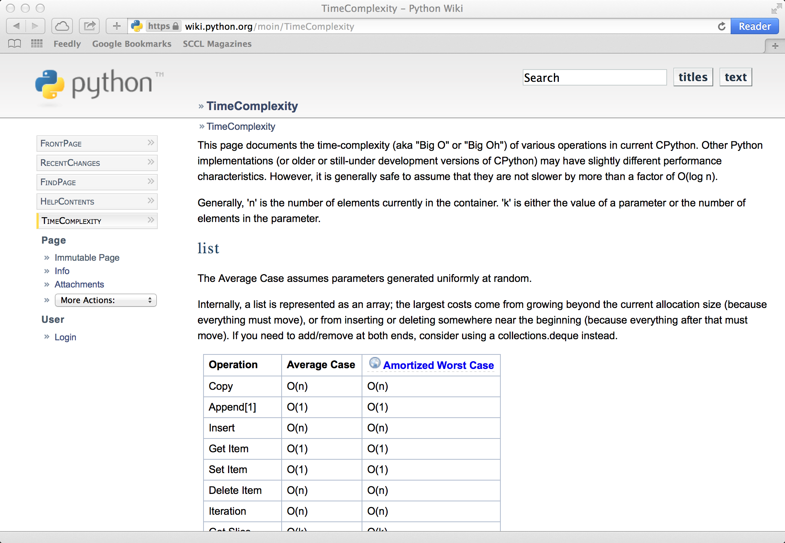

<https://wiki.python.org/moin/TimeComplexity>

### List operations

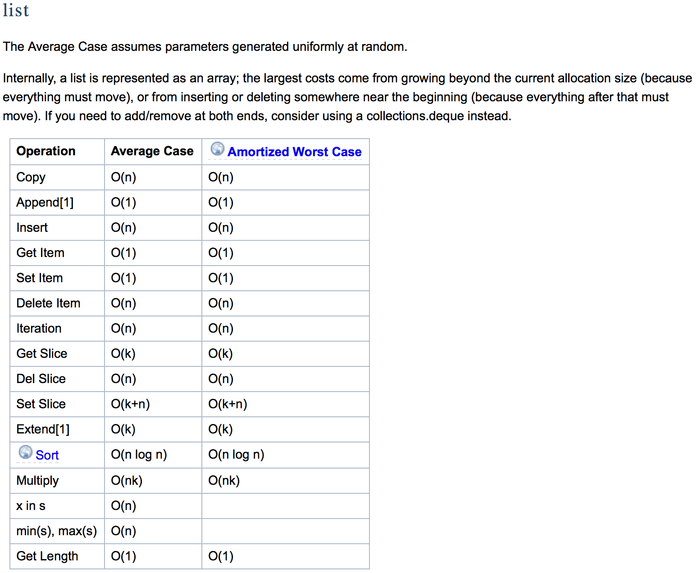

### Set operations

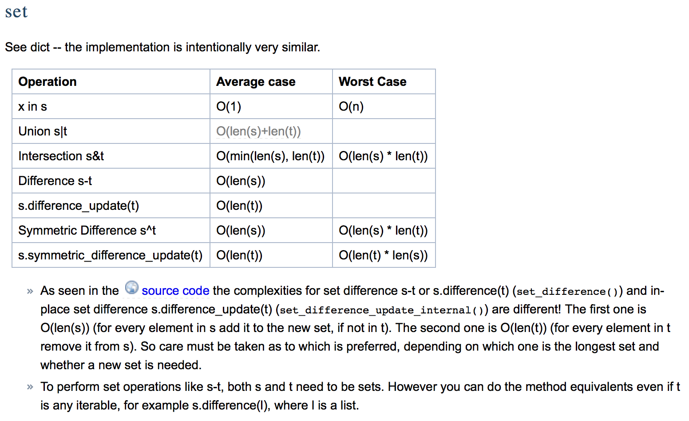

## Dictionary operations

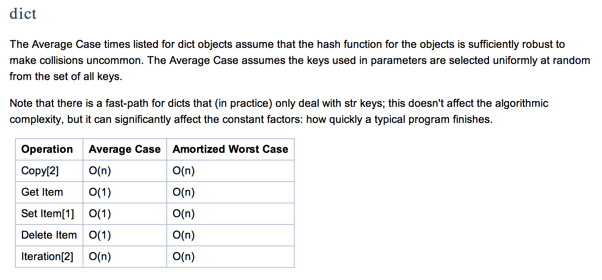

## Space complexity

* What additional storage will I need during execution of the algorithm? (often doesn't include input and output)


* Doesn't include the input or output data

* Really just refers to temporary data structures which have the life of the
algorithm

* Process for determining the space complexity is analogous to determining time
complexity

## Complexity analysis

* Good framework for comparing *algorithms* (look at highest order factor. We care about memory traffic more than flops nowadays. Analysis only works are we increase n (otherwise constant factors may dominate))

* Understanding individual algorithms will help you understand performance of an
application made up of multiple algorithms

* Also important for understanding data structures

* Caveats:

    * There is no standard definition of what constitutes an operation

    * It's an asymptotic limit for large n

    * Says nothing about the constants

    * May make assumptions about dataset (random distribution, etc.)

# CME 211: Lecture 6

Friday, October 2, 2015
### Git resources
* Git homepage: <http://git-scm.com/>
* Git documentation: <http://git-scm.com/doc>
* Git Book: <http://git-scm.com/book/en/v2>
Recommended reading: Git Book chapters 1 and 2

## Python functions
* Code we have seen so far has been executed in linear fashion from top to bottom, sometimes repeating one or more lines in a loop body

* Functions allow us to:
* Replace duplicated code with one centralized implementation within a single program
* Reuse code across different programs
* Easily use code developed by others
* Develop, test, debug code in isolation from other code
* Analogous to mathematical functions

Note: Python is pass by reference, not pass by copy, so there is little overhead cost to passing a variable as an argument to a function

### Defining a function in Python
``` py
>>> def PrintHello(name):
...     print("Hello, {}".format(name))
...
>>> PrintHello
<function PrintHello at 0x14d21b8> #the numbers and letters are the memory address
>>> PrintHello("CME 211 students")
Hello, CME 211 students
>>>
```
Anatomy of a Python function:
```py
def function_name(input_argument):
    # function body should be indented
    print("you guys rock")
```
### Return a value
Use the `return` keyword to return object from a function:

```py
>>> def summation(a, b):
...     total = 0
...     for n in range(a,b+1):
...         total += n
...     return total
...
>>> c = summation(1, 100)
>>> c
5050
>>>
```
### Return multiple values
```py
>>> def SummationAndProduct(a,b):
...     total = 0
...     prod = 1
...     for n in range(a,b+1):
...         total += n
...         prod *= n
...     return total, prod  #return multiple values
...
>>> a = SummationAndProduct(1,10)
>>> a
(55, 3628800)             #if saved as a single variables, returned values will be a tuple
>>> a, b = SummationAndProduct(1,10)
>>> a
55
>>> b
3628800
>>>
34
```
The `return` keyword packs multiple outputs into a tuple.  You can use Python's tuple unpacking to nicely get the return values in calling code.

### Variable scope
Let's look at an example to start discussing variable scope:
```py
>>> total = 42
>>> def summation(a, b):
...     total = 0
...     for n in range(a, b+1):
...         total += n
...     return total
...
>>> a = summation(1, 100)
>>> a
5050
>>> total
42
>>> n
Traceback (most recent call last):
File "<stdin>", line 1, in <module>
NameError: name 'n' is not defined
>>>
```

Function bodies have a local namespace.  In this example the `summation`
function does not see the variable `total` from the top level scope.
`summation` creates its own variable `total` which is different!  The top level
scope also cannot see variables used inside of `summation`.

Reference before assignment to a global scope variable will cause an error:

```py
>>> total = 0
>>> def summation(a, b):
...     for n in range(a, b+1):
...         total += n
...     return total
...
>>> a = summation(1, 100)
Traceback (most recent call last):
File "<stdin>", line 1, in <module>
File "<stdin>", line 3, in summation
UnboundLocalError: local variable 'total' referenced before assignment
>>>
```
### Variable scope examples
It is possible to use a variable from a higher scope.  This is generally considered bad practice:

```py
>>> a = ['hi', 'bye']
>>> def func():
...     print(a)
...
>>> func()
['hi', 'bye']
>>>
```

Even worse practice is modifying a mutable object from a higher scope:
```py
>>> a = ['hi', 'bye']
>>> def func():
...     a.append('hello')
...
>>> func()
>>> a
['hi', 'bye', 'hello']
>>>
```
Python will not let you redirect an identifier at a global scope.  Here the function body has its own `a`:

```py
>>> a = ['hi', 'bye']
>>> def func():
...     a = 2
...
>>> func()
>>> a
['hi', 'bye']
>>>
```
### Accessing a global variable

This is bad practice, do not do this.  We will take off points.  We show you in
case you run into it.

```py
>>> total = 0
>>> def summation(a,b):
...     global total
...     for n in range(a, b+1):
...         total += n
...
>>> a = summation(1,100)
>>> total
5050
>>>
```

### Functions must be defined before they are used

In scripts (and the interpreter), functions must be defined before they are
used!  See the file `lecture-6/order1.py`:

```py
def before():
    print("I am function defined before use.")

before()
after()

def after():
    print("I am function defined after use.")
```

Output:

```
$ python order1.py
I am function defined before use.
Traceback (most recent call last):
  File "order.py", line 5, in <module>
    after()
NameError: name 'after' is not defined
$
```

A function may refer to another function defined later in the file.  The rule is
that functions must be defined before they are actually invoked/called.

```py
def sumofsquares(a, b):
    total = 0
    for n in range(a, b+1):
        total += squared(n)
    return total

def squared(n):
    return n*n

print sumofsquares(1,10)
```

Output:

```
$ python order2.py
385
$
```


### Passing convention IMPORTANT!!

Python uses pass by object reference.  Python functions can change mutable
objects refereed to by input variables

```py
>>> def DoChores(a):
...     a.pop()
...
>>> b = ['feed dog', 'wash dishes']
>>> DoChores(b)
>>> b
['feed dog']
>>>
```

`int`s, `float`s, and `str`ings are immutable objects and cannot be changed by a
function:

```py
>>> def increment(a):
...     a = a + 1
...
>>> b = 2
>>> increment(b)
>>> b
2
```

### Pass by object reference

* Python uses what is sometimes called pass by object reference when calling
functions

* If the reference is to a mutable object (e.g. lists, dictionaries, etc.), that
object might be modified upon return from the function

* For references to immutable objects (e.g. numbers, strings), by definition the
original object being referenced cannot be modified

### Example of a bad function

```
def add(a, b):
    # I wrote this function because Nick
    # is mean and is making us write three functions
    return a + b
```

## Recommended Reading

From **Learning Python, Fifth Edition** by Mark Lutz

* Chapter 6: The Dynamic Typing Interlude (i.e. references and objects)

* Chapter 16: Function Basics

* Chapter 17: Scopes

* Chapter 18: Arguments

# CME 211: Lecture 7

Monday, October 5, 2015

Topics:

* Review: Python object model

* Python modules

* Python exceptions

## Python object model

Let's review and elaborate on Python's object model.  Key things to always keep
in mind:

* everything in Python is an object

* variables in Python are references to objects

### Starting example

```py
>>> a = [42, 19, 73]
>>> b = a
>>> a
[42, 19, 73]
>>> b
[42, 19, 73]
>>> b[0] = 7   # (1.)
>>> b
[7, 19, 73]    # (2.)
>>> a
[7, 19, 73]    # (2.)
>>>
```

1. Item `b[0]` is modified

2. This action affect the object referenced by both `a` and `b`

In this example, `a` is a reference to the list object initially set to `[42,
19, 73]`.  The variable `b` also references the same list.

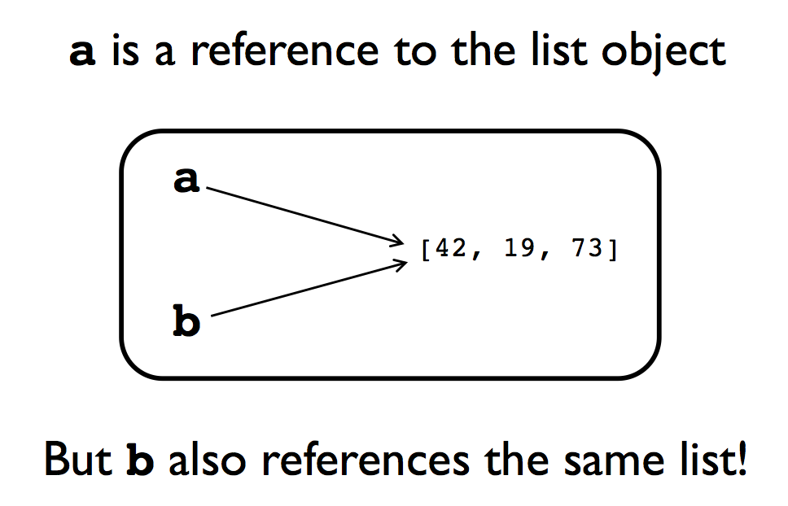

### Analogy

* This room is like an object

* "Geology Corner Auditorium" is an identifier that references this room

* "320-105" is also an identifier that references this same room

### Objects and references

* Names or identifiers point to or reference an object

* Identifiers are untyped and dynamic (an identifier can reference an integer,
and then reference a string)

```py
>>> a = 5
>>> a = 'hi'
```

* But Python is also strongly typed: you can't add a number and a string because
that doesn't make sense

* Everything in Python is an object: numbers, strings, functions, etc. are all
objects

* **An object is a location in memory with a type and a value**

### Assignment

* The assignment operation, `=`, can be interpreted as setting up the reference

```py
>>> a = 'hello'
```

1) Create a string object containing `'hello'`

2) Point the identifier a to the newly created string object

### Example

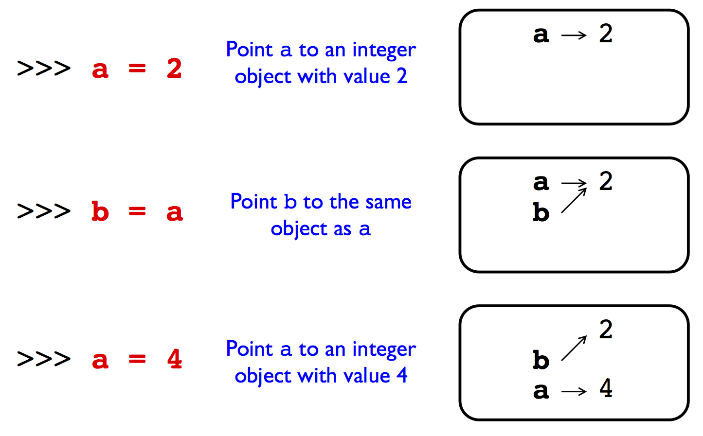

### Example

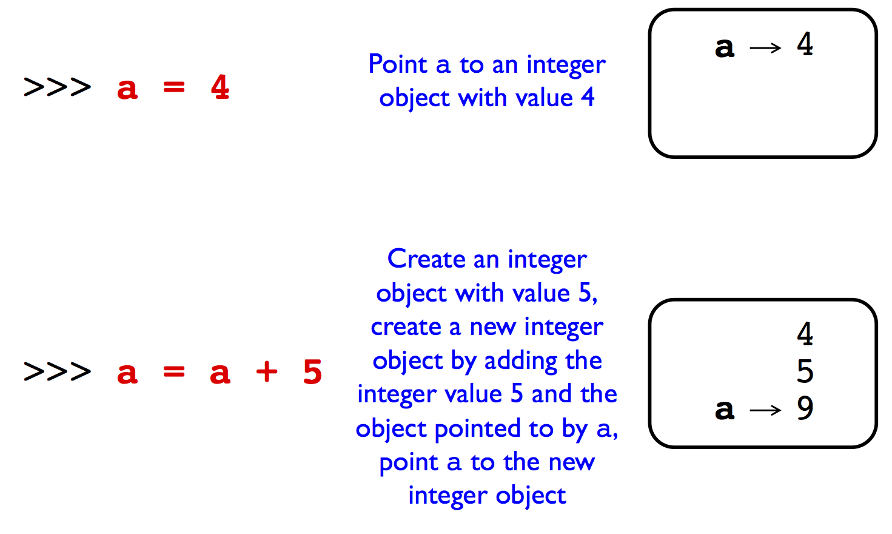

### Checking references

We can check if two names reference the same object with the `is` operator:

```py
>>> a = [42, 19, 73]
>>> b = a
>>> a is b
True
>>> b = [42, 19, 73]
>>> a is b
False
>>>
```
Another thing you can do is look at the id to see what the variable is referencing to. This is the address of where the object sits in memory.

```
>>> id(a)
4459239544
```
### Integers and references

Integers are objects also and need to be created in memory:

```py
>>> a = 1024
>>> b = a
>>> a is b
True
>>> a = 1024
>>> b = 1024
>>> a is b  #pointing to two diff integer objects that happen to have the same value
False
>>> a = 16
>>> b = 16
>>> a is b
True #small integers are handled differently in python (see preallocated integers)
>>>
```

### Preallocated integers

* For interactive usage, Python preallocates permanent integer objects for the
  values `-5` to `256`

* Instead of constantly creating / destroying these objects they are
  permanently maintained

* Integers outside this range are created / destroyed as needed

```py
>>> a = -6
>>> b = -6
>>> a is b
False
>>> a = -5
>>> b = -5
>>> a is b
True
>>> a = 256
>>> b = 256
>>> a is b
True
>>> a = 257
>>> b = 257
>>> a is b
False
>>>
```

### String reuse

String objects may be "reused" internally:

```py
>>> a = 'hello'
>>> b = 'hello'
>>> a is b
True
>>>
```

### Why immutables?

* It's a design decision not uncommon in other languages (e.g. strings are
  immutable in Java)

* Allows for performance optimizations

* Can setup storage for a string once because
it never changes

* Dictionary keys required to be immutable for performance optimizations to
  quickly locate keys

### Containers and element references

* The elements in a list, or the key and value pairs in a dictionary, contain
  references to objects

* Those references can be to "simple" data types like a number or string, or
  more complicated data types like other containers

* There are some restrictions, for example the key objects in a dictionary must
  be immutable (e.g. numbers, strings, or tuples)

### Containers and element references

```py
>>> a = [42, 'hello']
>>> b = a
```
a and b point to a list. The list points to objects 42 and "hello"

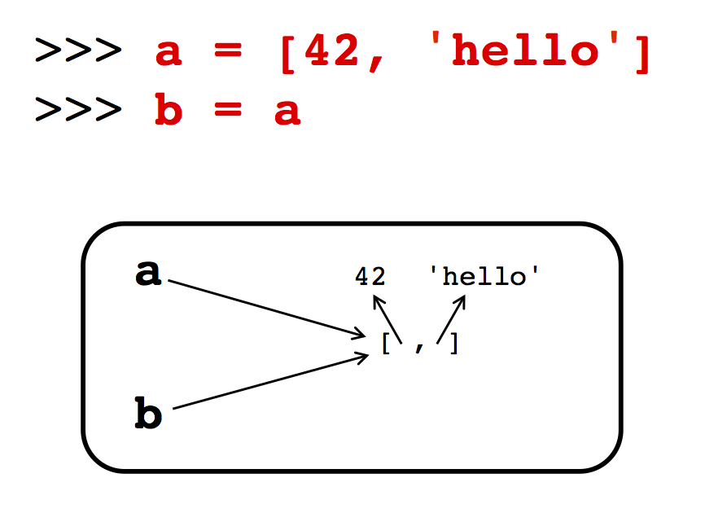

### Copying a list

* Simple assignment does not give us a copy
of a list, only an additional reference to the
same list


* What if we really want an additional copy
that can be modified without changing the
original?

### Shallow copy

```py
>>> a = [42, 'hello']
>>> import copy
>>> b = copy.copy(a)
```

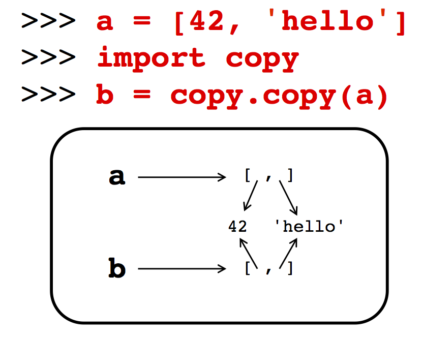

* Constructs a new list and inserts references to
the objects referenced in the original

### Shallow copies and mutables

```py
>>> a = [19, {'grade':92}]
>>> b = copy.copy(a)
>>> a
[19, {'grade': 92}]
>>> b
[19, {'grade': 92}]
>>> a[1]['grade'] = 97
>>> a
[19, {'grade': 97}]
>>> b
[19, {'grade': 97}]
>>>
```
Problem is that if we wanted to change value inside the dictionary, by changing a, we will change b as well

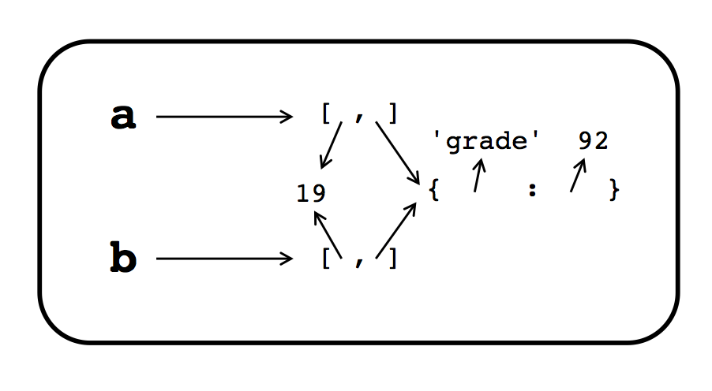

### Deep copy
This will recursively copy nested data structures
```py
>>> a = [19, {'grade':92}]
>>> b = copy.deepcopy(a)
>>> a
[19, {'grade': 92}]
>>> b
[19, {'grade': 92}]
>>> a[1]['grade'] = 97
>>> a
[19, {'grade': 97}]
>>> b
[19, {'grade': 92}]
>>>
```

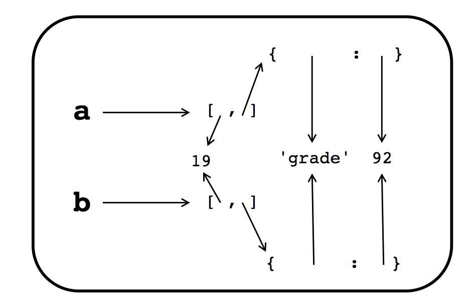

* Constructs a new list and inserts copies of the
objects referenced in the original

### Tuples and immutability

```py
>>> a = [42, 'feed the dog', 'clean house']
>>> import copy
>>> b = copy.copy(a)
>>> c = (a,b)
>>> c
([42, 'feed the dog', 'clean house'], [42, 'feed the dog', 'clean house'])
```
we can change mutable object (list), but not immutable objects (tuple)
```py
>>> b[0] = 7
>>> c
([42, 'feed the dog', 'clean house'], [7, 'feed the dog', 'clean house'])
>>> c[0][0] = 7
>>> c
([7, 'feed the dog', 'clean house'], [7, 'feed the dog', 'clean house'])
```

```py
>>> c[0] = [73, 'wash dishes', 'do laundry']
Traceback (most recent call last):
File "<stdin>", line 1, in <module>
TypeError: 'tuple' object does not support item assignment
>>>
```

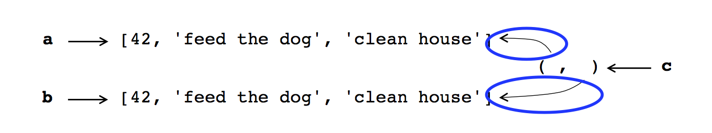

The immutable property of tuples only means I can't change where the arrows
point, I'm still free to change a mutable at the arrow destination

### Memory management

* What happens to those objects that are no longer referenced?

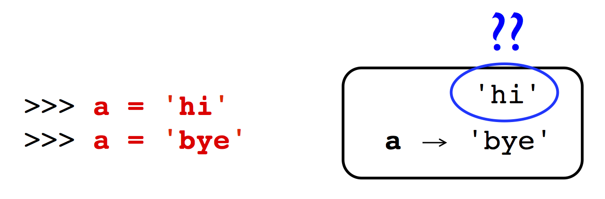

### Garbage collection

* Unreachable objects are garbage collected

* Garbage collection in Python is implemented with reference counting

Last example, we have string a and b, but no variables pointing to it, so no references
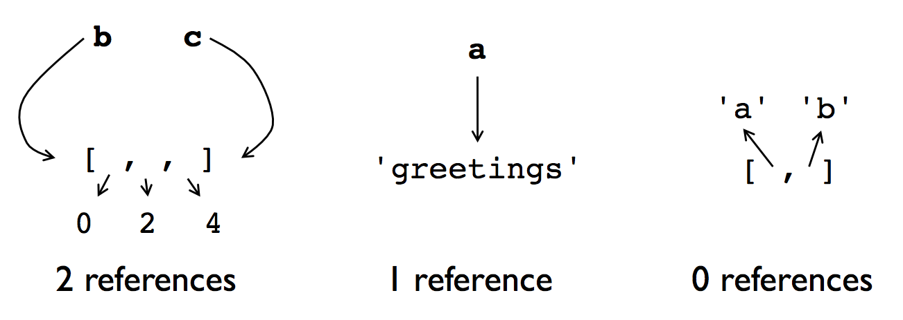

## Python modules

### Organization

* Your code should be organized in some way

* Code should often be split across multiple files for ease of maintenance and
  reuse

* For large projects you will probably have multiple directories each with
  multiple files

### Modules

* Code in Python can be organized and accessed as modules

* We've already used some modules that are part of Python (math, time, etc.)

* These modules were accessed using the import statement

### Import
Can use
```py
>>> import time
>>> dir(time)
```
to see the functions in the module

Here is an example if importing and using a function from the `time` module:

```py
>>> import time
>>> time.time()
1381091212.070504
>>> time()
Traceback (most recent call last):
File "<stdin>", line 1, in <module>
TypeError: 'module' object is not callable
>>> type(time)
<type 'module'>
>>> type(time.time)
<type 'builtin_function_or_method'>
>>>
```
type(time) shows us that it's a module, so you need to do time.time() to call the function that's in the module


* Keep in mind that the module name/object is different then the function that
  exists inside of the module

### Reference to a function

Functions are also objects and may be assigned to a variable:

```py
>>> t = time.time
>>> type(t)
<type 'builtin_function_or_method'>
>>> t is time.time
True
>>> t()
1381091266.353158
>>>
```
Can call the time.time() object with the variable t since we assigned it
### Import a single function

We can import a single function from a module:

```py
>>> from time import time
>>> type(time)
<type 'builtin_function_or_method'>
>>> time()
1381091470.26926
>>> import time
>>> type(time)
<type 'module'>
>>> time.time()
1381091483.548532
>>>
```

Another example is `from math import sqrt`.

### Import and rename

We can rename a function in the import statement:

```py
>>> from time import time as timer
>>> type(timer)
<type 'builtin_function_or_method'>
>>> timer()
1381091498.986958
>>>
```
another example:
```py
>>>import numpy as np
```
so we don't have to type numpy every time
### Wild card import

We can import everything from a module into the global namespace with:

```py
>>> from time import *
>>> type(time)
<type 'builtin_function_or_method'>
>>> time()
1381091614.217997
>>>
```

This is normally not a good idea, because you may unknowingly overwrite some
symbols that have been defined elsewhere.

### Modules and namespaces

* Not only do modules allow you to separate code into multiple files, but they
  also provide distinct namespaces

* Namespaces are particularly important in larger projects where reuse of common
  terms could be confusing at best

* Attribute renaming and/or wild card imports can make code less readable and
  more difficult to debug

### Example

Here we know where `time()` is coming from:

```py
import time
import mymodule
...
t = time.time()
```

Does `time()` come from `time` or `mymodule`?

```py
from time import *
from mymodule import *
...
t = time()
```

**Recommendation:** be explicit when using module functions!

### Writing your first module

See file `code/mymodule1.py`:

```py
def summation(a,b):
    total = 0
    for n in range(a,b+1):
        total += n
    return total

primes = [2, 3, 5, 7, 11, 13, 17, 19, 23, 29, 31, 37, 41, 43, 47]
```

### Using your first module

```py
>>> import mymodule1
>>> mymodule1.summation(1,100)
5050
>>> mymodule1.primes
[2, 3, 5, 7, 11, 13, 17, 19, 23, 29, 31, 37,
41, 43, 47]
>>>
```

### Improving your module

Add test code in file `code/mymodule2.py`:

```py
def summation(a,b):
    total = 0
    for n in range(a,b+1):
        total += n
    return total

primes = [2, 3, 5, 7, 11, 13, 17, 19, 23, 29, 31, 37, 41, 43, 47]

print('Testing function summation():...'),
total = summation(1,100)
if (total == 5050):
    print('OK')
else:
    print('FAILED')
```

### Testing your new module

```py
>>> import mymodule2
Testing function summation():... OK
>>> mymodule2.summation(1,100)
5050
>>> mymodule2.primes
[2, 3, 5, 7, 11, 13, 17, 19, 23, 29, 31, 37,
41, 43, 47]
>>>
```

### Import process

When you do `import mymodule2` several things happen

1. Python interpreter looks for a `.py` file with the same name as the module,
starting with your current directory followed by looking in system wide
locations

Invokes search through system directories

2. Code is byte compiled from the `.py` file to a `.pyc` file

Can delete .pyc files if you want or leave them there. When you update the code, it updates the .pyc file as well

3. File is processed from top to bottom

### Locating modules

* Searches for a module are based on directories in
the `sys.path` list

* **First item in the `sys.path` list is an empty string, `''``, which is used to
  denote the current directory**

For example,
  if you overwrite the math library, when you import math, because it search in the current working directory, it will invoke your function instead

```py
$ pwd
/home/nwh/git/cme211-notes/lecture-07
$ ls *.py
mymodule1.py  mymodule2.py
$ python
Python 2.7.5+ (default, Feb 27 2014, 19:37:08)
[GCC 4.8.1] on linux2
Type "help", "copyright", "credits" or "license" for more information.
>>> import sys
>>> sys.path.remove('') <- removed the current directory path
>>> import mymodule1
Traceback (most recent call last):
File "<stdin>", line 1, in <module>
ImportError: No module named mymodule1
>>> sys.path.insert(0,'')
>>> import mymodule1
>>>
```

### .pyc files

```
$ ls *.py*
mymodule1.py  mymodule1.pyc  mymodule2.py  mymodule2.pyc
```

* When you import a file Python byte compiles the file


* `.pyc` files are faster to load, but the runtime performance once you have them loaded is exactly the same
don't gain much by pre-byte compiling your files
safe to delete, typically don't want to commit these files into your git repos since they are regenerated

### `__name__` and `__main__`

* Special variable `__name__` is equal to `__main__` if the file is being
  executed as the main program

* `__name__` will not be equal to `__main__` if the file is being imported

### "Hiding" code during import

See `code/mymodule3.py`

```py
def summation(a,b):
    total = 0
    for n in range(a,b+1):
        total += n
    return total

primes = [2, 3, 5, 7, 11, 13, 17, 19, 23, 29, 31, 37, 41, 43, 47]

if __name__ == '__main__':
    print('Testing function summation():...'),
    total = summation(1,100)
    if (total == 5050):
        print('OK')
    else:
        print('FAILED')
```
without the if name==main, whenever you import this module, everything in this block will show up. Since we don't want to see the test code every time we import, we hide it in this if statement
### Another try at importing

```py
>>> import mymodule3
>>> mymodule3.summation(1,100)
5050
>>> mymodule3.primes
[2, 3, 5, 7, 11, 13, 17, 19, 23, 29, 31, 37,
41, 43, 47]
>>>
```

### Running the test code

```
$ python mymodule3.py
Testing function summation()... OK
$
```

### Documenting the module

See `code/mymodule4.py`:

```py
"""
My module of misc code.
"""

def summation(a,b):
    """
    Returns the sum of numbers between, and including, a and b.
    """

    total = 0
    for n in range(a,b+1):
        total += n
    return total

primes = [2, 3, 5, 7, 11, 13, 17, 19, 23, 29, 31, 37, 41, 43, 47]

if __name__ == '__main__':
    print('Testing function summation():...'),
    total = summation(1,100)
    if (total == 5050):
        print('OK')
    else:
        print('FAILED')
```
Triple quotes is documentation of what the function does
### Accessing your documentation

```py
>>> import mymodule4
>>> help(mymodule4)
```

```
Help on module mymodule4:

NAME
mymodule4 - My module of misc code.

FILE
/afs/.ir.stanford.edu/users/p/l/plegresl/CME211/Lecture07/mymodule4.py

FUNCTIONS
summation(a, b)
Returns the sum of numbers between, and including, a and b.

DATA
primes = [2, 3, 5, 7, 11, 13, 17, 19, 23, 29, 31, 37, 41, 43, 47]

(END)
```
## Python Error Handling
By default, python gives you traceback errors
### Errors in Python

```py
>>> a = [3, 7]
>>> a[2]
Traceback (most recent call last):
File "<stdin>", line 1, in <module>
IndexError: list index out of range
>>> b = {'cupcakes' : 7, 'brownies' : 2}
>>> b['cookies']
Traceback (most recent call last):
File "<stdin>", line 1, in <module>
KeyError: 'cookies'
>>>
```

### Exceptions
An exception is an object, and we can write code to catch exceptions to handle error
* Errors generate exceptions

* Exceptions can potentially be caught

* Uncaught exceptions propagate up to the interpreter, which halts execution and
  displays the information in a traceback

### Exceptions

* Python uses a try/except model for error handling

if you try to open a file that doesn't exist, we can handle this error (see below). If the try block is executed by the user, the except IOError block is printed to let user know their mistake.
Exception is a catch all statement for all exception types

```py
>>> f = open('thisfiledoesntexist.txt')
Traceback (most recent call last):
File "<stdin>", line 1, in <module>
IOError: [Errno 2] No such file or directory: 'thisfiledoesntexist.txt'
>>> try:
...     f = open('thisfiledoesntexist.txt')
... except IOError:
...     print 'That filename doesn't exist.'
...
That filename doesn't exist.
>>>
```

### Catching multiple exceptions

The 'try' block is executed, but all the code afterwards is still executed.

```py
>>> try:
...     5/0
... except IOError, e:
...     print('I/O error')
... except ZeroDivisionError, e:
...     print('Zero division error')
... except Exception, e:
...     print(e)
...
Zero division error
>>>
```

### Raising exceptions

From `code/mymodule5.py`:

```py
import types

def summation(a,b):
    """
    Returns the sum of numbers between, and including, a and b.
    """

    if (type(a) != types.IntType or type(b) != types.IntType):
        raise ValueError, 'Expected integers'

    total = 0
    for n in range(a,b+1):
        total += n
    return total
```

Using:
This one doesn't have the catch error. The Traceback error isn't as helpful to debug though, so that's why we raise a value error (above)- it's just more precise and easier to diagnose/debug later on.

```py
>>> import mymodule4
>>> mymodule4.summation(1,'hello')
Traceback (most recent call last):
  File "<stdin>", line 1, in <module>
  File "mymodule4.py", line 11, in summation
    for n in range(a,b+1):
TypeError: cannot concatenate 'str' and 'int' objects
>>> import mymodule5
>>> mymodule5.summation(1,'hello')
Traceback (most recent call last):
  File "<stdin>", line 1, in <module>
  File "mymodule5.py", line 13, in summation
    raise ValueError, 'Expected integers'
ValueError: Expected integers
>>>
```

### Recommended Reading

* Chapter 6: The Dynamic Typing Interlude

* Chapter 22: Modules: The Big Picture

* Chapter 23: Module Coding Basics

* Chapter 33: Exception Basics

* Chapter 34: Exception Coding Details

# CME 211: Lecture 8

Wednesday, October 7, 2015

Topic: Introduction to Object Oriented Programming (OOP) in Python

## Announcements
* Example to show good formatting of a Python program:
  <https://github.com/nwh/cme211-notes/blob/master/examples/ngrams/ngrams.py>

## Objects and References
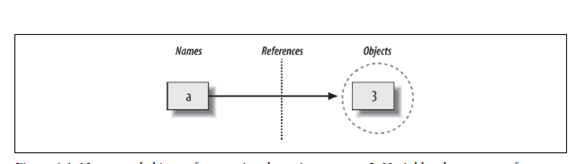

Variable

Object: pieces of allocated memory

Reference: pointers from variables to objects
*Types live with objects, not variable names*


## Command line arguments

In Python it is easy to pass command line arguments into a program.  For
review, a shell command looks like this:

```
$ command arg1 arg2 arg3
```
In a python scripts we can get access to the command line arguments with the
`sys.argv` variable.  `sys.argv` is a list containing the command line arguments
as items.  Command line arguments are separated by spaces.  See the example in
`code/command.py`:

```py
import sys

print("There are {} command line argument(s).".format(len(sys.argv)))

for i, arg in enumerate(sys.argv):
    print("arg {}: {}".format(i,arg))
```

Output:
Try not to name files with spaces since you have to quote or \ them.
```
$ python command.py a b c
There are 4 command line argument(s).
arg 0: command.py
arg 1: a
arg 2: b
arg 3: c
$ python command.py a b c "quote things with spaces"
There are 5 command line argument(s).
arg 0: command.py
arg 1: a
arg 2: b
arg 3: c
arg 4: quote things with spaces
$
```

Notes:

* `sys.argv[0]` is the name of the python script
* arguments are separated by spaces
* need to quote a string containing spaces
* in python, the data type is `str`, need to convert to an `int` or `float` if
  you want a number

Ex: Converting a string into an int
``` .py
a = int('1100')
```
## Introduction to OOP

### Procedural programming

* In procedural programming you implement your computation in terms of variables
(integers, doubles, etc.), data structures (arrays, lists, dictionaries, etc.),
and procedures (functions, subroutines, etc.)


* Python, C++, Fortran, Java, MATLAB, and many other languages have procedural
aspects to them but also support Object Oriented Programming (OOP)

### Why OOP?

* Concept of OOP has been around since 1960s

* Gained popularity in the 1980s and 1990s with the development and
standardization of C++, and faster computers that mitigated the overhead of the
abstractions

* Abstraction, modularity, and reusability are some of the most commonly cited
reasons for using OOP

* Almost all new software development uses some degree of OOP

### Abstraction

* Represent data and computations in a familiar form

    * Car object, with an engine object, and tire objects

* Make programmers more productive

    * Salaries are expensive compared to computers

* Too much abstraction can be a bad thing if it has a significant impact on
performance

    * Desktop computers really are cheap

    * Supercomputers are not cheap

### Objects

* In OOP you express your computations in terms of objects, which are instances
  of classes

* Classes are blueprints for objects
A class specifies data and functions associated with object
Object is actual thing in memory that gets assigned
There could be many objects in a class

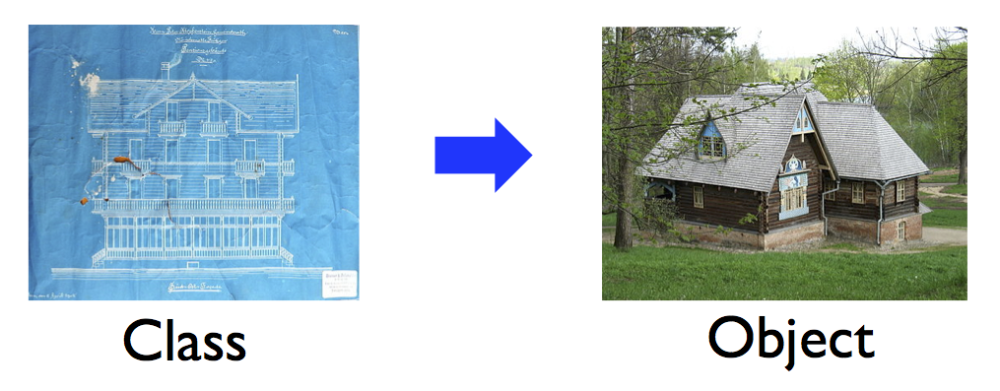

* Classes specify data and the methods to use or interact with that data

### Class / object example 1: list

```py
>>> a = list()
>>> a.append(5)
>>> a.append(19)
>>> a.append(3)
>>> a
[5, 19, 3]
>>> a.sort()
>>> a
[3, 5, 19]
>>>
```

* `list()` returns an object which is an instance of the *list* class
* `append()` and `sort()` are *methods* (function that is attached to the object, call using the "." notation)
* 3, 5, 19 are the *data* maintained by the object

### Class / object examples 2: file objects

See the file `code/filewrite.py`:

```py
f = open("hello.txt", "w")
f.write("hello cme211!\n")
f.close()
```

* The `open()` function returns an *object* which is an instance of the *file
  class*

* `write()` and `close()` are methods of the *file class*

If we run the code in *interactive* mode, we can inspect these things in
Python's online help:

```
$ python -i filewrite.py
>>> help(open)
```

Output:

```
Help on built-in function open in module __builtin__:

open(...)
    open(name[, mode[, buffering]]) -> file object

    Open a file using the file() type, returns a file object.  This is the
    preferred way to open a file.  See file.__doc__ for further information.
```

Now let's look at the file object with `>>> help(f)`:

```
Help on file object:

class file(object)
 |  file(name[, mode[, buffering]]) -> file object
 |  
 |  Open a file.  The mode can be 'r', 'w' or 'a' for reading (default),
 |  writing or appending.  The file will be created if it doesn't exist
 |  when opened for writing or appending; it will be truncated when
 |  opened for writing.  Add a 'b' to the mode for binary files.
 |  Add a '+' to the mode to allow simultaneous reading and writing.
 |  If the buffering argument is given, 0 means unbuffered, 1 means line
 |  buffered, and larger numbers specify the buffer size.  The preferred way
 |  to open a file is with the builtin open() function.
 |  Add a 'U' to mode to open the file for input with universal newline
 |  support.  Any line ending in the input file will be seen as a '\n'
 |  in Python.  Also, a file so opened gains the attribute 'newlines';
 |  the value for this attribute is one of None (no newline read yet),
 |  '\r', '\n', '\r\n' or a tuple containing all the newline types seen.
 |  
 |  'U' cannot be combined with 'w' or '+' mode.
 |  
 |  Methods defined here:
 |  
 |  __delattr__(...)
 |      x.__delattr__('name') <==> del x.name
 |  
 |  __enter__(...)
 |      __enter__() -> self.
 |  
```

The help documentation continues.  The public interface methods are at the
bottom.  I wish they would swap the order.

### Modularity and reusability

* High level languages like Python, Java, C++, etc.  include classes for working
with files, holding data (lists and dictionaries), etc.
  not true for C or fortran programmer; need to access a library in this case. standard classes make things very nice

* So you do not have to design and create your own classes if someone else has
already done the work for you


* But you might want to create classes that are specialized to the needs of your
applications, so they can be used (and reused) by yourself and others

### OOP in Python

* New kinds of objects can be created in Python by defining your own classes

* Classes are the blueprint for creating objects which are known as instances of
the class

* When instance of an object is created, Python does this: "Find the first occurrence of *attribute* by looking in *object*, then in all classes above it, from bottom to top and left to right"
      * attribute fetches are tree searches

* Classes have *attributes*

    * Variables (data) are called class *variables*

    * Functions for interacting with the class are called *methods*

    * Attributes are accessed using *dot notation*

    * Ex: Calling "I2.w" searches for attribute w by looking in I2 and above (at it's superclasses)

### Creating instances

* Instances of a class are created by calling the class object as a function

* Instances represent the concrete items in a program's domain. Their attributes record data that varies per specific object

For example, you can make multiple houses (objects) with the same blueprint (class), so each house is an instance of the blueprint (of the class)

* Any arguments of the function call are passed to the special `__init__()`
  method
    - `__init__` is  known as the constructor method and used to initialize objects' state

* Difference between class and modules: we only ever have one instance of a given module in memory, but with classes, we can make as many instances as we need

### Python class definition

```py
class Student:
    def __init__(self, id):
        self.id = id
```

* Classes are defined with the `class` keyword
* Followed by the class name and a colon (`:`)
* Followed by the indented class body, containing class *attributes*

### Object initialization

```py
    def __init__(self, id):
        self.id = id
```

* `__init__` is the special name for the initialization method
* `self` is a reference to the specific instance (object) that is calling this
  method
* `id` is the input argument from the call to create a new instance
* `self.id = id` stores the input `id` in the object

### Another example
When run class implements three specially named attributes that Python calls automatically:
* `__init__` is run when new instance object is created: self is the new ThirdClass object
* `__add__` is run when a ThirdClass instance appears in a + expression
*  `__str__` is run when an object is printed (or when it's converted to a print string)
  - NOTE: we usually use `__repr__`


```py
class ThirdClass(SecondClass):
    def __init__(self,value):
        self.data = value
    def __add__(self,other):
        return ThirdClass(self.data + other)
    def __str__(self):
        return '[ThirdClass: %s]' % self.data
```


### Class definition in action

See the file `code/student1.py`

7 is the id of the student, Student is the class

```py
class Student:
    def __init__(self, id):
        self.id = id

s = Student(7)
print(s)
```

Output:
```
$ python student1.py
<__main__.Student instance at 0x1069f6c20>
$
```
* we created an instance object (namespace that have access to their classes' attributes) by calling the class Student
    - we have 2 objects: 1 instance and 1 class, or 2 linked namespaces
    - the value id is passed in and assigned to self.id.
    - Self automatically refers to the instance being processed, which is s
* To get access to the id field, we can do s.id
    - This attaches a new attribute to the object; programs can fetch, change, or create attributes on any object to which they have references

### Let's talk about `self`

* First argument to any method is 'self'-- this is usually just for convention. Represents object that is calling the particular method

* Self always receives the instance object that is the implied subject of the method call, called self by convention

See `code-08/self.py`:
```py
class Student:
    def __init__(self, id):
        print("inside __init__()")
        print("self = {}".format(self))
        self.id = id

s = Student(7)
print("s    = {}".format(s))
```
We see from the output that we get the same thing. Self is just a reference to the object
Output:

```
$ python self.py
inside __init__()
self = <__main__.Student instance at 0x10967cc20>
s    = <__main__.Student instance at 0x10967cc20>
$
```

### Object setup

* The optional initialization method is typically used to do setup of class
variables that will be used throughout the life of the instance

* What kind of class variables might we want to setup for a student class?

### Class variable setup

* The `__init__` method is coded or inherited in a class, and Python calls it automatically each time an instance of that class is created. It's known as the constructor method; it is passed the new instance implicity, as well as any arguments passed explicitly to the class name. It's also the most commonly used operator overloading method.

* If `__init__` method NOT is present, instances simply begin life as empty namespaces

See `code/student2.py`.  Let's add an empty dictionary for the classes that
the student is enrolled in:

```py
class Student:
    def __init__(self, id):
        self.id = id
        self.classes = {} #means a dictionary of classes (courses, not the python class) that the student has been enrolled in

s = Student(7)
```

### Architecting our object

* Our object has data about `id` and `classes`

* But how do we do anything with it?

* We need to create additional methods for interacting or *interfacing* with the
object

### Encapsulation

Only care about inputs and outputs, details are hidden to make it easier to use

* The *interface* of an object encapsulates the internal data and code

* *encapsulation* means hiding the details of data structures and algorithms
(internal code)

As long as you don't change the interface, you don't have to change all the code that uses this interface. Just change data internal code. Adding things are fine, but changing things that you've introduced in the past causes problems

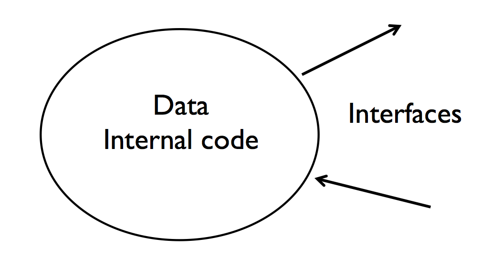


### Interfaces

* Interfaces protect the user of the class from internal implementation details

* Found a better way to implement the internal representation of the data? No
problem

* New algorithm for the internal processing of that data? No problem

* Screwed up your interface and now need to make changes to the interface?
Problem

### Defining a regular method

* *Methods* are functions attached to classes as attributes

Inside of the `Student` class, we put:

```py
    def getId(self):
        return self.id
```

* just like defining a Python function

* `self` is a reference to the specific instance that is calling this method

### Access to id

See `code/student3.py`:

```py
class Student:
    def __init__(self, id):
        self.id = id
        self.classes = {}
    def getId(self):
        return self.id

s = Student(7)
print(s)
print(s.getId())
```

Output:

```
$ python student3.py
<__main__.Student instance at 0x1038becb0>
7
$
```

### Check up

* How are we doing with interface design?

* Is there a way somebody could accidentally change the id given the interface
we've implemented?

* Let's test it!  See `code/student4.py`:

```py
class Student:
    def __init__(self, id):
        self.id = id
        self.classes = {}
    def getId(self):
        return self.id

s = Student(7)
print(s)
id = s.getId()
print("id = {}".format(id))
id = 9 #changing this from 7 to 9 doesn't change the id.
#We have not allowed a user to muck around with the internals of the class
print("id = {}".format(id))
print("s.getId() = {}".format(s.getId()))
```
Output:

```
$ python student4.py
<__main__.Student instance at 0x10bef2cb0>
id = 7
id = 9
s.getId() = 7
$
```

* The reference returned by `getId()` cannot be used to change the assignment of
  the reference within the object.


### Adding classes / grades

See: `code/student5.py`:

Problems: need to initialize gpa (to zero or NaN) otherwise this doesn't exist (try out by yourself)

id = arguments passed to the class

Should not add attributes to a class

```py
class Student:
    def __init__(self, id):
        self.id = id
        self.classes = {}
    def getId(self):
        return self.id
    def addClass(self, name, gradepoint):
        self.classes[name] = gradepoint
        #print self.classes.values() to see what it returns
        #ah, returns the values of the dictionary
        print('this is class values: {}'.format(self.classes.values()))
        sumgradepoints = float(sum(self.classes.values()))
        self.gpa = sumgradepoints/len(self.classes)
    def getGPA(self):
        return self.gpa

s = Student(7)
s.addClass("gym", 4)
s.addClass("math", 3)
print("GPA = {}".format(s.getGPA()))
```

Output:

```
$ python student5.py
this is class values: [4]
this is class values: [4, 3]
GPA = 3.5
$
```

### Getting classes

See `code/student6.py`:

```py
class Student:
    def __init__(self, id):
        self.id = id
        self.classes = {}
    def getId(self):
        return self.id
    def addClass(self, name, gradepoint):
        self.classes[name] = gradepoint
        sumgradepoints = float(sum(self.classes.values()))
        self.gpa = sumgradepoints/len(self.classes)
    def getGPA(self):
        return self.gpa
    def getClasses(self):
        return self.classes

s = Student(7)
s.addClass("gym", 4)
s.addClass("math", 3)
print("GPA = {}".format(s.getGPA()))
print("classes = {}".format(s.getClasses()))
```

Output:

```
$ python student6.py
GPA = 3.5
classes = {'gym': 4, 'math': 3}
$
```

### Getting classes

If a method returns a reference to a mutable object, then changing that object
"outside" of the class will change the data "inside" of the class.  See `code/student7.py`

```py
class Student:
    def __init__(self, id):
        self.id = id
        self.classes = {}
    def getId(self):
        return self.id
    def addClass(self, name, gradepoint):
        self.classes[name] = gradepoint
        sumgradepoints = float(sum(self.classes.values()))
        self.gpa = sumgradepoints/len(self.classes)
    def getGPA(self):
        return self.gpa
    def getClasses(self):
        return self.classes

s = Student(7)
s.addClass("gym", 4)
s.addClass("math", 3)

classes = s.getClasses()
classes["english"] = 4

print("GPA = {}".format(s.getGPA()))
print("classes = {}".format(s.getClasses()))
```

Output:

```
$ python student7.py
GPA = 3.5  #this is the wrong gpa since we added 'english'
classes = {'gym': 4, 'english': 4, 'math': 3}
$
```
Iterface leaks out mutable states (dictionary) and *now they are out of sync*

### Interfaces and references

* It is easy to accidentally let a method provide a reference to a mutable data
structure within your object

* Once you have handed out that reference someone can manipulate your internal
data and perhaps get the object into an unexpected state

* You really need to think about what you pass out of your object if you want to
have strong encapsulation

### Public attributes

* Default behavior is that all attributes are public, i.e. accessible using dot
notation

`code/student8.py`:

```py
class Student:
    def __init__(self, id):
        self.id = id
        self.classes = {}
    def getId(self):
        return self.id

s = Student(7)
print("s.id = {}".format(s.id))
```


Output:

```
$ python student8.py
s.id = 7
$
```

### Public attributes
`code/student9.py`:

```py
class Student:
    def __init__(self, id):
        self.id = id
        self.classes = {}
    def getId(self):
        return self.id

s = Student(7)
print("s.getId() = {}".format(s.getId()))
s.id = 9
print("s.getId() = {}".format(s.getId()))
```

Output:
This may or may not be a good interface design. we might want to protect this id variable. can do this by having protected variables start with "__ ".

```
$ python student9.py
s.getId() = 7
s.getId() = 9
$
```

### Private attributes
can prefixing with 2 underscores, so instead of "self.id", it's "self._ id"

no extra computational cost to making it private

Note: can use pass to make script run and put in code body later
```py
if True:
  pass
```
***Don't add attributes after an object has been created***

* Attributes can be made private by using a double underscore prefix for the
name

* See `code/student10.py`:

```py
class Student:
    def __init__(self, id):
        self.__id = id
        self.classes = {}
    def getId(self):
        return self.__id

s = Student(7)
print("s.getId() = {}".format(s.getId()))
print("s.id = {}".format(s.__id))
```

* Output

```
$ python student10.py
s.getId() = 7
Traceback (most recent call last):
  File "student10.py", line 10, in <module>
    print("s.id = {}".format(s.__id))
AttributeError: Student instance has no attribute '__id'
$
```

### "Privacy" through obscurity

Run `student10.py` in interactive mode:

```
$ python -i student10.py
s.getId() = 7
Traceback (most recent call last):
File "student10.py", line 10, in <module>
print "s.id = %s" % s.__id
AttributeError: Student instance has no attribute '__id'
>>> s._Student__id
7
>>> s._Student__id = 9
>>> s.getId()
9
>>>
```

The "private" attribute is still accessible by prefixing it with `_<class name>`.

### What not to do

Python is dynamic, which is great.  But you should not do this:

***Again, don't add attributes after an object has been created***

```
$ python
Python 2.7.4 (default, Sep 26 2013, 03:20:26)
[GCC 4.7.3] on linux2
Type "help", "copyright", "credits" or "license" for more information.
>>> class MyClass:
...
pass
...
>>> a = MyClass()
>>> a.nitems = 3
>>> a.todo = []
>>> a.todo.append("get groceries")
>>> a.todo
['get groceries']
>>>
```

### OOP Summary

* Object Oriented Programming is about implementing abstractions such that data,
and the associated operations on it, are represented in a way that is more
familiar to humans

* Mechanics of OOP are about the same as procedural programming, but developing
good abstractions can take a lot of thought

### Recommended Reading

*Learning Python, Fifth Edition* by Mark Lutz

* Chapter 26: OOP: The Big Picture

* Chapter 27: Class Coding Basics

# CME 211: Lecture 9

Wednesday, October 9, 2015

Topic: More Object Oriented Programming (OOP) in Python

## Python OOP topics & examples

### Name example

* `code/names.py`:

methods can be called inside the initialization method


```py
class NameClassifier:
    def __init__(self, femalefile, malefile):
        self.LoadNameData(femalefile, malefile)

    def LoadNameData(self, femalefile, malefile):
        # Creates a dictionary with the name data from the two input files
        self.namedata = {}
        f = open(femalefile,'r')
        for line in f:
            self.namedata[line.split()[0]] = 1.0
        f.close()

        f = open(malefile,'r')
        for line in f:
            name = line.split()[0]
        if name in self.namedata:
            # Just assume a 50/50 distribution for names on both lists
            self.namedata[name] = 0.5
        else:
            self.namedata[name] = 0.0
        f.close()

    def ClassifyName(self, name):
        if name in self.namedata:
            return self.namedata[name]
        else:
            # Don't have this name in our data
            return 0.5
```

* `code/main.py`:

```py
import names

# Create an instance of the name classifier
classifier = names.NameClassifier('dist.female.first', 'dist.male.first')

# Setup test data
testdata = ['PETER', 'LOIS', 'STEWIE', 'BRIAN', 'MEG', 'CHRIS']

# Invoke the ClassifyName() method
for name in testdata:
    print('{}: {}'.format(name, classifier.ClassifyName(name)))
```

* Output:

```
$ python main.py
PETER: 1.0
LOIS: 1.0
STEWIE: 0.5
BRIAN: 1.0
MEG: 1.0
CHRIS: 1.0
```

### Student example

Let's inspect a `Student` object:

* `code/student1.py`:

Notes: It returns copy.deepcopy(self.classes), so the thing that's returned cannot come back and change internal state of the student object since it's a deep copy of it.
  -This is often a good thing to do if you want to return a bunch of data from inside your class (Maintains strong encapsulation)


```py
import copy

class Student:
    def __init__(self, id):
        self.id = id
        self.classes = {}
    def getId(self):
        return self.id
    def addClass(self, name, gradepoint):
        self.classes[name] = gradepoint
        sumgradepoints = float(sum(self.classes.values()))
        self.gpa = sumgradepoints/len(self.classes)
    def getGPA(self):
        return self.gpa
    def getClasses(self):
        return copy.deepcopy(self.classes)

s = Student(7)
s.addClass("gym", 4)
s.addClass("math", 3)

print("s = {}".format(s))

# lots of print statements to get information
print(s.getId())
print(s.getClasses())
print(s.getGPA())
```

Output:

```
$ python student1.py
s = <__main__.Student instance at 0x7f27f94acdd0>
7
{'gym': 4, 'math': 3}
3.5
$
```

### Operator overloading

* Your user defined objects can be made to work with the Python built-in
operators

* Methods named with double underscores (`__X__`) are special hooks

* Why would you want to do that?

### String representation method

* `code/student2.py`:

all same except we added a "repr" method. this returns String representation of the method
before, when we did print(s), we got instance of memory, but now it prints out a nice thing

We've overloaded some default python funcitonality

```py
import copy

class Student:
    def __init__(self, id):
        self.id = id
        self.classes = {}
    def getId(self):
        return self.id
    def addClass(self, name, gradepoint):
        self.classes[name] = gradepoint
        sumgradepoints = float(sum(self.classes.values()))
        self.gpa = sumgradepoints/len(self.classes)
    def getGPA(self):
        return self.gpa
    def getClasses(self):
        return copy.deepcopy(self.classes)
    def __repr__(self):
        string = "Student %d: " % self.getId()
        string += " %s, " % self.getClasses()
        string += "GPA = %4.2f" % self.getGPA()
        return string

s = Student(7)
s.addClass("gym", 4)
s.addClass("math", 3)

# now easy to print a student
print(s)
```

Output:

```
$ python student2.py
Student 7: {'gym': 4, 'math': 3}, GPA = 3.50
$
```

### Methods you can override

```
| method               | operation                  |
|----------------------+----------------------------|
| __len__(self)        | Returns the length of self |
| __add__(self, other) | Returns self + other       |
| __mul__(self, other) | Returns self * other       |
| __neg__(self)        | Returns -sefl              |
| __abs__(self)        | Returns abs(self)          |
| __float__(self)      | Returns float(self)        |
```

Over 50+ methods in total

### What is OOP?

* Some will argue that putting your data in an object, and adding a bunch of put
/ get methods to interface with it, is just a glorified container and interface


* Real power of OOP might be in allowing objects to interact with each other by
overriding appropriate methods


### Particle collision

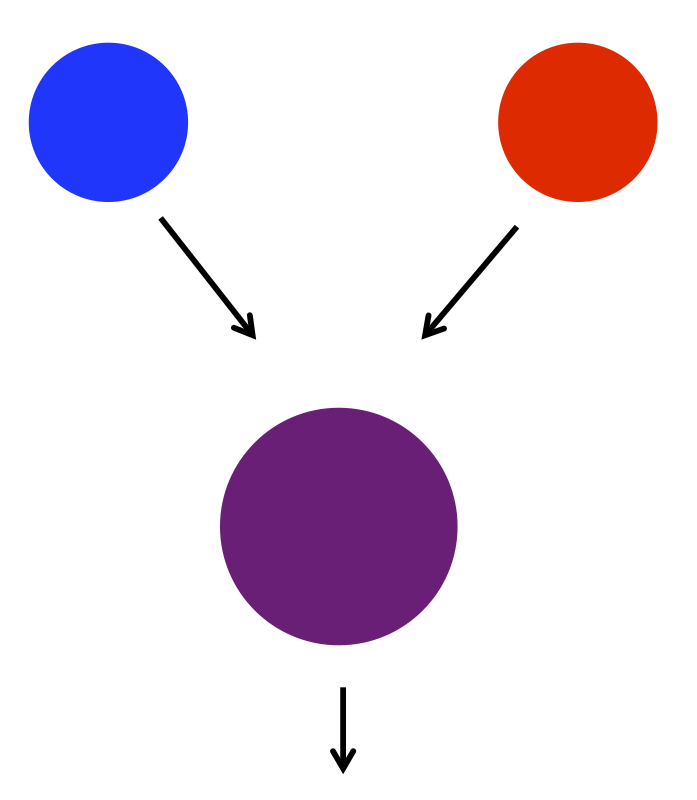

### OOP design

```
p_blue = Particle(...)
p_red = Particle(...)

...

p_purple = p_blue + p_red
```

### Particle class
"self" is the left hand side and "other" is the RHS
`code/particle.py`:

```py
class Particle:
    def __init__(self, mass, velx):
        self.mass = mass
        self.velx = velx
    def __add__(self, other):
        # inelastic collision (momentum is conserved)
        mass = self.mass + other.mass
        velx = (self.mass*self.velx + other.mass*other.velx)/mass
        return Particle(mass, velx)
    def __repr__(self):
        return "Mass: %s, Velocity: %s" % (self.mass, self.velx)
```

### OOP particle collision

```
$ python -i particle.py
>>> p_blue = Particle(4.3, 2.5)
>>> p_red = Particle(1.4, -0.8)
>>> p_purple = p_blue + p_red
>>> p_purple
Mass: 5.7, Velocity: 1.68947368421
>>>
```

### Overloading should be intuitive

`code/badoverloading.py`:

```py
class User:
    def __init__(self, id):
        self.id = id
    def __len__(self):
        return self.getId()
    def getId(self):
        return self.id
```

Output:

```
$ python -i badoverloading.py
>>> user = User(7)
>>> len(user)
7
>>>
```

Is this intuitive?
No, you shouldn't overload this one- it doesn't make sense for the user to have a length. Operator should make sense
### Inheritance

* Inheritance is a way for a class to inherit attributes from another class

* This is a form of code reuse

* The original class is called a base class, or a superclass, or a parent class

* The new class is called a derived class, or a subclass, or a child class

* The new class will typically redefine or add new attributes

### Inheritance example

`code/inheritance1.py`:

```py
# parent class
class User:
    def __init__(self, id):
        self.id = id
    def getId(self):
        return self.id

# child class
class MovieWatcher(User):
    pass
```
moviewatcher inherits from user class ...(User) means we are inheriting all attributes of User
Output:

```
$ python -i inheritance1.py
>>> user = MovieWatcher(3)
>>> user.getId()
3
>>>
```

### Overriding a method

`code/inheritance2.py`:

In this case, the moviewatcher has additional info. need to call initialization from parent class (use name of parent class and . method)

```py
class User:
    def __init__(self, id):
        self.id = id
    def getId(self):
        return self.id

class MovieWatcher(User):
    def __init__(self, id):
        # Call the parent class initialization
        User.__init__(self, id)
        # MovieWatcher specific initialization
        self.avgmovieranking = -1.
        self.movies = {}
```

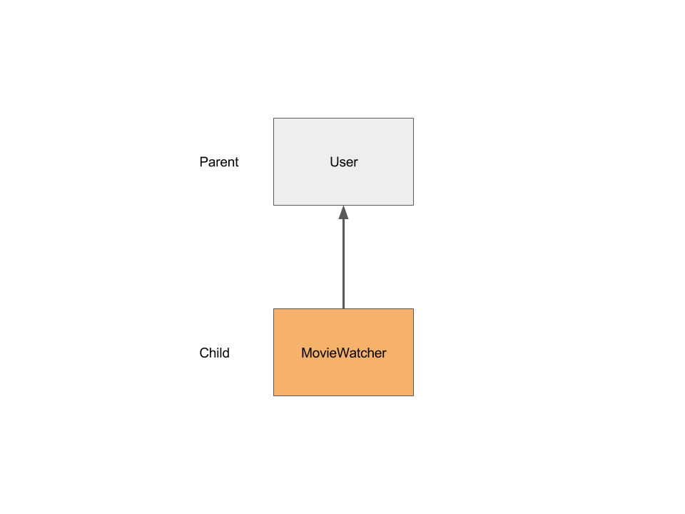

### Sibling classes

`code/inheritance3.py`:

both cookieeater and moviewatcher has inherited from user

```py
class User:
    def __init__(self, id):
        self.id = id
    def getId(self):
        return self.id

class MovieWatcher(User):
    def __init__(self, id):
        # Call the parent class initialization
        User.__init__(self, id)
        # MovieWatcher specific initialization
        self.avgmovieranking = -1.
        self.movies = {}

class CookieEater(User):
    def __init__(self, id):
        # Call the parent class initialization
        User.__init__(self, id)
        # CookieEater specific initialization
        self.cookieseaten = 0
        self.cookies = {}
```

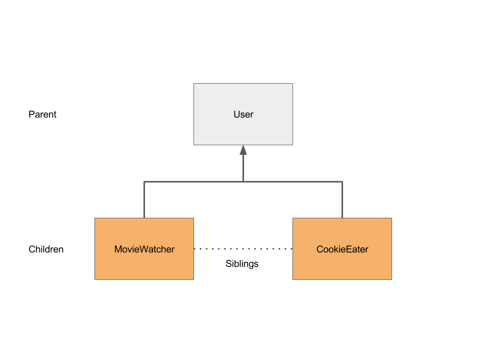

### Polymorphism
Meaning of operation depends on objects being operated on
- ex. 4*5 means multiplication but 'string'* 5 means repetition
*polymorphic* means function works on arbitrary types, as long as they support the expected object interface

* Different types of objects have methods with the same name that take the same
arguments

* Programmer does not need to know the exact type of an object for common
operations

* Typically the objects inherit from the same parent class

### Shapes

`code/shapes.py`:

Better implementation is if Shape knows it's posisition, then Circle and Rectangle inherits it

```py
import math

class Shape:
    def GetArea(self):
        raise RuntimeError, "Not implemented yet"

class Circle(Shape):
    def __init__ (self, x, y, radius):
        self.x = x
        self.y = y
        self.radius = radius

    def GetArea(self):
        area = math.pi * math.pow(self.radius, 2)
        return area

class Rectangle(Shape):
    def __init__ (self, x0, y0, x1, y1):
        self.x0 = x0
        self.y0 = y0
        self.x1 = x1
        self.y1 = y1

    def GetArea(self):
        xDistance = self.x1 - self.x0
        yDistance = self.y1 - self.y0
        return abs(xDistance * yDistance)

shapes = []
shapes.append(Circle(0., 0., 1.0))
shapes.append(Rectangle(0., 0., 2., 4.))

for shape in shapes:
    print("area = {}".format(shape.GetArea()))
```

Output:

```
$ python shapes.py
area = 3.14159265359
area = 8.0
$
```

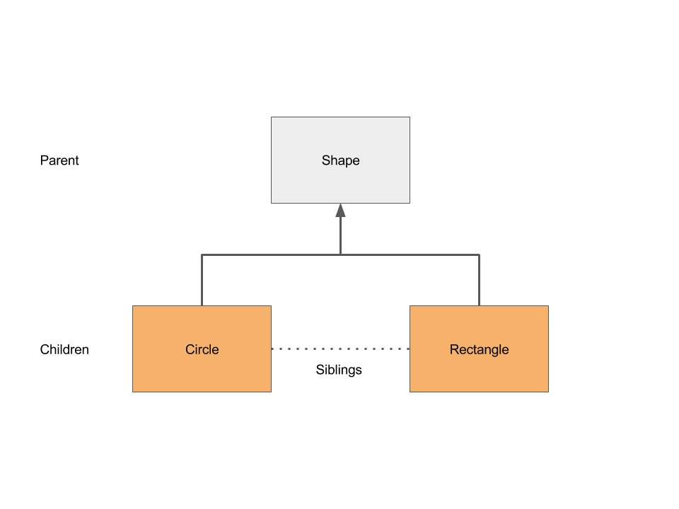

### OOP Summary

* Abstraction

* Represent things in a form familiar to humans

* Encapsulation

* Restrict access to internal data by providing interfaces

* Inheritance

* Parent / child classes for code reuse

* Polymorphism

* Share method names and arguments across (sibling) classes
# CME 211: Lecture 10

Monday, October 12, 2015

## Quiz 1 Prep

* Open book
* Open note
* Open computer (restricted internet use)
    * you may use Python iterpreter
    * use computer to access notes at
     <https://github.com/nwh/cme211-notes>
    * use computer to access Learning Python book
    * use computer to access Python documentation @ python.org
    * use computer to access reference sheet
      <http://www.astro.up.pt/~sousasag/Python_For_Astronomers/Python_qr.pdf>
    * You may not use Google or any other search method to try and find answers

Topics:

* Understanding of low level and high level programming languages
* Use cases for fundamental data types: integers, floating point numbers,
  strings
* basic Python syntax: loops, conditionals, functions, variables
* built-in Python containers: lists, dictionaries, sets
* fundamentals of python's data model
* Python OOP: defining classes, data attributes, methods
* Basics of complexity analysis (as covered in lecture)

Won't quiz on exceptions
No details on modules

Book chapters:

* Chapter 5: Numeric Types
* Chapter 6: The Dynamic Typing Interlude (i.e. references and objects)
* Chapter 7: String Fundamentals
* Chapter 8: Lists and Dictionaries
* Chapter 9: Tuples, Files, and Everything Else
* Chapter 11: Assignments, Expressions, and Prints
* Chapter 12: if Tests and Syntax Rules
* Chapter 13: while and for Loops
* Chapter 16: Function Basics
* Chapter 17: Scopes
* Chapter 18: Arguments
* Chapter 26: OOP: The Big Picture
* Chapter 27: Class Coding Basics

Notes:

* If you want `sqrt()`, remember to `import math` and use `math.sqrt()`.  Other
  than that, we won't test on module stuff.
* We won't test on python exceptions
* We won't test on Numpy, Scipy, or matplotlib (which we cover this week)
