# CME 211: Lecture 10

Topics: Representation of numbers, Numpy overview

## Computer representation of data

* Computers represent and store everything in *binary* (base 2, 0s and 1s called binary digits or bits)

* Byte = 8 bits

### Simplified model of computer

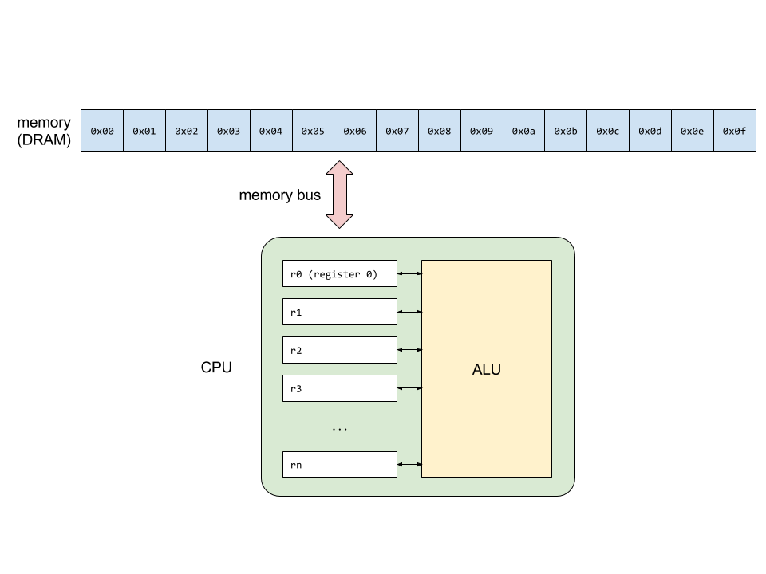

- Large sequence of bytes make up memory or DRAM.
- In diagram, each box = a single byte, each byte in memory has an address; usually 0x00 (hexadecimal, base 16)
- Fast computations done in registers
- Communication across memory bus is very slow compared to communication from register to alu
- nearby data is also brought along in memory bus, so it's ready to go in register

* temporal locality: likely i want data soon
* spatial locality: likely i want data nearby


### Converting between bases

* One can easily convert numbers between different bases such as binary (base 2)
and decimal (base 10)

```
| decimal | binary |
|---------+--------|
|       0 |      0 |
|       1 |      1 |
|       2 |     10 |
|       3 |     11 |
|       4 |    100 |
|       5 |    101 |
|       6 |    110 |
|       7 |    111 |
```
- if we have 8 bits, then largest number is 2^7+2^6...+2^0 = 255, so we have a range from 0-255 or can represent 256.
- For negative number, use negative two's compliment

### Common prefixes

* kilo, mega, giga, tera, peta, exa prefixes:

```
| kilobyte (kB) | 10^3 (or 2^10)  |
| megabyte (MB) | 10^6 (or 2^20)  |
| gigabyte (GB) | 10^9 (or 2^30)  |
| terabyte (TB) | 10^12 (or 2^40) |
| petabyte (PB) | 10^15 (or 2^50) |
| exabyte (EB)  | 10^18 (or 2^60) |
```

* Networking and storage typically use base 10 while memory is specified in
terms of base 2

* Technically prefixes and symbols are different, e.g. Kilobyte or kibibyte with
symbols KB / KiB / Kbytes for base 2

### Computer storage of text

* American Standard Code for Information Interchange (ASCII) is typically used
to encode text information

Assigns binary number to each letter, each character represents 7 bits, represent 128 characters

* Characters, numbers, symbols, etc. are encoded using 7 bits (although on
modern computers they would typically use 8 bits)

  * `A` maps to `1000001` in binary or 65 in decimal
  * `B` maps to `1000010` in binary or 66 in decimal

  python 2: strings are ascii
  python 3: strings in unicode format, up to 32 bits

### Computer storage of a number

* At the hardware level computers **don't** do variable length representations of
numbers

* We might write:

  * 4 as `100`, using 3 bits

  * 73 as `1001001`, using 7 bits

### Fixed storage widths

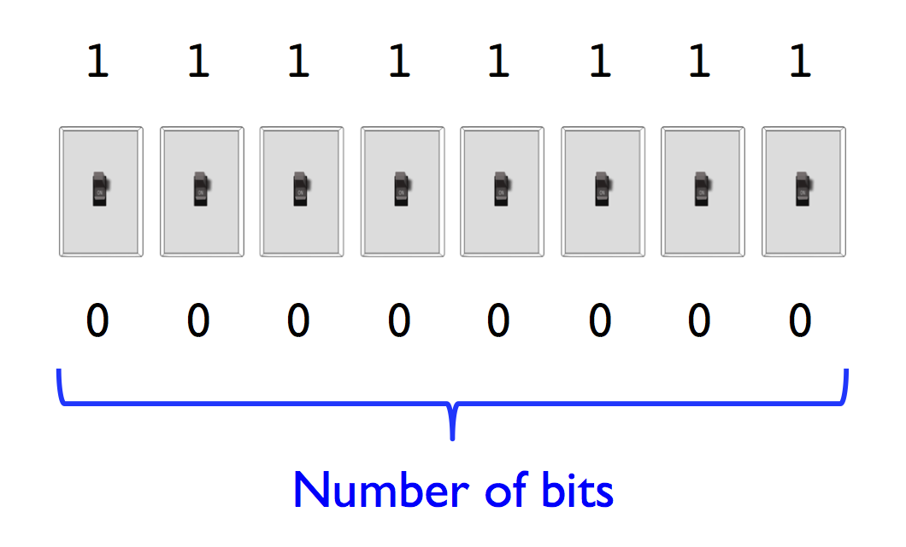

all floating point numbers take same amount of memory (same bits)
### Integer representation

* At the hardware level computers typically handle integers using 8, 16, 32, or
64 bits

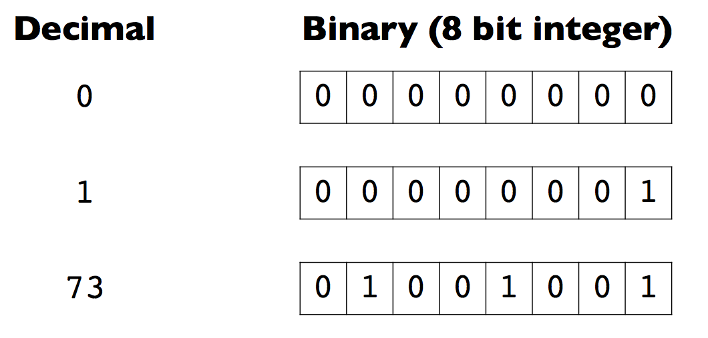

bit shift to left = multiplying the number
bit shift to right = divide, but might lose remainder

### Integer range

* For `n` bits, there are only `2^n` unique combinations of 0s and 1s

* This limits the range of what can be represented with a fixed number of bits

```
unsigned
2^8  = 256
2^16 = 65536
2^32 = 4,294,967,296
2^64 = 18,446,744,073,709,551,616

signed
2^8 gives  -127 to 128
2^16 gives -2^15+1 to 2^15 (-32767 to 32768)
2^32 gives -2^31+1 to 2^31
2^64 gives -2^63+1 to 2^63

```

### Sign bit

* Use one bit for sign and remaining bits for magnitude
cuts your positive values by a power of 2
two representations of 0 and -0, not good
causes hardware implementation to be more complicated

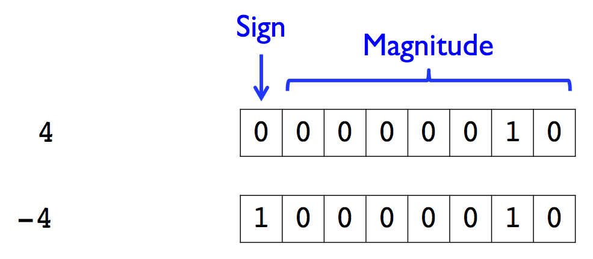

* Reduces the range of the magnitude from `2^n` to `2^(n-1)`

### Offset

* Apply an offset or bias to reinterpret the conversion between binary and
decimal

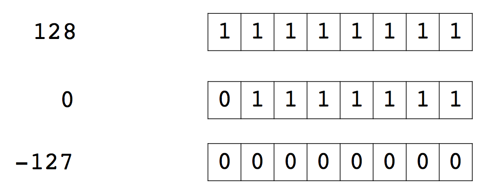

* Again, effectively reduces the range of the magnitude


### Unsigned integers

* Many programming languages support unsigned integers

* Python itself does not have unsigned integers, but Numerical Python (`numpy`) does

* Can use this to your advantage to expand the effective range available if
negative numbers don't need to be stored

### Overflow and underflow

* Attempting to assign a value greater/less than what can be represented by the data
type will result in overflow/underflow

* Overflow or underflow tend to cause wraparound, e.g. if adding together two
signed numbers causes overflow the result is likely to be a negative number

* Ex: overflow causes 128+1 = -127
* Ex: underflow causes -127-1 = 128

```py
>>> a = numpy.zeros(1,dtype=numpy.uint32)
>>> a
array([0], dtype=uint32)
>>> a-1
array([4294967295], dtype=uint32)
```
using numpy, give uint (unsigned integer of 32 bits, and subtract 1 to get largest value)
shows that it wraps around

### Range of integer types

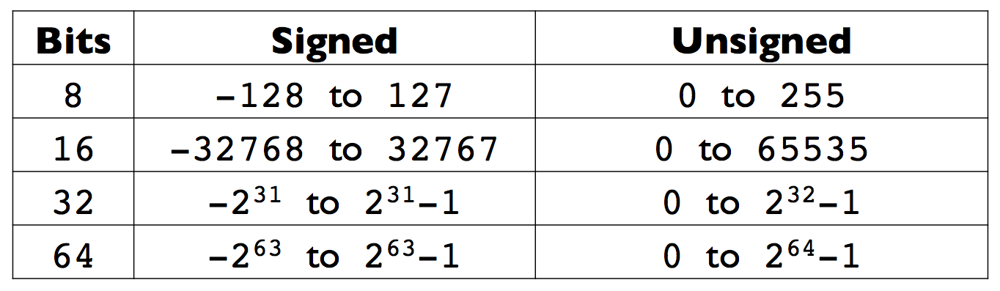

### Floating point representation

* How do I represent a floating point value using bits?

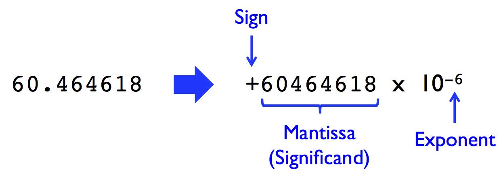
10-6 default, up to 6 accuracy

### Floating point standard

* IEEE (Institute of Electrical and Electronics Engineers) 754 is the technical
standard for floating point used by all modern processors

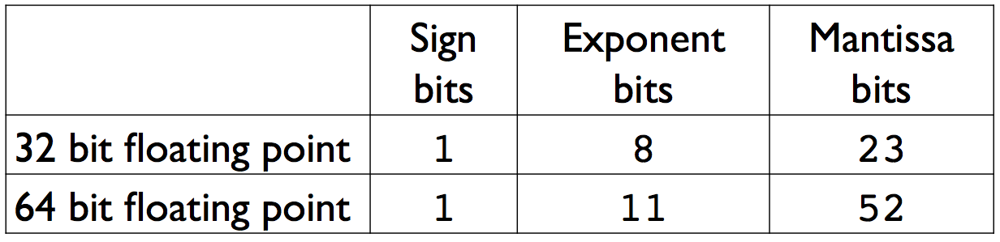

* Standard also specifies things like rounding modes, handling overflow, divide
by zero, etc.

### Floating point and you

* Floating point also has similar potential for overflow and underflow

* In addition, the limited number of bits for the mantissa means it often needs
to be rounded

* Will spend more time on floating point arithmetic in CME 212

* What Every Computer Scientist Should Know About Floating-Point Arithmetic by
Goldberg

### Numbers in Python

* Python has support for plain and long integers

* Plain integers are 32 or 64-bit signed integers depending on the platform

* Long integers have unlimited range

```
>>> 52**100
3984137914278306537107946300187788156651883090392267368064424070371960737746
8098814309384465476477916379562105903885691732986504663858102457926577952139
61405107689148645376L
>>>
```
python automatically converts from int to long when number gets too large, so it doesn't overflow
"L" specifies a long integer, as incremented python allocates more memory for it

* Floating point numbers are double precision (64-bit)

numpy behaves like fixed width integers

## Performance comparison

sums integers from 0 to a million and time it

`code/summation.cpp`:

```c++
#include <iostream>
#include <ctime>

int main() {
  std::clock_t start = std::clock();
  int sum = 0;
  for(int n = 0; n < 1000000; n++) {
    sum++;
  }
  double duration = (std::clock()-start) / (double) CLOCKS_PER_SEC;

  std::cout << sum << std::endl;
  std::cout << "time = " << duration << std::endl;

  return 0;
}
```

`code/summation1.py`:

```
import time

t0 = time.time()
total = 0
for n in range(1000000):
    total += 1
t1 = time.time()
print(total)
print("time = {}".format(t1-t0))
```

Output:

```
$ python summation1.py
1000000
time = 0.17532491684
$

$ ./summation
1000000
time = 9.53674e-07
$
```
python is a lot slower than C++
can try using xrange to be faster in python

Compile the C++ code with: `$ g++ summation.cpp -o summation`

### Python is kind of slow

One of the main disadvantages of a higher level language is that, while
comparatively easy to program, it is typically slow compared to C/C++, Fortran,
or other lower level languages

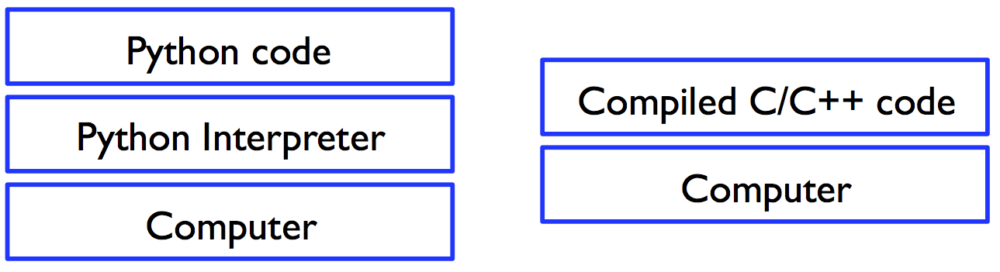

C++ sits much closer to hardwares; C compilers will inspect code and optimize it

### Object overhead

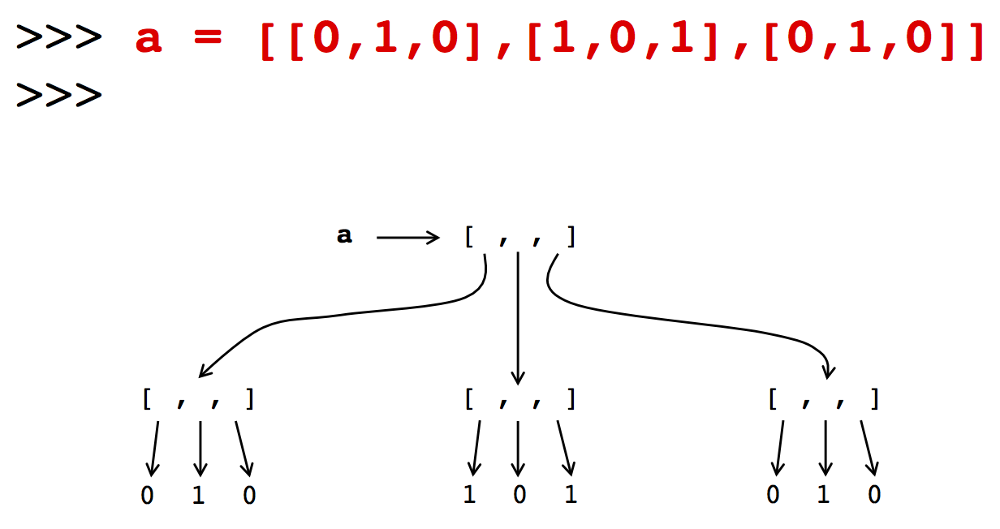

everything in python is an object, and this creates lots of overhead

### Options

* Python is great for quick projects, prototyping new ideas, etc.

* What if you need better performance?

* One option is to completely rewrite your program in something like C/C++

### Python C API

* Python has a C API which allows the use of compiled modules

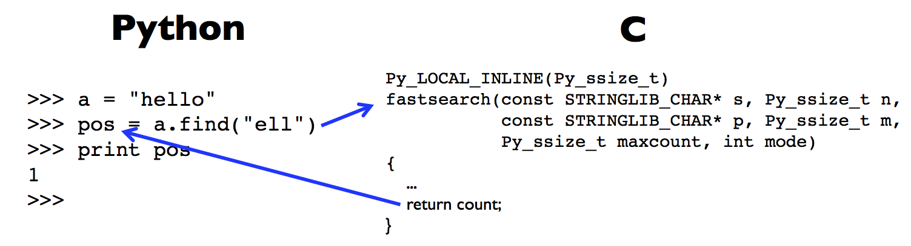

* The actual implementation of `string.find()` can be viewed at:

http://svn.python.org/view/python/trunk/Objects/stringlib/fastsearch.h

### Python compiled modules

* Python code in a `.py` file is actually executed in a hybrid approach by a mix
of the interpreter and compiled modules that come with Python

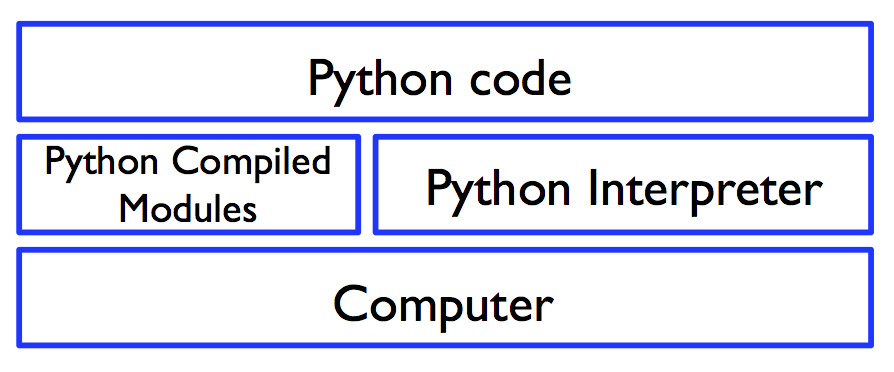


### Extension modules

* The same Python C API used by the developers of Python itself also allows
other programmers to develop and build their own compiled extension modules

* These modules extend the functionality of Python with high performance
implementations of common operations

* Other languages, such as C++ and Fortran, are also supported by using the C
API

### NumPy, SciPy, matplotlib

use compiled code for fast tasks

* NumPy - multidimensional arrays and fundamental operations on them

* SciPy - Various math functionality (linear solvers, FFT, optimization, etc.)
utilizing NumPy arrays

* matplotlib - plotting and data visualization

* None of these packages seek to clone MATLAB, if you want that try something
like GNU Octave

### Python software stack
numpy is a bit like compiled modules

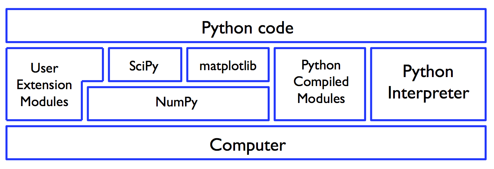

### NumPy
use to represent arrays of number
```py
>>> import numpy
>>> a = numpy.array([7, 42, -3])
>>> a
array([ 7, 42, -3])
>>> a[1]
42
>>> a[1] = 19
>>> a
array([ 7, 19, -3])
>>>
```

### Arrays are not lists
only store a SINGLE type of data; FIXED TYPE; allows most efficient code and mem representation
we don't have append method to this array. you can concatenate it though
```py
>>> a[0] = "hello"
Traceback (most recent call last):
File "<stdin>", line 1, in <module>
ValueError: invalid literal for long() with base 10: 'hello'
>>> a.append(8)
Traceback (most recent call last):
File "<stdin>", line 1, in <module>
AttributeError: 'numpy.ndarray' object has no attribute 'append'
>>>
```

### NumPy arrays

* NumPy arrays contain **homogeneous** data

* Size is fixed, i.e. you can't append or remove

### Data types

* Integers

    * 8, 16, 32, and 64 bit signed and unsigned (numpy.int8, numpy.uint8, etc.)

* Floating point

    * 32, 64, 128 bit (numpy.float32, numpy.float64, etc.)

* Complex, strings, and Python object references also supported
      -but these cause overhead

Data is compactly stored, so we can quickly access next number in the array. Stores in a consecutive block of memory, so quicker

**contiguous memory**

C stores row major ordering
Fortran stores column major ordering

### Data type examples

```py
>>> a = numpy.array([ 7, 19, -3], dtype=numpy.float32)
>>> a
array([ 7., 19., -3.], dtype=float32)
>>> a[0] = a[0]/0.
__main__:1: RuntimeWarning: divide by zero encountered
>>> a
array([ inf, 19., -3.], dtype=float32)
>>> b = numpy.array([4, 7, 19], dtype=numpy.int8)
>>> b
array([ 4, 7, 19], dtype=int8)
>>> b[0] = 437
>>> b
array([-75,
7, 19], dtype=int8)
>>>
```
be careful to specify the type of array
can represent infinity
division by 0 gives warning, but doesn't stop code
### Multidimensional arrays

* Arrays can have multiple dimensions called *axes*

* The number of *axes* is called the *rank*

### Multidimensional arrays

```py
>>> a = numpy.array([(7, 19, -3), (4, 8, 17)], dtype=numpy.float64)
>>> a
array([[ 7., 19., -3.],
[ 4., 8., 17.]])
>>> a.ndim
2
>>> a.dtype
dtype('float64')
>>> a.shape
(2, 3)
>>> a.size
6
>>>
```
same as matlab, first index is column, next is rows
last index is contiguous in mem
### Internal representation

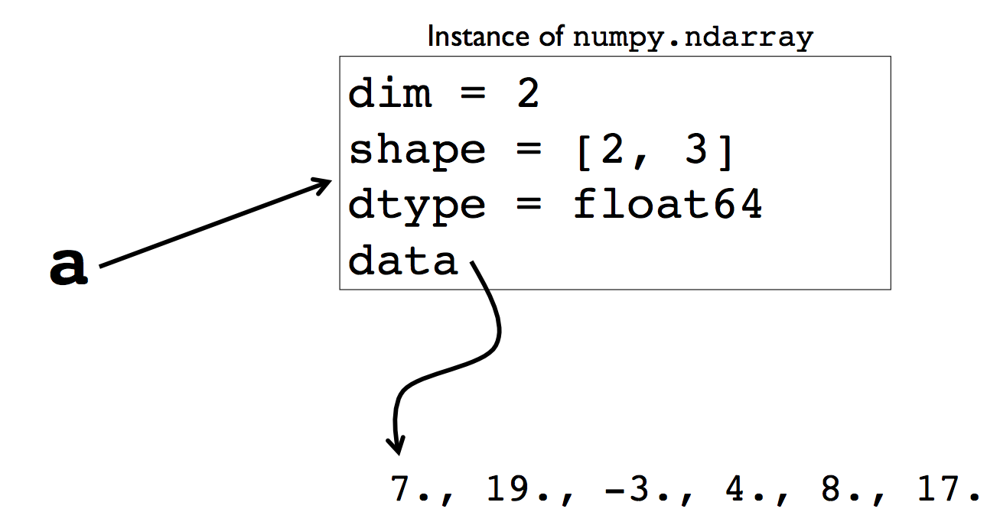

contiguous block of memory- data is together, so high performance

### Creating arrays

.empty doesn't create empty matrix, just random numbers
need to pass zeros as a tuple
shape gives tuple of shape of dimensions

```py
>>> a = numpy.empty((3,3))
>>> a
array([[  2.12261410e-314,   0.00000000e+000,   2.14827413e-314],
       [  2.14834326e-314,   2.14832351e-314,   2.14834284e-314],
       [  0.00000000e+000,   0.00000000e+000,   2.12336647e-314]])
>>> a = numpy.zeros((3,3))
>>> a
array([[ 0.,  0.,  0.],
       [ 0.,  0.,  0.],
       [ 0.,  0.,  0.]])
>>> a = numpy.ones((3,3))
>>> a
array([[ 1.,  1.,  1.],
       [ 1.,  1.,  1.],
       [ 1.,  1.,  1.]])
>>> a = numpy.eye(3)
>>> a
array([[ 1.,  0.,  0.],
       [ 0.,  1.,  0.],
       [ 0.,  0.,  1.]])
>>>
```

### Creating more arrays
can reshape matrix- change rank; product of dimensions should match (can't change amount of data)
By default, they use C ordering (rows are contiguous in memory)

```py
>>> a = numpy.arange(9, dtype=numpy.float64)
>>> a
array([ 0., 1., 2., 3., 4., 5., 6., 7., 8.])
>>> a = numpy.arange(9, dtype=numpy.float64).reshape(3,3)
>>> a
array([[ 0., 1., 2.],
[ 3., 4., 5.],
[ 6., 7., 8.]])
>>>
```
### Fortran ordering
default is that array orders by row, but if we do fortran ordering,columns will be contiguous
```py
>>> a = numpy.arange(9,dtype=numpy.float64).reshape((3,3))
>>> a
array([[ 0., 1., 2.],
       [ 3., 4., 5.],
       [ 6., 7., 8.]])
>>> a = numpy.arange(9,dtype=numpy.float64).reshape((3,3)),order='F')
array([[ 0., 3., 6.],
       [ 1., 4., 7.],
       [ 2., 5., 8.]])
```
### Creating more arrays

```
$ cat numbers.txt
7. 19. -3.
4. 8. 17.
$ python
Python 2.7.5+ (default, Feb 27 2014, 19:37:08)
[GCC 4.8.1] on linux2
Type "help", "copyright", "credits" or "license" for more information.
>>> import numpy
>>> a = numpy.loadtxt('numbers.txt', dtype=numpy.float64)
>>> a
array([[ 7., 19., -3.],
[ 4.,
8., 17.]])
>>> numpy.savetxt('numbers2.txt', a)
>>>
```
savetxt dumps info to disk

### Remove single dimension entry

```py
>>> import numpy as np <-- usually standard to import as this
>>> a = numpy.arange(3)
>>> a
array([0, 1, 2])
>>> a.shape
(3,)
>>> b = numpy.arange(3).reshape(3,1)
>>> b
array([[0],
[1],
[2]])
>>> b.shape
(3, 1)
>>> b = numpy.squeeze(b)  <-- squeeze function gets rid of singleton dimensions
>>> b
array([0, 1, 2])
>>> b.shape
(3,)     <-- created a 1D numpy array, this is a python tuple with single element
>>> b = np.arrange(3).reshape(3,1)
>>> b.shape
(3,1)
>>> b.ndim   
2
```
array broadcasting: system with a bunch of rules (for example, outer product addition)
  -keep in mind in case you get unexpected behavior

### Array operations

```py
>>> a = numpy.arange(9, dtype=numpy.float64)
>>> a
array([ 0.,  1.,  2.,  3.,  4.,  5.,  6.,  7.,  8.])
>>> a[3:7] <--- can slice to get subarray
array([ 3.,  4.,  5.,  6.])
>>> a[3:7] = 0 <--- can assign to a subsequence (modify array)
>>> a
array([ 0.,  1.,  2.,  0.,  0.,  0.,  0.,  7.,  8.])
>>> 2*a
array([  0.,   2.,   4.,   0.,   0.,   0.,   0.,  14.,  16.])
>>> a*a
array([  0.,   1.,   4.,   0.,   0.,   0.,   0.,  49.,  64.])
>>> sum(a)
18.0
>>> min(a)
0.0
>>> max(a)
8.0
>>>
```
Slicing operation returns a ref to subarray rather than a subarray
```py
>>> b=a[3:7]
>>> b[0]=0
>>> b
array([0,4,5,6])
>>> a
array([0,1,2,3,4,5,6,7,8])

```
if we change b, it changes a

### Array operations

```py
>>> import math
>>> a = numpy.arange(9, dtype=numpy.float64)
>>> a
array([ 0., 1., 2., 3., 4., 5., 6., 7., 8.])
>>> # bad idea
>>> total = 0.
>>> for n in range(len(a)):
...   total += a[n]*a[n]
...
>>> math.sqrt(total)
14.2828568570857
>>> # better idea
>>> math.sqrt(numpy.dot(a,a))
14.2828568570857
>>> # best idea
>>> numpy.linalg.norm(a)
14.282856857085701
>>>
```
better for performance to use norm
### Speed of array operations

`code/summation2.py`:
```py
import numpy
import time

t0 = time.time()
total = sum(numpy.ones(1000000,dtype=numpy.int32))
t1 = time.time()
print(total)
print("time = {}".format(t1-t0))
```

Output:

```
$ python summation2.py
1000000
time = 0.428977012634
$
```

### Speed of array operations

`code/summation3.py`:

```py
import numpy
import time

t0 = time.time()
total = numpy.sum(numpy.ones(1000000,dtype=numpy.int32))
t1 = time.time()
print(total)
print("time = {}".format(t1-t0))
```

Output:

```
$ python summation3.py
1000000
time = 0.00641703605652
$
```
Conclusion: sum versus numpy.sum-> use numpy.sum to achieve best results (faster)

### Loops vs. array operations

* Loops you write in Python will be executed by the interpreter

* Some of the overloaded operators (e.g. `min`, `max`, `sum`, etc.) work albeit
  slowly


* Calling NumPy function or methods of the array object will invoke high
performance implementations of these operations

### Matrix operations

```py
>>> a = numpy.arange(9, dtype=numpy.float64).reshape(3,3)
>>> a
array([[ 0.,  1.,  2.],
       [ 3.,  4.,  5.],
       [ 6.,  7.,  8.]])
>>> a.transpose()
array([[ 0.,  3.,  6.],
       [ 1.,  4.,  7.],
       [ 2.,  5.,  8.]])
>>> numpy.trace(a)
12.0
>>> a*a # element wise multiplication
array([[  0.,   1.,   4.],
       [  9.,  16.,  25.],
       [ 36.,  49.,  64.]])
>>> numpy.dot(a,a) # matrix-matrix multiplication
array([[  15.,   18.,   21.],
       [  42.,   54.,   66.],
       [  69.,   90.,  111.]])
>>>
```

### array vs matrix

* NumPy has a dedicated matrix class

* However, the matrix class is not as widely used and there are subtle
differences between a 2D array and a matrix

* It is highly recommended that you use 2D arrays for maximum compatibility with
other NumPy functions, SciPy, matplotlib, etc.

* See here for more details:
<http://mathesaurus.sourceforge.net/matlab-numpy.html>
<http://www.scipy.org/NumPy_for_Matlab_Users>

(`array' or `matrix'? Which should I use?)

### References to an array

```py
>>> a = numpy.arange(9, dtype=numpy.float64).reshape(3,3)
>>> a
array([[ 0.,  1.,  2.],
       [ 3.,  4.,  5.],
       [ 6.,  7.,  8.]])
>>> b = a
>>> b[0,0] = 42
>>> b
array([[ 42.,   1.,   2.],
       [  3.,   4.,   5.],
       [  6.,   7.,   8.]])
>>> a
array([[ 42.,   1.,   2.],
       [  3.,   4.,   5.],
       [  6.,   7.,   8.]])
>>>
```

### Array slices and references

```py
>>> a = numpy.arange(9, dtype=numpy.float64)
>>> a
array([ 0.,  1.,  2.,  3.,  4.,  5.,  6.,  7.,  8.])
>>> b = a[2:7]
>>> b
array([ 2.,  3.,  4.,  5.,  6.])
>>> b[2] = -1
>>> b
array([ 2.,  3., -1.,  5.,  6.])
>>> a
array([ 0.,  1.,  2.,  3., -1.,  5.,  6.,  7.,  8.])
>>>
```

### Array copies

```py
>>> a = numpy.arange(9, dtype=numpy.float64)
>>> a
array([ 0.,  1.,  2.,  3.,  4.,  5.,  6.,  7.,  8.])
>>> b = a.copy()
>>> b
array([ 0.,  1.,  2.,  3.,  4.,  5.,  6.,  7.,  8.])
>>> b[4] = -1
>>> b
array([ 0.,  1.,  2.,  3., -1.,  5.,  6.,  7.,  8.])
>>> a
array([ 0.,  1.,  2.,  3.,  4.,  5.,  6.,  7.,  8.])
>>>
```

### Universal functions (ufuncs)
Need to call the numpy.sqrt() instead of the math module one

```py
>>> import numpy
>>> a = numpy.arange(9, dtype=numpy.float64)
>>> a
array([ 0.,  1.,  2.,  3.,  4.,  5.,  6.,  7.,  8.])
>>> import math
>>> math.sqrt(a)
Traceback (most recent call last):
  File "<stdin>", line 1, in <module>
TypeError: only length-1 arrays can be converted to Python scalars
>>> numpy.sqrt(a)
array([ 0.        ,  1.        ,  1.41421356,  1.73205081,  2.        ,
        2.23606798,  2.44948974,  2.64575131,  2.82842712])
>>>
```

### Beyond just arrays


* NumPy has some support for some useful operations beyond the usual vector and
matrix operations:

    * Searching, sorting, and counting within arrays

    * FFT (Fast Fourier Transform)

    * Linear Algebra

    * Statistics

    * Polynomials

    * Random number generation

* SciPy has largely replaced much of this functionality,
plus added much more

### Warning

* Once you start making use of extension modules such as NumPy, SciPy, etc. the
chances of code "breaking" when you run it on different machines goes up
significantly

* If you do some of your development on machines other than corn (which isn't
the model we advise) you may run into issues

### Further Reading

* MATLAB users: <http://www.scipy.org/NumPy_for_Matlab_Users>
* NumPy tutorial at: <http://www.scipy.org/Tentative_NumPy_Tutorial>
* Official docs at: <http://docs.scipy.org/>

# CME 211: Lecture 14

Friday, October 23, 2015

Topics:

* Introduction to C++
* Hello world
* Variables
* Strings

## C++

* Latest version of the standard was ratified in 2014 and is referred to as
C++14.  Next update is expected to come in 2017.  The document defining the
standard is 1,366 pages long.

* We will use C++11, which was a substantial update and improvement over C++03.
  (C++14 was a smaller update)

### C versus C++

* C is roughly a subset of C++

* C is a lower level language that has fewer abstractions over the hardware

* Even within C++ programs, the most computationally intense parts should be C
like for efficiency

* C is still used for many applications: Linux kernel, CPython interpreter, low
power or embedded systems, etc.

## A Simple C++ Program
* The OS runs a C++ program by calling main.
```c++
int main() //main has return type int and takes in empty list of parameters
{
  return 0; //block of statements in curly brace, return terminates the function
  // a nonzero return indicates what kind of error occurred
}
```
The value is returned to the shell and can be accessed using the command '$ echo $?'. Usually,
-1 means program failure.


## Hello world

In this lecture, we are going to start with a C++ source file and modify it to
show various things about C++.  If you desire to compile and execute subsequent
code block on your own, please modify the provided source (or start a new source
file).

Let's start with the file: `src/hello.cpp`
sometimes also .cc or .cxx or others. Some are standard so that C++ compiler will know what to do
if you pass in .c file, interpreter will compile that as standard C

```c++
#include <iostream> // input/output stream
//these are like import in python

int main() // input arguments in main to put in command line arguments, int is the return type
{
  // everything in this code block is run
  /* Hello world program (this is a comment)
     this form of comment can span multiple line*/

  // this is also a comment, but only goes to the end of the line

  std::cout << "Hello world" << std::endl;
//std cout is the output string, we're sending it the string "hello world" and
//endl forces text to be displayed

  return 0; // Return value of the function
}
```

* `#include` statments are analogous to Python `import` statements.  This is how
  functionality from other source files and libraries is made available to this
  program.  `<iostream>` has standard C++ input output functionality.

* The `main` function is the entry point into the program.  Code from the `main`
function body will be executed upon starting the program.

* The `return` keyword returns a value from the function.  The type of the
  return value must match the specified output type of the function (`int` in
  this case).

* There are two forms of comments in C++

  * Text between an `/*` and an `*/` is a comment, this can span multiple lines

  * Text after a `//` is also a comment, these comments go to the end of the
  line

### Compilation

* C++ programs have to be compiled
```
DN0a225536:src babagoatkw$ ls
hello.cpp	string.cpp	variables.cpp
DN0a225536:src babagoatkw$ vi hello.cpp
DN0a225536:src babagoatkw$ g++ hello.cpp <-- g++ is the compiler, creates an a.out file
DN0a225536:src babagoatkw$ ls
a.out		hello.cpp	string.cpp	variables.cpp
DN0a225536:src babagoatkw$ ./a.out  <-- run using the ./ command (want to run an executable located in this directory)
Hello world
```

Note: use "cd -" to go back to original directory you were in

* Compilation is the process of translating the human readable source code into
an executable containing the machine instructions that the computer will use
while the program is running

* Although C++ source code can be made portable and compiled on multiple
machines (Linux, Windows, Mac) the executables are specific to an operating
system and underlying processor

```
DN0a225536:src babagoatkw$ g++ hello.cpp -o hello <-- can name the compiled code to something different
DN0a225536:src babagoatkw$ ls
a.out		hello		hello.cpp	string.cpp	variables.cpp
DN0a225536:src babagoatkw$ ./hello
Hello world
```

### Compiling on corn

* We will use the GNU (GNU's Not Unix) compilers that should be available with
any Linux distribution

```
[nwh@icme-nwh src] $ ls
hello.cpp
[nwh@icme-nwh src] $ g++ -Wall -Wconversion -Wextra hello.cpp <--- "-W" tells compiler to give us warnings (they are flags). If we are compiling with these flags and it's producing warnings, fix those warnings
[nwh@icme-nwh src] $ ls
a.out  hello.cpp
```

Details:

* `g++`: GNU C++ compiler program

* `-Wall`, `-Wconversion`, `-Wextra` are flags to enable all warnings

* `hello.cpp` is the name of the C++ source file to compile

### Running Hello world

```
[nwh@icme-nwh src] $ ls
a.out  hello.cpp
[nwh@icme-nwh src] $ ./a.out
Hello world
```

An explanation for the dot slash: <http://www.linfo.org/dot_slash.html>

Why `a.out`?: <https://en.wikipedia.org/wiki/A.out>
- is just the default

### Naming your executable

Specify the output executable name:

```
[nwh@icme-nwh src] $ g++ -Wall -Wconversion -Wextra hello.cpp -o hello
[nwh@icme-nwh src] $ ls
a.out  hello  hello.cpp
[nwh@icme-nwh src] $ ./hello
Hello world
```

### Streams

* Standard C++ uses "streams" for output

* Stream: sequence of characters read from or written to an IO device; characters are gnerated or consumed sequentially over time

* The  `iostream` library have two types:  `istream` and `ostream`, which represent standard input and output streams
    - For input, use `istream` object named `cin`
    - For output, use `ostream` object named `cout`
    - Library also has `ostream` objects named `cerr` (for standard error for warning) and `clog`  (for general info about execution of the program)

* Example: In this context, we keep passing strings (and
other identifiers) to the output stream, which is then sent to the terminal.
There are other forms of streams as well.

```
std::cout << "Hello world" << std::endl;
```

* `cout` is in the `std` namespace and refers to the standard output (stdout)
  stream

* `endl` is in the `std` namespace and inserts '\n' and flushes the stream

* `<<` is the stream insertion operator

### `std::endl`

* Inserts a newline character (`\n`) and flushes the buffer

* You can also put in a newline yourself, and let the buffer flush automatically
as necessary

```c++
#include <iostream>

int main() {
  int a;
  std::cout << a << std::endl; // with flags, will get warning that we haven't initialized a. Without flags, a=0. Compiler can also give warnings if there is an unused variable in the code. Warnings don't stop the compilation problems- they just spit out warnings

  std::cout << "Hello world\n"; // this will not flush the buffer. It's good to use standard endl for outputting new lines
  return 0;
}
```

```
$ g++ -Wall -Wconversion -Wextra hello.cpp -o newline
$ ./newline
Hello world
$
```

## Include (header) files

* When  we do  `#include` that  is somewhat  analogous to  an import  in Python,
giving us access to functionality defined in another file

* In C++ the access to even fundamental functionality like outputting to the
screen requires specifying the proper include file(s)

* Include files in C++ work a bit differently when it comes to namespaces


* However, namespaces in C++ still generally serve the same purpose as
namespaces in Python

### Namespaces

* In Python the name of the namespace comes from the file name, and everything
in the file is automatically in that one namespace

* A C++ include file might contain functions, classes, etc. that are not in a
namespace at all

* An include file could also contain functions, classes, etc. from multiple
namespaces

* Namespaces can also span multiple include files, like for the C++ standard
library

### C++ Standard Library

* The C++ Standard Library is all the built in functionality that is part of the
C++ language

* Namespace for this library is `std`

* `iostream` contains `cout` in the `std` namespace

* By default, when using `cout`, we need to specify the namespace and fully
  qualify the symbol as `std::cout`

### Scope resolution operator

* The `::` is called the scope resolution operator
  - for example, `std::out`, so we need  `namespace::what we want`

* Used to indicate what namespace something comes from

* If a namespace is required that will typically be listed in the documentation,
or by inspecting the include file

* Will talk about namespaces more when we start writing our own include files

### Common mistakes

Forgetting to `#include <iostream>`:

```c++
int main() {
  std::cout << "Hello world" << std::endl;
  return 0;
}
```

```
[nwh@icme-nwh src] $ g++ -Wall -Wconversion -Wextra hello.cpp -o hello
hello.cpp: In function ‘int main()’:
hello.cpp:11:3: error: ‘cout’ is not a member of ‘std’
   std::cout << "Hello world" << std::endl;
   ^
hello.cpp:11:33: error: ‘endl’ is not a member of ‘std’
   std::cout << "Hello world" << std::endl;
                                 ^
[nwh@icme-nwh src] $
```

### Common mistakes

Forgetting the `std` namespace:

```cpp
#include <iostream>

int main() {
  cout << "Hello world" << endl;
  return 0;
}
```

```
[nwh@icme-nwh src] $ g++ -Wall -Wconversion -Wextra hello.cpp -o hello
hello.cpp: In function ‘int main()’:
hello.cpp:11:3: error: ‘cout’ was not declared in this scope
   cout << "Hello world" << endl;
   ^
hello.cpp:11:3: note: suggested alternative:
In file included from hello.cpp:1:0:
/usr/include/c++/4.9.2/iostream:61:18: note:   ‘std::cout’
   extern ostream cout;  /// Linked to standard output
                  ^
hello.cpp:11:28: error: ‘endl’ was not declared in this scope
   cout << "Hello world" << endl;
                            ^
hello.cpp:11:28: note: suggested alternative:
In file included from /usr/include/c++/4.9.2/iostream:39:0,
                 from hello.cpp:1:
/usr/include/c++/4.9.2/ostream:564:5: note:   ‘std::endl’
     endl(basic_ostream<_CharT, _Traits>& __os)
     ^
[nwh@icme-nwh src] $
```

### Another namespace option

```cpp
#include <iostream>

// this is not considered good practice
using namespace std;

int main() {
  cout << "Hello world" << endl;
  return 0;
}
```

```
$ g++ -Wall -Wconversion -Wextra hello.cpp -o hello
$ ./hello
Hello world
$
```

### Another namespace option

```cpp
#include <iostream>

// good practice, (but not when you write a header file!)
using std::cout;
using std::endl;

int main() {
  cout << "Hello world" << endl;
  return 0;
}
```

### Blocks of code

* Blocks of code, such as the code comprising a function, conditional, loop,
etc. are indicated by enclosing them in curly brackets

* There are very few places where whitespace matters to the compiler

```cpp
#include <iostream>
int main(){std::cout<<"Hello world"<<std::endl;return 0;}
```

```
$ g++ -Wall -Wconversion -Wextra hello.cpp -o hello
$ ./hello5
Hello world
$
```

### Bracket style

```cpp
#include <iostream>

int main()
{
  /* Hello world program*/
  std::cout << "Hello world" << std::endl;
  return 0;
}
```

```cpp
#include <iostream>

int main() {
  /* Hello world program*/
  std::cout << "Hello world" << std::endl;
  return 0;
}
```

### Return value from `main()`

```cpp
#include <iostream>

int main() {
  /* Hello world program*/
  std::cout << "Hello world" << std::endl;
  return 7;
}
```
* returning a positve number represents an error
```
[nwh@icme-nwh src] $ g++ -Wall -Wconversion -Wextra hello.cpp -o hello
[nwh@icme-nwh src] $ ./hello
Hello world
[nwh@icme-nwh src] $ echo $?
7
[nwh@icme-nwh src] $ ls
a.out  hello  hello.cpp
[nwh@icme-nwh src] $ echo $?
0
```

* Unix standard: programs return `0` under normal conditions and other numbers
  on error conditions

## Variables

File: `src/variables.cpp`
* code below won't compile since 'a' hasn't been declared (you didn't tell me what type variable is going to correspond to). need to specify type
```cpp
#include <iostream>

int main() {
  a = 2;
  b = 3;
  c = a + b;

  std::cout << "c = " << c << std::endl;

  return 0;
}
```

Output:

```
[nwh@icme-nwh src] $ g++ -Wall -Wconversion -Wextra variables.cpp -o variables
variables.cpp: In function ‘int main()’:
variables.cpp:4:3: error: ‘a’ was not declared in this scope
   a = 2;
   ^
variables.cpp:5:3: error: ‘b’ was not declared in this scope
   b = 3;
   ^
variables.cpp:6:3: error: ‘c’ was not declared in this scope
   c = a + b;
   ^
```

### Declaring variables

```cpp
#include <iostream>

int main() {
  int a;
  int b, c;

  c = a + b;

  std::cout << "c = " << c << std::endl;

  return 0;
}
```

```
$ g++ variables.cpp -o variables
$ ./variables
c = 32767  <-- this is dangerous since it assigns a,b random ints that were already in mem
$
```

### Compiler warnings

```
[nwh@icme-nwh src] $ g++ -Wall -Wconversion -Wextra variables.cpp -o variables
variables.cpp: In function ‘int main()’:
variables.cpp:9:12: warning: ‘a’ is used uninitialized in this function [-Wuninitialized]
   c = a + b;
            ^
variables.cpp:9:12: warning: ‘b’ is used uninitialized in this function [-Wuninitialized]
```

* Enable them, read them, and fix them

* We will not have any sympathy if you have bugs that would have been caught by
enabling warnings

* You will lose points if compilation of your program generates warnings

### Initializing variables

```cpp
#include <iostream>

int main() {
  int a = 2;
  int b;

  b = 3;
  int c = a + b;

  std::cout << "c = " << c << std::endl;

  return 0;
}
```

```
[nwh@icme-nwh src] $ g++ -Wall -Wconversion -Wextra variables.cpp -o variables
[nwh@icme-nwh src] $ ./variables
c = 5
```

### Type errors

```cpp
#include <iostream>

int main() {
  int a;
  a = "hello";

  std::cout << "a = " << a << std::endl;

  return 0;
}
```

```
[nwh@icme-nwh src] $ g++ -Wall -Wconversion -Wextra variables.cpp -o variables
variables.cpp: In function ‘int main()’:
variables.cpp:10:5: error: invalid conversion from ‘const char*’ to ‘int’ [-fpermissive]
   a = "hello";
     ^
```

### Mixed number types

* manually cast data to the right type if you need to; best thing to do is round, then cast it

```cpp
#include <iostream>

int main() {
  int a, b;

  a = 2.7;
  b = 3;
  int c = a + b;

  std::cout << "c = " << c << std::endl;

  return 0;
}
```

```
[nwh@icme-nwh src] $ g++ -Wall -Wconversion -Wextra variables.cpp -o variables
variables.cpp: In function ‘int main()’:
variables.cpp:6:5: warning: conversion to ‘int’ alters ‘double’ constant value [-Wfloat-conversion]
   a = 2.7;
     ^
```

### Mixed number types

```cpp
#include <iostream>

int main() {
  int a, b;

  a = (int)2.7; // int(2.7) would also work

  b = 3;
  int c = a + b;

  std::cout << "c = " << c << std::endl;

  return 0;
}
```

```
[nwh@icme-nwh src] $ g++ -Wall -Wconversion -Wextra variables.cpp -o variables
[nwh@icme-nwh src] $ ./variables
c = 5
```

### Double precision floating point

```cpp
#include <iostream>

int main() {
  int a;
  double b = 3.14; // 64 bit floating point number (higher precision); float is 32 bit floating point number

  a = 2;
  double c = a*b;

  std::cout << "c = " << c << std::endl;

  return 0;
}
```

```
$ g++ -Wall -Wconversion -Wextra variables.cpp -o variables
$ ./variables6
c = 6.28
$
```

### Rounding

```cpp
#include <iostream>
#include <cmath> // include this to use round() function

int main() {
  int a;
  double c = 2.7;

  a = (int)round(c);
  // note that the round() function
  // is not in the std namespace

  std::cout << "a = " << a << std::endl;

  return 0;
}
```

```
$ g++ -Wall -Wconversion -Wextra variables.cpp -o variables
$ ./variables
a = 3
$
```

### Key data types

* C++ has all of the data types that we talked about when we looked at computer
representation of data in conjunction with NumPy

  * Various signed and unsigned integers

  * Floating point (float, double, long double)

* A Boolean data type

* A string object

### Boolean (true/false values)

```cpp
#include <iostream>

int main() {
  bool equal;

  equal = 2 == 3; // assigning the bool to equal. Should be equal = false
  std::cout << equal << std::endl;

  equal = true; // All lowercase

  std::cout << equal << std::endl;

  return 0;
}
```

```
$ g++ -Wall -Wconversion -Wextra boolean.cpp -o boolean
$ ./boolean
0
1
$
```

## Strings

* There are two options for strings in C++
 - we'll mainly use string rather than char arrays

* An array of characters (same as C)

* A string object

* The latter is much safer and easier to use

### String example

```cpp
#include <iostream>
#include <string> // need to include this

int main() {
  std::string hello = "Hello world"; // pass as a standard string

  std::cout << hello << std::endl;

  return 0;
}
```

```
$ g++ -Wall -Wconversion -Wextra string.cpp -o string
$ ./string
Hello world
$
```

### String concatenation

```cpp
#include <iostream>
#include <string>

int main() {
  std::string hello = "Hello";
  std::string world = " world";

  std::string helloworld = hello + world; // string concatenation

  std::cout << helloworld << std::endl;

  return 0;
}
```

```
$ g++ -Wall -Wconversion -Wextra string.cpp -o string
$ ./string
Hello world
$
```

### String finding

```cpp
#include <iostream>
#include <string>

int main() {
  std::string hello = "Hello";
  std::string lo = "lo";

  std::cout << hello.find(lo) << std::endl;

  return 0;
}
```

```
$ g++ -Wall -Wconversion -Wextra string.cpp -o string
$ ./string
3
$
```

## Required reading

* **C++ Primer, Fifth Edition** by Lippman et al.

* Available on Safari ProQuest:
  <http://proquest.safaribooksonline.com/book/programming/cplusplus/9780133053043>

* Chapter 1: Getting Started, Sections 1.1 - 1.3

* Chapter 2: Variables and Basic Types, Sections 2.1 - 2.2

* Chapter 3: Strings, Vectors, and Arrays: Sections 3.1 - 3.2

## Resources

* <http://www.cppreference.com>

* <http://www.cplusplus.com>

* <http://www.linfo.org/index.html>
# CME 211: Lecture 15

Monday, October 26, 2015

Topics:

* static arrays
* variable scope
* looping

Coliru.stacked-crooked.com is a handy website that you can write C++ code in and compile.
## Static arrays

The size (length) of static arrays is known at compile time.  See `src/array.cpp`:

```c++
#include <iostream>

int main() {
  int a[3]; // Array referenced via a with 3, integer elements (array with 3 elements)

  a[0] = 0;
  a[1] = a[0] + 1;
  a[2] = a[1] + 1;

  std::cout << "a[0] = " << a[0] << std::endl;
  std::cout << "a[1] = " << a[1] << std::endl;
  std::cout << "a[2] = " << a[2] << std::endl;

  return 0;
}
```

Compile and look at the output:

```
$ g++ -Wall -Wconversion -Wextra array.cpp -o array
$ g++ -Wall -Wconversion -Wextra array.cpp -o array
$ ./array
a[0] = 0
a[1] = 1
a[2] = 2
$
```

### Out of bounds access

Accessing static arrays (or any array for that matter) out of bounds leads to
undefined behavior and is a particularly nasty problem.  Modify `src/array.cpp`
to the following:

```cpp
#include <iostream>

int main() {
  int a[3]; // Array has 3 elements


  a[0] = 0;
  a[1] = a[0] + 1;
  a[2] = a[1] + 1;
  a[3] = a[2] + 1; // Out of bounds access


  std::cout << "a[0] = " << a[0] << std::endl;
  std::cout << "a[1] = " << a[1] << std::endl;
  std::cout << "a[2] = " << a[2] << std::endl;
  std::cout << "a[3] = " << a[3] << std::endl;

  return 0;
}
```

Now, compile and run:

```
$ g++ -Wall -Wconversion -Wextra array.cpp -o array
$ ./array
a[0] = 0
a[1] = 1
a[2] = 2
a[3] = 3
$
```

Nothing bad happened here.  But, the behavior is undefined. We're overwriting memory in the computer that is used for something else, but we don't know what that is, so this is very very bad.

Python checks this for your (out of bounds error), but C++ doesn't! Leads to all sorts of problems

### Address Sanitizer

We can instrument the executable to detect out of bound memory access in static
arrays.  To do this we enable the "address sanitizer" at compile time.

* <https://code.google.com/p/address-sanitizer/>

* Incorporated into GNU (and other) compilers

* Adds instrumentation around memory accesses

* Enabled at compile time

* Program will use more memory and run slower

Let's enable this with `g++`:
Backslash '\' tells command line to keep reading on the next line
```

$ g++ -Wall -Wconversion -Wextra \
    -g \ // enables debugging signal
    -fsanitize=address \
    array.cpp -o array
$
```

Notes:

* The `-g` flag adds debugging symbols to the output executable

* The `-fsanitize=address` enables the address sanitizer

* In `bash` the `\` character allows line continuation

### Testing Address Sanitizer

```
$ ./array
=================================================================
==23777== ERROR: AddressSanitizer: stack-buffer-overflow on address 0x7fff6e11364c at pc 0x400c64 bp 0x7fff6e113610 sp 0x7fff6e113608
WRITE of size 4 at 0x7fff6e11364c thread T0
    #0 0x400c63 (/afs/ir.stanford.edu/users/n/w/nwh/git/cme211-notes/lecture-15/src/array+0x400c63)
    #1 0x7f1dbf75dec4 (/lib/x86_64-linux-gnu/libc-2.19.so+0x21ec4)
    #2 0x400a58 (/afs/ir.stanford.edu/users/n/w/nwh/git/cme211-notes/lecture-15/src/array+0x400a58)
Address 0x7fff6e11364c is located at offset 44 in frame <main> of T0's stack:
  This frame has 1 object(s):
    [32, 44) 'a'
HINT: this may be a false positive if your program uses some custom stack unwind mechanism or swapcontext
      (longjmp and C++ exceptions *are* supported)
Shadow bytes around the buggy address:
  0x10006dc1a670: 00 00 00 00 00 00 00 00 00 00 00 00 00 00 00 00
  0x10006dc1a680: 00 00 00 00 00 00 00 00 00 00 00 00 00 00 00 00
  0x10006dc1a690: 00 00 00 00 00 00 00 00 00 00 00 00 00 00 00 00
  0x10006dc1a6a0: 00 00 00 00 00 00 00 00 00 00 00 00 00 00 00 00
  0x10006dc1a6b0: 00 00 00 00 00 00 00 00 00 00 00 00 00 00 00 00
=>0x10006dc1a6c0: 00 00 00 00 f1 f1 f1 f1 00[04]f4 f4 f3 f3 f3 f3
  0x10006dc1a6d0: 00 00 00 00 00 00 00 00 00 00 00 00 00 00 00 00
  0x10006dc1a6e0: 00 00 00 00 00 00 00 00 00 00 00 00 00 00 00 00
  0x10006dc1a6f0: 00 00 00 00 00 00 00 00 00 00 00 00 00 00 00 00
  0x10006dc1a700: 00 00 00 00 00 00 00 00 00 00 00 00 00 00 00 00
  0x10006dc1a710: 00 00 00 00 00 00 00 00 00 00 00 00 00 00 00 00
Shadow byte legend (one shadow byte represents 8 application bytes):
  Addressable:           00
  Partially addressable: 01 02 03 04 05 06 07
  Heap left redzone:     fa
  Heap righ redzone:     fb
  Freed Heap region:     fd
  Stack left redzone:    f1
  Stack mid redzone:     f2
  Stack right redzone:   f3
  Stack partial redzone: f4
  Stack after return:    f5
  Stack use after scope: f8
  Global redzone:        f9
  Global init order:     f6
  Poisoned by user:      f7
  ASan internal:         fe
==23777== ABORTING
```

### Address Sanitizer and `gdb`

We can use the GNU debugger `gdb` to get more precise information about the
error:

```
$ export ASAN_OPTIONS=abort_on_error=1
$ gdb ./array
...
(gdb) run
Starting program:
/afs/ir.stanford.edu/users/n/w/nwh/git/cme211-notes/lecture-15/src/array
... [lots of output] ...
(gdb) backtrace
#0  0x00007ffff47b8cc9 in __GI_raise (sig=sig@entry=6) at
../nptl/sysdeps/unix/sysv/linux/raise.c:56
#1  0x00007ffff47bc0d8 in __GI_abort () at abort.c:89
#2  0x00007ffff4e66829 in ?? () from /usr/lib/x86_64-linux-gnu/libasan.so.0
#3  0x00007ffff4e5d3ec in ?? () from /usr/lib/x86_64-linux-gnu/libasan.so.0
#4  0x00007ffff4e64012 in ?? () from /usr/lib/x86_64-linux-gnu/libasan.so.0
#5  0x00007ffff4e63121 in __asan_report_error () from
/usr/lib/x86_64-linux-gnu/libasan.so.0
#6  0x00007ffff4e5d7f7 in __asan_report_store4 () from
/usr/lib/x86_64-linux-gnu/libasan.so.0
#7  0x0000000000400c64 in main () at array.cpp:12
(gdb) q
```
'#7  0x0000000000400c64 in main () at array.cpp:12
(gdb) q' this is an important line since it tells you what line of code is causing the crash

## Multidimensional static arrays

See `src/md_array.cpp`:

```c++
#include <iostream>

int main() {
  // declare a 2D array
  int a[2][2]; // accessing data along the second element or rightmost index is CONTIGUOUS in memory (this is C-style format)

  a[0][0] = 0;
  a[1][0] = 1;
  a[0][1] = 2;
  a[1][1] = 3;

  std::cout << "a = " << a << std::endl;

  std::cout << "a[0][0] = " << a[0][0] << std::endl;
  std::cout << "a[1][0] = " << a[1][0] << std::endl;
  std::cout << "a[0][1] = " << a[0][1] << std::endl;
  std::cout << "a[1][1] = " << a[1][1] << std::endl;

  return 0;
}
```

Compile and run:

```
$ g++ -Wall -Wconversion -Wextra md_array.cpp -o md_array
$ ./md_array
a = 0x7fffe2a9e8d0
a[0][0] = 0
a[1][0] = 1
a[0][1] = 2
a[1][1] = 3
$
```

Note: the first output line prints the memory address.

### Array operations

You can't do assignment with C++ static arrays.  Let's modify `src/md_array.cpp`:

```c++
#include <iostream>

int main() {
  // declare a 2D array
  int a[2][2];

  // declare another 2D array
  int b[2][2];

  b = a; // cannot assign a to b, gives compile error. If you want to copy array, you need to do a double nested for loop and do it yourself

  a[0][0] = 0;
  a[1][0] = 1;
  a[0][1] = 2;
  a[1][1] = 3;

  std::cout << "a = " << a << std::endl;
  std::cout << "b = " << b << std::endl;

  std::cout << "a[0][0] = " << a[0][0] << std::endl;
  std::cout << "a[1][0] = " << a[1][0] << std::endl;
  std::cout << "a[0][1] = " << a[0][1] << std::endl;
  std::cout << "a[1][1] = " << a[1][1] << std::endl;

  return 0;
}
```

Attempt to compile:

```
$ g++ -Wall -Wconversion -Wextra md_array.cpp -o md_array
md_array.cpp: In function 'int main()':
md_array.cpp:10:5: error: invalid array assignment
   b = a;
     ^
$
```

## Scope

* A variable declared within a block is only accessible from within that block

* Blocks are denoted by curly brackets, typically the same brackets that denote
a function, loop or conditional body, etc.

* Sub-blocks can declare different variables that have the same name as
variables at broader scope

* Variables should not be declared with excessive scope

### Scope examples

```cpp
#include <iostream>

int main() {
  {
    int n = 5;
  }
 //compile time error since n is outside the scope and we are trying to print it
  std::cout << "n = " << n << std::endl;

  return 0;
}
```

Output:

```
$ g++ -Wall -Wconversion -Wextra scope.cpp -o scope
scope.cpp: In function 'int main()':
scope.cpp:5:9: warning: unused variable 'n' [-Wunused-variable]
     int n = 5;
         ^
scope.cpp:8:26: error: 'n' was not declared in this scope
   std::cout << "n = " << n << std::endl;
                          ^
$
```

### Scope examples

```cpp
#include <iostream>
#include <string>

int main() {
  std::string n = "Hi";
  std::cout << "n = " << n << std::endl;

  {
    int n = 5;
    {
      std::cout << "n = " << n << std::endl;
    }
  }

  return 0;
}
```
This bad practice since you don't want to rename variables in a subscope
```
$ g++ -Wall -Wconversion -Wextra scope.cpp -o scope
$ ./scope
n = Hi
n = 5
$
```
If you comment out the int n=5 block, get:
```
$ g++ -Wall -Wconversion -Wextra scope.cpp -o scope
$ ./scope
n = Hi
n = Hi <- this is the print statement called in the nested for loop
$
```
## C++ for loop

Start with an example.  See `src/for_loop1.cpp`:

```cpp
#include <iostream>

int main() {
  for (int i = 0; i < 10; ++i) {
    std::cout << "i = " << i << std::endl;
  }
  return 0;
}
```

Compile and run:

```
$ g++ -Wall -Wconversion -Wextra for_loop1.cpp -o for_loop1
$ ./for_loop1
i = 0
i = 1
i = 2
i = 3
i = 4
i = 5
i = 6
i = 7
i = 8
i = 9
$
```

### Anatomy of a for loop

```cpp
for (expression1; expression2; expression3) {
  // loop body
}
```

* `expression1`: evaluated once at the start of the loop
* `expression2`: conditional statement evaluated at the start of each loop iteration,
  terminate if conditional statement returns false
* `expression3`: evaluated at the end of each iteration

### Another `for` loop example

File `src/for_loop2.cpp`:

```cpp
#include <iostream>

int main() {
  int n, sum;

  sum = 0;
  for (n = 0; n < 101; ++n) {
    sum += n;
  }

  std::cout << "sum = " << sum << std::endl;
  return 0;
}
```

Output:

```
$ g++ -Wall -Wconversion -Wextra for_loop2.cpp -o for_loop2
$ ./for_loop2
sum = 5050
```

### Increment and decrement

* Increment (`++`) and decrement (`--`) are just shorthand for incrementing or
  decrementing by one

* You can put them before or after a variable

* See `src/increment.cpp`

```cpp
#include <iostream>

int main() {
  int n = 2;

  std::cout << "n = " << n << std::endl;
  n++;
  std::cout << "n = " << n << std::endl;
  ++n;
  std::cout << "n = " << n << std::endl;
  n--;
  std::cout << "n = " << n << std::endl;
  --n;
  std::cout << "n = " << n << std::endl;

  return 0;
}
```

Output:

```
$ g++ -Wall -Wconversion -Wextra increment.cpp -o increment
$ ./increment
n = 2
n = 3
n = 4
n = 3
n = 2
```

### Prefix (`++n`) vs. postfix (`n++`) increment operators

* The postfix operator creates a temporary and returns the value before
  incrementing

* The prefix operator returns a reference after incrementing

Example (`src/increment2.cpp`):

```cpp
#include <iostream>

int main() {
  int a = 1;
  std::cout << "            a: " << a   << std::endl;
  std::cout << "return of a++: " << a++ << std::endl;
  std::cout << "            a: " << a   << std::endl;
  std::cout << "return of ++a: " << ++a << std::endl;
  std::cout << "            a: " << a   << std::endl;
  return 0;
}
```

Output:

```
            a: 1
return of a++: 1 //copy value of a, store it, then increment
            a: 2
return of ++a: 3 //increment first, then store and returns
            a: 3
```
Postfix is more expensive
### Iterating through an array

`src/for_loop3.cpp`:

```cpp
#include <iostream>

int main() {
  int n = 5;
  double a[16];

  /* Initialize a to zeros. */

  for (int n = 0; n < 16; n++) {
    a[n] = 0.;
  }

  std::cout << "a[0] = " << a[0] << std::endl;
  std::cout << "n = " << n << std::endl;

  return 0;
}
```

```
$ g++ -Wall -Wconversion -Wextra for_loop3.cpp -o for_loop3
$ ./for_loop3
a[0] = 0
n = 5
```

### Variations on for loop

```
#include <iostream>

int main() {
  int n = 0, sum = 0;
  // here n is declared with excessive scope
  // n is not needed outside of the for loop
  for (; n <= 100;) {
    sum += n;
    n++;
  }
  std::cout << "sum = " << sum << std::endl;

  return 0;
}
```

### Variations on for loop

```cpp
#include <iostream>

int main() {
  int sum = 0;
  // n may be declared in the first for loop expression
  for (int n = 0; n <= 100;) {
    sum += n;
    n++;
  }
  std::cout << "sum = " << sum << std::endl;

  return 0;
}
```

### Infinite loops

See `src/inf_loop.cpp`:

```cpp
#include <iostream>

int main() {
  for (;;) {
  }

  return 0;
}
```

```
$ ./inf_loop
```

* Can generally be terminated with `Ctrl-c`

* If that doesn't work use `Ctrl-z` to background and then kill that job number

### `for` loop brackets

```cpp
#include <iostream>

int main() {
  int sum = 0;

  for (int n = 0; n < 101; n++)
    sum += n; // One statement loop body, does not have to be enclosed

  std::cout << "sum = " << sum << std::endl;

  return 0;
}
```

### Common mistake

```
#include <iostream>

int main() {
  int n, sum, product;

  sum = 0;
  product = 1;
  for (n = 1; n < 11; n++)
    sum += n;
    product *= n; // Not part of for loop


  std::cout << "sum = " << sum << std::endl;
  std::cout << "product = " << product << std::endl;

  return 0;
}
```


### Common mistake

```
#include <iostream>

int main() {
  int n;

  int sum = 0;
  for (n = 0; n < 101; n++); // no loop body
  {
    sum += n;
  }

  std::cout << "sum = " << sum << std::endl;

  return 0;
}
```

### Nested loops example

```cpp
#include <iostream>

int main() {
  double a[3][3];

  /* Initialize a to zeros. */

  for (int n = 0, i = 0; i < 3; i++) {
    for (int j = 0; j < 3; j++) {
      a[i][j] = n;
      n++;
    }
  }

  /* Print a. */

  for (int i = 0; i < 3; i++) {
    std::cout << a[i][0];
    for (int j = 1; j < 3; j++) {
      std::cout << " " << a[i][j];
    }
    std::cout << std::endl;
  }

  return 0;
}
```

### `while` loop

```cpp
#include <iostream>

int main() {
  int n = 0, sum = 0;
  while (n <= 100) {
    sum += n;
    n++;
  }
  std::cout << "sum = " << sum << std::endl;

  return 0;
}
```

### Common mistake

```cpp
#include <iostream>

int main() {
  int n = 0, sum = 0;

  while (n <= 100); // no loop body
  {
    sum += n;
    n++;
  }
  std::cout << "sum = " << sum << std::endl;

  return 0;
}
```

### `do`-`while` loop

* A while loop may execute zero times if the conditional is not true on initial
evaluation

* C/C++ has a do-while loop that is very similar to a while loop, but always
executes at least once

```cpp
do {
  // loop body
} while (expression);
```

Note the semicolon at the very end!

### Reading

* **C++ Primer, Fifth Edition** by Lippman et al.

* <http://proquest.safaribooksonline.com/book/programming/cplusplus/9780133053043>

* Chapter 1: Getting Started, Sections 1.4.1 and 1.4.2 (while and for)

* Chapter 3: Strings, Vectors, and Arrays: Sections 3.5 and 3.6 (arrays)
# CME 211: Lecture 16

Wednesday, October 27, 2015

Announcements:
68% of class will get A- or above

Topics:

* conditionals
* basic file operations in C++

## Conditional statements in C++

C++ has three conditional statements:

* `if`

* `switch`

* C++ ternary operator: `(x == y) ? a : b`

## C++ `if`

```cpp
#include <iostream>

int main() {
  int n = 2;

  std::cout << "n = " << n << std::endl;
  if (n > 0) {
    std::cout << "n is positive" << std::endl;
  }

  return 0;
}
```

Output:

```
$ ./if1
n = 2
n is positive
$
```

Note: brackets `{...}` are not needed for a single line `if` block.  However, I
recommend always putting them in.

### `else if`

```cpp
#include <iostream>

int main() {
  int n = -3;

  std::cout << "n = " << n << std::endl;

  if (n > 0) {
    std::cout << "n is positive" << std::endl;
  }
  else if (n < 0) {
    std::cout << "n is negative" << std::endl;
  }

  return 0;
}
```

```
$ ./if2
n = -3
n is negative
$
```

### `else`
This is executed if none of the other blocks are executed (last case)
```cpp
#include <iostream>

int main() {
  int n = 0;

  std::cout << "n = " << n << std::endl;

  if (n > 0) {
    std::cout << "n is positive" << std::endl;
  }
  else if (n < 0) {
    std::cout << "n is negative" << std::endl;
  }
  else {
    std::cout << "n is zero" << std::endl;
  }

  return 0;
}
```

```
$ ./if3
n = 0
n is zero
$
```

### Common mistakes

Empty `if` due to extraneous semi-colon:

```
if (n < 0);
  std::cout << "n is negative" << std::endl;
```

Assignment in the conditional expression:
This gives an compiler error if assigned for a conditional
If no error, code may not run properly
```
if (n = 0)
  std::cout << "n is zero" << std::endl;
```
Can also switch order of variable to force noncompile (ex: if(0 == n)), called a yoda condition
Note: some people recommend always putting the 'literal' before the variable.
This is known as a
[Yoda Condition](https://en.wikipedia.org/wiki/Yoda_conditions).

### `break`

The `break` keyword breaks out of the current loop.

```cpp
#include <iostream>

int main() {

  for (unsigned int n = 0; n < 10; n++) {
    std::cout << n << std::endl;
    if (n > 3) break;
  }

  return 0;
}
```

```
$ ./break
0
1
2
3
4
$
```

### `continue`

The `continue` keyword moves to the next loop iteration.

```
#include <iostream>

int main() {
  for (unsigned int n = 0; n < 10; n++) {
    if (n < 7) continue;
    std::cout << n << std::endl;
  }

  return 0;
}
```

```
$ ./continue
7
8
9
$
```

### Logical operators

* C++ has two choices for logical operators

  * Newer style `and`, `or`, `not`

  * Older style `&&`, `||`,'!'

* Latter are backwards compatible with C

### Logical AND

```cpp
#include <iostream>

int main() {
  int a = 7;
  int b = 42;

  // the following are equivalent

  if (a == 7 and b == 42)
    std::cout << "a == 7 and b == 42 is true" << std::endl;

  if (a == 7 && b == 42)
    std::cout << "a == 7 && b == 42 is true" << std::endl;

  return 0;
}
```

```
$ ./logical1
a == 7 and b == 42 is true
a == 7 && b == 42 is true
$
```

### `0` is false, everything else is true
use cpp.reference to see how to print format with precision

```cpp
#include <iostream>

int main() {
  int a[] = {-1, 0, 1, 2};

  for (int n = 0; n < 4; n++) {
    if (a[n])
      std::cout << a[n] << " is true" << std::endl;
    else
      std::cout << a[n] << " is false" << std::endl;
  }

  return 0;
}
```

```
$ ./logical2
-1 is true
0 is false
1 is true
2 is true
$
```

### Bitwise results
common mistake: doing bitwise and instead of logical


```cpp
#include <iostream>

int main() {
  int a = 1;
  int b = 2;

  if (a)
    std::cout << "a is true" << std::endl;
  else
    std::cout << "a is false" << std::endl;

  if (b)
    std::cout << "b is true" << std::endl;
  else
    std::cout << "b is false" << std::endl;

  if (a & b)
    std::cout << "a & b is true" << std::endl;
  else
    std::cout << "a & b is false" << std::endl;

  return 0;
}
```

Bitwise and of 1 (01) and 2 (10) becomes (00), so it becomes false
```
$ g++ -Wall -Wconversion -Wextra logical3.cpp -o logical3
$ ./logical3
a is true
b is true
a & b is false
$
```

### `switch`

* `if`, `else if`, `else`, etc. gets verbose if you have many paths of execution

* Can use a switch statement instead:

```cpp
if (choice == `C')
  clearRecord();
else if (choice == `D')
  deleteRecord();
else if (choice == `A')
  addRecord();
else if (choice == `P')
  printRecord();
else
  std::cout << "Bad choice\n";
```

Becomes:
each case needs to end with a break
say we're in case C, execute function, then break goes to end of switch block
if neglected to put break, control would keep going down and execute other cases
default is executed if choice is not equal to any of the other cases
```
switch (choice) {
  case `C': clearRecord(); break;
  case `D': deleteRecord(); break;
  case `A': addRecord(); break;
  case `P': printRecord(); break;
  default: std::cout << "Bad choice\n";
}
```

### `switch` and `enum` example
enum is a new type that has text values; makes code more readable
might have enum for days of the week, months, anything that we often think of enumerated with text (not numbers)

```cpp
enum direction {
  left,
  right,
  up,
  down
};

//Can also do this and assign a keyword to some integer:
// can also define inside of a function
enum direction {
  left=100,
  right=123,
  up=32,
  down=88
};

int main() {
  direction d = right;

  std::string txt = "you are going ";
  switch (d) {
    case left:
      txt += "left"; break;
    case right:
      txt += "right"; break;
    case up:
      txt += "up"; break;
    case down:
      txt += "down"; break;
  }
  std::cout << txt << std::endl;
  return 0;
}
```

```
$ ./switch1
you are going right
$
```

### Advantage

Compiler warnings will tell you if you are missing some cases.

```cpp
switch (d)
{
  case left:
    txt += "left"; break;
  case right:
    txt += "right"; break;
  case down:
    txt += "down"; break;
}
```

```
$ g++ -Wall -Wconversion -Wextra switch2.cpp -o switch2
switch2.cpp: In function 'int main()':
switch2.cpp:16:10: warning: enumeration value 'up' not handled in switch [-Wswitch]
switch (d)
^
$
```

### Common mistake

Neglecting to add `break` in each case.

```cpp
std::string txt = "you are going ";
switch (d) {
  case left:
    txt += "left";
  case right:
    txt += "right";
  case up:
    txt += "up";
  case down:
    txt += "down";
}
std::cout << txt << std::endl;
```

```
$ g++ -Wall -Wconversion -Wextra switch3.cpp -o switch3
$ ./switch3
you are going rightupdown
$
```

### Ternary operator

This is called the "ternary" operator:

-b returned if b<0 is true
b returned if b<0 is false

```
a = b < 0 ? -b : b;
```

Equivalent code:

```
if (b < 0)
  a = -b;
else
  a = b;
```

Anatomy:

```
[conditional] ? [return expression if true] : [return expression if false];
```

### `goto`

"If you find yourself using a `goto` statement within a program, then you have not
thought about the problem and its implementation for long enough"

See: <http://xkcd.com/292/>


## File I/O

File I/O in Python:


File I/O in C++:


### C++ file I/O

* Like outputting to the screen, file I/O is also handled via streams

* Three stream options:

  * `ofstream`: output file stream (i.e. write)

  * `ifstream`: input file stream (i.e. read)

  * `fstream`: file stream (i.e. read or write)

### `ofstream`

```cpp
#include <iostream>
#include <fstream>

int main() {
  std::ofstream f; //this stream is specifically for output

  f.open("hello.txt");
  if (f.is_open()) { //test to make sure file is open
    f << "Hello" << std::endl; //normally, we put stdcout
    f.close();
  }
  else {
    std::cout << "Failed to open file" << std::endl;
  }

  return 0;
}
```

```
$ g++ -Wall -Wconversion -Wextra ofstream1.cpp -o ofstream1
$ rm -f hello.txt
$ ./ofstream1
$ cat hello.txt
```

### Using a variable for the filename

Code:

```cpp
#include <iostream>
#include <fstream>
#include <string>

int main() {
  std::string filename = "file.txt";

  std::ofstream f;
  f.open(filename);
  if (f.is_open()) {
    f << "Hello" << std::endl;
    f.close();
  }
  else {
    std::cout << "Failed to open file" << std::endl;
  }

  return 0;
}
```

Output:
open method doesn't support (new feature in C++ 11)
can convert back to older one by using .cstr()
```
$ g++ -Wall -Wconversion -Wextra ofstream2.cpp -o ofstream2
ofstream2.cpp: In function 'int main()':
ofstream2.cpp:10:18: error: no matching function for call to
'std::basic_ofstream<char>::open(std::string&)'
f.open(filename);
^
ofstream2.cpp:10:18: note: candidate is:
In file included from ofstream2.cpp:2:0:
/usr/include/c++/4.8/fstream:713:7: note: void std::basic_ofstream<_CharT,
_Traits>::open(const char*, std::ios_base::openmode) [with _CharT = char; _Traits =
std::char_traits<char>; std::ios_base::openmode = std::_Ios_Openmode]
open(const char* __s,
^
/usr/include/c++/4.8/fstream:713:7: note:
no known conversion for argument 1 from
'std::string {aka std::basic_string<char>}' to 'const char*'
$
```

Change to:

```cpp
  f.open(filename.c_str());
```
Or see below, convert to C++ 2011 standard
```
$ g++ -Wall -Wconversion -Wextra ofstream3.cpp -o ofstream3
$ rm -f file.txt
$ ./ofstream3
$ cat file.txt
```

### C++ 2011 standard
Our homeworks will all be in C++ 2011

Specify usage of the C++ 2011 standard.  Passing an `std::string` to `f.open` is supported:

```
g++ -std=c++11 -Wall -Wconversion -Wextra ofstream2.cpp -o ofstream2
rm -f file.txt
./ofstream2
cat file.txt
```

### Writing an array of values

```
#include <iostream>

//  Define constants to size the static array
#define ni 2  // anytime you see a "ni", replace it with a 2
#define nj 3  // anytime you see a "nj", replace it with a 3

int main() {
  int a[ni][nj];

  // Initialize the array values
  int n = 0;
  for (int i = 0; i < ni; i++) {
    for (int j = 0; j < nj; j++) {
      a[i][j] = n;
      n++;
    }
  }

  // Store the array values in a file
  std::ofstream f("array.txt");
  if (f.is_open()) {
    f << ni << " " << nj << std::endl;
      for (int i = 0; i < ni; i++) {
        f << a[i][0];
        for (int j = 1; j < nj; j++) {
          f << " " << a[i][j];
        }
        f << std::endl;
      }
    f.close();
  }
  return 0;
}
```

### `fstream`

Can read and write using fstream

```cpp
#include <iostream>
#include <fstream>

int main() {
  std::fstream f;

  // specify output mode with second argument
  f.open("hello.txt", std::ios::out); // need to pass in what you want to do (read? or write?)
  if (f.is_open()) {
    f << "Hello" << std::endl;
    f.close();
  }
  else {
    std::cout << "Failed to open file" << std::endl;
  }

  return 0;
}
```

### Reading from a file

* Not as easy or convenient as in Python

* We will start by looking at how to read the simple array file we previously
wrote

### `ifstream`

```
#include <iostream>
#include <fstream>

int main() {
  // Read the array values from the file
  std::ifstream f("array.txt"); //creates object and opens it in the same line
  if (f.is_open()) {
    int i;
    while (f >> i) { // Stream extraction operator
      std::cout << i << std::endl;
    }
    f.close();
  }
  return 0;
}
```

Output:

```
$ g++ -std=c++11 -Wall -Wconversion -Wextra ifstream1.cpp -o ifstream1
$ ./ifstream1
2
3
0
1
2
3
4
5
$
```

### Reading the array

```cpp
// Read the array values from the file
std::ifstream f("array.txt");

if (f.is_open()) {
  // Read the size of the data and make sure storage is sufficient
  int nif, njf; // Values of ni and nj read to be read from file
  f >> nif >> njf; // read in size of the file to make sure we have enough storage for the size of that array
  if (nif > ni or njf > nj) {
    std::cout << "Not enough storage available" << std::endl;
    return 0; // quit the program
  }

  // Read the data and populate the array
  for (int i = 0; i < nif; i++) {
    for (int j = 0; j < njf; j++) {
      f >> a[i][j]; // reads in data from file into the array
    }
  }
  f.close();
}
```

## Reading

* **C++ Primer, Fifth Edition** by Lippman et al.

* Chapter 1: Conditional Statements: Sections 5.3 - 5.5

* Chapter 8: The IO Library: Section 8.2
# CME 211: Lecture 17

Friday, October 30, 2015

Topic: Additional file I/O options in C++
C++ is zero based indexing
### Command line arguments
Argc is the number if input arguments
float returns 32 bit floating point
double returns a 64 bit floating point
```cpp
#include <iostream>

int main(int argc, char *argv[]) {
  // Display the command line arguments
  for (int n = 0; n < argc; n++) {
    std::cout << n << " " << argv[n] << std::endl;
  }
  return 0;
}
```

```
$ ./argv1 hello.txt 3.14 42
0 ./argv1 // first one is the program
1 hello.txt
2 3.14
3 42
$
```

### Command line arguments

```cpp
#include <iostream>
#include <string>

int main(int argc, char *argv[]) {
  if (argc < 4) {
    std::cout << "Usage:" << std::endl;
    std::cout << " " << argv[0] << " <filename> <param1> <param2>" << std::endl;
    return 0;
  }
  // easy for strings
  std::string filename = argv[1];
  // conversion functions (from char array to numbers) comes from <string>
  //noted by someone in class: should use stod instead of stof since we're assigning it to a double
  double param1 = std::stof(argv[2]); //stof gives a floating point number
  int param2 = std::stoi(argv[3]);   //stoi gives an int

  std::cout << "filename = " << filename << std::endl;
  std::cout << "param1 = " << param1 << std::endl;
  std::cout << "param2 = " << param2 << std::endl;

  return 0;
}
```

Output:

```
$ g++ -std=c++11 -Wall -Wconversion -Wextra argv2.cpp -o argv2
$ ./argv2 hello.txt 3.14 42
filename = hello.txt
param1 = 3.14
param2 = 42
$
```

### Formatting
Note: can also do #include <cstdio> for C style printing
```cpp
#include <iostream>

int main() {
  double a = 2.;
  std::cout << "a = " << a << std::endl;
  return 0;
}
```

```
$ ./formatting1
a = 2
$
```

### Showing decimal point

```cpp
#include <iostream>

int main() {
  double a = 2.;
  //this changes a flag (setf means set floating point property), then () is the options
  std::cout.setf(std::ios::showpoint);
  std::cout << "a = " << a << std::endl;
  return 0;
}
```
// Prints out a bunch of zeros
```
$ ./formatting2
a = 2.00000
$
```

### Showing decimal point

```cpp
#include <iostream>

int main() {
  double a = 2., b = 3.14;
  int c = 4;

  std::cout.setf(std::ios::showpoint);

  std::cout << "a = " << a << std::endl;
  std::cout << "b = " << b << std::endl;
  std::cout << "c = " << c << std::endl;

  return 0;
}
```

```
$ ./formatting3
a = 2.00000
b = 3.14000
c = 4
$
```

### Controlling decimal places

```c++
#include <iostream>

int main() {
  double a = 2., b = 3.14;
  int c = 4;

  //Always show 3 decimal places
  //fixed means "fixed width"
  std::cout.setf(std::ios::fixed, std::ios::floatfield);
  std::cout.setf(std::ios::showpoint); //always show the point
  std::cout.precision(3);

  std::cout << "a = " << a << std::endl;
  std::cout << "b = " << b << std::endl;
  std::cout << "c = " << c << std::endl;

  return 0;
}
```

```
$ ./formatting4
a = 2.000
b = 3.140
c = 4
$
```

### Scientific notation

```cpp
int main() {
  double a = 2., b = 3.14;
  int c = 4;

  std::cout.setf(std::ios::scientific, std::ios::floatfield);
  std::cout.precision(3);

  std::cout << "a = " << a << std::endl;
  std::cout << "b = " << b << std::endl;
  std::cout << "c = " << c << std::endl;

  return 0;
}
```

```
$ ./formatting5
a = 2.000e+00
b = 3.140e+00
c = 4
$
```

### Field width

```cpp
#include <iostream>

int main() {
  double a = 2., b = 3.14;
  int c = 4;
  std::cout.setf(std::ios::scientific, std::ios::floatfield);
  std::cout.precision(3);

  std::cout << "a = " << a << std::endl;
  std::cout.width(15);
  std::cout << "b = " << b << std::endl;
  std::cout.width(30);
  std::cout << "c = " << c << std::endl;

  return 0;
}
```

```
$ ./formatting6
a = 2.000e+00
           b = 3.140e+00
                          c = 4
$
```

### Fill character

```cpp
#include <iomanip>
#include <iostream>

int main() {

  std::cout.fill('0'); // use this to line stuff up

  for(int n = 0; n < 10; n++) {
    std::cout << std::setw(2) << n << std::endl;
  }

  return 0;
}
```
Width is 2 and fill character is 0
```
$ ./formatting7
00
01
02
...
```

### `cout` and files work the same

```cpp
#include <iostream>
#include <fstream>

int main() {
  double a = 2., b = 3.14;
  int c = 4;

  std::ofstream f("formatting.txt");
  f.setf(std::ios::showpoint);

  f << "a = " << a << std::endl;
  f << "b = " << b << std::endl;
  f << "c = " << c << std::endl;

  f.close();

  return 0;
}
```

```
$ ./formatting8
$ cat formatting.txt
a = 2.00000
b = 3.14000
c = 4
$
```

### Loading a table

Remember the Movielens data?

```
$ cat u.data
196	242	3	881250949
186	302	3	891717742
22	377	1	878887116
244	51	2	880606923
166	346	1	886397596
298	474	4	884182806
115	265	2	881171488
253	465	5	891628467
305	451	3	886324817
6	86	3	883603013
```

### Same data on each line
Macs use clang++ (different compiler compared to corn)
then,
make file1 (this is to rerun)
```cpp
#include <fstream>
#include <iostream>

int main() {

  std::ifstream f;
  f.open("u.data");
  if (f.is_open()) {
    int uid, mid, rating, time;
    //from inputstream f, read into uid, mid, rating, and time
    //reads in a single line at a time and delimit by whitespace, then store info in those variables
    // >> stream operator converts what it reads from file into an interger
    // if we don't include >> time, it messes up the column since now it doesn't read in the time stamp
    if we force "int uid,mid,rating,time", and the conversion doesn't work, it returns false and the loop terminates
    while (f >> uid >> mid >> rating >> time) { //all these in while loop since it returns false at end of file
      std::cout << "user = " << uid;
      std::cout << ", movie = " << mid;
      std::cout << ", rating = " << rating << std::endl;
    }
    f.close();
  }
  else {
    std::cerr << "ERROR: Failed to open file" << std::endl;
  }
  return 0;
}
```

```
$ ./file1
user = 196, movie = 242, rating = 3
user = 186, movie = 302, rating = 3
user = 22, movie = 377, rating = 1
user = 244, movie = 51, rating = 2
user = 166, movie = 346, rating = 1
user = 298, movie = 474, rating = 4
user = 115, movie = 265, rating = 2
user = 253, movie = 465, rating = 5
user = 305, movie = 451, rating = 3
user = 6, movie = 86, rating = 3
```

### Different data types

See `src/dist.female.first`:

```
MARY           2.629  2.629      1
PATRICIA       1.073  3.702      2
LINDA          1.035  4.736      3
BARBARA        0.980  5.716      4
ELIZABETH      0.937  6.653      5
JENNIFER       0.932  7.586      6
MARIA          0.828  8.414      7
SUSAN          0.794  9.209      8
MARGARET       0.768  9.976      9
DOROTHY        0.727 10.703     10
LISA           0.704 11.407     11
NANCY          0.669 12.075     12
KAREN          0.667 12.742     13
BETTY          0.666 13.408     14
```

### Be careful with data types

```cpp
std::ifstream f;

f.open("dist.female.first");
if (f.is_open()) {
  std::string name;
  double perc1, perc2;
  int rank;
  while (f >> name >> perc1 >> perc2 >> rank) {
    std::cout << name << ", " << perc1 << std::endl;
  }
  f.close();
}
else {
  std::cerr << "ERROR: Failed to open file" << std::endl;
}
```

### Step by step extraction

What if lines have a varying amount of data to load?

```
$ cat geometry1.txt
workspace 0 0 10 10
circle 3 7 1
triangle 4 6 8 6 5 7
rectangle 1 1 8 2
$ cat geometry2.txt
workspace 0 0 10 10
circle 3 7 1
line 0 0 3 2
rectangle 1 1 8 2
$
```

### Step by step extraction

```cpp
f.open(filename);
if (f.is_open()) {
  std::string shape;
  while (f >> shape) {
    int nval;
    // Determine the shape and how many values need to be read
    if (shape == "workspace" or shape == "rectangle")
      nval = 4;
    else if (shape == "circle")
      nval = 3;
    else if (shape == "triangle")
      nval = 6;
    else {
      std::cerr << "ERROR: Unknown shape '" << shape;
      std::cerr << "'" << std::endl;
      return 1;
    }

    // Read appropriate number of values
   float val[6];
   for (int n = 0; n < nval; n++) {
   f >> val[n];
  }
```

### Read line by line

```cpp
f.open(filename);
if (f.is_open()) {
  std::string line;
  while (getline(f, line)) { // reads a single line from file into a string, handy to process line by line
    std::cout << line << std::endl;
  }
  f.close();
}
else {
  std::cerr << "ERROR: Failed to open file" << std::endl;
}
```

### Read line by line

```
$ ./file4 geometry1.txt
workspace 0 0 10 10
circle 3 7 1
triangle 4 6 8 6 5 7
rectangle 1 1 8 2
$ ./file4 geometry2.txt
workspace 0 0 10 10
circle 3 7 1
line 0 0 3 2
rectangle 1 1 8 2
$
```

### String stream READ IN BOOK
Remains in memory- Purpose is to convert back into string later
This is a more efficient way to do string concatenation and behind the scenes, object handles mem by itself
```cpp
f.open(filename);
if (f.is_open()) {
  // Read the file one line at a time
  std::string line;
  while (getline(f, line)) {
    // Use a string stream to extract text for the shape
    std::stringstream ss;
    ss << line;
    std::string shape;
    ss >> shape;

    // Determine how many values need to be read
    int nval;
    if (shape == "workspace" or shape == "rectangle")
    nval = 4;
    ...
else {
  std::cerr << "ERROR: Unknown shape '" << shape;
  std::cerr << "'" << std::endl;
  return 1;
}
// Read appropriate number of values
float val[6];
for (int n = 0; n < nval; n++)
  ss >> val[n]
```

```
$ ./extraction1
Usage:
./extraction1 <name data> [nnames]

Read at most nnames (optional)
$
```

### Convert argument to number

```cpp
#include <limits>

int main(int argc, char *argv[]) {
  if (argc < 2) {
    std::cout << "Usage:" << std::endl;
    std::cout << " " << argv[0] << " <name data> [nnames]" << std::endl << std::endl; //nnames is number of names we will process and this is an optional argument, so we want a default number
    std::cout << " Read at most nnames (optional)" << std::endl;
    return 0;
  }

  // Setup string for the filename to be read
  std::string filename = argv[1];

  // Determine maximum number of names to read
  int nnames = std::numeric_limits<int>::max(); //do #include <limits> to retrieve limit of integer type
  if (argc == 3) {
    nnames = std::stoi(argv[2]); //again, we see stoi. also, this is NOT a silent error (see Testing extraction)
  }

  std::ifstream f;
  f.open(filename);
```

### Convert argument to number

```
$ ./extraction1 dist.female.first
Read 10 names.
$ ./extraction1 dist.female.first 7
Read 7 names.
$ ./extraction1 dist.female.first 3
Read 3 names.
```

### Testing extraction

```cpp
#include <iostream>
#include <sstream>

int main(int argc, char *argv[]) {
  // Setup a string stream to access the command line argument
  std::string arg = argv[1];
  std::stringstream ss;
  ss << arg;

  // Attempt to extract an integer from the string stream
  int n = 0;
  ss >> n; //putting a string into an int, and when C++ realizes it can't convert, it leaves n=0 and doens't modify it. This doesn't throw an error! or a silent error
  std::cout << "n = " << n << std::endl;

  return 0;
}
```

### Testing extraction

```
$ ./extraction2 42
n = 42
$ ./extraction2 -17
n = -17
$ ./extraction2 hello
n = 0
```

### Extraction failures

```cpp
#include <iostream>
#include <sstream>

int main(int argc, char *argv[]) {
  // Setup a string stream to access the command line argument
  std::string arg = argv[1];
  std::stringstream ss;
  ss << arg;

  // Attempt to extract an integer from the string stream
  int n = 0;
  if (ss >> n) // if cannot convert, it returns a false
    std::cout << "n = " << n << std::endl;
  else
    std::cerr << "ERROR: string stream extraction failed" << std::endl;

  return 0;
}
```

### Extraction failures

```
$ ./extraction3
n = 42
$ ./extraction3
n = -17
$ ./extraction3
ERROR: string stream extraction failed
$ ./extraction3
n = 3
$
```

## Reading

* **C++ Primer, Fifth Edition** by Lippman et al.

* Chapter 8: The IO Library

* Chapter 17: Specialized Library Facilities: Section 17.5.1
# CME 211: Lecture 18

Wednesday, November 4, 2015

Topics:

* Functions
* Preprocessor & `#include` statements

## Functions

* Functions allow us to decompose a program into smaller components

* It is easier to implement, test, and debug portions of a program in isolation

* Allows work to be spread among many people working mostly independently

* If done properly it can make your program easier to understand and maintain

  * Eliminate duplicated code

  * Reuse functions across multiple programs

### C/C++ function

Example:

```c++
int sum(int a, int b) { //need to specify return type and parameter type
  int c = a + b;
  return c;
}
```

Components:

```c++
return_type function_name(argument_type1 argument_var1, ...) {
   // function body
   return return_var; // return_var must have return_type
}
```

### `sum` function in use

`src/sum1.cpp`

```c++
#include <iostream>

int sum(int a, int b) {
  int c = a + b;
  return c;
}

int main() {
  int a = 2, b = 3;

  int c = sum(a,b);
  std::cout << "c = " << c << std::endl;

  return 0;
}
```

Output:

```
$ g++ -Wall -Wextra -Wconversion sum1.cpp -o sum1
$ ./sum1
c = 5
$
```

### Order matters

`src/sum2.cpp`:

The order in which the function appears matters. Sum function should show up before the main function.

```c++
#include <iostream>

int main() {
  int a = 2, b = 3;

  // the compiler does not yet know about sum()
  int c = sum(a,b);
  std::cout << "c = " << c << std::endl;

  return 0;
}

int sum(int a, int b) {
  int c = a + b;
  return c;
}
```

Output:

```
$ g++ -Wall -Wextra -Wconversion sum2.cpp -o sum2
sum2.cpp: In function 'int main()':
sum2.cpp:7:18: error: 'sum' was not declared in this scope
  int c = sum(a,b);
                 ^
$
```

### Function declarations and definitions

* A function *definition* is the code that implements the function

* It is legal to call a function if it has been defined or *declared* previously (in the same C++ source file)

* See example below: A function *declaration* specifies the function name, input argument type(s),
  and output type.  The function *declaration* need not specify the
  implementation (code) for the function.

`src/sum3.cpp`:

```c++
#include <iostream>

// Forward declaration or prototype
int sum(int a, int b); // tells compiler that there is an implementation for this function and it exists somewhere

int main() {
  int a = 2, b = 3;

  int c = sum(a,b);
  std::cout << "c = " << c << std::endl;

  return 0;
}

// Function definition
int sum(int a, int b) {
  int c = a + b;
  return c;
}
```

Output:

```
$ g++ -Wall -Wextra -Wconversion sum3.cpp -o sum3
$ ./sum3
c = 5
$
```

### Data types

`src/datatypes1.cpp`

```c++
#include <iostream>

int sum(int a, int b) {
  int c;
  c = a + b;
  return c;
}

int main() {
  double a = 2.7, b = 3.8;

  int c = sum(a,b);
  std::cout << "c = " << c << std::endl;

  return 0;
}
```

Output:

```
$ g++ -Wall -Wextra -Wconversion datatypes1.cpp -o datatypes1
datatypes1.cpp: In function 'int main()':
datatypes1.cpp:14:18: warning: conversion to 'int' from 'double' may alter its value [-Wconversion]
  int c = sum(a,b);
              ^
datatypes1.cpp:14:18: warning: conversion to 'int' from 'double' may alter its value [-Wconversion]
$ ./datatypes1
c = 5
$
```

### Implicit casting

`src/datatypes2.cpp`:

```c++
#include <iostream>

int sum(int a, int b) {
  double c = a + b;
  return c; // we are not returning the correct type (since this rounds c up or down to an int)

}

int main() {
  double a = 2.7, b = 3.8;

  int c = sum(a,b);
  std::cout << "c = " << c << std::endl;

  return 0;
}
```

Output:

```
$ g++ -Wall -Wextra -Wconversion datatypes2.cpp -o datatypes2
datatypes2.cpp: In function 'int sum(int, int)':
datatypes2.cpp:6:10: warning: conversion to 'int' from 'double' may alter its value [-Wconversion]
  return c;
         ^
datatypes2.cpp: In function 'int main()':
datatypes2.cpp:13:18: warning: conversion to 'int' from 'double' may alter its value [-Wconversion]
  int c = sum(a,b);
              ^
datatypes2.cpp:13:18: warning: conversion to 'int' from 'double' may alter its value [-Wconversion]
$ ./datatypes2
c = 5
$
```

### Explicit casting

`src/datatypes3.cpp`

```c++
#include <iostream>

int sum(int a, int b) {
  double c = a + b;
  return (int)c;
}

int main() {
  double a = 2.7, b = 3.8;

  int c = sum((int)a,(int)b); // can also do int(a), but (int)a used to be compatible with C
  std::cout << "c = " << c << std::endl;

  return 0;
}
```

Output:
This returns c = 5

```
$ g++ -Wall -Wextra -Wconversion datatypes3.cpp -o datatypes3
$
```


### `void`

* Use the `void` keyword to indicate absence of data

* `src/void1.cpp`

```c++
#include <iostream>

void printHeader(void) { //the input argument doesn't need to have anything (it's optional to put void or not)
  std::cout << "-------------------------" << std::endl;
  std::cout << "      MySolver v1.0      " << std::endl;
  std::cout << "-------------------------" << std::endl;
}

int main() {
  printHeader();
  return 0;
}
```

Output:

```
$ g++ -Wall -Wextra -Wconversion void1.cpp -o void1
$ ./void1
-------------------------
      MySolver v1.0
-------------------------
$
```

### `void` and `return`

`src/void2.cpp`:

```c++
#include <iostream>

//returning 0 gives compiler error since the return is void
void printHeader(void) {
  std::cout << "-------------------------" << std::endl;
  std::cout << "      MySolver v1.0      " << std::endl;
  std::cout << "-------------------------" << std::endl;
  return 0;
}


int main() {
  printHeader();
  return 0;
}
```

Output:

```
$ g++ -Wall -Wextra -Wconversion void2.cpp -o void2
void2.cpp: In function 'void printHeader()':
void2.cpp:8:10: error: return-statement with a value, in function returning 'void' [-fpermissive]
  return 0;
         ^
$
```

### `void` and `return`

`src/void3.cpp`:

```c++
#include <iostream>

// use return keyword to get back to main
void printHeader(void) {
  std::cout << "-------------------------" << std::endl;
  std::cout << "      MySolver v1.0      " << std::endl;
  std::cout << "-------------------------" << std::endl;
  return;
}

int main() {
  printHeader();
  return 0;
}
```

Output:

```
$ g++ -Wall -Wextra -Wconversion void3.cpp -o void3
$
```
and it gives
```
-------------------------
      MySolver v1.0      
-------------------------
```

### Ignoring return value

`src/ignore.cpp`:

```c++
#include <iostream>

int sum(int a, int b) {
  int c = a + b;
  return c;
}

int main() {
  int a = 2, b = 3;

  sum(a,b); // legal to ignore return value if you want

  return 0;
}
```

Output:

```
$ g++ -Wall -Wextra -Wconversion ignore.cpp -o ignore
$ ./ignore
$
```

### Function scope

`src/scope1.cpp`:

```c++
#include <iostream>

int sum(void) {
  // a and b are not in the function scope
  int c = a + b;
  return c;
}

int main() {
  int a = 2, b = 3;

  int c = sum();
  std::cout << "c = " << c << std::endl;

  return 0;
}
```

Output:

In this case, a,b exist in scope of main but not in sum, so it gives a compile time error

```
$ g++ -Wall -Wextra -Wconversion scope1.cpp -o scope1
scope1.cpp: In function 'int sum()':
scope1.cpp:5:11: error: 'a' was not declared in this scope
  int c = a + b;
          ^
scope1.cpp:5:15: error: 'b' was not declared in this scope
  int c = a + b;
              ^
...
```

### Global scope

`src/scope2.cpp`:

```c++
#include <iostream>

// an be accessed from anywhere in the file (bad, bad, bad)
int a;

void increment(void) {
  a++;
}

int main() {
  a = 2;

  std::cout << "a = " << a << std::endl;
  increment();
  std::cout << "a = " << a << std::endl;

  return 0;
}
```

Output:

```
$ g++ -Wall -Wextra -Wconversion scope2.cpp -o scope2
$ ./scope2
a = 2
a = 3
$
```

### Passing arguments

`src/passing1.cpp`:

```c++
#include <iostream>

void increment(int a) {
  a++;
  std::cout << "a = " << a << std::endl;
}

int main() {
  int a = 2;

  increment(a);
  std::cout << "a = " << a << std::endl;

  return 0;
}
```

Output:

```
$ g++ -Wall -Wextra -Wconversion passing1.cpp -o passing1
$ ./passing1
a = 3
a = 2
$
```

### Passing arguments

`src/passing2.cpp`:

```c++
#include <iostream>

void increment(int a[2]) {
  a[0]++;
  a[1]++;
  std::cout << "a[0] = " << a[0] << ", " << "a[1] = " << a[1]<< std::endl;

}

int main() {
  int a[2] = {2, 3};

  std::cout << "a[0] = " << a[0] << ", " << "a[1] = " << a[1]<< std::endl;
  increment(a); // passes a pointer so that we can still modify this array
  std::cout << "a[0] = " << a[0] << ", " << "a[1] = " << a[1]<< std::endl;

  return 0;
}
```

Output:

```
$ g++ -Wall -Wextra -Wconversion passing2.cpp -o passing2
$ ./passing2
a[0] = 2, a[1] = 3
a[0] = 3, a[1] = 4
a[0] = 3, a[1] = 4
$
```

### Pass by value

* C/C++ default to pass by value, which means that when calling a function the
arguments are copied

* However, you need to be careful and recognize what is being copied

* In the case of a number like `int a`, what is being copied is the value of the
  number

* For a static array like `int a[2]`, what is being passed and copied is the
**location in memory** where the array data is stored

* Will discuss pass by reference when we get to data structures


### Towards modularity
Takes source file and compiles them independently
Compiler operates in stages:
1. preprocess
2. compile
3. link
g++ -Wall -Wextra -Wconversion main4.cpp sum4.cpp -o sum4
this command links  main4.cpp sum4.cpp  together
if don't include one of the program, this gives a "linker" or "link" error


`src/main4.cpp`:

```c++
#include <iostream>

int sum(int a, int b);

int main() {
  int a = 2, b = 3;

  int c = sum(a,b);
  std::cout << "c = " << c << std::endl;

  return 0;
}
```

`src/sum4.cpp`:

```c++
int sum(int a, int b) {
  int c = a + b;
  return c;
}
```

Output:

```
$ g++ -Wall -Wextra -Wconversion main4.cpp sum4.cpp -o sum4
$ ./sum4
c = 5
$
```

### Maintaining consistency

`src/main5.cpp`:

```c++
#include <iostream>

int sum(int a, int b);

int main() {
  int a = 2, b = 3;

  int c = sum(a,b);
  std::cout << "c = " << c << std::endl;

  return 0;
}
```

`src/sum5.cpp`:

```c++
double sum(double a, double b) {
  double c = a + b;
  return c;
}
```

Output:

```
$ g++ -Wall -Wextra -Wconversion main5.cpp sum5.cpp -o sum5
/tmp/ccCKlsvX.o: In function main':
main5.cpp:(.text+0x21): undefined reference to sum(int, int)'
collect2: error: ld returned 1 exit status
$
```

Can overload a function based on input arguments, not output

## The preprocessor and `#include`

* We have used functionality from the C++ standard library for output to the
screen using `cout`, performing I/O with files, using the string object, etc.

* A library is a collection of functions, data types, constants, class
definitions, etc.

* Somewhat analogous to a Python module

* At a minimum, accessing the functionality of a library requires `#include`
statements

### `#include`

* So what actually happens when you put something like `#include <iostream>` in
your file?

* `<iostream>` is a way of referring to a file called iostream that is part of
the compiler installation and on the corn machines is found at
`/usr/include/c++/4.8/iostream`

* These types of files are called include or header files and contains forward
declarations (prototypes) of functions, class definitions, constants, etc.

### Preprocessor

* Before files are processed by the compiler, they are run through the C
preprocessor, `cpp`

* What does the preprocessor do?

* For one thing it processes those `#include` statements
    - "#include" copy pastes into code

### Hacking the preprocessor

```
$ cpp -P goodbye.txt
Hello!

Goodbye!


$ cat hello.txt
Hello!
$ cat goodbye.txt
#include "hello.txt"
Goodbye!

$ cpp -P goodbye.txt
Hello!

Goodbye!
```


### Compilation process


### Standard decomposition

* Function (and type) *declarations* go in header (`.hpp`) files

* Function *definitions* go in source (`.cpp`) files

* Source files that want to use the functions must `#include` the header

`src/main6.cpp`:

```c++
```

`src/sum6.hpp`

```c++
double sum(double a, double b);
```

`src/sum6.cpp`:

```c++
#include "sum6.hpp"

double sum(double a, double b) {
  double c = a + b;
  return c;
}
```

Output:

```
$ g++ -Wall -Wextra -Wconversion main6.cpp sum6.cpp -o sum6
$ ./sum6
c = 5
$
```

### `#include` syntax


* The `.hpp` file extension denotes a C++ header file

* `<` `>` around the file name means that the preprocessor should search for an
include file in a system dependent or default directory

* These are typically include files that come with the compiler like `iostream`,
`fstream`, `string`, etc.

* Usually these files are somewhere in `/usr/include` with the GNU compilers on
Linux

* `"header.hpp"` means that the preprocessor should first search in the user directory,
followed by a search in a system dependent or default directory if necessary
*  Quotes within the same file
* Brackets for system directory


### `#define`

- Will replace any instance of ni or nj with 16
- Use this for constants

`src/define1.cpp`:

```c++
// define ni and nj to be 16

#define ni 16
#define nj 16

int main() {
  int a[ni][nj];

  for(int i = 0; i < ni; i++) {
    for(int j = 0; j < nj; j++) {
      a[i][j] = 1;
    }
  }

  return 0;
}
```

Pass the code through the preprocessor:

```
$ cpp -P define1.cpp
// define ni and nj to be 16

int main() {
  int a[16][16];

  for(int i = 0; i < 16; i++) {
    for(int j = 0; j < 16; j++) {
      a[i][j] = 1;
    }
  }

  return 0;
}
$
```

### Macros

* Real power of `#define` is in setting up macros

* Similar to functions but handled by the preprocessor

### `#define` macro

`src/define2.cpp`

```c++
#include <iostream>

#define sqr(n) (n)*(n) // take instances of sqr(n) and replace it with (n)*(n), so do this for generic types

int main() {
  int a = 2;

  int b = sqr(a);
  std::cout << "b = " << b << std::endl;

  return 0;
}
```

Output:

```
$ g++ -Wall -Wextra -Wconversion define2.cpp -o define2
$ ./define2
b = 4
$
```

### Be careful

`src/define3.cpp`:

```c++
#include <iostream>

#define sqr(n) n*n // need to bracket variables!! otherwise get weird outputs  

int main() {
  int a = 2;

  int b = sqr(a+3);
  std::cout << "b = " << b << std::endl;

  return 0;
}
```

Output:

```
$ g++ -Wall -Wextra -Wconversion define3.cpp -o define3
$ ./define3
b = 11
$
```

### Predefined macros

`src/define4.cpp`:


```c++
#include <iostream>

int main() {
  std::cout << "This line is in file " << __FILE__
            << ", line " << __LINE__ << std::endl;
  return 0;
}
```

Output:

```
$ g++ -Wall -Wextra -Wconversion define4.cpp -o define4
$ ./define4
This line is in file define4.cpp, line 5
$
```

### Conditional compilation

`src/conditional.cpp`:

```c++
#include <iostream>

#define na 4

int main() {
  int a[na];

  a[0] = 2;
  for (int n = 1; n < na; n++) a[n] = a[n-1] + 1;

#ifdef DEBUG // if DEBUG is defined in the preprocessor, then include this code. This is a debugging flag
  // Only kept by preprocessor if DEBUG defined
  for (int n = 0; n < na; n++) {
    std::cout << "a[" << n << "] = " << a[n] << std::endl;
  }
#endif

  return 0;
}
```

Output:

```
$ g++ -Wall -Wextra -Wconversion conditional.cpp -o conditional
$ ./conditional
$ g++ -Wall -Wextra -Wconversion conditional.cpp -o conditional -DDEBUG
$ ./conditional
a[0] = 2
a[1] = 3
a[2] = 4
a[3] = 5
$
```

### Reading

* **C++ Primer, Fifth Edition** by Lippman et al.

* Chapter 6: Functions: Sections 6.1 - 6.3
# CME 211: Lecture 19

Friday, November 6, 2015

Topics:

* C++ containers
* `vector`
* `tuple`

## C++ containers

* Static arrays are very limiting

* You could build your own data structures like lists, dictionaries, etc.

* But the C++ standard library includes many containers that are similar to what
you have already seen in Python

* Some of these include: `vector`, `map`, `set`, `tuple`, etc.

## Vector

* A vector in C++ is analogous to a list in Python

* Vectors are objects, so they have methods associated with them

* Just like the Python list, a vector can change in size to accommodate the
addition or removal of items

* Unlike Python lists, the vector is restricted to containing homogeneous data

### Our first vector

`src/vector1.cpp`:

```c++
#include <iostream>
#include <vector>

int main()
{
  std::vector<int> v;

  std::cout << "v.size() = " << v.size() << std::endl;

  if (v.empty())
    std::cout << "v is empty" << std::endl;
  else
    std::cout << "v is not empty" << std::endl;

  v.push_back(42); //similar to "append()" to a list in python

  std::cout << "v.size() = " << v.size() << std::endl;

  if (v.empty())
    std::cout << "v is empty" << std::endl;
  else
    std::cout << "v is not empty" << std::endl;

  return 0;
}
```

Output:

```
$ g++ -Wall -Wextra -Wconversion vector1.cpp -o vector1
$ ./vector1
v.size() = 0
v is empty
v.size() = 1
v is not empty
$
```

### Printing a vector

C++ does not have a built-in facility to print out a `vector`.

`src/vector2.cpp`:

```c++
#include <iostream>
#include <vector>

int main()
{
  std::vector<int> v;
  v.push_back(42);

  std::cout << "v = " << v << std::endl; // will give error since you cant print vector like this

  return 0;
}
```

Output:

```
$ g++ -std=c++11 -Wall -Wextra -Wconversion    vector2.cpp   -o vector2
vector2.cpp: In function ‘int main()’:
vector2.cpp:9:13: error: cannot bind ‘std::basic_ostream<char>’ lvalue to ‘std::basic_ostream<char>&&’
   std::cout << "v = " << v << std::endl;
             ^
In file included from /usr/include/c++/4.9.2/iostream:39:0,
                 from vector2.cpp:1:
/usr/include/c++/4.9.2/ostream:602:5: note: initializing argument 1 of ‘std::basic_ostream<_CharT, _Traits>& std::operator<<(std::basic_ostream<_CharT, _Traits>&&, const _Tp&) [with _CharT = char; _Traits = std::char_traits<char>; _Tp = std::vector<int>]’
     operator<<(basic_ostream<_CharT, _Traits>&& __os, const _Tp& __x)
     ^
<builtin>: recipe for target 'vector2' failed
```

### Printing a vector

We must write our own loop to print a vector.  We use square brackets `[]` to
access an item of a `vector`.

`src/vector3.cpp`:

```c++
#include <iostream>
#include <vector>

int main()
{
  std::vector<int> v;
  v.push_back(42);
  v.push_back(-7);
  v.push_back(19);

  for(unsigned int n = 0; n < v.size(); n++)
    std::cout << "v[" << n << "] = " << v[n] << std::endl;

  return 0;
}
```

Output:

```
$ g++ -std=c++11 -Wall -Wextra -Wconversion    vector3.cpp   -o vector3
$ ./vector3
v[0] = 42
v[1] = -7
v[2] = 19
```

### `operator[]`

On C++ containers, like `vector`, the square brakets `[]` are called
`operator[]`.  This is a special method for C++ objects and may be overloaded.
For now, we just need to use them for `vector`s.

Valid `vector` indices for a vector named `v` are in the range
`[0,v.size())`.  Attempting to access element outside of those bounds leads to undefined behavior.  Next halloween, I am going to dress up as "undefined behavior".  It is a particulary scary thing.

`src/vector4a.cpp`:

```c++
#include <iostream>
#include <vector>

int main()
{
  std::vector<int> v;
  // add three elements to vector
  v.push_back(42);
  v.push_back(-7);
  v.push_back(19);
  // access vector out of bounds
  std::cout << "v[-1] = " << v[-1] << std::endl;
  std::cout << "v[3] = " << v[3] << std::endl;

  return 0;
}
```

Output:
No error, but will hurt your later. Hard to find bugs later.
```
$ g++ -std=c++11 -Wall -Wextra -Wconversion    vector4a.cpp   -o vector4a
$ ./vector4a
v[-1] = 0
v[3] = 0
```

Hmm, not thing bad happened yet!  It is hard to track down these bugs.

### `operator[]`

Let's explore this a little bit further.  In the file `src/vector4b.cpp` we are
only going to attempt accessing `v[-1]` and use the `-fsanitize=address`
compiler flag.

Part of `src/vector4b.cpp`

```c++
  std::cout << "v[-1] = " << v[-1] << std::endl;
```

Output:

```
$ g++ -std=c++11 -Wall -Wextra -Wconversion -g -fsanitize=address    vector4b.cpp   -o vector4b
$ ./vector4b
=================================================================
==7470==ERROR: AddressSanitizer: heap-buffer-overflow on address 0x60200000efac at pc 0x40131c bp 0x7ffc8700eb50 sp 0x7ffc8700eb40
READ of size 4 at 0x60200000efac thread T0
    #0 0x40131b in main /home/nwh/Dropbox/courses/2015-Q4-cme211/lecture-prep/lecture-19-work/src/vector4b.cpp:11
    #1 0x7f77d9383fdf in __libc_start_main (/lib64/libc.so.6+0x1ffdf)
    #2 0x401118 (/home/nwh/Dropbox/courses/2015-Q4-cme211/lecture-prep/lecture-19-work/src/vector4b+0x401118)
...
```

Ok, that told us something.  Now, in the file `src/vector4c.cpp` we are going to
attempt accessing `v[3]` with `-fsanitize=address` and see what happens.

Part of `src/vector4c.cpp`

```c++
#include <iostream>
#include <vector>

int main()
{
  std::vector<int> v;
  v.push_back(42);
  v.push_back(-7);
  v.push_back(19);

  std::cout << "v[3] = " << v[3] << std::endl;

  return 0;
}
```

Output:
No address sanitizer fault

```
$ g++ -std=c++11 -Wall -Wextra -Wconversion -g -fsanitize=address    vector4c.cpp   -o vector4c
$ ./vector4c
v[3] = -1094795586
```

The program compiled and ran with no problem.  Of course we got junk output for
`v[3]` because that part of memory had not been initialized.

What happened here:

* When a `vector` is declared in C++, some amount of memory is allocated for the
  storage of the element.  Often, more storage is allocated than initially
  needed by the vector to allow for efficient addition of new items at the end
  of the vector.

* Thus, trying to access `v[3]` in this case does not access memory out of
  bounds from the context of the lower level memory allocation, but is still
  undefined behavior.  There is not guarantee that there will be extra space.

* `operator[]` for `vector` takes in an unsigned integer as its argument.  There
  for in `v[-1]` the `-1` is converted to a very large positive integer, which
  turns out to be out of range of the allocated memory for the vector.  This
  leads to the address sanitizer churning out error messages.

### `at()`

The `at()` method for a vector performs bounds checking.  As a result `at()` is
slower than `operator[]`.

`src/vector5.cpp`:

```c++
#include <iostream>
#include <vector>

int main()
{
  std::vector<int> v;
  v.push_back(42);
  v.push_back(-7);
  v.push_back(19);

  std::cout << "v.at(1) = " << v.at(1) << std::endl;
  std::cout << "v.at(3) = " << v.at(3) << std::endl;

  return 0;
}
```
error is not connected to sanitizer- this is from .at() methods
Watch out, at() adds extra computation- can help in debugging, but would rather use debug move
Output:

```
$ clang++ -std=c++11 -Wall -Wextra -Wconversion -g -fsanitize=address    vector5.cpp   -o vector5
$ ./vector5
v.at(1) = -7
libc++abi.dylib: terminating with uncaught exception of type std::out_of_range: vector
```

(I am at home writing these notes on my Mac.  You will see `clang++` as the
compiler.  For the context of this class consider this to be equivalent to `g++`.)

### Modifying an element

`src/vector6.cpp`:

```c++
#include <iostream>
#include <vector>

int main()
{
  std::vector<int> v;
  v.push_back(42);
  v.push_back(-7);
  v.push_back(19);

  v[1] = 73;

  for(unsigned int n = 0; n < v.size(); n++)
    std::cout << "v[" << n << "] = " << v[n] << std::endl;

  return 0;
}
```

Output:

```
$ clang++ -std=c++11 -Wall -Wextra -Wconversion -g -fsanitize=address    vector6.cpp   -o vector6
$ ./vector6
v[0] = 42
v[1] = 73
v[2] = 19
```
### Insert

`src/vector7.cpp`:

```c++
#include <iostream>
#include <vector>

int main()
{
  std::vector<int> v;
  v.push_back(42);
  v.push_back(-7);
  v.push_back(19);

  v.insert(1, 73);

  for(unsigned int n = 0; n < v.size(); n++)
    std::cout << "v[" << n << "] = " << v[n] << std::endl;

  return 0;
}
```

Output:

```
clang++ -std=c++11 -Wall -Wextra -Wconversion -g -fsanitize=address    vector7.cpp   -o vector7
vector7.cpp:11:5: error: no matching member function for call to 'insert'
  v.insert(1, 73);
  ~~^~~~~~
/Applications/Xcode.app/Contents/Developer/Toolchains/XcodeDefault.xctoolchain/usr/bin/../include/c++/v1/vector:709:14: note:
      candidate function not viable: no known conversion from 'int' to
      'const_iterator' (aka '__wrap_iter<const_pointer>') for 1st argument
    iterator insert(const_iterator __position, value_type&& __x);
             ^
```

C++ `vector` does not allow insertion at an integer index.

### Iterator

We have to us an **iterator** for this.

`src/vector8.cpp`:

```c++
#include <iostream>
#include <vector>

int main()
{
  std::vector<int> v;
  v.push_back(42);
  v.push_back(-7);
  v.push_back(19);

  //  Declare an iterator
  std::vector<int>::iterator iter;

  // Set iterator to start of vector
  // think of like a reference/pointer to a particular location to a vector
  iter = v.begin(); //points to start of vector

  // Advance iterator by two positions
  iter += 2;

  // Use iterator to insert a new value into the vector
  v.insert(iter, 73);

  for(unsigned int n = 0; n < v.size(); n++)
    std::cout << "v[" << n << "] = " << v[n] << std::endl;

  return 0;
}
```
Inserted 73, and it pushed 19 back
Data containers don't have a notion of being able to index into the container, so we need iterator
(ex, C++ map doesn't have a sequence, so iterator moves thru items in a container but not be associated with an integer index)
Output:

```
$ clang++ -std=c++11 -Wall -Wextra -Wconversion -g -fsanitize=address    vector8.cpp   -o vector8
$ ./vector8
v[0] = 42
v[1] = -7
v[2] = 73
v[3] = 19
```

### Erase

The `erase()` method also uses an iterator.
Below example, we want to remove the fourth element

`src/vector9.cpp`:

```c++
#include <iostream>
#include <vector>

int main()
{
  std::vector<int> v;
  v.push_back(42);
  v.push_back(-7);
  v.push_back(19);
  v.push_back(73);
  v.push_back(0);

  // remove fourth element
  v.erase(v.begin()+3); //advances three elements from beginning

  for(unsigned int n = 0; n < v.size(); n++)
    std::cout << "v[" << n << "] = " << v[n] << std::endl;

  return 0;
}
```

Output:

```
$ clang++ -std=c++11 -Wall -Wextra -Wconversion -g -fsanitize=address    vector9.cpp   -o vector9
$ ./vector9
v[0] = 42
v[1] = -7
v[2] = 19
v[3] = 0
```

### Sort

`src/sort.cpp`:

```c++
#include <algorithm>
#include <iostream>
#include <vector>

int main()
{
  std::vector<int> v;
  v.push_back(42);
  v.push_back(-7);
  v.push_back(19);
  v.push_back(73);
  v.push_back(0);

  std::sort(v.begin(), v.end());

  for(unsigned int n = 0; n < v.size(); n++)
    std::cout << "v[" << n << "] = " << v[n] << std::endl;

  return 0;
}

```

Output:

```
$ clang++ -std=c++11 -Wall -Wextra -Wconversion -g -fsanitize=address    sort.cpp   -o sort
$ ./sort
v[0] = -7
v[1] = 0
v[2] = 19
v[3] = 42
v[4] = 73
```

### Accumulate
Need to include numeric algorithm. Need to pass it iterators of the beginning and end. Check reference for waht 0 is doing.
This is equivalent to python sum()

`src/accumulate.cpp`:

```c++
#include <iostream>
#include <numeric>
#include <vector>

int main()
{
  std::vector<int> v;
  v.push_back(42);
  v.push_back(-7);
  v.push_back(19);
  v.push_back(73);
  v.push_back(0);

  int sum = std::accumulate(v.begin(), v.end(), 0);
  std::cout << "sum = " << sum << std::endl;

  return 0;
}
```

Output:

```
$ ./accumulate
sum = 127
$
```

### Copy or reference?

`src/vector10.cpp`:

```c++
#include <iostream>
#include <vector>

int main()
{
  std::vector<int> v1;
  v1.push_back(42);
  v1.push_back(-7);
  v1.push_back(19);

  std::vector<int> v2 = v1;
  v2[1] = 73;

  for (unsigned int n = 0; n < v1.size(); n++) {
    std::cout << "v1[" << n << "] = " << v1[n] << std::endl;
  }
  for (unsigned int n = 0; n < v2.size(); n++) {
    std::cout << "v2[" << n << "] = " << v2[n] << std::endl;
  }
  return 0;
}
```

Output:

```
$ clang++ -std=c++11 -Wall -Wextra -Wconversion -g -fsanitize=address    vector10.cpp   -o vector10
$ ./vector10
v1[0] = 42
v1[1] = -7
v1[2] = 19
v2[0] = 42
v2[1] = 73
v2[2] = 19
```
### Function that returns a vector

`src/vector11.cpp`:

```c++
#include <iostream>
#include <fstream>
#include <vector>

std::vector<int> ReadNumbers(std::string filename) {
  std::vector<int> v;
  std::ifstream f(filename.c_str());
  if (f.is_open()) {
    int val;
    while (f >> val) v.push_back(val);
    f.close();
  }
  return v;
}

int main() {
  std::vector<int> v = ReadNumbers("numbers.txt");

  for(unsigned int n = 0; n < v.size(); n++)
    std::cout << "v[" << n << "] = " << v[n] << std::endl;

  return 0;
}
```

Output:

```
$ cat numbers.txt
42
17
-5
73
$ ./vector11
v[0] = 42
v[1] = 17
v[2] = -5
v[3] = 73
$
```

### Copy or reference?

`src/vector12.cpp`:

```c++
#include <iostream>
#include <vector>

//this is pass by caller (make a copy)
void increment(std::vector<int> v) {
  for (unsigned int n = 0; n < v.size(); n++) {
    v[n]++;
    std::cout << "v[" << n << "] = " << v[n] << std::endl;
  }
}

int main() {
  std::vector<int> v;
  v.push_back(42);
  v.push_back(-7);
  v.push_back(19);

  increment(v);

  for (unsigned int n = 0; n < v.size(); n++) {
    std::cout << "v[" << n << "] = " << v[n] << std::endl;
  }
  return 0;
}
```

Output:

```
$ ./vector12
v[0] = 43
v[1] = -6
v[2] = 20
v[0] = 42
v[1] = -7
v[2] = 19
$
```

### Pass by reference
This is faster as the previous example
`src/passing.cpp`:

```c++
#include <iostream>

void increment(int &a) //use & to pass by reference; variable is reference to an int
{
  a++;
  std::cout << "a = " << a << std::endl;
}

int main()
{
  int a = 2;

  increment(a);
  std::cout << "a = " << a << std::endl;

  return 0;
}
```

Output:

```
$ ./passing
a = 3
a = 3
$
```

### Pass by reference

`src/vector13.cpp`:

```c++
#include <iostream>
#include <vector>

void increment(std::vector<int> &v) {
  for (unsigned int n = 0; n < v.size(); n++) {
    v[n]++;
    std::cout << "v[" << n << "] = " << v[n] << std::endl;
  }
}

int main() {
  std::vector<int> v;
  v.push_back(42);
  v.push_back(-7);
  v.push_back(19);

  increment(v);

  for (unsigned int n = 0; n < v.size(); n++) {
    std::cout << "v[" << n << "] = " << v[n] << std::endl;
  }
  return 0;
}
```

Output:

```
$ ./vector13
v[0] = 43
v[1] = -6
v[2] = 20
v[0] = 43
v[1] = -6
v[2] = 20
$
```

## Tuple

* A tuple is another sequence object available in C++

* Tuples have fixed size established at the time of creation

* Elements in the tuple can be modified

* Elements need not be homogeneous, but the data types cannot be changed after
you create the tuple

### Our first tuple

`src/tuple1.cpp`:

```c++
#include <iostream>
#include <string>
#include <tuple>

int main()
{
  std::string h = "Hello";
  int a = 42;

  auto t = std::make_tuple(h, a); //automatically put the type
  //auto t = std::make_tuple(h, a,b,v); //can add even more if you want


  std::cout << "t[0] = " << std::get<0>(t) << std::endl;
  std::cout << "t[1] = " << std::get<1>(t) << std::endl;

  std::get<1>(t) = 19;

  std::cout << "t[1] = " << std::get<1>(t) << std::endl;

  return 0;
}
```

Output:

```
$ g++ -std=c++11 -Wall -Wextra -Wconversion tuple1.cpp -o tuple1
$ ./tuple1
t[0] = Hello
t[1] = 42
t[1] = 19
$
```

### Vector of tuples

`src/tuple2.cpp`:

```c++
#include <iostream>
#include <fstream>
#include <tuple>
#include <vector>

int main() {
  std::ifstream f;
  std::vector<std::tuple<std::string,float,float,int>> names; //data has four columns (string,float,float,int). each item in the vector is this tuple type

  f.open("dist.female.first");
  if (f.is_open()) {
    std::string name;
    double perc1, perc2;
    int rank;
    while (f >> name >> perc1 >> perc2 >> rank) {
      names.emplace_back(name, perc1, perc2, rank);
    }
    f.close();
  }
  else {
    std::cerr << "ERROR: Failed to open file" << std::endl;
  }

  for(unsigned int n = 0; n < names.size(); n++) {
    std::cout << std::get<0>(names[n]) << " " << std::get<1>(names[n]) << std::endl;
  }

  return 0;
}
```

Output:

```
$ g++ -std=c++11 -Wall -Wextra -Wconversion -g -fsanitize=address    tuple2.cpp   -o tuple2
$ ./tuple2
MARY 2.629
PATRICIA 1.073
LINDA 1.035
BARBARA 0.98
ELIZABETH 0.937
JENNIFER 0.932
MARIA 0.828
SUSAN 0.794
MARGARET 0.768
DOROTHY 0.727
```

### Newer style iteration

`src/tuple3.cpp`:

```c++
#include <iostream>
#include <fstream>
#include <tuple>
#include <vector>

int main() {
  std::ifstream f;
  std::vector<std::tuple<int,int,int,int>> data;

  f.open("u.data");
  if (f.is_open()) {
    int uid, mid, rating, time;
    while (f >> uid >> mid >> rating >> time) {
      data.emplace_back(uid, mid, rating, time);
    //  data.push_back(std::tuple<uid, mid, rating, time>); // this is equivalent to above, but this is less efficient

    }
    f.close();
  }
  else {
    std::cerr << "ERROR: Failed to open file" << std::endl;
  }
// loops thru vector data and gives us one entry
  for (auto d : data) { // use auto so compiler automatically determines the type that's stored
    std::cout << std::get<0>(d) << " " << std::get<1>(d);
    std::cout << " " << std::get<2>(d) << std::endl;
  }

  return 0;
}
```

Output:

```
$ g++ -std=c++11 -Wall -Wextra -Wconversion -g -fsanitize=address    tuple3.cpp   -o tuple3
$ ./tuple3
196 242 3
186 302 3
22 377 1
244 51 2
166 346 1
298 474 4
115 265 2
253 465 5
305 451 3
6 86 3
```

## Reading

* **C++ Primer, Fifth Edition** by Lippman et al.

* Chapter 9: Sequential Containers: Sections 9.1 - 9.4
# CME 211: Lecture 20

Monday, November 9, 2015

Topics:

* C++ containers
* `map`
* `set`
* and more

## Container iteration

### Container iteration example 1

`src/iter1.cpp`:

```cpp
#include <iostream>
#include <vector>

int main()
{
  std::vector<double> vec;

  vec.push_back(7);
  vec.push_back(11);
  vec.push_back(42);

  for (auto v : vec)
    v++;

  for (auto v : vec)
    std::cout << v << std::endl;

  return 0;
}
```

Output:

```
$ clang++ -std=c++11 -Wall -Wextra -Wconversion src/iter1.cpp -o src/iter1
$ ./src/iter1
7
11
42
```

### Container iteration example 2

`src/iter2.cpp`:

```cpp
#include <iostream>
#include <vector>

int main()
{
  std::vector<double> vec;

  vec.push_back(7);
  vec.push_back(11);
  vec.push_back(42);

  for (auto &v : vec)
    v++;

  for (auto v : vec)
    std::cout << v << std::endl;

  return 0;
}
```

Output:

```
$ clang++ -std=c++11 -Wall -Wextra -Wconversion src/iter2.cpp -o src/iter2
$ ./src/iter2
8
12
43
```

## Map

* A C++ map is analogous to a dictionary in Python

* Need to specify data type for both the key and the value when instance is
declared

### Our first map

`src/map1.cpp`:

```cpp
#include <iostream>
#include <map>

int main()
{
  std::map<int,std::string> dir;

  dir[0] = std::string("north");
  dir[1] = std::string("east");
  dir[2] = std::string("south");
  dir[3] = std::string("west");

  std::cout << "dir[2] = " << dir[2] << std::endl;
  std::cout << "dir[0] = " << dir[0] << std::endl;

  return 0;
}
```

Output:

```
$ clang++ -std=c++11 -Wall -Wextra -Wconversion src/map1.cpp -o src/map1
$ ./src/map1
dir[2] = south
dir[0] = north
```

### Map iteration

`src/map2.cpp`:

```cpp
#include <iostream>
#include <map>

int main()
{
  std::map<int,std::string> dir;

  dir[0] = std::string("north");
  dir[1] = std::string("east");
  dir[2] = std::string("south");
  dir[3] = std::string("west");

  for (auto d : dir)
    std::cout << "d[" << d.first << "] = " << d.second << std::endl;

  for (auto &d : dir)
    std::cout << "d[" << d.first << "] = " << d.second << std::endl;

  return 0;
}
```

Output:

```
$ clang++ -std=c++11 -Wall -Wextra -Wconversion src/map2.cpp -o src/map2
$ ./src/map2
d[0] = north
d[1] = east
d[2] = south
d[3] = west
d[0] = north
d[1] = east
d[2] = south
d[3] = west
```

### Older style iteration

`src/map3.cpp`:

```cpp
#include <iostream>
#include <map>

int main()
{
  std::map<int,std::string> dir;

  dir[0] = std::string("north");
  dir[1] = std::string("east");
  dir[2] = std::string("south");
  dir[3] = std::string("west");

  for (std::map<int,std::string>::iterator i = dir.begin(); i != dir.end(); i++)
    std::cout << "d[" << i->first << "] = " << i->second << std::endl;

  return 0;
}
```

Output:

```
$ clang++ -std=c++11 -Wall -Wextra -Wconversion src/map3.cpp -o src/map3
$ ./src/map3
d[0] = north
d[1] = east
d[2] = south
d[3] = west
```

### Nonexistent keys

`src/map4.cpp`:

```cpp
#include <iostream>
#include <map>

int main()
{
  std::map<int,std::string> dir;

  dir[0] = std::string("north");
  dir[1] = std::string("east");
  dir[2] = std::string("south");
  dir[3] = std::string("west");

  std::cout << "dir.size() = " << dir.size() << std::endl;
  std::cout << "dir[5] = " << dir[5] << std::endl;
  std::cout << "dir.size() = " << dir.size() << std::endl;

  return 0;
}
```

Output:

```
$ clang++ -std=c++11 -Wall -Wextra -Wconversion src/map4.cpp -o src/map4
$ ./src/map4
dir.size() = 4
dir[5] =
dir.size() = 5
```

### Nonexistent keys

`src/map5.cpp`:

```cpp
#include <iostream>
#include <map>

int main()
{
  std::map<int,std::string> dir;

  dir[0] = std::string("north");
  dir[1] = std::string("east");
  dir[2] = std::string("south");
  dir[3] = std::string("west");

  std::cout << "dir.size() = " << dir.size() << std::endl;
  std::cout << "dir.at(5) = " << dir.at(5) << std::endl;
  std::cout << "dir.size() = " << dir.size() << std::endl;

  return 0;
}
```

Output:

```
$ clang++ -std=c++11 -Wall -Wextra -Wconversion src/map5.cpp -o src/map5
$ ./src/map5
dir.size() = 4
dir.at(5) =
libc++abi.dylib: terminating with uncaught exception of type std::out_of_range: map::at:  key not found
```

### Testing for a key

`src/map6.cpp`:

```cpp
#include <iostream>
#include <map>

int main()
{
  std::map<int,std::string> dir;

  dir[0] = std::string("north");
  dir[1] = std::string("east");
  dir[2] = std::string("south");
  dir[3] = std::string("west");

  std::cout << "dir.count(2) = " << dir.count(2) << std::endl;
  std::cout << "dir.count(5) = " << dir.count(5) << std::endl;

  return 0;
}
```

Output:

```
$ clang++ -std=c++11 -Wall -Wextra -Wconversion src/map6.cpp -o src/map6
$ ./src/map6
dir.count(2) = 1
dir.count(5) = 0
```

### Testing for a key

`src/map7.cpp`:

```cpp
#include <iostream>
#include <map>

int main() {
  std::map<int,std::string> dir;

  dir[0] = std::string("north");
  dir[1] = std::string("east");
  dir[2] = std::string("south");
  dir[3] = std::string("west");

  int key = 2;
  auto iter = dir.find(key);
  if (iter == dir.end()) {
    std::cout << "key " << key << " is not present" << std::endl;
  }
  else {
    std::cout << "key " << key << " is present" << std::endl;
    std::cout << "value is " << iter->second << std::endl;
  }

  return 0;
}
```

Output:

```
$ clang++ -std=c++11 -Wall -Wextra -Wconversion src/map7.cpp -o src/map7
$ ./src/map7
key 2 is present
value is south
```

### Key order

`src/map8.cpp`:

```cpp
#include <iostream>
#include <map>

int main()
{
  std::map<int,std::string> dir;

  dir[2] = std::string("south");
  dir[3] = std::string("west");
  dir[1] = std::string("east");
  dir[0] = std::string("north");

  for (auto &d : dir)
    std::cout << d.first << std::endl;

  return 0;
}
```

Output:

```
$ clang++ -std=c++11 -Wall -Wextra -Wconversion src/map8.cpp -o src/map8
$ ./src/map8
0
1
2
3
```

### Map and tuples

`src/map9.cpp`:

```cpp
#include <fstream>
#include <iostream>
#include <map>
#include <string>
#include <tuple>

int main() {
  std::ifstream f("dist.female.first");
  if (not f.good()) {
    std::cerr << "ERROR: Failed to open file" << std::endl;
    return 1;
  }

  std::map<std::string,std::tuple<double,double,int>> names;

  std::string name;
  double perc1, perc2;
  int rank;
  while(f >> name >> perc1 >> perc2 >> rank) {
    names[name] = std::make_tuple(perc1, perc2, rank);
  }

  for(auto &data : names) {
    std::cout << data.first << " " << std::get<0>(data.second) << std::endl;
  }

  return 0;
}
```

Output:

```
$ clang++ -std=c++11 -Wall -Wextra -Wconversion src/map9.cpp -o src/map9
$ ./src/map9
BARBARA 0.98
DOROTHY 0.727
ELIZABETH 0.937
JENNIFER 0.932
LINDA 1.035
MARGARET 0.768
MARIA 0.828
MARY 2.629
PATRICIA 1.073
SUSAN 0.794
```

### Using functions

`src/readnames.hpp`:

```cpp
#ifndef READNAMES_HPP
#define READNAMES_HPP

#include <map>
#include <string>
#include <tuple>

std::map<std::string,std::tuple<double,double,int>> ReadNames(std::string filename);

#endif /* READNAMES_HPP */
```

`src/readnames.cpp`:

```cpp
#include <fstream>
#include <iostream>

#include "readnames.hpp"

std::map<std::string,std::tuple<double,double,int>> ReadNames(std::string filename)
{
  std::ifstream f(filename);

  std::map<std::string,std::tuple<double,double,int>> names;

  std::string name;
  double perc1, perc2;
  int rank;
  while(f >> name >> perc1 >> perc2 >> rank) {
    names[name] = std::make_tuple(perc1, perc2, rank);
  }

  return names;
}
```

`#pragma once`: only include this file once (not standard)

`src/testname.hpp`:

```cpp
#pragma once

#include <map>
#include <string>
#include <tuple>

double TestName(std::map<std::string,std::tuple<double,double,int>> names,
                std::string name);
```

`src/testname.cpp`:

```cpp
#include <iostream>

#include "testname.hpp"

double TestName(std::map<std::string,std::tuple<double,double,int>> names,
                std::string name)
{
  double percentage = 0.;

  auto match = names.find(name);
  if (match != names.end())
  {
    percentage = std::get<0>(match->second);
  }

  return percentage;
}
```

### Using functions

`src/main.cpp`:

```cpp
#include <iostream>
#include <string>
#include <vector>

#include "readnames.hpp"
#include "testname.hpp"

int main()
{
  auto names = ReadNames("dist.female.first");

  std::vector<std::string> tests;
  tests.push_back("LINDA");
  tests.push_back("PETER");
  tests.push_back("DOROTHY");

  for(auto test : tests)
  {
    std::cout << test << " " << TestName(names, test) << std::endl;
  }

  return 0;
}
```

Output:

```
$ clang++ -std=c++11 -Wall -Wextra -Wconversion src/main.cpp src/readnames.cpp src/testname.cpp -o src/main
$ ./src/main
LINDA 1.035
PETER 0
DOROTHY 0.727
```

### Sets

`src/set.cpp`:

```cpp
#include <algorithm>
#include <fstream>
#include <iostream>
#include <set>
#include <string>

std::set<std::string> ReadNames(std::string filename)
{
  std::set<std::string> names;

  std::ifstream f(filename);
  if (not f.is_open())
  {
    std::cerr << "ERROR: Could not read file " << filename << std::endl;
    return names;
  }

  std::string name;
  double perc1, perc2;
  int rank;
  while (f >> name >> perc1 >> perc2 >> rank)
  {
    names.insert(name);
  }
  f.close();

  return names;
}

int main()
{
  auto fnames = ReadNames("dist.female.first");
  auto mnames = ReadNames("dist.male.first");

  std::set<std::string> common;

  std::set_intersection(fnames.begin(), fnames.end(), mnames.begin(), mnames.end(),
                        std::inserter(common, common.begin()));

  std::cout << fnames.size() << " female names" << std::endl;
  std::cout << mnames.size() << " male names" << std::endl;
  std::cout << common.size() << " common names" << std::endl;

  return 0;
}
```

Output:

```
$ clang++ -std=c++11 -Wall -Wextra -Wconversion src/set.cpp -o src/set
$ ./src/set
ERROR: Could not read file dist.male.first
10 female names
0 male names
0 common names
```

### Additional data structures

* `std::array` (C++ 2011)

* `std::list`

* `std::forward_list` (C++ 2011)

* `std::unordered_map` (C++ 2011)

* `std::unordered_set` (C++ 2011)

### Array example

`src/array.cpp`:

```cpp
#include <array>
#include <iostream>

int main()
{
  std::array<double,4> a;

  a.fill(1.);
  a[2] = 3.;

  for (auto val : a)
    std::cout << val << std::endl;

  return 0;
}
```

Output:

```
$ clang++ -std=c++11 -Wall -Wextra -Wconversion src/array.cpp -o src/array
$ ./src/array
1
1
3
1
```

## Linked lists

* Ordered data sequence similar to a C++ vector or Python list, but data is not
stored contiguously

* Sense of order is maintained via links

* There is additional storage overhead for the links

* But this allows for insertion and removal operations in constant time


### List example

`src/list.cpp`:

```cpp
#include <iostream>
#include <list>

int main()
{
  std::list<int> l;
  l.push_back(42);
  l.push_back(17);
  l.push_back(9);

  auto it = l.begin();
  advance(it, 1);
  l.erase(it);

  for (auto val : l)
    std::cout << val << std::endl;

  return 0;
}
```

```
$ clang++ -std=c++11 -Wall -Wextra -Wconversion src/list.cpp -o src/list
$ ./src/list
42
9
```

### Maps and sets

* Python dictionaries and sets are internally implemented by using hashing

* For hashing implementation, time complexity for data access is (amortized)
constant time

* Instances of C++ `std::map` and `std::set` are internally implemented using a tree
data structure

* For a tree, time complexity for data access is `O(log n)`

* Reference: <http://www.cplusplus.com/reference/map/map/operator[]/>

### Unordered maps and sets

* In the C++ 2011 standard the `std::unordered_map` and `set::unordered_set`
were added

* Like Python, internal implementation is based on hashing

* Faster access, but entries are no longer ordered (but that usually doesn't
  matter)

### Unordered map example

`src/unordered_map.cpp`:

```cpp
#include <iostream>
#include <unordered_map>

int main()
{
  std::unordered_map<int,std::string> dir;

  dir[0] = std::string("north");
  dir[1] = std::string("east");
  dir[2] = std::string("south");
  dir[3] = std::string("west");

  std::cout << "dir[2] = " << dir[2] << std::endl;
  std::cout << "dir[0] = " << dir[0] << std::endl;

  return 0;
}
```

Output:

```
$ clang++ -std=c++11 -Wall -Wextra -Wconversion src/unordered_map.cpp -o src/unordered_map
$ ./src/unordered_map
dir[2] = south
dir[0] = north
```

## Reading

* **C++ Primer, Fifth Edition** by Lippman et al.

* Chapter 11: Associative Containers: Sections 11.1 - 11.3
# CME 211: Lecture 21

Wednesday, November 11, 2015

Topics:

* Multi-dimensional data
* Boost `multi_array`

## Layout in memory for `vector`


* Memory for `std::vector` has 2 parts:

  * Memory for the vector data

  * Memory for the `std::vector` container.  This part (essentially) includes
  the memory address of the vector data, the size of the vector and capacity.

* The 2 parts may be very far apart in the memory address space.

### Look at the details

`src/vector_memory.cpp`:

```cpp
#include <iostream>
#include <vector>

int main() {
  std::vector<int> a;
  for (int i = 0; i < 10; i++) {
    a.push_back(i); //requires 40 bytes of memory
  }
  std::cout << "sizeof(a): " << sizeof(a) << std::endl; //sizeof() gives size in bytes required by that variable and the type (for example, this returns n bytes required by the vector container)
  std::cout << "    memory location of a: " << &a << std::endl; //&a gives address of the object a (orange thing in the pic)
  std::cout << " memory location of data: " << a.data() << std::endl; //.data() returns memory location of data (blue thing in pic)
  std::cout << "difference in memory loc: "
            << double((int*)&a-a.data()) / 1024 / 1024 / 1024 // how far apart the memory and its container (address of a-address of data)
            << " GB" << std::endl; //this returns in Gigabytes instead of bytes
  return 0;
}
```

Output:

Note that memory allocation is stochastic- this is for security purposes, making it harder for ppl to introduce malicious codes

```
$ clang++ -std=c++11 -Wall -Wextra -Wconversion src/vector_memory.cpp -o src/vector_memory
$ ./src/vector_memory
sizeof(a): 24
    memory location of a: 0x7fff541738e0 //hexadecimals
 memory location of data: 0x7f9d4b500040
difference in memory loc: 98.0343 GB //difference in address space, not physical memory space
$ ./src/vector_memory
sizeof(a): 24
    memory location of a: 0x7fff5d1498e0
 memory location of data: 0x7ffddac04ad0
difference in memory loc: 1.5091 GB
$ ./src/vector_memory
sizeof(a): 24
    memory location of a: 0x7fff5b5a88e0
 memory location of data: 0x7ffcc2c04ad0
difference in memory loc: 2.5961 GB
```

* The size of the `std::vector` container is 24 bytes, this could be for

  * 8 bytes for the memory address of the vector data

  * 8 bytes for the size of the vector, number of elements stored

  * 8 bytes of the capacity of the vector, number of elements that may be stored
  before reallocation

* Memory locations are different in each run of the program.  This is a security
  feature to make it harder to introduce malicious code or data.

## Multidimensional data

* How do we handle multidimensional data in C++?

### Container of containers
This is basically a vector of vectors (causes things in different rows to be NOT contiguous in memory)
`src/multi1.cpp`:

```cpp
#include <vector>
#include <iostream>

int main() {
  // declare vector of vectors
  std::vector< std::vector<double> > v;
  // add empty "second-level" vectors
  v.push_back(std::vector<double>());
  v.push_back(std::vector<double>());
  v.push_back(std::vector<double>());
  // add some data
  double n = 0.;
  for(unsigned int i = 0; i < 3; i++) {
    for(unsigned int j = 0; j < 3; j++) {
      v[i].push_back(n);
      n++;
    }
  }
  // print
  for(unsigned int i = 0; i < 3; i++) {
    for(unsigned int j = 0; j < 3; j++) {
      std::cout << "v[" << i << "][" << j << "] = " << v[i][j] << std::endl;
    }
  }
  return 0;
}
```

Output:

```
$ clang++ -std=c++11 -Wall -Wextra -Wconversion src/multi1.cpp -o src/multi1
$ ./src/multi1
v[0][0] = 0
v[0][1] = 1
v[0][2] = 2
v[1][0] = 3
v[1][1] = 4
v[1][2] = 5
v[2][0] = 6
v[2][1] = 7
v[2][2] = 8
```

### Layout in memory


### Contiguous memory
Source of programmer error (getting something wrong in the indexing)
Should write some helper functions to make indexing a bit nicer

`src/multi2.cpp`:

```cpp
#include <iostream>
#include <vector>

int main() {
  unsigned int nrows = 3, ncols = 3;
  std::vector<double> a;
  a.resize(nrows*ncols); //data for entire array is contiguous in memory

  double n = 0.;
  for(unsigned int i = 0; i < nrows; i++) {
    for(unsigned int j = 0; j < ncols; j++) {
      // manual indexing into "multi-dimensional array"
      a[i*ncols + j] = n;
      n++;
    }
  }

  for(unsigned int i = 0; i < nrows*ncols; i++) {
    std::cout << "a[" << i << "] = " << a[i] << std::endl;
  }
  return 0;
}
```

Output:

```
$ clang++ -std=c++11 -Wall -Wextra -Wconversion src/multi2.cpp -o src/multi2
$ ./src/multi2
a[0] = 0
a[1] = 1
a[2] = 2
a[3] = 3
a[4] = 4
a[5] = 5
a[6] = 6
a[7] = 7
a[8] = 8
```

## Boost Multidimensional Array Library
Check boost.org for a ton of different C++ libraries


`src/array1.cpp`:

```cpp
#include <iostream>
#include <boost/multi_array.hpp>

int main() {
  unsigned int nrows = 3, ncols = 3;
  boost::multi_array<double, 2> a(boost::extents[nrows][ncols]); //boost:: namespace; double is the type we want to store in the array, '2' is the number of dimensions you want the array to have

  double n = 0.;
  for (unsigned int i = 0; i < nrows; i++) {
    for (unsigned int j = 0; j < ncols; j++) {
      a[i][j] = n; // access elements like static array
      n++;
    }
  }

  for (unsigned int i = 0; i < nrows; i++) {
    for (unsigned int j = 0; j < ncols; j++) {
      std::cout << "a[" << i << "][" << j << "] = " << a[i][j] << std::endl;
    }
  }
  return 0;
}
```

Output:

```
$ clang++ -std=c++11 -Wall -Wextra -Wconversion src/array1.cpp -o src/array1
$ ./src/array1
a[0][0] = 0
a[0][1] = 1
a[0][2] = 2
a[1][0] = 3
a[1][1] = 4
a[1][2] = 5
a[2][0] = 6
a[2][1] = 7
a[2][2] = 8
```

### Accessing the contiguous memory
Use a.data() for multiarray object- you can index into that to access data items sequentially (linearly)
Second index is contiguous (j) and there will be a stride in (i)


`src/array2.cpp`:

```cpp
#include <iostream>

#include <boost/multi_array.hpp>

int main() {
  boost::multi_array<double, 2> a(boost::extents[3][3]);

  double n = 0.;
  for (unsigned int i = 0; i < 3; i++) {
    for (unsigned int j = 0; j < 3; j++) {
      a[i][j] = n;
      n++;
    }
  }

  for (unsigned int n = 0; n < a.num_elements(); n++) {
    std::cout << "a.data()[" << n << "] = " << a.data()[n] << std::endl;
  }

  return 0;
}
```

Output:

```
$ clang++ -std=c++11 -Wall -Wextra -Wconversion src/array2.cpp -o src/array2
$ ./src/array2
a.data()[0] = 0
a.data()[1] = 1
a.data()[2] = 2
a.data()[3] = 3
a.data()[4] = 4
a.data()[5] = 5
a.data()[6] = 6
a.data()[7] = 7
a.data()[8] = 8
```

### Performance

`src/perf1.cpp`:

```cpp
#include <iostream>
#include <ctime>
#include <boost/multi_array.hpp>

int main() {
  unsigned int nrows = 8192, ncols = 8192;
  boost::multi_array<double, 2> a(boost::extents[nrows][ncols]);

  for (unsigned int i = 0; i < nrows; i++) {
    for (unsigned int j = 0; j < ncols; j++) {
      a[i][j] = 1.0;
    }
  }

  auto t0 = std::clock();
  double sum = 0.;
  for (unsigned int i = 0; i < nrows; i++) {
    for (unsigned int j = 0; j < ncols; j++) {
      sum += a[i][j];
    }
  }
  auto t1 = std::clock();

  std::cout << " boost: sum = " << sum << ", time = "
            << double(t1-t0) / CLOCKS_PER_SEC
            << " seconds"<< std::endl;

  auto b = a.data(); //access memory linearly
  t0 = std::clock();
  sum = 0.;
  for (unsigned int n = 0; n < nrows*ncols; n++) {
    sum += b[n];
  }
  t1 = std::clock();
  std::cout << "direct: sum = " << sum << ", time = "
            << double(t1-t0) / CLOCKS_PER_SEC
            << " seconds"<< std::endl;
  return 0;
}
```

Output:

```
$ clang++ -std=c++11 -Wall -Wextra -Wconversion src/perf1.cpp -o src/perf1
$ ./src/perf1
 boost: sum = 6.71089e+07, time = 4.4801 seconds
direct: sum = 6.71089e+07, time = 0.1854 seconds
$ ./src/perf1
 boost: sum = 6.71089e+07, time = 4.4333 seconds
direct: sum = 6.71089e+07, time = 0.186353 seconds
$ ./src/perf1
 boost: sum = 6.71089e+07, time = 4.39778 seconds
direct: sum = 6.71089e+07, time = 0.184639 seconds
```
Why? Boost does range checks if you're out of bounds. We can disable these (see below)


### Performance

From `src/perf2.cpp`:

```c++
// disable boost range checking
#define BOOST_DISABLE_ASSERTS
#include <boost/multi_array.hpp>
```
Output:

```
$ clang++ -std=c++11 -Wall -Wextra -Wconversion src/perf2.cpp -o src/perf2
$ ./src/perf2
 boost: sum = 6.71089e+07, time = 3.97609 seconds
direct: sum = 6.71089e+07, time = 0.184989 seconds
$ ./src/perf2
 boost: sum = 6.71089e+07, time = 3.97695 seconds
direct: sum = 6.71089e+07, time = 0.18614 seconds
$ ./src/perf2
 boost: sum = 6.71089e+07, time = 3.97976 seconds
direct: sum = 6.71089e+07, time = 0.184732 seconds
```
We're still quite a bit slower than the standard linear run of the data even when we disable the range checks

### Compiler optimization

Enable compiler optimizations with the `-O3` argument.
Boost is still a bit slower, but not bad!
With range checking:

Output:

```
$ clang++ -O3 -std=c++11 -Wall -Wextra -Wconversion src/perf1.cpp -o src/perf1
$ ./src/perf1
 boost: sum = 6.71089e+07, time = 0.064458 seconds
direct: sum = 6.71089e+07, time = 0.064259 seconds
$ ./src/perf1
 boost: sum = 6.71089e+07, time = 0.068965 seconds
direct: sum = 6.71089e+07, time = 0.064744 seconds
$ ./src/perf1
 boost: sum = 6.71089e+07, time = 0.066465 seconds
direct: sum = 6.71089e+07, time = 0.062854 seconds
```

Range checking disabled:
Output:
Really good- compiler did an amazing job optimizing the code so that our memory access is as efficient as linear access
Drawbacks: Compilation phase takes longer, you may lose something else in arithmetic or other things (check up manual for more details)
```
$ clang++ -O3 -std=c++11 -Wall -Wextra -Wconversion src/perf2.cpp -o src/perf2
$ ./src/perf2
 boost: sum = 6.71089e+07, time = 0.065588 seconds
direct: sum = 6.71089e+07, time = 0.067835 seconds
$ ./src/perf2
 boost: sum = 6.71089e+07, time = 0.065887 seconds
direct: sum = 6.71089e+07, time = 0.071683 seconds
$ ./src/perf2
 boost: sum = 6.71089e+07, time = 0.064704 seconds
direct: sum = 6.71089e+07, time = 0.062087 seconds
```

### Range checking

`src/array3a.cpp`:

```cpp
#include <iostream>
#include <boost/multi_array.hpp>

int main() {
  boost::multi_array<double, 2> a(boost::extents[3][3]);
  a[3][3] = 1.; //try putting value out of bounds
  return 0;
}
```

Output:

```
$ clang++ -std=c++11 -Wall -Wextra -Wconversion src/array3a.cpp -o src/array3a
$ ./src/array3a
Assertion failed: (size_type(idx - index_bases[0]) < extents[0]), function access, file /usr/local/include/boost/multi_array/base.hpp, line 136.
```

### Range checking

`src/array3b.cpp`:

```cpp
#include <iostream>
#define BOOST_DISABLE_ASSERTS
#include <boost/multi_array.hpp>

int main() {
  boost::multi_array<double, 2> a(boost::extents[3][3]);
  a[3][3] = 1.;
  return 0;
}
```

Output:

```
$ clang++ -std=c++11 -Wall -Wextra -Wconversion src/array3b.cpp -o src/array3b
$ ./src/array3b
$ clang++ -std=c++11 -g -fsanitize=address -Wall -Wextra -Wconversion src/array3b.cpp -o src/array3b
$ ./src/array3b
=================================================================
==22629==ERROR: AddressSanitizer: heap-buffer-overflow on address 0x60700000dd00 at pc 0x00010a53d131 bp 0x7fff556c3710 sp 0x7fff556c3708
WRITE of size 8 at 0x60700000dd00 thread T0
==22629==atos returned: An admin user name and password is required to enter Developer Mode.
    #0 0x10a53d130 in main (/Users/nwh/Dropbox/courses/2015-Q4-cme211/lecture-prep/lecture-21-work/./src/array3b+0x100001130)
    #1 0x7fff9147f5c8 in start (/usr/lib/system/libdyld.dylib+0x35c8)
    #2 0x0  (<unknown module>)

0x60700000dd00 is located 16 bytes to the left of 67-byte region [0x60700000dd10,0x60700000dd53)
allocated by thread T0 here:
    #0 0x10a591bb0 in wrap_malloc (/Applications/Xcode.app/Contents/Developer/Toolchains/XcodeDefault.xctoolchain/usr/lib/clang/7.0.0/lib/darwin/libclang_rt.asan_osx_dynamic.dylib+0x42bb0)
    #1 0x7fff83776441 in _xpc_malloc (/usr/lib/system/libxpc.dylib+0x2441)
    #2 0x7fff8377631d in _xpc_dictionary_insert (/usr/lib/system/libxpc.dylib+0x231d)
    #3 0x7fff83778a95 in xpc_dictionary_set_string (/usr/lib/system/libxpc.dylib+0x4a95)
    #4 0x7fff83778993 in _xpc_collect_environment (/usr/lib/system/libxpc.dylib+0x4993)
    #5 0x7fff83775acb in _libxpc_initializer (/usr/lib/system/libxpc.dylib+0x1acb)
    #6 0x7fff902d4a94 in libSystem_initializer (/usr/lib/libSystem.B.dylib+0x1a94)
    #7 0x7fff6f3e1d0a  (<unknown module>)
    #8 0x7fff6f3e1e97  (<unknown module>)
    #9 0x7fff6f3de890  (<unknown module>)
    #10 0x7fff6f3de825  (<unknown module>)
    #11 0x7fff6f3de825  (<unknown module>)
    #12 0x7fff6f3de825  (<unknown module>)
    #13 0x7fff6f3de717  (<unknown module>)
    #14 0x7fff6f3de988  (<unknown module>)
    #15 0x7fff6f3d1244  (<unknown module>)
    #16 0x7fff6f3d4c18  (<unknown module>)
    #17 0x7fff6f3d0275  (<unknown module>)
    #18 0x7fff6f3d0035  (<unknown module>)
    #19 0x0  (<unknown module>)

SUMMARY: AddressSanitizer: heap-buffer-overflow ??:0 main
Shadow bytes around the buggy address:
  0x1c0e00001b50: fa fa fa fa fa fa fa fa fa fa fa fa fa fa fa fa
  0x1c0e00001b60: fa fa fa fa fa fa fa fa fa fa fa fa fa fa fa fa
  0x1c0e00001b70: fa fa fa fa fa fa fa fa fa fa fa fa fa fa fa fa
  0x1c0e00001b80: fa fa fa fa fa fa fa fa fa fa fa fa fa fa fa fa
  0x1c0e00001b90: fa fa fa fa 00 00 00 00 00 00 00 00 00 fa fa fa
=>0x1c0e00001ba0:[fa]fa 00 00 00 00 00 00 00 00 03 fa fa fa fa fa
  0x1c0e00001bb0: 00 00 00 00 00 00 00 00 00 fa fa fa fa fa 00 00
  0x1c0e00001bc0: 00 00 00 00 00 00 00 00 fa fa fa fa fd fd fd fd
  0x1c0e00001bd0: fd fd fd fd fd fd fa fa fa fa fd fd fd fd fd fd
  0x1c0e00001be0: fd fd fd fd fa fa fa fa fd fd fd fd fd fd fd fd
  0x1c0e00001bf0: fd fd fa fa fa fa fd fd fd fd fd fd fd fd fd fd
Shadow byte legend (one shadow byte represents 8 application bytes):
  Addressable:           00
  Partially addressable: 01 02 03 04 05 06 07
  Heap left redzone:       fa
  Heap right redzone:      fb
  Freed heap region:       fd
  Stack left redzone:      f1
  Stack mid redzone:       f2
  Stack right redzone:     f3
  Stack partial redzone:   f4
  Stack after return:      f5
  Stack use after scope:   f8
  Global redzone:          f9
  Global init order:       f6
  Poisoned by user:        f7
  Container overflow:      fc
  Array cookie:            ac
  Intra object redzone:    bb
  ASan internal:           fe
  Left alloca redzone:     ca
  Right alloca redzone:    cb
==22629==ABORTING
```

### Range checking

Another method to check for memory leaks is `valgrind`.

Still leave in -g debugging flag
execute valgrind <give program you want to execute>
able to detect out of bounds memory access

Output:

```
$ clang++ -g -Wall -Wextra -Wconversion src/array3b.cpp -o src/array3b
$ valgrind ./src/array3b
==22635== Memcheck, a memory error detector
==22635== Copyright (C) 2002-2015, and GNU GPL'd, by Julian Seward et al.
==22635== Using Valgrind-3.11.0 and LibVEX; rerun with -h for copyright info
==22635== Command: ./src/array3b
==22635==
==22635== Invalid write of size 8
==22635==    at 0x10000093D: main (array3b.cpp:7)
==22635==  Address 0x100809650 is 16 bytes after a block of size 80 in arena "client"
==22635==
==22635==
==22635== HEAP SUMMARY:
==22635==     in use at exit: 34,725 bytes in 422 blocks
==22635==   total heap usage: 510 allocs, 88 frees, 41,197 bytes allocated
==22635==
==22635== LEAK SUMMARY:
==22635==    definitely lost: 0 bytes in 0 blocks
==22635==    indirectly lost: 0 bytes in 0 blocks
==22635==      possibly lost: 0 bytes in 0 blocks
==22635==    still reachable: 0 bytes in 0 blocks
==22635==         suppressed: 34,725 bytes in 422 blocks
==22635==
==22635== For counts of detected and suppressed errors, rerun with: -v
==22635== ERROR SUMMARY: 1 errors from 1 contexts (suppressed: 0 from 0)
```

### Elementwise comparison

`src/array5.cpp`:

```cpp
#include <iostream>
#include <boost/multi_array.hpp>

int main() {
  boost::multi_array<double, 2> a(boost::extents[3][3]);
  boost::multi_array<double, 2> b(boost::extents[3][3]);

  for (unsigned int i = 0; i < 3; i++) {
    for (unsigned int j = 0; j < 3; j++) {
      a[i][j] = 1.;
      b[i][j] = 2.;
    }
  }

  std::cout << "a == b: " << (a == b) << std::endl; //returns true if all elements of a and b are equal
  std::cout << "a < b: " << (a < b) << std::endl;
  std::cout << "a > b: " << (a > b) << std::endl;

  return 0;
}
```

Output:

```
$ clang++ -std=c++11 -Wall -Wextra -Wconversion src/array5.cpp -o src/array5
$ ./src/array5
a == b: 0
a < b: 1
a > b: 0
```

### Copy or reference?

`src/array6a.cpp`:

```cpp
#include <iostream>
#include <boost/multi_array.hpp>

int main() {
  boost::multi_array<double, 2> a(boost::extents[3][3]);

  for (unsigned int i = 0; i < 3; i++) {
    for (unsigned int j = 0; j < 3; j++) {
      a[i][j] = 1.;
    }
  }

  auto b = a; // copy or reference?

//modify elements of a
  for (unsigned int i = 0; i < 3; i++) {
    for (unsigned int j = 0; j < 3; j++) {
      a[i][j] = 2.;
    }
  }
//print out both a and b
  std::cout << "a b" << std::endl;
  std::cout << "---" << std::endl;
  for (unsigned int i = 0; i < 3; i++) {
    for (unsigned int j = 0; j < 3; j++) {
      std::cout << a[i][j] << " " << b[i][j] << std::endl;
    }
  }
  return 0;
}
```

Output:

They are different! So the assignment operator = is COPYING the array
```
$ clang++ -std=c++11 -Wall -Wextra -Wconversion src/array6a.cpp -o src/array6a
$ ./src/array6a
a b
---
2 1
2 1
2 1
2 1
2 1
2 1
2 1
2 1
2 1
```

### Passing an array to a function

This convention is pass by copy or value

`src/array6b.cpp`:

```cpp
#include <iostream>
#include <boost/multi_array.hpp>

void increment(boost::multi_array<double, 2> b) {
  for (unsigned int i = 0; i < 3; i++) {
    for (unsigned int j = 0; j < 3; j++) {
      b[i][j]++;
    }
  }
}

int main() {
  boost::multi_array<double, 2> a(boost::extents[3][3]);

  for (unsigned int i = 0; i < 3; i++) {
    for (unsigned int j = 0; j < 3; j++) {
      a[i][j] = 1.;
    }
  }

  increment(a);

  for (unsigned int i = 0; i < 3; i++) {
    for (unsigned int j = 0; j < 3; j++) {
      std::cout << a[i][j] << std::endl;
    }
  }
  return 0;
}
```

Output:

```
$ clang++ -std=c++11 -Wall -Wextra -Wconversion src/array6b.cpp -o src/array6b
$ ./src/array6b
1
1
1
1
1
1
1
1
1
```

### Passing by reference

Specify by the & (reference to the data type)

From `src/array6c.cpp`:

```cpp
void increment(boost::multi_array<double, 2>& b) {
  for (unsigned int i = 0; i < 3; i++) {
    for (unsigned int j = 0; j < 3; j++) {
      b[i][j]++;
    }
  }
}
```

Output:

```
$ clang++ -std=c++11 -Wall -Wextra -Wconversion src/array6b.cpp -o src/array6b
$ ./src/array6b
1
1
1
1
1
1
1
1
1
```

### Array operations?

* Boost `multi_array` does not support array operations like NumPy

* If `a` is a `multi_array` things like `2*a` and `a = 1.0` will not work and
will lead to very long compiler error messages.

* If you want this kind of stuff, have a look at:

  * http://eigen.tuxfamily.org/index.php?title=Main_Page

  * http://arma.sourceforge.net/

### Array views

An **array view** is essentially a reference into a sub-array of a larger array.

`src/array9.cpp`:

```cpp
#include <iostream>
#include <boost/multi_array.hpp>

int main() {
  boost::multi_array<double, 2> a(boost::extents[3][3]);

  double n = 0.;
  for (unsigned int i = 0; i < 3; i++) {
    for (unsigned int j = 0; j < 3; j++) {
      a[i][j] = n;
      n++;
    }
  }

  /* Setup b as a view into a subset of a. */
  typedef boost::multi_array<double, 2>::index_range index_range; // rename this long type (boost::multi_array<double, 2>::index_range) and call it index_range instead, similar to import numpy as np in python- it's just an alias for the name
  auto b = a[boost::indices[index_range(1,3)][index_range(1,3)]];

  for (unsigned int i = 0; i < 2; i++) {
    for (unsigned int j = 0; j < 2; j++) {
      b[i][j] = -1.;
    }
  }

  for (unsigned int i = 0; i < 3; i++) {
    for (unsigned int j = 0; j < 3; j++) {
      std::cout << a[i][j] << std::endl;
    }
  }
  return 0;
}
```

Output:

```
$ clang++ -std=c++11 -Wall -Wextra -Wconversion src/array9.cpp -o src/array9
$ ./src/array9
0
1
2
3
-1
-1
6
-1
-1
```

### Storage order

`src/array10a.cpp`:

```cpp
#include <iostream>
#include <boost/multi_array.hpp>

int main() {
  boost::multi_array<double, 2> a(boost::extents[3][3]);

  double n = 0.;
  for (unsigned int i = 0; i < 3; i++) {
    for (unsigned int j = 0; j < 3; j++) {
      a[i][j] = n; //rightmost index is contiguous in memory
      n++;
    }
  }

  auto b = a.data();
  for (unsigned int n = 0; n < a.num_elements(); n++) {
    std::cout << "b[" << n << "] = " << b[n] << std::endl;
  }

  return 0;
}
```

Output:

```
$ clang++ -std=c++11 -Wall -Wextra -Wconversion src/array10a.cpp -o src/array10a
$ ./src/array10a
b[0] = 0
b[1] = 1
b[2] = 2
b[3] = 3
b[4] = 4
b[5] = 5
b[6] = 6
b[7] = 7
b[8] = 8
```

* Uses C convention that rows are stored contiguously in memory (row major
order)

* Or put another way, the last index in a multidimensional array changes fastest
when traversing through linear memory

### "Fortran" storage order

Is the opposite: the first index changes fastest and is contigous in memory

`src/array10b.cpp`:

```cpp
#include <iostream>
#include <boost/multi_array.hpp>

int main() {
  boost::multi_array<double, 2> a(boost::extents[3][3],
                                  boost::fortran_storage_order());

  double n = 0.;
  for (unsigned int i = 0; i < 3; i++) {
    for (unsigned int j = 0; j < 3; j++) {
      a[i][j] = n;
      n++;
    }
  }

  auto b = a.data();
  for (unsigned int n = 0; n < a.num_elements(); n++) {
    std::cout << "b[" << n << "] = " << b[n] << std::endl;
  }

  return 0;
}
```

Output:

```
$ clang++ -std=c++11 -Wall -Wextra -Wconversion src/array10b.cpp -o src/array10b
$ ./src/array10b
b[0] = 0
b[1] = 3
b[2] = 6
b[3] = 1
b[4] = 4
b[5] = 7
b[6] = 2
b[7] = 5
b[8] = 8
```

* In Fortran columns are stored contiguously in memory (column major order)

* Or put another way, the first index in a multidimensional array changes
fastest when traversing through linear memory

### MultiArrays are containers

From `src/accumulate.cpp`:

```cpp
  for (unsigned int i = 0; i < nrows; i++) {
    sum += std::accumulate(a[i].begin(), a[i].end(), 0.);
  }
```

Output:
Can optimize all of the using the -03
```
$ clang++ -std=c++11 -Wall -Wextra -Wconversion src/accumulate.cpp -o src/accumulate
$ ./src/accumulate
 boost: sum = 6.71089e+07, time = 4.78976 seconds //array access is slow
direct: sum = 6.71089e+07, time = 0.186091 seconds //going over memory is fast
 accum: sum = 6.71089e+07, time = 2.63903 seconds //somewhere in the middle
```

### Boost summary

From <http://www.boost.org>:

Boost provides free peer-reviewed portable C++ source libraries.

We emphasize libraries that work well with the C++ Standard Library. Boost
libraries are intended to be widely useful, and usable across a broad spectrum
of applications. The Boost license encourages both commercial and non-commercial
use.

**Good**:

* Well implemented library with a lot of diverse functionality.

* Approximately 115 sub-libraries, of which MultiArray is just
one of them.

* Cross platform (Windows, Mac, Linux) and friendly license for
commercial applications.

**Bad**:

* Sometimes the documentation can be a bit lacking.

* Not a standard part of C++ (external dependency).

* Some people seem to have a real aversion to it.

* Sometimes the `boost` library authors make an effort to utilize C++ features
  at the expense of code clarity.  I believe this is why some people have strong
  feelings against `boost`.

**Practical advice**:

* Use boost if it helps you get your work done quickly.

* If you find yourself trying too hard to fit into a particular boost library,
then maybe look for something else.

* It is sometimes nice to have single external dependency that contains many useful
  utilities as opposed to many smaller external dependencies.

### Challenge problem: how to do exp() function using python?
Hint: use the taylor series expansion around 0
Plot the error versus n based on how many terms you include/truncate
# CME 211: Lecture 22

Friday, November 13, 2015

Topics:

* Compilation process
* Make for building software

## Compilation

* Although you can go from source code to an executable in one command, the
process is actually made up of 4 steps

  * Preprocessing

  * Compilation

  * Assembly

  * Linking

* `g++` and `clang++` (and `gcc` or `clang` for C code) are driver programs that
invoke the appropriate tools to perform these steps

* This is a high level overview.  The compilation process also includes
  optimization phases during compilation and linking.

### Behind the scenes

We can inspect the compilation process in more detail with the `-v` compiler
argument.  `-v` typically stands for "verbose".

Output:

```
$ g++ -v -Wall -Wextra -Wconversion src/hello1.cpp -o src/hello1
Using built-in specs.
COLLECT_GCC=/usr/bin/g++
COLLECT_LTO_WRAPPER=/usr/libexec/gcc/x86_64-redhat-linux/4.9.2/lto-wrapper
Target: x86_64-redhat-linux
Configured with: ../configure --prefix=/usr --mandir=/usr/share/man --infodir=/usr/share/info --with-bugurl=http://bugzilla.redhat.com/bugzilla --enable-bootstrap --enable-shared --enable-threads=posix --enable-checking=release --enable-multilib --with-system-zlib --enable-__cxa_atexit --disable-libunwind-exceptions --enable-gnu-unique-object --enable-linker-build-id --with-linker-hash-style=gnu --enable-languages=c,c++,objc,obj-c++,fortran,ada,go,lto --enable-plugin --enable-initfini-array --disable-libgcj --with-isl=/builddir/build/BUILD/gcc-4.9.2-20150212/obj-x86_64-redhat-linux/isl-install --with-cloog=/builddir/build/BUILD/gcc-4.9.2-20150212/obj-x86_64-redhat-linux/cloog-install --enable-gnu-indirect-function --with-tune=generic --with-arch_32=i686 --build=x86_64-redhat-linux
Thread model: posix
gcc version 4.9.2 20150212 (Red Hat 4.9.2-6) (GCC)
COLLECT_GCC_OPTIONS='-v' '-Wall' '-Wextra' '-Wconversion' '-o' 'src/hello1' '-shared-libgcc' '-mtune=generic' '-march=x86-64'
 /usr/libexec/gcc/x86_64-redhat-linux/4.9.2/cc1plus -quiet -v -D_GNU_SOURCE src/hello1.cpp -quiet -dumpbase hello1.cpp -mtune=generic -march=x86-64 -auxbase hello1 -Wall -Wextra -Wconversion -version -o /tmp/ccgejI6U.s
GNU C++ (GCC) version 4.9.2 20150212 (Red Hat 4.9.2-6) (x86_64-redhat-linux)
	compiled by GNU C version 4.9.2 20150212 (Red Hat 4.9.2-6), GMP version 6.0.0, MPFR version 3.1.2, MPC version 1.0.2
GGC heuristics: --param ggc-min-expand=100 --param ggc-min-heapsize=131072
ignoring nonexistent directory "/usr/lib/gcc/x86_64-redhat-linux/4.9.2/include-fixed"
ignoring nonexistent directory "/usr/lib/gcc/x86_64-redhat-linux/4.9.2/../../../../x86_64-redhat-linux/include"
#include "..." search starts here:
#include <...> search starts here:
 /usr/lib/gcc/x86_64-redhat-linux/4.9.2/../../../../include/c++/4.9.2
 /usr/lib/gcc/x86_64-redhat-linux/4.9.2/../../../../include/c++/4.9.2/x86_64-redhat-linux
 /usr/lib/gcc/x86_64-redhat-linux/4.9.2/../../../../include/c++/4.9.2/backward
 /usr/lib/gcc/x86_64-redhat-linux/4.9.2/include
 /usr/local/include
 /usr/include
End of search list.
GNU C++ (GCC) version 4.9.2 20150212 (Red Hat 4.9.2-6) (x86_64-redhat-linux)
	compiled by GNU C version 4.9.2 20150212 (Red Hat 4.9.2-6), GMP version 6.0.0, MPFR version 3.1.2, MPC version 1.0.2
GGC heuristics: --param ggc-min-expand=100 --param ggc-min-heapsize=131072
Compiler executable checksum: 954ba53e83b294b646fa1b6b73a69682
COLLECT_GCC_OPTIONS='-v' '-Wall' '-Wextra' '-Wconversion' '-o' 'src/hello1' '-shared-libgcc' '-mtune=generic' '-march=x86-64'
 as -v --64 -o /tmp/ccHWfZ3W.o /tmp/ccgejI6U.s
GNU assembler version 2.24 (x86_64-redhat-linux) using BFD version version 2.24
COMPILER_PATH=/usr/libexec/gcc/x86_64-redhat-linux/4.9.2/:/usr/libexec/gcc/x86_64-redhat-linux/4.9.2/:/usr/libexec/gcc/x86_64-redhat-linux/:/usr/lib/gcc/x86_64-redhat-linux/4.9.2/:/usr/lib/gcc/x86_64-redhat-linux/
LIBRARY_PATH=/usr/lib/gcc/x86_64-redhat-linux/4.9.2/:/usr/lib/gcc/x86_64-redhat-linux/4.9.2/../../../../lib64/:/lib/../lib64/:/usr/lib/../lib64/:/usr/lib/gcc/x86_64-redhat-linux/4.9.2/../../../:/lib/:/usr/lib/
COLLECT_GCC_OPTIONS='-v' '-Wall' '-Wextra' '-Wconversion' '-o' 'src/hello1' '-shared-libgcc' '-mtune=generic' '-march=x86-64'
 /usr/libexec/gcc/x86_64-redhat-linux/4.9.2/collect2 -plugin /usr/libexec/gcc/x86_64-redhat-linux/4.9.2/liblto_plugin.so -plugin-opt=/usr/libexec/gcc/x86_64-redhat-linux/4.9.2/lto-wrapper -plugin-opt=-fresolution=/tmp/ccK49X1Y.res -plugin-opt=-pass-through=-lgcc_s -plugin-opt=-pass-through=-lgcc -plugin-opt=-pass-through=-lc -plugin-opt=-pass-through=-lgcc_s -plugin-opt=-pass-through=-lgcc --build-id --no-add-needed --eh-frame-hdr --hash-style=gnu -m elf_x86_64 -dynamic-linker /lib64/ld-linux-x86-64.so.2 -o src/hello1 /usr/lib/gcc/x86_64-redhat-linux/4.9.2/../../../../lib64/crt1.o /usr/lib/gcc/x86_64-redhat-linux/4.9.2/../../../../lib64/crti.o /usr/lib/gcc/x86_64-redhat-linux/4.9.2/crtbegin.o -L/usr/lib/gcc/x86_64-redhat-linux/4.9.2 -L/usr/lib/gcc/x86_64-redhat-linux/4.9.2/../../../../lib64 -L/lib/../lib64 -L/usr/lib/../lib64 -L/usr/lib/gcc/x86_64-redhat-linux/4.9.2/../../.. /tmp/ccHWfZ3W.o -lstdc++ -lm -lgcc_s -lgcc -lc -lgcc_s -lgcc /usr/lib/gcc/x86_64-redhat-linux/4.9.2/crtend.o /usr/lib/gcc/x86_64-redhat-linux/4.9.2/../../../../lib64/crtn.o
```

### Splitting up the steps manually

GNU compiler flags:

* `-E`: preprocess
* `-S`: compile
* `-c`: assemble

Output:

```
$ cat src/hello1.cpp
#include <iostream>

int main() {
  std::cout << "Hello, CME 211!" << std::endl;
  return 0;
}
$ g++ -E -o src/hello1.i src/hello1.cpp //just preprocess and do '.i'
$ g++ -S -o src/hello1.s src/hello1.i //compiles into assembly language (source to assembly)
$ g++ -c -o src/hello1.o src/hello1.s //assemble process (produces object file)
$ g++ -o src/hello1 src/hello1.o //linking happens by default
$ ./src/hello1
Hello, CME 211!
```

### Preprocessing

* The preprocessor handles the lines that start with `#`

  * `#include`
  * `#define`
  * `#if`
  * etc.

* You can invoke the preprocessor with the `cpp` command

### Preprocessed file

From `src/hello1.i`:

```
# 1 "hello1.cpp"
# 1 "<command-line>"
# 1 "/usr/include/stdc-predef.h" 1 3 4
# 30 "/usr/include/stdc-predef.h" 3 4
# 1 "/usr/include/x86_64-linux-gnu/bits/predefs.h" 1 3 4
# 31 "/usr/include/stdc-predef.h" 2 3 4
# 1 "<command-line>" 2
# 1 "hello1.cpp"
# 1 "/usr/include/c++/4.8/iostream" 1 3
# 36 "/usr/include/c++/4.8/iostream" 3

...

int main()
{
std::cout << "Hello" << std::endl;
return 0;
}
```

Approximately 17,500 lines omitted!

### Compilation

* Compilation is the process of translating source code to assembly commands

* The assembly commands are still human readable text (if the human knows
assembly)

From `src/hello.s`:

```
main:
.LFB1020:
	.cfi_startproc
	pushq	%rbp
	.cfi_def_cfa_offset 16
	.cfi_offset 6, -16
	movq	%rsp, %rbp
	.cfi_def_cfa_register 6
	movl	$.LC0, %esi
	movl	$_ZSt4cout, %edi
	call	_ZStlsISt11char_traitsIcEERSt13basic_ostreamIcT_ES5_PKc
	movl	$_ZSt4endlIcSt11char_traitsIcEERSt13basic_ostreamIT_T0_ES6_, %esi
	movq	%rax, %rdi
	call	_ZNSolsEPFRSoS_E
	movl	$0, %eax
	popq	%rbp
	.cfi_def_cfa 7, 8
	ret
	.cfi_endproc
```

### Assembly

* This step translates the text representation of the assembly instructions into
the binary machine code in a `.o` file

* `.o` files are called object files (binary file so you cant read it)

* Linux uses the Executable and Linkable Format (ELF) for these files

* If you try to look at these files with a normal text editor you will just see
garbage, intermixed with a few strings

* Sometimes it is helpful to inspect object files with the `nm` command to see
  what symbols are defined:

Output:

```
$ nm ./src/hello1.o //inspect symbols inside an object file using 'nm'
                 U __cxa_atexit
                 U __dso_handle
0000000000000064 t _GLOBAL__sub_I_main
0000000000000000 T main (THIS CORRESPONDS TO OUR MAIN FUNCTION)
0000000000000027 t _Z41__static_initialization_and_destruction_0ii
                 U _ZNSolsEPFRSoS_E (THESE ARE C++ mangled symbols)
                 U _ZNSt8ios_base4InitC1Ev (Us are unresolved symbols)
                 U _ZNSt8ios_base4InitD1Ev
                 U _ZSt4cout
                 U _ZSt4endlIcSt11char_traitsIcEERSt13basic_ostreamIT_T0_ES6_
0000000000000000 b _ZStL8__ioinit
                 U _ZStlsISt11char_traitsIcEERSt13basic_ostreamIcT_ES5_PKc
```

### Linking

* Linking is the process of building the final executable by combining (linking)
the `.o` file(s), and possibly library files as well (resolving all those unresolved symbols)

* The linker makes sure all of the required functions are present

* If for example `foo.o` contains a call to a function called `bar()`, there has
to be another `.o` file or library file that provides the implementation of the
`bar()` function

### Linking example

`src/foobar.hpp`:

```c++
#pragma once

void bar(void);
void foo(void);
```

`src/foo.cpp`:

```c++
#include <iostream>

void foo(void) {
  std::cout << "Hello from foo" << std::endl;
}
```

`src/bar.cpp`:

```c++
#include <iostream>

void bar(void) {
  std::cout << "Hello from bar" << std::endl;
}
```

`src/main.cpp`:

```c++
#include "foobar.hpp"

int main() {
  foo();
  bar();
  return 0;
}
```

### Linking example

Inspect the files:

Output:

```
$ ls src
bar.cpp
bar.o
ex1
ex2
ex3
ex4
foobar.hpp
foo.cpp
foo.o
hello1
hello1.cpp
hello1.i
hello1.o
hello1.s
hw6
hw6.cpp
hw6.hpp
main
main.cpp
main.o
stanford.jpg
test.jpg
```

Compile and assemble source files, but don't link:

Output:

```
$ g++ -c src/foo.cpp -o src/foo.o //covert object files into cpp files
$ g++ -c src/bar.cpp -o src/bar.o //note -c means compile and assemble
$ g++ -c src/main.cpp -o src/main.o
```

Let's inspect the output:

Output:

```
$ ls src/*.o
ls: cannot access src/*.o: No such file or directory
```

What symbols are present in the object files?

Output:

```
$ nm src/foo.o //inspect the object file
                 U __cxa_atexit
                 U __dso_handle
000000000000005f t _GLOBAL__sub_I__Z3foov
0000000000000000 T _Z3foov (THIS corresponds to object file)
0000000000000022 t _Z41__static_initialization_and_destruction_0ii
                 U _ZNSolsEPFRSoS_E
                 U _ZNSt8ios_base4InitC1Ev
                 U _ZNSt8ios_base4InitD1Ev
                 U _ZSt4cout
                 U _ZSt4endlIcSt11char_traitsIcEERSt13basic_ostreamIT_T0_ES6_
0000000000000000 b _ZStL8__ioinit
                 U _ZStlsISt11char_traitsIcEERSt13basic_ostreamIcT_ES5_PKc
$ nm src/bar.o
                 U __cxa_atexit
                 U __dso_handle
000000000000005f t _GLOBAL__sub_I__Z3barv
0000000000000000 T _Z3barv (BAR OBJECT FILE)
0000000000000022 t _Z41__static_initialization_and_destruction_0ii
                 U _ZNSolsEPFRSoS_E
                 U _ZNSt8ios_base4InitC1Ev
                 U _ZNSt8ios_base4InitD1Ev
                 U _ZSt4cout
                 U _ZSt4endlIcSt11char_traitsIcEERSt13basic_ostreamIT_T0_ES6_
0000000000000000 b _ZStL8__ioinit
                 U _ZStlsISt11char_traitsIcEERSt13basic_ostreamIcT_ES5_PKc
$ nm src/main.o //object file for main
0000000000000000 T main //provides function main
                 U _Z3barv //we have two undefined references to bar and foo
                 U _Z3foov
```

What happens if we try to link `main.o` into an executable with out pointing to
the other object files?

Output:

```
$ g++ src/main.o -o src/main
src/main.o: In function `main':
main.cpp:(.text+0x5): undefined reference to `foo()'
main.cpp:(.text+0xa): undefined reference to `bar()'
collect2: error: ld returned 1 exit status
```

Ahhh, linker errors!  Let's do it right:

Output:
provide compiler wiht all the object files

```
$ g++ src/main.o src/foo.o src/bar.o -o src/main
$ ./src/main
Hello from foo
Hello from bar
```

### Libraries

* Libraries are really just a file that contain one or more `.o` files

* On Linux these files typically have a `.a` (static library) or `.so` (dynamic
library) extension (shared object 'so')

* `.so` files are analogous to `.dll` files on Windows

* `.dylib` files on Mac OS X and iOS are also very similar to `.so` files

* Static libraries are factored into the executable at link time in the
compilation process.

* Shared (dynamic) libraries are loaded up at run time.

### JPEG Example

From `src/hw6.cpp`:

```c++
...

#include <jpeglib.h> //look in standard system locations

#include "hw6.hpp"


void ReadGrayscaleJPEG(std::string filename, boost::multi_array<unsigned char,2> &img)
{
  /* Open the file, read the header, and allocate memory */

  FILE *f = fopen(filename.c_str(), "rb");
  if (not f)
  {
    std::stringstream s;
    s << __func__ << ": Failed to open file " << filename;
    throw std::runtime_error(s.str());
  }
  ...
}

...

#ifdef DEBUG
int main()
{
  boost::multi_array<unsigned char,2> img;
  ReadGrayscaleJPEG("stanford.jpg", img);
  WriteGrayscaleJPEG("test.jpg", img);

  return 0;
}
#endif /* DEBUG */
```

Let's try to compile:
main is protected by DEBUG, so we need to add that
we dont have references to jpeg library (header should provide header declarations, but since main isn't defined, we don't have access to library calls to jpeg library)
Output:

```
$ g++ -std=c++11 -Wall -Wextra -Wconversion src/hw6.cpp -o src/hw6
/usr/lib/gcc/x86_64-redhat-linux/4.9.2/../../../../lib64/crt1.o: In function `_start':
(.text+0x20): undefined reference to `main'
/tmp/ccoFK0Eq.o: In function `ReadGrayscaleJPEG(std::string, boost::multi_array<unsigned char, 2ul, std::allocator<unsigned char> >&)':
hw6.cpp:(.text+0xfe): undefined reference to `jpeg_std_error'
hw6.cpp:(.text+0x11e): undefined reference to `jpeg_CreateDecompress'
hw6.cpp:(.text+0x134): undefined reference to `jpeg_stdio_src'
hw6.cpp:(.text+0x148): undefined reference to `jpeg_read_header'
hw6.cpp:(.text+0x281): undefined reference to `jpeg_start_decompress'
hw6.cpp:(.text+0x2c9): undefined reference to `jpeg_read_scanlines'
hw6.cpp:(.text+0x32e): undefined reference to `jpeg_finish_decompress'
hw6.cpp:(.text+0x33d): undefined reference to `jpeg_destroy_decompress'
/tmp/ccoFK0Eq.o: In function `WriteGrayscaleJPEG(std::string, boost::multi_array<unsigned char, 2ul, std::allocator<unsigned char> >&)':
hw6.cpp:(.text+0x4e4): undefined reference to `jpeg_std_error'
hw6.cpp:(.text+0x504): undefined reference to `jpeg_CreateCompress'
hw6.cpp:(.text+0x51a): undefined reference to `jpeg_stdio_dest'
hw6.cpp:(.text+0x56e): undefined reference to `jpeg_set_defaults'
hw6.cpp:(.text+0x587): undefined reference to `jpeg_set_quality'
hw6.cpp:(.text+0x59b): undefined reference to `jpeg_start_compress'
hw6.cpp:(.text+0x5e7): undefined reference to `jpeg_write_scanlines'
hw6.cpp:(.text+0x606): undefined reference to `jpeg_finish_compress'
collect2: error: ld returned 1 exit status
```

That did not work.  The linker looks for the `main` symbol when trying to build
and executable.  This linker also cannot find all of the symbols from the JPEG
library.

Let's find the `jpeglib.h` header file:

Output:

header files should go in here (standard location)

```
$ ls -l /usr/include/jpeglib.h
-rw-r--r--. 1 root root 50298 Feb 24  2015 /usr/include/jpeglib.h
```

Let's find `libjpeg`:

Output:

```
$ ls -l /usr/lib/libjpeg.*
ls: cannot access /usr/lib/libjpeg.*: No such file or directory
$ ls -l /usr/lib64/libjpeg.*
ls: cannot access /usr/lib64/libjpeg.*: No such file or directory
```

Note that the library files may be in a different location on your system.

Now let's compile:
-DDEBUG includes main in the compilation
then, specify include and library file
-ljpeg link against libjpeg
Output:

```
$ g++ -std=c++11 -Wall -Wextra -Wconversion src/hw6.cpp -o src/hw6 -DDEBUG -I/usr/include -L/usr/lib64 -ljpeg
$ ./src/hw6
```

* `-I/usr/include`: look in this directory for include files (optional in this case)
* `-L/usr/lib64`: look in this directory for library files (optional in this case)
* `-ljpeg`: link to the `libjpeg.{a,so}` file (not optional here)

## Make

* Utility that compiles programs based on rules read in from a file called
Makefile

* Widely used on Linux/Unix platforms

* Setup and maintenance of Makefile(s) can become rather complicated for major
projects

* We will look at a few simple examples

### Example source files

`src/ex1/sum.cpp`:

```c++
#include "sum.hpp"

double sum(double a, double b) {
  double c = a + b;
  return c;
}
```

`src/ex1/sum.hpp`:

```c++
#pragma once //header guard

double sum(double a, double b);
```

`src/ex1/main.cpp`:

```c++
#include <iostream> //need to include header file

#include "sum.hpp"

int main() {
  double a = 2., b = 3., c;

  c = sum(a,b);
  std::cout << "c = " << c << std::endl;

  return 0;
}
```

### Example `makefile`

`src/ex1/makefile`:

```makefile
main: main.cpp sum.cpp sum.hpp
	g++ -Wall -Wextra -Wconversion -o main main.cpp sum.cpp
```

Anatomy of a `make` rule:

```
target: dependencies
    build_command //make requires a tab! not a space
```

* `target`: is the thing you want the rule to create.  The target should be a
  file that will be created in the file system.  For example, the final
  executable or intermediate object file.

* `dependencies`: space separated list files that the target depends on
  (typically source or header files)

* `build_command`: a **tab-indented** shell command (or sequence) to build the
  target from dependencies.

### Let's run the example

Let's run make!

```
[nwh@icme-nwh ex1] $ ls
main.cpp  makefile  sum.cpp  sum.hpp
[nwh@icme-nwh ex1] $ make //runs first rule in file
g++ -Wall -Wextra -Wconversion -o main main.cpp sum.cpp
[nwh@icme-nwh ex1] $ ls
main  main.cpp	makefile  sum.cpp  sum.hpp
[nwh@icme-nwh ex1] $ make
make: 'main' is up to date.
[nwh@icme-nwh ex1] $
```

### File changes

* Make looks at time stamps on files to know when changes have been made and
will recompile accordingly

* have one make file for a project

```
[nwh@icme-nwh ex1] $ make
make: 'main' is up to date.
[nwh@icme-nwh ex1] $ touch main.cpp //change timestamp
[nwh@icme-nwh ex1] $ make //recompiles
g++ -Wall -Wextra -Wconversion -o main main.cpp sum.cpp
[nwh@icme-nwh ex1] $ touch sum.hpp
[nwh@icme-nwh ex1] $ make
g++ -Wall -Wextra -Wconversion -o main main.cpp sum.cpp
[nwh@icme-nwh ex1] $ make
make: 'main' is up to date.
[nwh@icme-nwh ex1] $
```

### Make variables, multiple targets, and comments

`src/ex2/makefile`:

```makefile
# this is a makefile variable, note := for direct assignment
CXX := g++ //C++ compiler

# this is a makefile comment
#CXXFLAGS := -Wall -Wextra -Wconversion
#CXXFLAGS := -Wall -Wextra -Wconversion -g Commented out
CXXFLAGS := -Wall -Wextra -Wconversion -fsanitize=address

main: main.cpp sum.cpp sum.hpp
	$(CXX) $(CXXFLAGS) -o main main.cpp sum.cpp

# here is a target to clean up the output of the build process
.PHONY: clean //delete everything that you have compiled (target that doesnt produce a file .PHONY)
clean:
	$(RM) main
```

Output:

```
[nwh@icme-nwh ex2] $ ls
main.cpp  makefile  sum.cpp  sum.hpp
[nwh@icme-nwh ex2] $ make
g++ -Wall -Wextra -Wconversion -fsanitize=address -o main main.cpp sum.cpp
[nwh@icme-nwh ex2] $ ls
main  main.cpp	makefile  sum.cpp  sum.hpp
[nwh@icme-nwh ex2] $ make clean
rm -f main
[nwh@icme-nwh ex2] $ ls
main.cpp  makefile  sum.cpp  sum.hpp
[nwh@icme-nwh ex2] $
```

### Individual compilation of object files

`src/ex3/makefile`:

```makefile
CXX := g++
CXXFLAGS := -O3 -Wall -Wextra -Wconversion -std=c++11

TARGET := main
OBJS := main.o sum.o foo.o bar.o
INCS := sum.hpp foobar.hpp

$(TARGET): $(OBJS)
	$(CXX) -o $(TARGET) $(OBJS)

# this is a make pattern rule
%.o: %.cpp $(INCS)
	$(CXX) -c -o $@ $< $(CXXFLAGS)

.PHONY: clean
clean:
	$(RM) $(OBJS) $(TARGET)
```

Output:

```
[nwh@icme-nwh ex3] $ ls
bar.cpp  foobar.hpp  foo.cpp  main.cpp	makefile  sum.cpp  sum.hpp
[nwh@icme-nwh ex3] $ make
g++ -c -o main.o main.cpp -O3 -Wall -Wextra -Wconversion -std=c++11
g++ -c -o sum.o sum.cpp -O3 -Wall -Wextra -Wconversion -std=c++11
g++ -c -o foo.o foo.cpp -O3 -Wall -Wextra -Wconversion -std=c++11
g++ -c -o bar.o bar.cpp -O3 -Wall -Wextra -Wconversion -std=c++11
g++ -o main main.o sum.o foo.o bar.o
[nwh@icme-nwh ex3] $ ls
bar.cpp  bar.o	foobar.hpp  foo.cpp  foo.o  main  main.cpp  main.o  makefile  sum.cpp  sum.hpp	sum.o
[nwh@icme-nwh ex3] $ make clean
rm -f main.o sum.o foo.o bar.o main
[nwh@icme-nwh ex3] $ ls
bar.cpp  foobar.hpp  foo.cpp  main.cpp	makefile  sum.cpp  sum.hpp
[nwh@icme-nwh ex3] $
```

### Linking to a library & `run` targets

`src/ex4/makefile`:

```makefile
# conventional variable for c++ compiler
CXX := g++

# conventional variable for C preprocessor
CPPFLAGS := -DDEBUG

# conventional variable for C++ compiler flags
CXXFLAGS := -O3 -std=c++11 -Wall -Wextra -Wconversion

# conventional variable for linker flags
LDFLAGS := -ljpeg

TARGET := hw6
OBJS := hw6.o
INCS := hw6.hpp

$(TARGET): $(OBJS)
	$(CXX) -o $(TARGET) $(OBJS) $(LDFLAGS) //use for hw 6

%.o: %.cpp $(INCS)
	$(CXX) -c -o $@ $< $(CPPFLAGS) $(CXXFLAGS)

# use .PHONY for targets that do not produce a file
.PHONY: clean
clean:
	rm -f $(OBJS) $(TARGET) *~

.PHONY: run
run: $(TARGET)
	./$(TARGET)
```

Output:

```
[nwh@icme-nwh ex4] $ ls
hw6.cpp  hw6.hpp  makefile  stanford.jpg
[nwh@icme-nwh ex4] $ make
g++ -c -o hw6.o hw6.cpp -DDEBUG -O3 -std=c++11 -Wall -Wextra -Wconversion
g++ -o hw6 hw6.o -ljpeg
[nwh@icme-nwh ex4] $ ./hw6
[nwh@icme-nwh ex4] $ make clean
rm -f hw6.o hw6 *~
[nwh@icme-nwh ex4] $ make run
g++ -c -o hw6.o hw6.cpp -DDEBUG -O3 -std=c++11 -Wall -Wextra -Wconversion
g++ -o hw6 hw6.o -ljpeg
./hw6
[nwh@icme-nwh ex4] $ ls
hw6  hw6.cpp  hw6.hpp  hw6.o  makefile	stanford.jpg  test.jpg
```

### Make

* Automation tool for expressing how your C/C++/Fortran code should be compiled

* Good for small projects

* But be careful with dependencies.  It is **very** important to understand this
  process for larger projects.

* Some people would not recommend hand writing Makefile(s) for larger projects
(use CMake or similar)

* With discipline, I believe that Make is a good tool for large projects.  This
  is what I use.  Sometimes CMake and other tools make it harder to build
  projects.
  # CME 211: Lecture 23

  Monday, November 16, 2015

  Topic: C++ Object Oriented Programming

  ## Initial Discussion
  - Every class defines a type (type name is the same as the class)
  - we can define a variable of a class type (this variable is an object of the class)

  ## A simple class

  `src/class1.cpp`:

  ```c++
  #include <string>

  class user {
    // data members (members of the types)
    int id;
    std::string name;
  }; //REQUIRED SEMICOLON!!

  int main()
  {
    user u; // object (instance of the class)
    return 0; //creates object in memory, doesn't do anything
  }
  ```

  Output:

  ```
  $ clang++ -Wall -Wextra -Wconversion src/class1.cpp -o src/class1
  src/class1.cpp:5:7: warning: private field 'id' is not used [-Wunused-private-field]
    int id;
        ^
  1 warning generated.
  $ ./src/class1
  ```

  ### Member access

  `src/class2.cpp`:

  ```c++
  #include <iostream>
  #include <string>

  class user
  {
    int id;
    std::string name;
  };

  int main()
  {
    user u; //create object u of class user
    u.id = 7; // Member access via dot notation
    std::cout << "u.id = " << u.id << std::endl;
    return 0; //code does NOT compile- everything is private; cannot access data inside class
  }
  ```

  Output:

  ```
  $ clang++ -Wall -Wextra -Wconversion src/class2.cpp -o src/class2
  src/class2.cpp:13:5: error: 'id' is a private member of 'user'
    u.id = 7; // Member access via dot notation
      ^
  src/class2.cpp:6:7: note: implicitly declared private here
    int id;
        ^
  src/class2.cpp:14:31: error: 'id' is a private member of 'user'
    std::cout << "u.id = " << u.id << std::endl;
                                ^
  src/class2.cpp:6:7: note: implicitly declared private here
    int id;
        ^
  2 errors generated.
  ```

  ### Member access

  `src/struct1.cpp`:

  ```c++
  #include <iostream>
  #include <string>

  struct user //default access is public
  {
    int id;
    std::string name;
  };

  int main()
  {
    user u;
    u.id = 7; //similar to python code we've seen before
    std::cout << "u.id = " << u.id << std::endl;
    return 0;
  }
  ```

  Output:

  ```
  $ clang++ -Wall -Wextra -Wconversion src/struct1.cpp -o src/struct1
  $ ./src/struct1
  u.id = 7
  ```

  ### Member access

  * C++ is strict about member access

  * Need to know about default behavior

  * And how to override defaults via access specifiers

  ### Access specifiers

  * `private`: data or method member only accessible from within member(s) of the
  same class

  * `public`: data or method member accessible by anyone using dot notation

  * Default access specifier for `class` is `private`

  * Default access specifier for `struct` is `public`

  ### Overriding default access

  `src/class3.cpp`:

  ```c++
  #include <iostream>
  #include <string>

  class user {
   public: // everything after this will be public
    int id;
    std::string name;
  };

  int main() {
    user u;
    u.id = 7;
    u.name = "Leland";
    std::cout << "u.id = " << u.id << std::endl;
    std::cout << "u.name = " << u.name << std::endl;
    return 0;
  }
  ```

  Output:

  ```
  $ clang++ -Wall -Wextra -Wconversion src/class3.cpp -o src/class3
  $ ./src/class3
  u.id = 7
  u.name = Leland
  ```

  ### Overriding default access

  `src/struct2.cpp`:

  ```c++
  #include <iostream>
  #include <string>

  struct user {
    int id;
   private: // everything after this will be private
    std::string name;
  };

  int main() {
    user u;
    u.id = 7;
    u.name = "Leland";
    std::cout << "u.id = " << u.id << std::endl;
    std::cout << "u.name = " << u.name << std::endl;
    return 0;
  }
  ```

  Output:

  ```
  $ clang++ -Wall -Wextra -Wconversion src/struct2.cpp -o src/struct2
  src/struct2.cpp:13:5: error: 'name' is a private member of 'user'
    u.name = "Leland";
      ^
  src/struct2.cpp:7:15: note: declared private here
    std::string name;
                ^
  src/struct2.cpp:15:33: error: 'name' is a private member of 'user'
    std::cout << "u.name = " << u.name << std::endl;
                                  ^
  src/struct2.cpp:7:15: note: declared private here
    std::string name;
                ^
  2 errors generated.
  ```

  ### Mix and match

  `src/class4.cpp`:

  ```c++
  #include <iostream>
  #include <string>

  class user {
    int id;
   public:
    std::string name;
   private:
    int age;
  };

  int main() {
    user u;
    u.id = 7; //this is private (will give compile time errors)
    u.name = "Leland";
    u.age = 12; //this is private

    std::cout << "u.id = " << u.id << std::endl;
    std::cout << "u.name = " << u.name << std::endl;
    std::cout << "u.age = " << u.age << std::endl;

    return 0;
  }
  ```

  Output:

  ```
  $ clang++ -Wall -Wextra -Wconversion src/class4.cpp -o src/class4
  src/class4.cpp:14:5: error: 'id' is a private member of 'user'
    u.id = 7;
      ^
  src/class4.cpp:5:7: note: implicitly declared private here
    int id;
        ^
  src/class4.cpp:16:5: error: 'age' is a private member of 'user'
    u.age = 12;
      ^
  src/class4.cpp:9:7: note: declared private here
    int age;
        ^
  src/class4.cpp:18:31: error: 'id' is a private member of 'user'
    std::cout << "u.id = " << u.id << std::endl;
                                ^
  src/class4.cpp:5:7: note: implicitly declared private here
    int id;
        ^
  src/class4.cpp:20:32: error: 'age' is a private member of 'user'
    std::cout << "u.age = " << u.age << std::endl;
                                 ^
  src/class4.cpp:9:7: note: declared private here
    int age;
        ^
  4 errors generated.
  ```

  ### "Adding" a member

  `src/struct3.cpp`:

  ```c++
  #include <iostream>

  struct user {
    int id;
  };

  int main() {
    user u;
    u.id = 7;
    u.age = 12; //age wasn't declared in struct user
    return 0;
  }
  ```

  Output:

  ```
  $ clang++ -Wall -Wextra -Wconversion src/struct3.cpp -o src/struct3
  src/struct3.cpp:10:5: error: no member named 'age' in 'user'
    u.age = 12;
    ~ ^
  1 error generated.
  ```

  ### Our first method

  `src/class5.cpp`:

  ```c++
  #include <iostream>

  class user {
    // data member initialization is a C++11 feature
    int id = 7; //data member initialization
    int getId(void) {//define a function inside a class (note:don't need self)
      return id;
    }
  };

  int main() {
    user u;
    std::cout << "u.getId() = " << u.getId() << std::endl;
    return 0;
  }
  ```

  Output:

  ```
  $ clang++ -std=c++11 -Wall -Wextra -Wconversion src/class5.cpp -o src/class5
  src/class5.cpp:13:36: error: 'getId' is a private member of 'user'
    std::cout << "u.getId() = " << u.getId() << std::endl;
                                     ^
  src/class5.cpp:6:7: note: implicitly declared private here
    int getId(void) {
        ^
  1 error generated.
  ```

  ### Our first method

  `src/class6.cpp`:

  ```c++
  #include <iostream>

  class user {
    int id = 7; //this is private, user cannot modify
   public:
    int getId(void) { //getter method (read only method for that variable)
      return id;
    }
  };

  int main() {
    user u;
    std::cout << "u.getId() = " << u.getId() << std::endl;
    return 0;
  }
  ```

  Output:

  ```
  $ clang++ -std=c++11 -Wall -Wextra -Wconversion src/class6.cpp -o src/class6
  $ ./src/class6
  u.getId() = 7
  ```

  ### Naming

  `src/class7.cpp`:

  ```c++
  #include <iostream>

  class user {
    int id = 1;
   public:
    int getId(void) { return id; }
    void setId(int id) { id = id; } //user can set it, but id = id clashes with int id (this is ambiguous). id refers to id from argument, and this causes errors
  };

  int main() {
    user u;
    u.setId(7);
    std::cout << "u.getId() = " << u.getId() << std::endl;
    u.setId(42);
    std::cout << "u.getId() = " << u.getId() << std::endl;
    return 0;
  }
  ```

  Output:

  ```
  $ clang++ -std=c++11 -Wall -Wextra -Wconversion src/class7.cpp -o src/class7
  src/class7.cpp:7:27: warning: explicitly assigning value of variable of type 'int' to itself [-Wself-assign]
    void setId(int id) { id = id; }
                         ~~ ^ ~~
  1 warning generated.
  $ ./src/class7
  u.getId() = 1
  u.getId() = 1
  ```

  ### One solution

  google.github style guide

  `src/class8.cpp`:

  ```c++
  #include <iostream>

  class user {
    int id = 1;
   public:
    int getId(void) { return id; }
    void setId(int id_) { id = id_; } // id_ refers to argument
  };

  int main()
  {
    user u;
    u.setId(7);
    std::cout << "u.getId() = " << u.getId() << std::endl;
    u.setId(42);
    std::cout << "u.getId() = " << u.getId() << std::endl;
    return 0;
  }
  ```

  Output:

  ```
  $ clang++ -std=c++11 -Wall -Wextra -Wconversion src/class8.cpp -o src/class8
  $ ./src/class8
  u.getId() = 7
  u.getId() = 42
  ```

  ### `this`

  `src/class9.cpp`:

  ```c++
  #include <iostream>

  class user {
    int id = 1;
   public:
    int getId(void) { return id; }
    void setId(int id) { this->id = id; } //this is analogous to self in python; "this" is the pointer to the object. when we want to access data id, this-> get acces to data member
  };

  int main() {
    user u;
    u.setId(7);
    std::cout << "u.getId() = " << u.getId() << std::endl;
    u.setId(42);
    std::cout << "u.getId() = " << u.getId() << std::endl;
    return 0;
  }
  ```

  Output:

  ```
  $ clang++ -std=c++11 -Wall -Wextra -Wconversion src/class9.cpp -o src/class9
  $ ./src/class9
  u.getId() = 7
  u.getId() = 42
  ```

  ## Constructor

  * Special method called when a new object of the class is created

  * C++ provides a default constructor that takes no arguments

  * You can replace the default constructor with a custom constructor by defining
  a method name with the same name as the class

  * Like other methods, the constructor can take arguments

  * Does not return anything, not even void

  ### Constructor example

  `src/class10.cpp`:

  ```c++
  #include <iostream>

  class user {
    int id;
   public://in most cases, you want the constructor to be public
    user(int id) { this->id = id; }
    int getId(void) { return id; }
  };

  int main() {
    user u(13);
    std::cout << "u.getId() = " << u.getId() << std::endl;
    return 0;
  }
  ```

  Output:

  ```
  $ clang++ -std=c++11 -Wall -Wextra -Wconversion src/class10.cpp -o src/class10
  $ ./src/class10
  u.getId() = 13
  ```

  ### Constructor example
  `src/class11.cpp`:

  ```c++
  #include <iostream>

  class user {
    int id;
   public:
    user(int id) { this->id = id; }
    int getId(void) { return id; }
  };

  int main() {
    user u; //calls default constructor, but doesn't exit -> need to declare on its own(for ex, set id=0 in constructor)
    std::cout << "u.getId() = " << u.getId() << std::endl;
    return 0;
  }
  ```

  Output:

  ```
  $ clang++ -std=c++11 -Wall -Wextra -Wconversion src/class11.cpp -o src/class11
  src/class11.cpp:11:8: error: no matching constructor for initialization of 'user'
    user u;
         ^
  src/class11.cpp:6:3: note: candidate constructor not viable: requires single argument 'id', but no arguments were provided
    user(int id) { this->id = id; }
    ^
  src/class11.cpp:3:7: note: candidate constructor (the implicit copy constructor) not viable: requires 1 argument, but 0 were provided
  class user {
        ^
  src/class11.cpp:3:7: note: candidate constructor (the implicit move constructor) not viable: requires 1 argument, but 0 were provided
  1 error generated.
  ```

  ## Circle example

  `src/circle1.cpp`:

  ```c++
  #include <cmath>
  #include <iostream>

  class circle {
    double x, y, r;
   public:
    circle(double x, double y, double r) {
      this->x = x;
      this->y = y;
      this->r = r;
    }
    double getArea(void) {
      return M_PI*r*r;
    }
  };

  int main() {
    circle c(1.2, 3.4, 2.);
    std::cout << "c.getArea() = " << c.getArea() << std::endl;
    return 0;
  }
  ```

  Output:

  ```
  $ clang++ -Wall -Wextra -Wconversion src/circle1.cpp -o src/circle1
  $ ./src/circle1
  c.getArea() = 12.5664
  ```

  ## Multiple files

  `src/circle2.hpp`:

  ```c++
  //header gaurds
  #ifndef CIRCLE2_HPP
  #define CIRCLE2_HPP

  class circle {
    double x, y, r;
   public:
    circle(double x, double y, double r);
    double getArea(void);
  };

  #endif /* CIRCLE2_HPP */
  ```

  `src/circle2.cpp`:

  ```c++
  #include <cmath>

  #include "circle2.hpp" //header has class definition that we'll need later in the function

  circle::circle(double x, double y, double r) { //member funcitons sit inside class namespace
    this->x = x;
    this->y = y;
    this->r = r;
  }

  double circle::getArea(void) { //member functions have different name
    return M_PI*r*r;
  }
  ```

  `src/main2.cpp`:

  ```c++
  #include <iostream>

  #include "circle2.hpp"

  int main() {
    circle c(1.2, 3.4, 2.);
    std::cout << "c.getArea() = " << c.getArea() << std::endl;
    return 0;
  }
  ```

  Output:

  ```
  $ clang++ -Wall -Wextra -Wconversion src/circle2.cpp src/main2.cpp -o src/main2 -I./src
  $ ./src/main2
  c.getArea() = 12.5664
  ```

  ### Multiple files, example 2

  `src/circle3.hpp`:

  ```c++
  #ifndef CIRCLE3_HPP
  #define CIRCLE3_HPP

  namespace geometry { //namespace can access everything inside geometry (defining this namespace)

  class circle {
    double x, y, r;
   public:
    circle(double x, double y, double r);
    double getArea(void);
    double getPerimeter(void);
  };

  }

  #endif /* CIRCLE3_HPP */
  ```

  `src/circle3a.cpp`:

  ```c++
  #include <cmath>

  #include "circle3.hpp"

  namespace geometry {

  circle::circle(double x, double y, double r) {
    this->x = x;
    this->y = y;
    this->r = r;
  }

  double circle::getArea(void) {
    return M_PI*r*r;
  }

  }

  ```

  `src/circle3b.cpp`:

  ```c++
  #include <cmath>

  #include "circle3.hpp"

  namespace geometry {

  double circle::getPerimeter(void) {
    return 2.*M_PI*r;
  }

  }
  ```

  `src/main3.cpp`:

  ```c++
  #include <iostream>

  #include "circle3.hpp"

  int main() {
    geometry::circle c(1.2, 3.4, 1.8); // namespace is geometry
    std::cout << "c.getArea() = " << c.getArea() << std::endl;
    std::cout << "c.getPerimeter() = " << c.getPerimeter() << std::endl;
    return 0;
  }
  ```

  Output:

  ```
  $ clang++ -Wall -Wextra -Wconversion src/circle3a.cpp src/circle3b.cpp src/main3.cpp -o src/main3 -I./src
  $ ./src/main3
  c.getArea() = 10.1788
  c.getPerimeter() = 11.3097
  ```

  ## Objects and containers

  `src/container.cpp`:

  ```c++
  #include <iostream>
  #include <vector>

  #include "circle3.hpp"

  int main() {
    std::vector<geometry::circle> circles; //vector is gonna contain circles
    circles.emplace_back(8.3, 4.7, 0.5); //push them at the end of vector (emplace does it inplace instead of push_back, which makes copies
    circles.emplace_back(4.1, 2.3, 1.4);
    circles.emplace_back(-3.2, 0.8, 14.4);

    for(auto& c : circles) {
      std::cout << "c.getArea() = " << c.getArea() << std::endl;
    }

    return 0;
  }
  ```

  Output:

  ```
  $ clang++ -std=c++11 -Wall -Wextra -Wconversion src/circle3a.cpp src/circle3b.cpp src/container.cpp -o src/container -I./src
  $ ./src/container
  c.getArea() = 0.785398
  c.getArea() = 6.15752
  c.getArea() = 651.441
  ```

  ## Reading

  **C++ Primer, Fifth Edition** by Lippman et al.

  * Section 1.5: Introducing Classes
  # CME 211: Lecture 24

  Wednesday, November 18, 2015

  Topic: C++ Object Oriented Programming, Part Duex

  ## Example 1: name algorithm

  `../lecture-09/code/names.py`:

  ```py
  class NameClassifier:
      def __init__(self, femalefile, malefile):
          self.LoadNameData(femalefile, malefile)

      def LoadNameData(self, femalefile, malefile):
          # Creates a dictionary with the name data from the two input files
          self.namedata = {}
          f = open(femalefile,'r')
          for line in f:
              self.namedata[line.split()[0]] = 1.0
          f.close()

          f = open(malefile,'r')
          for line in f:
              name = line.split()[0]
          if name in self.namedata:
              # Just assume a 50/50 distribution for names on both lists
              self.namedata[name] = 0.5
          else:
              self.namedata[name] = 0.0
          f.close()

      def ClassifyName(self, name):
          if name in self.namedata:
              return self.namedata[name]
          else:
              # Don't have this name in our data
              return 0.5
  ```

  `../lecture-09/code/main.py`:

  ```py
  import names

  # Create an instance of the name classifier
  classifier = names.NameClassifier('dist.female.first', 'dist.male.first')

  # Setup test data
  testdata = ['PETER', 'LOIS', 'STEWIE', 'BRIAN', 'MEG', 'CHRIS']

  # Invoke the ClassifyName() method
  for name in testdata:
      print('{}: {}'.format(name, classifier.ClassifyName(name)))
  ```

  Output:

  ```
  $ python main.py
  PETER: 1.0
  LOIS: 1.0
  STEWIE: 0.5
  BRIAN: 1.0
  MEG: 1.0
  CHRIS: 1.0
  $
  ```

  ### Top level

  `name/main.cpp`:

  ```c++
  #include <iostream>
  #include <string>
  #include <vector>

  #include "names.hpp"

  int main(int argc, char* argv[]) {
    std::string female_file = "dist.female.first";
    std::string male_file = "dist.male.first";
    if (argc == 3) {
      female_file = argv[1];
      male_file = argv[2];
    }

    auto classifier = NameClassifier(female_file,male_file);
    std::cout << "There are " << classifier.getNumberNames();
    std::cout << " names in our reference data." << std::endl;

    std::vector<std::string> testdata;
    testdata.push_back("PETER");
    testdata.push_back("LOIS");
    testdata.push_back("STEWIE");
    testdata.push_back("BRIAN");
    testdata.push_back("MEG");
    testdata.push_back("CHRIS");

    for (auto& name : testdata) {
      std::cout << name << ": " << classifier.classifyName(name) << std::endl;
    }

    return 0;
  }
  ```

  ### Interface

  `name/names.hpp`:

  ```c++
  #ifndef NAMES_HPP
  #define NAMES_HPP

  #include <string>
  #include <tuple>
  #include <unordered_map>
  // namemap is the alias for this very long type
  typedef std::unordered_map<std::string,std::tuple<double,double,unsigned int>> namemap;

  class NameClassifier
  {//these are all private (default), not accessible outside of class
    namemap female; //data members with the namemap type defined above (using alias)
    namemap male;

    void readData(std::string filename, namemap &names);
  //this are all public: the constructor is public (data we need to create object of this class)
   public:
    NameClassifier(std::string female, std::string male);
    double classifyName(std::string name);
    namemap::size_type getNumberNames(void);
    namemap::size_type getNumberFemaleNames(void);
    namemap::size_type getNumberMaleNames(void);
  };

  #endif /* NAMES_HPP */
  ```

  ### Implementation

  `name/names.cpp`:

  ```c++
  #include <fstream>
  #include <iostream>
  #include <string>
  #include <tuple>

  #include "names.hpp"

  NameClassifier::NameClassifier(std::string file_female, std::string file_male) {
    // Read each of the files
    readData(file_female, female);
    readData(file_male, male);
  }

  void NameClassifier::readData(std::string file, namemap& names) {
    std::ifstream f(file);
    if (not f.is_open()) {
      std::cerr << "ERROR: Could not open file " << file << std::endl;
      exit(1);
    }

    std::string name;
    double perc1, perc2;
    unsigned int rank;
    while (f >> name >> perc1 >> perc2 >> rank) {
      names[name] = std::make_tuple(perc1, perc2, rank);
    }

    f.close();
  }

  double NameClassifier::classifyName(std::string name) {
    auto f = female.find(name);
    auto m = male.find(name);

    // name was not found
    if (f == female.end() and m == male.end()) return 0.5;

    // definitely male or female
    if (f == female.end()) return 0.; //end method returns an iterator that is one past the end (indicates that name was not found in this map)
    if (m == male.end()) return 1.;

    // somewhere in between (f-> second corresponds to value, f-> first corresponds to key)
    return std::get<0>(f->second)/(std::get<0>(f->second) + std::get<0>(m->second)); //get<0> is index column?
  }

  namemap::size_type NameClassifier::getNumberNames(void) {
    return getNumberFemaleNames() + getNumberMaleNames();
  }

  namemap::size_type NameClassifier::getNumberFemaleNames(void) {
    return female.size(); //note that this is type size_type (will it work if we change to int? probably not, but you can try it)
  }

  namemap::size_type NameClassifier::getNumberMaleNames(void) {
    return male.size();
  }
  ```

  ### Putting it together
  //pass name of main and names source files
  Output:

  ```
  $ make -C name clean
  make: Entering directory '/home/nwh/Dropbox/courses/2015-Q4-cme211/lecture-prep/lecture-24/name'
  rm -f main
  make: Leaving directory '/home/nwh/Dropbox/courses/2015-Q4-cme211/lecture-prep/lecture-24/name'
  $ make -C name main
  make: Entering directory '/home/nwh/Dropbox/courses/2015-Q4-cme211/lecture-prep/lecture-24/name'
  g++ -std=c++11 -Wall -Wextra -Wconversion main.cpp names.cpp -o main
  make: Leaving directory '/home/nwh/Dropbox/courses/2015-Q4-cme211/lecture-prep/lecture-24/name'
  $ ./name/main name/dist.female.first name/dist.male.first
  There are 5494 names in our reference data.
  PETER: 0.0026178
  LOIS: 1
  STEWIE: 0.5
  BRIAN: 0.00135685
  MEG: 1
  CHRIS: 0.108597
  ```

  ## Example 2: user similarity

  * Homework 2

  * Uses MovieLens dataset

  * Computes user similarities based on Pearson Correlation Coefficient (PCC)

  ### Python performance

  On my workstation.

  ```
  $ python similarity.py u.data sim_cpy.txt
  Input MovieLens file: u.data
  Output file for similarity data: sim_cpy.txt
  Minimum number of common users: 5
  Read 100000 lines with total of 1682 movies and 943 users
  Computed similarities in 39.075 seconds
  ```

  ### C++ implementation

  * Uses same algorithm and data structures

  * Only difference is high level versus low level language

  * Let's review the implementation...

  - there's c standard includes
  - c++ standard includes
  - any of my own includes
  - declare types for data (typedef uint32_t MovieId;); used typedef for easier read, also more flexible when you need to make changes
  - Nick's preference is to make types with capital letters and everything else lowercase with underscores
  - pass large data structures by reference

  ### C++ performance

  ```
  $ g++ -std=c++11 -O3 -Wall -Wextra -Wconversion similarity.cpp -o similarity
  ./similarity u.data sim_cpp.txt
  Input MovieLens file: u.data
  Output file for similarity data: sim_cpp.txt
  Minimum number of common users: 5
  Read 100000 lines with total of 1682 movies and 943 users
  Computed similarities in 4.83 seconds
  ```

  ### Easier options?

  There are alternatives to pure Python or pure C++:

  * PyPy: Implementation of Python that uses Just-in-Time compilation to improve
  performance (see: <http://pypy.org/>).

  * Numba: Uses annotations in Python code to speed up your application using
  compilation (see: <http://numba.pydata.org/>).  This seems to work best on
  operations with NumPy arrays.

  * Cython: Extends Python with C like constructs to create compiled extensions
    (see: <http://cython.org/>).

  We will look at PyPy.

  **Warnings**:

  * Not all of these options support code that uses NumPy

  * Also, they tend to be more experimental so you will need to retest if your
  code works properly

  ### PyPy performance

  ```
  $ pypy similarity.py u.data sim_pypy.txt
  Input MovieLens file: u.data
  Output file for similarity data: sim_pypy.txt
  Minimum number of common users: 5
  Read 100000 lines with total of 1682 movies and 943 users
  Computed similarities in 19.097 seconds
  ```

  ### Performance summary

  * CPython: 39.1 seconds

  * PyPy: 19.1 seconds

  * C++: 4.83 seconds (with `-O3`)

  (On Nick's workstation)
  # CME 211: Lecture 25

  Friday, November 20, 2015

  Topic: C++ memory management

  ## Python memory management

  

  ## C/C++ memory model

  * All data in your application is stored in the same physical memory

  * The memory used by each application is logically divided into the *stack* and
  the *heap*

  ## Stack

  * managed by compiler (heap is managed by programmer)

  * Fixed memory allocation provided to your application

  * It is the operating system that specifies the size of the stack

  * Stack memory is automatically managed for you by the compiler / processor

  * Limited to local variables of fixed size

  ### Stack example
  Fixed set of memory, so it's possible to get a seg fault (or stack overflow)
  

  ### Function call

  

  ### Static arrays

  

  ### Static array example

  `src/stack4.cpp`:

  ```c++
  #include <iostream>

  int main() {
    int a[2048][2048];
    a[0][0] = 42;
    std::cout << "a[0][0] = " << a[0][0] << std::endl;
    return 0;
  }
  ```

  Output:

  ```
  $ g++ -Wall -Wextra -Wconversion src/stack4.cpp -o src/stack4
  $ ./src/stack4
  Segmentation fault (core dumped)
  ```


  ### Static size limit
  stack size is only 4096
  this command, ulimit -a tells you all the properties you might be interested in
  max memory size is usually set on clusters
  cpu time is interesting- tells you in seconds
  Output:

  ```
  $ ulimit -a
  core file size          (blocks, -c) 0
  data seg size           (kbytes, -d) unlimited
  scheduling priority             (-e) 0
  file size               (blocks, -f) unlimited
  pending signals                 (-i) 30601
  max locked memory       (kbytes, -l) 64
  max memory size         (kbytes, -m) unlimited
  open files                      (-n) 1024
  pipe size            (512 bytes, -p) 8
  POSIX message queues     (bytes, -q) 819200
  real-time priority              (-r) 0
  stack size              (kbytes, -s) 4096
  cpu time               (seconds, -t) unlimited
  max user processes              (-u) 4096
  virtual memory          (kbytes, -v) unlimited
  file locks                      (-x) unlimited
  ```

  ### Modifying the stack size limit
  sometimes may not be able to change on corn
  only modifies for whatever session you're in (close terminal, thne it goes back)

  ```
  $ ulimit -s unlimited
  -bash: ulimit: stack size: cannot modify limit: Operation not permitted
  $ ulimit -s 16384
  -bash: ulimit: stack size: cannot modify limit: Operation not permitted
  $ ulimit -s 4096
  $
  ```

  * On `corn` we cannot make the stack size larger, but we can make it smaller!

  ### Stack size
  We're pushing a ton of data back- they get managed on the heap;
  They run just fine even though they are huge just because these containers manage data on the heap
  `src/stack5.cpp`:

  ```c++
  #include <vector>

  #include "boost/multi_array.hpp"

  int main() {
    std::vector<unsigned int> a;
    for(unsigned int i = 0; i < 8192*8192; i++)
      a.push_back(i);

    boost::multi_array<unsigned int, 2> b(boost::extents[8192][8192]);

    return 0;
  }
  ```

  ### Stack size

  Output:

  ```
  $ ulimit -a
  core file size          (blocks, -c) 0
  data seg size           (kbytes, -d) unlimited
  scheduling priority             (-e) 0
  file size               (blocks, -f) unlimited
  pending signals                 (-i) 30601
  max locked memory       (kbytes, -l) 64
  max memory size         (kbytes, -m) unlimited
  open files                      (-n) 1024
  pipe size            (512 bytes, -p) 8
  POSIX message queues     (bytes, -q) 819200
  real-time priority              (-r) 0
  stack size              (kbytes, -s) 4096
  cpu time               (seconds, -t) unlimited
  max user processes              (-u) 4096
  virtual memory          (kbytes, -v) unlimited
  file locks                      (-x) unlimited
  $ g++ -std=c++11 -Wall -Wextra -Wconversion src/stack5.cpp -o src/stack5
  $ ./src/stack5
  ```

  ## Heap

  * worry about impacts of memory leaks (short programs, doesn't matter since program cleans up)

  * Can contain data of arbitrary size (subject to available computer resources
  like total memory)

  * Accessible by any function (global scope)

  * Has the life of the program

  * *Managed by programmer*

  ### Using heap memory

  * You need to allocate heap memory (get a pointer to memory that has been allocated, usu a contiguous block. when you're done with that memory, you need to free it up)

  * The location of the allocated memory is stored in a pointer, a special
  variable which stores a memory address

  * When you are done using the memory you need to free the memory

  ### Pointers

  Declaration of a pointer is denoted by a `*` in front of the variable name
    (after the type)

  * `int a;`: variable `a` will contain an integer (memory on the stack)

  * `int *b;`: variable `b` will contain a memory address where an integer is (declares a pointer)
    stored

  * `int* b;`: equivalent to `int *b;`.  This is my prefered style.  I would read
    it as: "`b` is a variable containing a pointer to an int".  Hint: read C and
    C++ type declarations backwards.

  ### Pointers contain addresses
  & returns memory address (give me the address of the data stored at a)
  

  ### Many roles of the `*`

  * We've already seen that the asterisk is used to denote the declaration of a
  pointer

  * The asterisk is also used to access the data at the memory address stored in a
  pointer

  * This operation is typically call *dereferencing*

  ### Dereferencing a pointer

  `src/pointer1.cpp`:

  ```c++
  #include <iostream>

  int main() {
    int a = 42;
    int* b; // b is a pointer to an int

    std::cout << " a = " << a << std::endl;
    std::cout << "&a = " << &a << std::endl;

    b = &a; // here & is the "address of" operator

    // show the value of the pointer
    std::cout << " b = " << b << std::endl;

    // dereference the pointer, give us value that is stored at the memory address
    std::cout << "*b = " << *b << std::endl;

    return 0;
  }
  ```

  Output:

  ```
  $ g++ -std=c++11 -Wall -Wextra -Wconversion src/pointer1.cpp -o src/pointer1
  $ ./src/pointer1
   a = 42
  &a = 0x7ffdf7b3efa4 //address of a
   b = 0x7ffdf7b3efa4 //assign address of a to b
  *b = 42 //dereference b, returns value stored at this memory address
  ```

  ### Store a value at a memory address

  The asterisk in front of a pointer has a different meaning when it appears on
  the left of the assignment operator (`=`)

  ```c++
  int a = 42;
  int *b;
  b = &a;
  // store the value 7 at the memory address in b
  *b = 7;
  ```

  ### Storing a value

  You can have a pointer to a pointer, but cannot get an address to an address

  `src/pointer2.cpp`:

  ```c++
  #include <iostream>

  int main() {
    int a = 42;
    int *b;
    b = &a;

    std::cout << " a = " << a << std::endl;
    std::cout << "&a = " << &a << std::endl;
    std::cout << " b = " << b << std::endl;
    std::cout << "*b = " << *b << std::endl;

    // Store the value 7 at the
    // memory address stored in b
    *b = 7;

    std::cout << " a = " << a << std::endl;
    std::cout << "&a = " << &a << std::endl;
    std::cout << " b = " << b << std::endl;
    std::cout << "*b = " << *b << std::endl;

    return 0;
  }
  ```

  Output:

  ```
  $ g++ -std=c++11 -Wall -Wextra -Wconversion src/pointer2.cpp -o src/pointer2
  $ ./src/pointer2
   a = 42
  &a = 0x7ffccf457cd4
   b = 0x7ffccf457cd4
  *b = 42
   a = 7
  &a = 0x7ffccf457cd4
   b = 0x7ffccf457cd4
  *b = 7
  ```

  ### Increment
  we have a pointer to an int and want to increment

  `src/increment.cpp`:

  ```c++
  #include <iostream>

  void increment(int *a) {
    // Value at the memory
    // address is incremented
    (*a)++; //based on order operation
  }

  int main() {
    int a = 2;
    std::cout << "a = " << a << std::endl;

    // increment() receives copy of memory address for a
    increment(&a);
    std::cout << "a = " << a << std::endl;

    return 0;
  }
  ```

  Output:

  ```
  $ g++ -std=c++11 -Wall -Wextra -Wconversion src/increment.cpp -o src/increment
  $ ./src/increment
  a = 2
  a = 3
  ```

  ### Increment

  

  ### Returning pointers

  `src/func.cpp`:

  ```c++
  #include <iostream>

  int* func(void) {
    int b = 2;
    return &b;
  }

  int main() {
    int *a = func();

    std::cout << " a = " << a << std::endl;
    std::cout << "*a = " << *a << std::endl;

    return 0;
  }
  ```

  Output:

  ```
  $ g++ -std=c++11 -Wall -Wextra -Wconversion src/func.cpp -o src/func
  src/func.cpp: In function ‘int* func()’:
  src/func.cpp:4:7: warning: address of local variable ‘b’ returned [-Wreturn-local-addr]
     int b = 2;
         ^
  $ ./src/func
   a = 0x7ffc716c177c
  *a = 32577
  ```

  ### Returning pointers

  

  ### Common mistake: pointer declaration

  (There are many!)

  `double *a, b;`

  * `a` is a pointer to a double

  * `b` is a double

  `double *a, *b;`

  * `a` is a pointer to a double

  * `b` is a pointer to a double

  `double* a, b;`

  * `a` is a pointer to a double

  * `b` is a **double**

  ### Many uses of `*`

  `src/pointer3.cpp`:

  ```c++
  #include <iostream>

  int main() {
    int a = 4;
    int *b = &a;

    // * used for dereferencing, multiplication, and storage
    *b = *b**b;

    std::cout << "a = " << a << std::endl;

    return 0;
  }
  ```

  Output:

  ```
  $ g++ -std=c++11 -Wall -Wextra -Wconversion src/pointer3.cpp -o src/pointer3
  $ ./src/pointer3
  a = 16
  ```

  ### Common mistake: uninitialized pointer

  `src/pointer4.cpp`:

  ```c++
  #include <iostream>

  int main() {
    int *a;
    std::cout << "*a = " << *a << std::endl; //this accesses data and a random location in memory
    return 0;
  }
  ```

  Output:
  This is an undefined behavior and could cause a seg fault
  ```
  $ g++ -std=c++11 -Wall -Wextra -Wconversion src/pointer4.cpp -o src/pointer4
  src/pointer4.cpp: In function ‘int main()’:
  src/pointer4.cpp:5:28: warning: ‘a’ is used uninitialized in this function [-Wuninitialized]
     std::cout << "*a = " << *a << std::endl;
                              ^
  $ ./src/pointer4
  *a = -1991643855
  ```

  ### Suggestion
  better to initialize to null pointer
  essentiallly says a points to nothing

  `src/pointer5.cpp`:

  ```c++
  #include <iostream>

  int main() {
    int *a = nullptr;
    std::cout << "*a = " << *a << std::endl;
    return 0;
  }
  ```

  Output:
  if you dereference a null pointer, you get a seg fault (should show that below)
  ```
  $ g++ -std=c++11 -Wall -Wextra -Wconversion src/pointer5.cpp -o src/pointer5
  $ ./src/pointer5
  ```

  ### `new`

  * the `new` keyword *allocates* dynamic memory in the *heap*
  * keyword "delete" frees the dynamic memory in the heap

  * Works by setting aside a specified amount of *contiguous memory* and returning
  the *starting address* (returns a pointer)

  * No guarantees about the state of initialization (i.e. the memory will have
  "random" data in it), but don't use as random number generator (it's pseudo random)

  ### Memory allocation

  `src/new1.cpp`:

  ```c++
  #include <iostream>
  #include <string>

  int main(int argc, char *argv[]) {
    if (argc < 2) return 1;
    unsigned int n = std::stoi(argv[1]);

    // Allocate storage for n double values and
    // store the starting address in a
    double *a = new double[n]; //type, pointer type to a variable type *a (new keyword) then number of items we want to allocate memory for (allocates memory for n doubles)
    std::cout << "a = " << a << std::endl; //this is a pointer (mem address)

    for (unsigned int i = 0; i < n; i++)
      a[i] = i+3;

    for (unsigned int i = 0; i < n; i++)
      std::cout << "a[" << i << "] = " << a[i] << std::endl;

    // Free the memory
    delete[] a;
    std::cout << "a = " << a << std::endl;

    return 0;
  }
  ```
  If we only want to allocate memory for a single item (not n numbers), here's the syntax
  ```
  double *a = new double;
  delete a; //free mem
  ```

  Output:

  ```
  $ g++ -std=c++11 -Wall -Wextra -Wconversion src/new1.cpp -o src/new1
  $ ./src/new1 2 //declared memory for 2 items
  a = 0x8f5040
  a[0] = 3
  a[1] = 4
  a = 0x8f5040
  $ ./src/new1 4
  a = 0x2405010
  a[0] = 3
  a[1] = 4
  a[2] = 5
  a[3] = 6
  a = 0x2405010
  ```

  ### Memory allocation sequence

  Step 1:

  

  Step 2:
  a now is a pointer to that memory on the heap
  

  Step 3:
  variable a still contains memory address allocated for us by the new command
  

  ### Out of bounds access
  Delete memory then try to access it (gives out of bounds error since the memory at pointer a is no longer allocated for our program)
  `src/new2.cpp`:

  ```c++
  #include <iostream>
  #include <string>

  int main(int argc, char *argv[]) {
    if (argc < 2) return 1;
    unsigned int n = std::stoi(argv[1]);

    double *a = new double[n];
    std::cout << "a = " << a << std::endl;

    delete[] a;
    std::cout << "a = " << a << std::endl;

    for (unsigned int i = 0; i < n; i++)
      a[i] = i+3;

    for (unsigned int i = 0; i < n; i++)
      std::cout << "a[" << i << "] = " << a[i] << std::endl;

    return 0;
  }
  ```

  Output:

  ```
  $ g++ -std=c++11 -Wall -Wextra -Wconversion src/new2.cpp -o src/new2
  $ ./src/new2 2
  a = 0xe98040
  a = 0xe98040
  a[0] = 3
  a[1] = 4 // no issue for small sizes
  $ ./src/new2 1048576
  a = 0x7f8bf1c0b010
  a = 0x7f8bf1c0b010
  Segmentation fault (core dumped) // core dumped for larger sizes, undefined behavior based on size- > this is bad
  ```

  ### Use valgrind

  * compile with `-g` flag

  * run with `valgrind`

  Give us invalid writes, good for finding out of bounds memory access and memory leaks

  Output:

  ```
  $ g++ -g -std=c++11 -Wall -Wextra -Wconversion src/new2.cpp -o src/new2
  $ valgrind ./src/new2 4
  ==29156== Memcheck, a memory error detector
  ==29156== Copyright (C) 2002-2013, and GNU GPL'd, by Julian Seward et al.
  ==29156== Using Valgrind-3.10.1 and LibVEX; rerun with -h for copyright info
  ==29156== Command: ./src/new2 4
  ==29156==
  a = 0x5a200a0
  a = 0x5a200a0
  ==29156== Invalid write of size 8
  ==29156==    at 0x400FF4: main (new2.cpp:15)
  ==29156==  Address 0x5a200a0 is 0 bytes inside a block of size 32 free'd
  ==29156==    at 0x4C2B633: operator delete[](void*) (in /usr/lib64/valgrind/vgpreload_memcheck-amd64-linux.so)
  ==29156==    by 0x400F6A: main (new2.cpp:11)
  ==29156==
  ==29156== Invalid read of size 8
  ==29156==    at 0x40101E: main (new2.cpp:18)
  ==29156==  Address 0x5a200a0 is 0 bytes inside a block of size 32 free'd
  ==29156==    at 0x4C2B633: operator delete[](void*) (in /usr/lib64/valgrind/vgpreload_memcheck-amd64-linux.so)
  ==29156==    by 0x400F6A: main (new2.cpp:11)
  ==29156==
  a[0] = 3
  a[1] = 4
  a[2] = 5
  a[3] = 6
  ==29156==
  ==29156== HEAP SUMMARY:
  ==29156==     in use at exit: 0 bytes in 0 blocks
  ==29156==   total heap usage: 2 allocs, 2 frees, 58 bytes allocated
  ==29156==
  ==29156== All heap blocks were freed -- no leaks are possible
  ==29156==
  ==29156== For counts of detected and suppressed errors, rerun with: -v
  ==29156== ERROR SUMMARY: 8 errors from 2 contexts (suppressed: 0 from 0)
  ```

  ### Suggestion

  `src/new3.cpp`:

  ```c++
  #include <iostream>
  #include <string>

  int main(int argc, char *argv[]) {
    if (argc < 2) return 1;
    unsigned int n = std::stoi(argv[1]);

    double *a = new double[n];

    delete[] a; // still contains memory address
    a = nullptr; //program will crash now, so easy for programmer to clean up

    for (unsigned int i = 0; i < n; i++)
      a[i] = i+3;

    for (unsigned int i = 0; i < n; i++)
      std::cout << "a[" << i << "] = " << a[i] << std::endl;

    return 0;
  }
  ```

  ```
  $ g++ -std=c++11 -Wall -Wextra -Wconversion src/new3.cpp -o src/new3
  $ ./src/new3 2
  Segmentation fault (core dumped)
  ```

  ### Memory allocation in a function

  `src/new4.cpp`:

  ```c++
  #include <iostream>
  #include <string>

  double * AllocateArray(unsigned int n) {
    //Memory allocated, accessed, and pointer to it returned
    double *a = new double[n];
    for (unsigned int i = 0; i < n; i++) a[i] = 0.;
    return a;
  }

  int main(int argc, char *argv[]) {
    if (argc < 2) return 1;
    unsigned int n = std::stoi(argv[1]);

    // Returned memory address stored in stack variable
    double *a = AllocateArray(n);

    // Memory is now used by main()
    for (unsigned int i = 0; i < n; i++)
      a[i] = i+3;
    for (unsigned int i = 0; i < n; i++)
      std::cout << "a[" << i << "] = " << a[i] << std::endl;

    delete[] a; // Memory is freed
    a = NULL;

    return 0;
  }
  ```

  Output:

  ```
  $ g++ -std=c++11 -g -Wall -Wextra -Wconversion src/new4.cpp -o src/new4
  $ valgrind ./src/new4 4
  ==29162== Memcheck, a memory error detector
  ==29162== Copyright (C) 2002-2013, and GNU GPL'd, by Julian Seward et al.
  ==29162== Using Valgrind-3.10.1 and LibVEX; rerun with -h for copyright info
  ==29162== Command: ./src/new4 4
  ==29162==
  a[0] = 3
  a[1] = 4
  a[2] = 5
  a[3] = 6
  ==29162==
  ==29162== HEAP SUMMARY:
  ==29162==     in use at exit: 0 bytes in 0 blocks
  ==29162==   total heap usage: 2 allocs, 2 frees, 58 bytes allocated
  ==29162==
  ==29162== All heap blocks were freed -- no leaks are possible
  ==29162==
  ==29162== For counts of detected and suppressed errors, rerun with: -v
  ==29162== ERROR SUMMARY: 0 errors from 0 contexts (suppressed: 0 from 0)
  ```

  ### Memory leaks

  `src/new5.cpp`:

  ```c++
  #include <iostream>
  #include <string>

  void ProcessData(double *a, unsigned int n) {
    // temporary allocation for processing a
    // Memory is allocated but never freed
    double *tmp = new double[n];
    for (unsigned int i = 0; i < n; i++) tmp[i] = 0.;

    // Process a
    a[0] = tmp[0];

    return;
  }

  int main(int argc, char *argv[]) {
    if (argc < 2) return 1;
    unsigned int n = std::stoi(argv[1]);

    double *a = new double[n];

    // Process a
    ProcessData(a, n);

    delete[] a;
    a = nullptr;

    return 0;
  }
  ```

  Output:

  ```
  $ g++ -std=c++11 -g -Wall -Wextra -Wconversion src/new5.cpp -o src/new5
  $ valgrind ./src/new5 4
  ==29168== Memcheck, a memory error detector
  ==29168== Copyright (C) 2002-2013, and GNU GPL'd, by Julian Seward et al.
  ==29168== Using Valgrind-3.10.1 and LibVEX; rerun with -h for copyright info
  ==29168== Command: ./src/new5 4
  ==29168==
  ==29168==
  ==29168== HEAP SUMMARY:
  ==29168==     in use at exit: 32 bytes in 1 blocks
  ==29168==   total heap usage: 3 allocs, 2 frees, 90 bytes allocated
  ==29168==
  ==29168== LEAK SUMMARY:
  ==29168==    definitely lost: 32 bytes in 1 blocks
  ==29168==    indirectly lost: 0 bytes in 0 blocks
  ==29168==      possibly lost: 0 bytes in 0 blocks
  ==29168==    still reachable: 0 bytes in 0 blocks
  ==29168==         suppressed: 0 bytes in 0 blocks
  ==29168== Rerun with --leak-check=full to see details of leaked memory
  ==29168==
  ==29168== For counts of detected and suppressed errors, rerun with: -v
  ==29168== ERROR SUMMARY: 0 errors from 0 contexts (suppressed: 0 from 0)
  ```

  ### C++ memory management

  

  ## Containers

  * Object is a stack variable

  * One (or more) data attributes point to heap memory

  ### Vector implementation

  `src/MyVector1.hpp`:

  ```c++
  #pragma once

  class MyVector
  {
   private:
    int *data;
    unsigned int size;
    unsigned int capacity;
   public:
    MyVector();
    void push_back(int val);
    void print(void);
  };
  ```

  `src/MyVector1.cpp`:

  ```c++
  #include <iostream>

  #include "MyVector1.hpp"

  MyVector::MyVector() {
    size = 0;
    capacity = 10;
    data = new int[capacity];
  }

  void MyVector::push_back(int val) {
    if (size < capacity) {
      data[size] = val;
      size++;
    }
    else {
      // A real implementation would resize the capacity
      std::cerr << "Vector is full" << std::endl;
      exit(1);
    }
  }

  void MyVector::print() {
    using std::cout;
    using std::endl;
    cout << "[";
    bool comma = false;
    for (unsigned int i = 0; i < size; ++i) {
      if (comma) {
        cout << ", ";
      }
      else {
        comma = true;
      }
      cout << data[i];
    }
    cout << ']';
  }
  ```

  `src/main1.cpp`:

  ```c++
  #include <iostream>
  #include "MyVector1.hpp"

  void func(void) {
    // Create an instance of the MyVector class
    MyVector v;
    v.push_back(7);
    v.push_back(42);
    v.print();
    std::cout << std::endl;
  }

  int main() {
    func();
    return 0;
  }
  ```

  Output:

  ```
  $ g++ -g -std=c++11 -Wall -Wextra -Wconversion src/main1.cpp src/MyVector1.cpp -o src/main1
  $ ./src/main1
  [7, 42]
  ```

  ### Memory leak

  Output:

  ```
  $ valgrind ./src/main1
  ==29177== Memcheck, a memory error detector
  ==29177== Copyright (C) 2002-2013, and GNU GPL'd, by Julian Seward et al.
  ==29177== Using Valgrind-3.10.1 and LibVEX; rerun with -h for copyright info
  ==29177== Command: ./src/main1
  ==29177==
  [7, 42]
  ==29177==
  ==29177== HEAP SUMMARY:
  ==29177==     in use at exit: 40 bytes in 1 blocks
  ==29177==   total heap usage: 1 allocs, 0 frees, 40 bytes allocated
  ==29177==
  ==29177== LEAK SUMMARY:
  ==29177==    definitely lost: 40 bytes in 1 blocks
  ==29177==    indirectly lost: 0 bytes in 0 blocks
  ==29177==      possibly lost: 0 bytes in 0 blocks
  ==29177==    still reachable: 0 bytes in 0 blocks
  ==29177==         suppressed: 0 bytes in 0 blocks
  ==29177== Rerun with --leak-check=full to see details of leaked memory
  ==29177==
  ==29177== For counts of detected and suppressed errors, rerun with: -v
  ==29177== ERROR SUMMARY: 0 errors from 0 contexts (suppressed: 0 from 0)
  ```

  ## Destructor

  `src/MyVector2.hpp`:

  ```c++
  #pragma once

  class MyVector
  {
   private:
    int *data;
    unsigned int size;
    unsigned int capacity;
   public:
    MyVector();
    void push_back(int val);
    void print(void);
    ~MyVector();
  };
  ```

  From `src/MyVector2.cpp`:

  ```c++
  MyVector::~MyVector() {
    delete[] data;
    data = nullptr;
  }
  ```

  Output:

  ```
  $ g++ -g -std=c++11 -Wall -Wextra -Wconversion src/main2.cpp src/MyVector2.cpp -o src/main2
  $ ./src/main2
  [7, 42]
  $ valgrind ./src/main2
  ==29192== Memcheck, a memory error detector
  ==29192== Copyright (C) 2002-2013, and GNU GPL'd, by Julian Seward et al.
  ==29192== Using Valgrind-3.10.1 and LibVEX; rerun with -h for copyright info
  ==29192== Command: ./src/main2
  ==29192==
  [7, 42]
  ==29192==
  ==29192== HEAP SUMMARY:
  ==29192==     in use at exit: 0 bytes in 0 blocks
  ==29192==   total heap usage: 1 allocs, 1 frees, 40 bytes allocated
  ==29192==
  ==29192== All heap blocks were freed -- no leaks are possible
  ==29192==
  ==29192== For counts of detected and suppressed errors, rerun with: -v
  ==29192== ERROR SUMMARY: 0 errors from 0 contexts (suppressed: 0 from 0)
  ```

  ### C++ memory management

  

  ## Reading

  **C++ Primer, Fifth Edition** by Lippman et al:

  * Section 2.3.2: Pointers

  * Section 12.2: Dynamic Arrays

  * Section 7.1.5: Destruction
