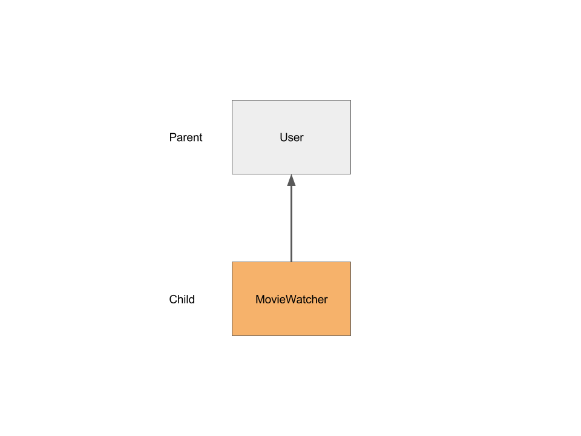
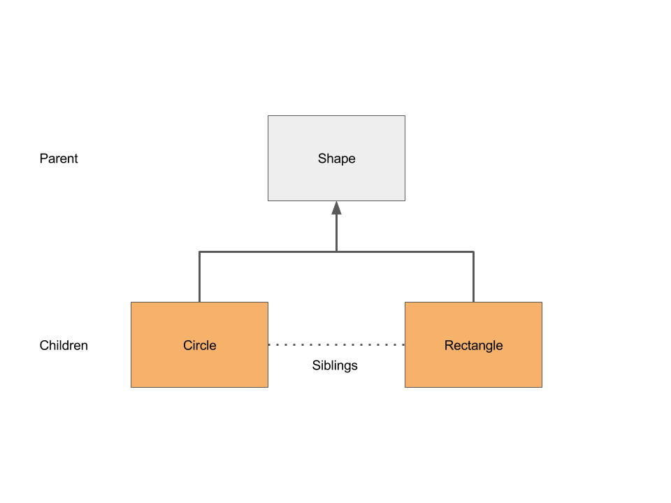
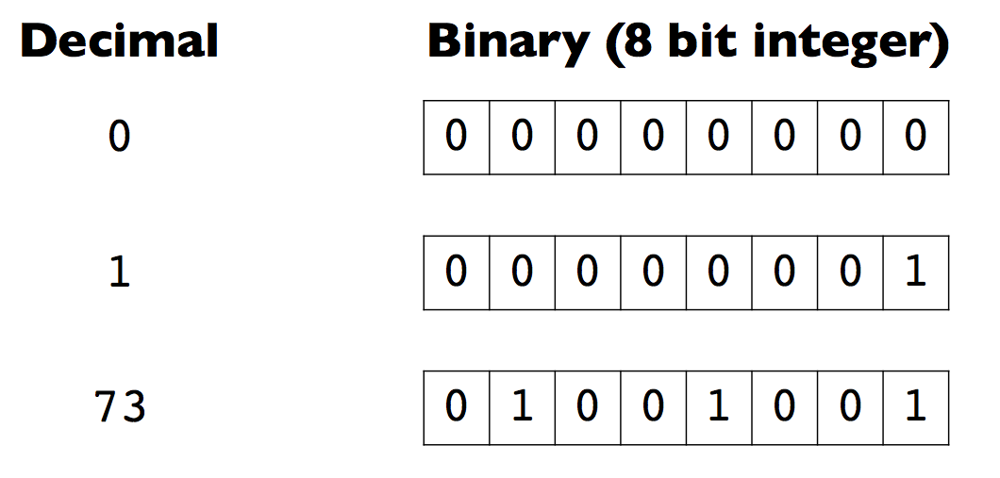
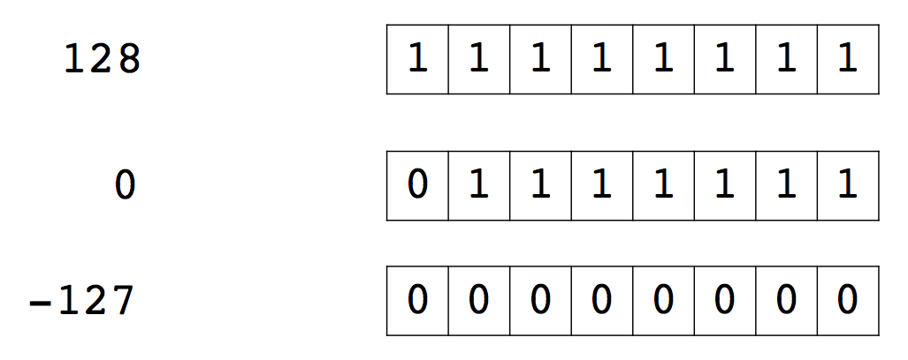
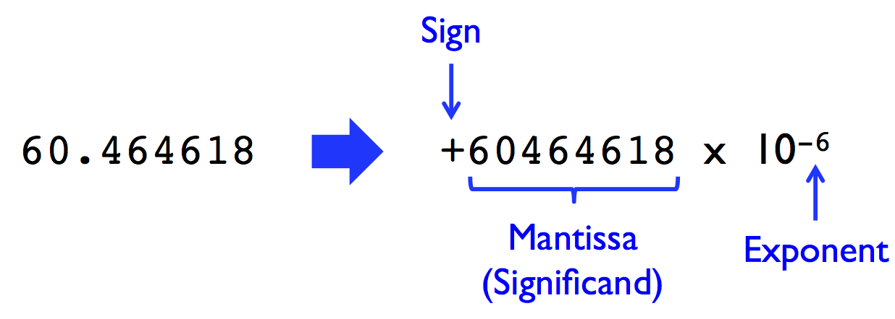

# CME 211: Lecture 9

Wednesday, October 9, 2015

Topic: More Object Oriented Programming (OOP) in Python

## Announcements

## Python OOP topics & examples

### Name example

* `code/names.py`:

methods can be called inside the initialization method


```py
class NameClassifier:
    def __init__(self, femalefile, malefile):
        self.LoadNameData(femalefile, malefile)

    def LoadNameData(self, femalefile, malefile):
        # Creates a dictionary with the name data from the two input files
        self.namedata = {}
        f = open(femalefile,'r')
        for line in f:
            self.namedata[line.split()[0]] = 1.0
        f.close()

        f = open(malefile,'r')
        for line in f:
            name = line.split()[0]
        if name in self.namedata:
            # Just assume a 50/50 distribution for names on both lists
            self.namedata[name] = 0.5
        else:
            self.namedata[name] = 0.0
        f.close()

    def ClassifyName(self, name):
        if name in self.namedata:
            return self.namedata[name]
        else:
            # Don't have this name in our data
            return 0.5
```

* `code/main.py`:

```py
import names

# Create an instance of the name classifier
classifier = names.NameClassifier('dist.female.first', 'dist.male.first')

# Setup test data
testdata = ['PETER', 'LOIS', 'STEWIE', 'BRIAN', 'MEG', 'CHRIS']

# Invoke the ClassifyName() method
for name in testdata:
    print('{}: {}'.format(name, classifier.ClassifyName(name)))
```

* Output:

```
$ python main.py
PETER: 1.0
LOIS: 1.0
STEWIE: 0.5
BRIAN: 1.0
MEG: 1.0
CHRIS: 1.0
```

### Student example

Let's inspect a `Student` object:

* `code/student1.py`:

They return copy.deepcopy(self.classes)
THe thing that's returned cannot come back and change internal state of the student object
Often a good thing to do if you want to return a bunch of data from inside your class (Maintains strong encapsulation)


```py
import copy

class Student:
    def __init__(self, id):
        self.id = id
        self.classes = {}
    def getId(self):
        return self.id
    def addClass(self, name, gradepoint):
        self.classes[name] = gradepoint
        sumgradepoints = float(sum(self.classes.values()))
        self.gpa = sumgradepoints/len(self.classes)
    def getGPA(self):
        return self.gpa
    def getClasses(self):
        return copy.deepcopy(self.classes)

s = Student(7)
s.addClass("gym", 4)
s.addClass("math", 3)

print("s = {}".format(s))

# lots of print statements to get information
print(s.getId())
print(s.getClasses())
print(s.getGPA())
```

Output:

```
$ python student1.py
s = <__main__.Student instance at 0x7f27f94acdd0>
7
{'gym': 4, 'math': 3}
3.5
$
```

### Operator overloading

* Your user defined objects can be made to work with the Python built-in
operators

* Why would you want to do that?

### String representation method

* `code/student2.py`:

all same except we added a "repr" method. this returns String representation of the method
before, when we did print(s), we got instance of memory, but now it prints out a nice thing

We've overloaded some default python funcitonality

```py
import copy

class Student:
    def __init__(self, id):
        self.id = id
        self.classes = {}
    def getId(self):
        return self.id
    def addClass(self, name, gradepoint):
        self.classes[name] = gradepoint
        sumgradepoints = float(sum(self.classes.values()))
        self.gpa = sumgradepoints/len(self.classes)
    def getGPA(self):
        return self.gpa
    def getClasses(self):
        return copy.deepcopy(self.classes)
    def __repr__(self):
        string = "Student %d: " % self.getId()
        string += " %s, " % self.getClasses()
        string += "GPA = %4.2f" % self.getGPA()
        return string

s = Student(7)
s.addClass("gym", 4)
s.addClass("math", 3)

# now easy to print a student
print(s)
```

Output:

```
$ python student2.py
Student 7: {'gym': 4, 'math': 3}, GPA = 3.50
$
```

### Methods you can override

```
| method               | operation                  |
|----------------------+----------------------------|
| __len__(self)        | Returns the length of self |
| __add__(self, other) | Returns self + other       |
| __mul__(self, other) | Returns self * other       |
| __neg__(self)        | Returns -sefl              |
| __abs__(self)        | Returns abs(self)          |
| __float__(self)      | Returns float(self)        |
```

Over 50+ methods in total

### What is OOP?

* Some will argue that putting your data in an object, and adding a bunch of put
/ get methods to interface with it, is just a glorified container and interface


* Real power of OOP might be in allowing objects to interact with each other by
overriding appropriate methods


### Particle collision


### OOP design

```
p_blue = Particle(...)
p_red = Particle(...)

...

p_purple = p_blue + p_red
```

### Particle class
"self" is the left hand side and "other" is the RHS
`code/particle.py`:

```py
class Particle:
    def __init__(self, mass, velx):
        self.mass = mass
        self.velx = velx
    def __add__(self, other):
        # inelastic collision (momentum is conserved)
        mass = self.mass + other.mass
        velx = (self.mass*self.velx + other.mass*other.velx)/mass
        return Particle(mass, velx)
    def __repr__(self):
        return "Mass: %s, Velocity: %s" % (self.mass, self.velx)
```

### OOP particle collision

```
$ python -i particle.py
>>> p_blue = Particle(4.3, 2.5)
>>> p_red = Particle(1.4, -0.8)
>>> p_purple = p_blue + p_red
>>> p_purple
Mass: 5.7, Velocity: 1.68947368421
>>>
```

### Overloading should be intuitive

`code/badoverloading.py`:

```py
class User:
    def __init__(self, id):
        self.id = id
    def __len__(self):
        return self.getId()
    def getId(self):
        return self.id
```

Output:

```
$ python -i badoverloading.py
>>> user = User(7)
>>> len(user)
7
>>>
```

Is this intuitive?
No, you shouldn't overload this one- it doesn't make sense for the user to have a length. Operator should make sense
### Inheritance

* Inheritance is a way for a class to inherit attributes from another class

* This is a form of code reuse

* The original class is called a base class, or a superclass, or a parent class

* The new class is called a derived class, or a subclass, or a child class

* The new class will typically redefine or add new attributes

### Inheritance example

`code/inheritance1.py`:

```py
# parent class
class User:
    def __init__(self, id):
        self.id = id
    def getId(self):
        return self.id

# child class
class MovieWatcher(User):
    pass
```
moviewatcher inherits from user class ...(User) means we are inheriting all attributes of User
Output:

```
$ python -i inheritance1.py
>>> user = MovieWatcher(3)
>>> user.getId()
3
>>>
```

### Overriding a method

`code/inheritance2.py`:

In this case, the moviewatcher has additional info. need to call initialization from parent class (use name of parent class and . method)

```py
class User:
    def __init__(self, id):
        self.id = id
    def getId(self):
        return self.id

class MovieWatcher(User):
    def __init__(self, id):
        # Call the parent class initialization
        User.__init__(self, id)
        # MovieWatcher specific initialization
        self.avgmovieranking = -1.
        self.movies = {}
```



### Sibling classes

`code/inheritance3.py`:

both cookieeater and moviewatcher has inherited from user

```py
class User:
    def __init__(self, id):
        self.id = id
    def getId(self):
        return self.id

class MovieWatcher(User):
    def __init__(self, id):
        # Call the parent class initialization
        User.__init__(self, id)
        # MovieWatcher specific initialization
        self.avgmovieranking = -1.
        self.movies = {}

class CookieEater(User):
    def __init__(self, id):
        # Call the parent class initialization
        User.__init__(self, id)
        # CookieEater specific initialization
        self.cookieseaten = 0
        self.cookies = {}
```


### Polymorphism

* Different types of objects have methods with the same name that take the same
arguments

* Programmer does not need to know the exact type of an object for common
operations

* Typically the objects inherit from the same parent class

### Shapes

`code/shapes.py`:

Better implementation is if Shape knows it's posisition, then Circle and Rectangle inherits it

```py
import math

class Shape:
    def GetArea(self):
        raise RuntimeError, "Not implemented yet"

class Circle(Shape):
    def __init__ (self, x, y, radius):
        self.x = x
        self.y = y
        self.radius = radius

    def GetArea(self):
        area = math.pi * math.pow(self.radius, 2)
        return area

class Rectangle(Shape):
    def __init__ (self, x0, y0, x1, y1):
        self.x0 = x0
        self.y0 = y0
        self.x1 = x1
        self.y1 = y1

    def GetArea(self):
        xDistance = self.x1 - self.x0
        yDistance = self.y1 - self.y0
        return abs(xDistance * yDistance)

shapes = []
shapes.append(Circle(0., 0., 1.0))
shapes.append(Rectangle(0., 0., 2., 4.))

for shape in shapes:
    print("area = {}".format(shape.GetArea()))
```

Output:

```
$ python shapes.py
area = 3.14159265359
area = 8.0
$
```



### OOP Summary

* Abstraction

* Represent things in a form familiar to humans

* Encapsulation

* Restrict access to internal data by providing interfaces

* Inheritance

* Parent / child classes for code reuse

* Polymorphism

* Share method names and arguments across (sibling) classes

## Computer representation of data

* Computers represent and store everything in *binary*

* Binary, a base 2 number system, consists only of 0s and 1s called binary
digits (bits)

* There are 8 bits in a byte

### Converting between bases

* One can easily convert numbers between different bases such as binary (base 2)
and decimal (base 10)

```
| decimal | binary |
|---------+--------|
|       0 |      0 |
|       1 |      1 |
|       2 |     10 |
|       3 |     11 |
|       4 |    100 |
|       5 |    101 |
|       6 |    110 |
|       7 |    111 |
```

### Common prefixes


* kilo, mega, giga, tera, peta, exa prefixes:

```
| kilobyte (kB) | 10^3 (or 2^10) |
| megabyte (MB) | 10^6 (or 2^20) |
| gigabyte (GB) | 10^9 (or 2^30) |
| terabyte (TB) | 10^12 (or 2^40) |
| petabyte (PB) | 10^15 (or 2^50) |
| exabyte (EB)  | 10^18 (or 2^60) |
```

* Networking and storage typically use base 10 while memory is specified in
terms of base 2

* Technically prefixes and symbols are different, e.g. Kilobyte or kibibyte with
symbols KB / KiB / Kbytes for base 2

### Computer storage of text

* American Standard Code for Information Interchange (ASCII) is typically used
to encode text information

* Characters, numbers, symbols, etc. are encoded using 7 bits (although on
modern computers they would typically use 8 bits)

  * `A` maps to `1000001` in binary or 65 in decimal
  * `B` maps to `1000010` in binary or 66 in decimal

### Computer storage of a number

* At the hardware level computers **don't** do variable length representations of
numbers

* We might write:

  * 4 as `100`, using 3 bits

  * 73 as `1001001`, using 7 bits

### Fixed storage widths


### Integer representation

* At the hardware level computers typically handle integers using 8, 16, 32, or
64 bits



### Integer range

* For `n` bits, there are only `2^n` unique combinations of 0s and 1s

* This limits the range of what can be represented with a fixed number of bits

```
2^8  = 256
2^16 = 65536
2^32 = 4294967296
2^64 = 18446744073709551616
```

### Sign bit

* Use one bit for sign and remaining bits for magnitude


* Reduces the range of the magnitude from `2^n` to `2^(n-1)`

### Offset

* Apply an offset or bias to reinterpret the conversion between binary and
decimal



* Again, effectively reduces the range of the magnitude

### Unsigned integers

* Many programming languages support unsigned integers

* Python itself does not have unsigned integers, but Numerical Python (`numpy`) does

* Can use this to your advantage to expand the effective range available if
negative numbers don't need to be stored

* But be careful...

### Overflow and underflow

* Attempting to assign a value greater than what can be represented by the data
type will result in overflow

* Attempting to assigning a value less than what can be represented by the data
type will result in underflow

* Overflow or underflow tend to cause wraparound, e.g. if adding together two
signed numbers causes overflow the result is likely to be a negative number

### Range of integer types


### Floating point representation

* How do I represent a floating point value using bits?



### Floating point standard

* IEEE (Institute of Electrical and Electronics Engineers) 754 is the technical
standard for floating point used by all modern processors


* Standard also specifies things like rounding modes, handling overflow, divide
by zero, etc.

### Floating point and you

* Floating point also has similar potential for overflow and underflow

* In addition, the limited number of bits for the mantissa means it often needs
to be rounded

* Will spend more time on floating point arithmetic in CME 212

* What Every Computer Scientist Should Know About Floating-Point Arithmetic by
Goldberg

### Numbers in Python

* Python has support for plain and long integers

* Plain integers are 32 or 64-bit signed integers depending on the platform

* Long integers have unlimited range

```
>>> 52**100
3984137914278306537107946300187788156651883090392267368064424070371960737746
8098814309384465476477916379562105903885691732986504663858102457926577952139
61405107689148645376L
>>>
```

* Floating point numbers are double precision (64-bit)
