# CME 211: Lecture 13

Monday, October 19, 2015

Topics: Introduction to LaTeX

## LaTeX

* LaTeX is a document markup language

* HTML is also a document markup language targeting web browsers

* LaTeX targets high quality print (pdf) documents

* LaTeX commands are also now used to typeset equations on the web

* pdf Latex is also on corn

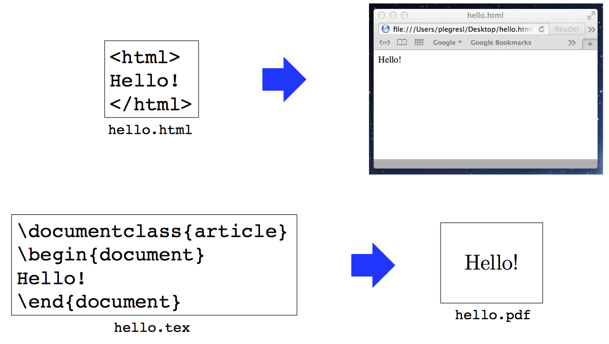

## How to obtain

* Mac OSX: <https://tug.org/mactex/>

* Ubuntu: `$ sudo apt-get install texlive`

* Fedora: `$ sudo yum install texlive-scheme-medium`

Note: on Linux distributions, you may have to install other `texlive` packages
to get the full TeXLive distribution.  Ubuntu has the package `texlive-full`.
Fedora has the package collection `texlive-scheme-full`.  These are large
downloads.  Be prepared to wait.  Don't install TeX at the last moment!

TeXLive is installed on `corn.stanford.edu`.  The primary access point for CME
211 will be the command line program `pdflatex`.

### Equations in LaTeX

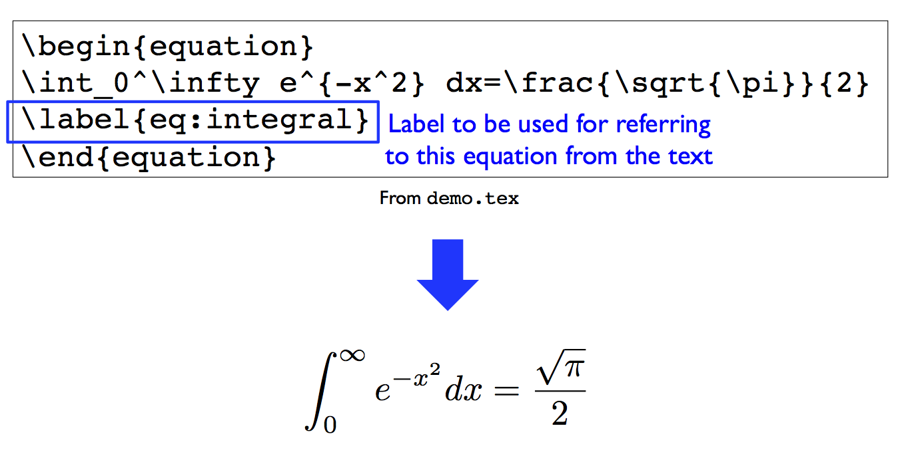

- put equations in an equation environment
- handy program in mac called latex it
  - can experiment with different tex equations
  - `\frac{1}{2}`

### Hello world

See: `tex/hello.tex`:

```
\documentclass{article}
\begin{document}
Hello
\end{document}
```

Typesetting instructions (from this directory):
don't check temporary files in github

```
$ cd tex
$ pdflatex hello.tex
```

this produces the pdf
This creates `hello.pdf`.
uses computer modern font

### Document class

Quite a few options:

* `article` - general purpose class for publications, reports, etc.

* `proc` - proceedings

* `report` - longer reports, short books, etc.

* `book` - books

* `slides` - presentation slides

* `letter` - writing letters

* etc.

Various organizations will also distribute customized document classes for
various purposes.  For example:

* SIAM LaTeX: <https://www.siam.org/journals/auth-info.php>

* Stanford PhD thesis template:
  <https://library.stanford.edu/research/bibliography-management/latex-and-bibtex>

### White space

White space is normalized so `1` to `n` spaces are treated the same

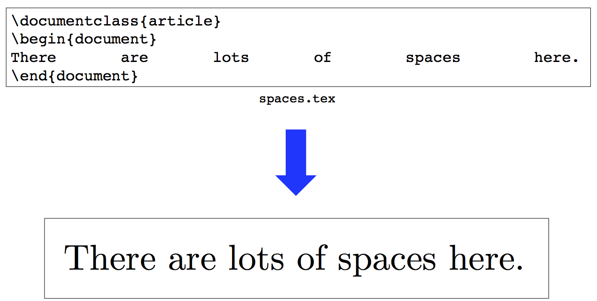

If you need extra spaces between words, type `\ \` to escape the spaces

### Paragraphs

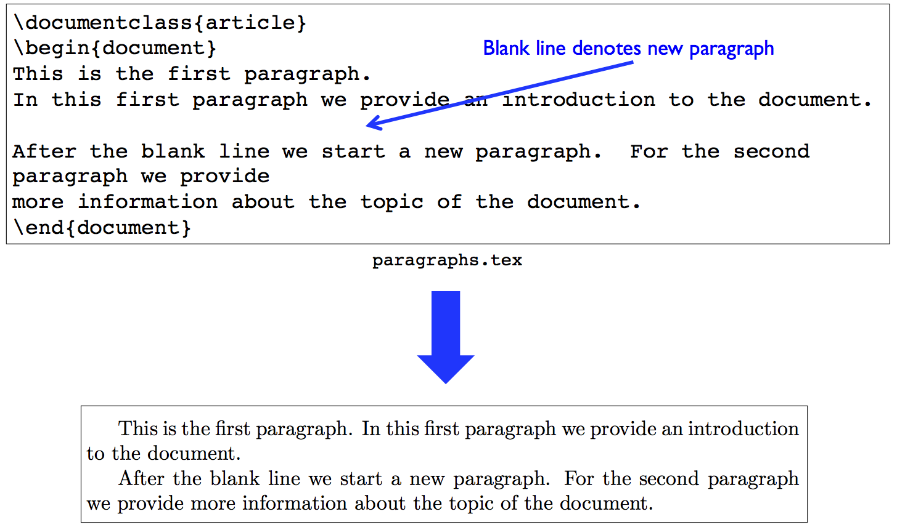


### Special characters

There are several reserved characters in LaTeX:

```
# $ % ^ & _ { } ~ \
```
All of these have to be escaped to show up
### Comments

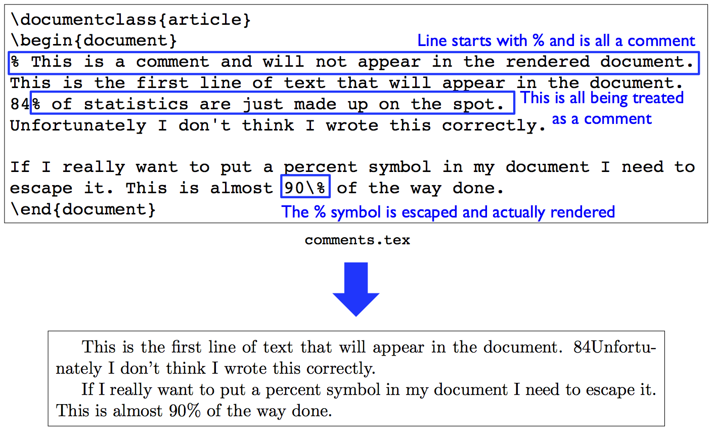

### Groups

Pairs of curly brackets denote a group and are typically used to limit the scope
of switches:

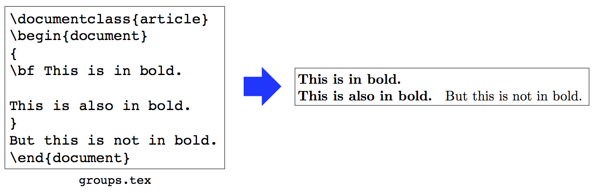

everything within curly brakcets will be in bold

can also do:
```
\textbf{
  blahblah.\\
  blahblah.
}

can use tt for code

### Commands

General form of a LaTeX command is

```
\commandname[option1,option2,...]{argument1}{argument2}...
```
options are required, arguments are optional
### Command example

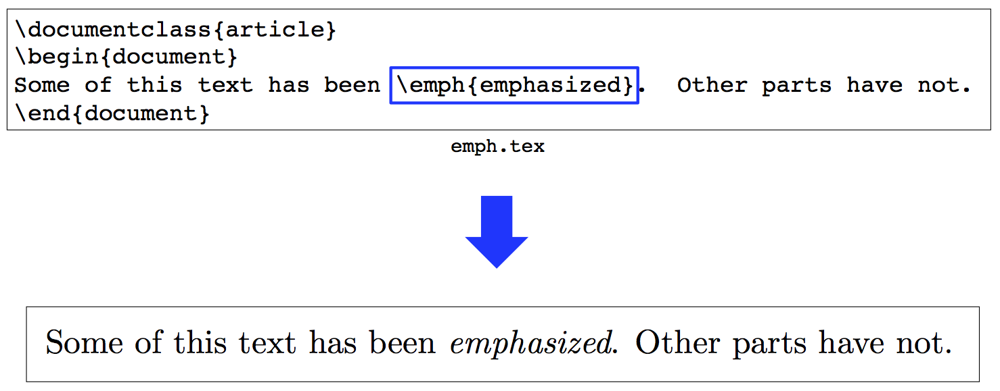

### Environments

```
\begin{environmentname}
Text to be influenced by this environment
\end{environmentname}
```

### Equation environment


use labels to refer to the equation

### Bulleted list

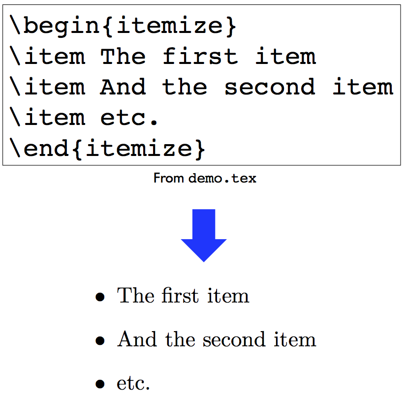

if you want numbers, it is `enumerate`

### Latex packages

Many LaTeX environments are defined in packages.  To include a package use the
`\usepackage` command in the document preamble.  The `tex/demo.tex` document
uses a few:

```
\usepackage{graphicx}
\usepackage{algorithm2e}
```

This comes before the `\begin{document}` command.

* `graphicx` provides the `\includegraphics` command for figures

* `algorithm2e` provides an environment for displaying algorithms

### Figures

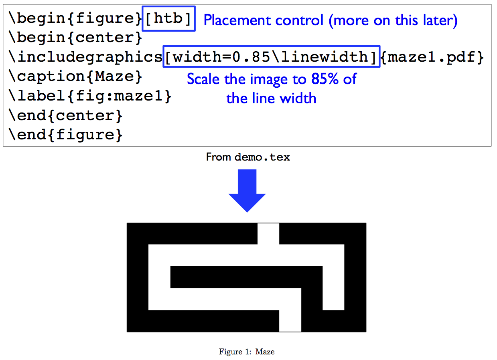

### Table

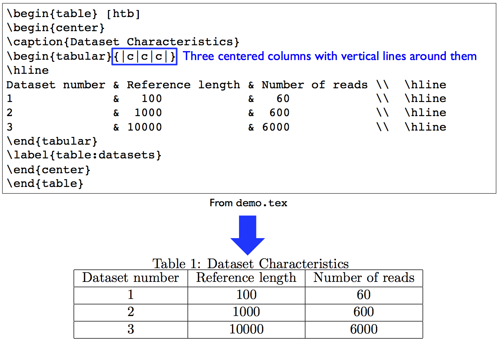

table is built into standard latex
`{|c|c|c|}` tells how we want to justify

### Algorithm

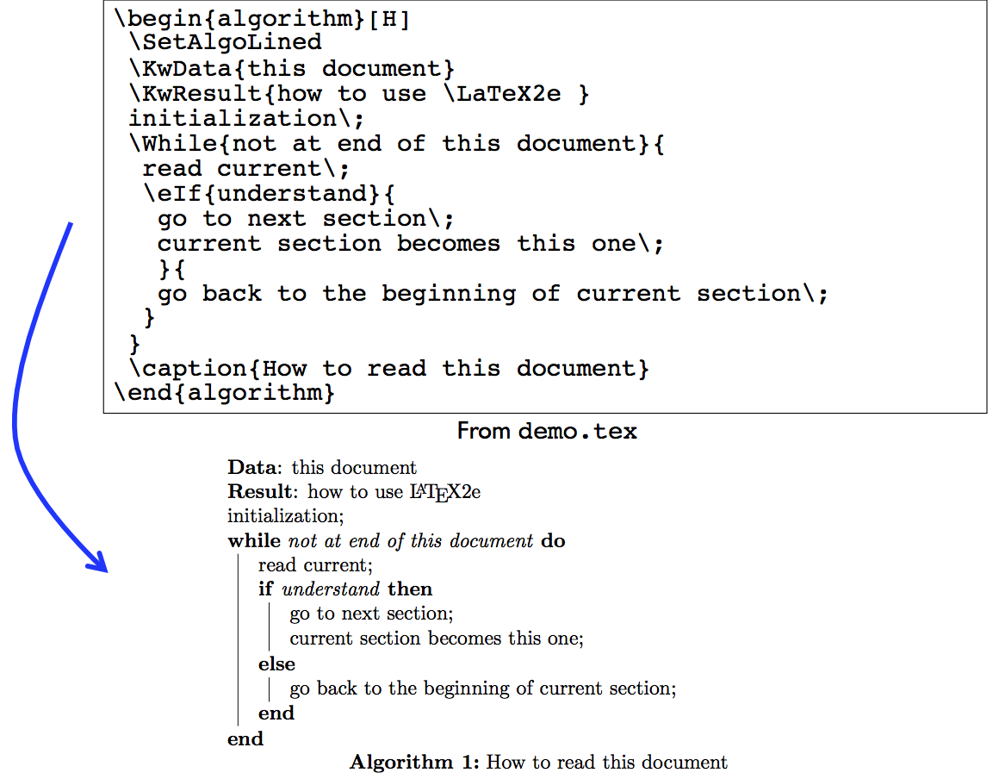

### Referencing labels

Use `\label` and `\ref`:

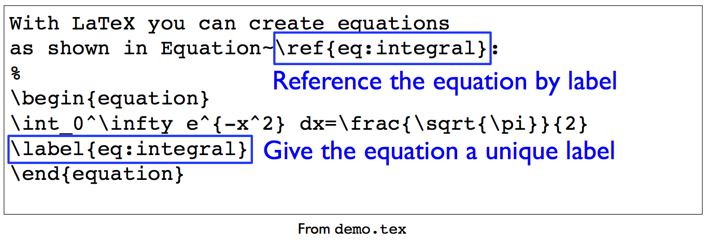

The first pass of LaTeX will produce an unresolved reference:

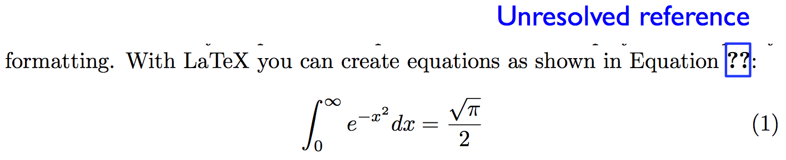

The second pass of LaTeX will resolved the reference:

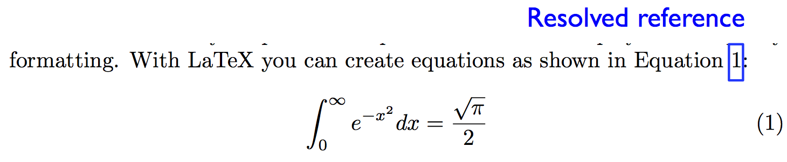

### Controlling placement

* By default figures, tables, etc. will "float" around to where they best fit

* You can also specify preferences about placement

* Floating environments take a parameter in square brackets:
  `\begin{figure}[?]`.  The options are:

  * `h` for "float here"

  * `t` for "top of page"

  * `b` for "bottom of page"

  * `H` for "put here, don't float" this forces it to be put here

* Good figure placement often requires some experimentation.

* Advice: write the document first.  Make it look nice second.  Things will
  change as you add more text and figures.

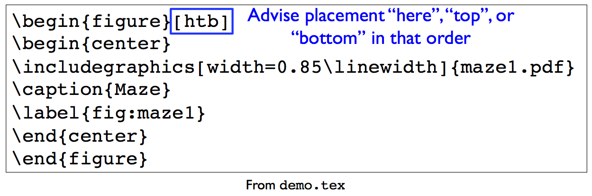

### BibTex

* Companion program for managing citations of papers, books, websites, etc.

* Start by creating a `.bib` file

### .bib file

See `tex/references.bib`:

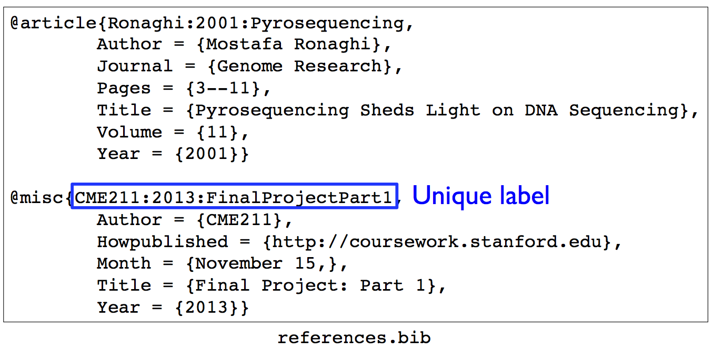

- first thing is the unique label that you use to refer to in the document

### Typesetting with BibTeX reference

This is really annoying!

```
$ pdflatex demo
$ bibtex demo
$ pdflatex demo
$ pdflatex demo
```

Many TeX editors do this for you with one button click.  See

* TeXShop

* TeXWorks

* TeXMaker

I use a GNU makefile to drive TeX (automatically run the four commands)

### Bibliography management

* Any text editor can be used to create, edit, and manage a `.bib` file

* Some editors will recognize the file extension and enable a BibTex specific
mode

  * There are also applications specifically for doing this:

  * BibDesk (Mac OS X only): <http://bibdesk.sourceforge.net> use GUI

  * JabRef (Windows / Mac OS X / Linux): <http://jabref.sourceforge.net>

  * Mendeley: <http://www.mendeley.com> commercial product

### Citations

Citation in LaTeX:

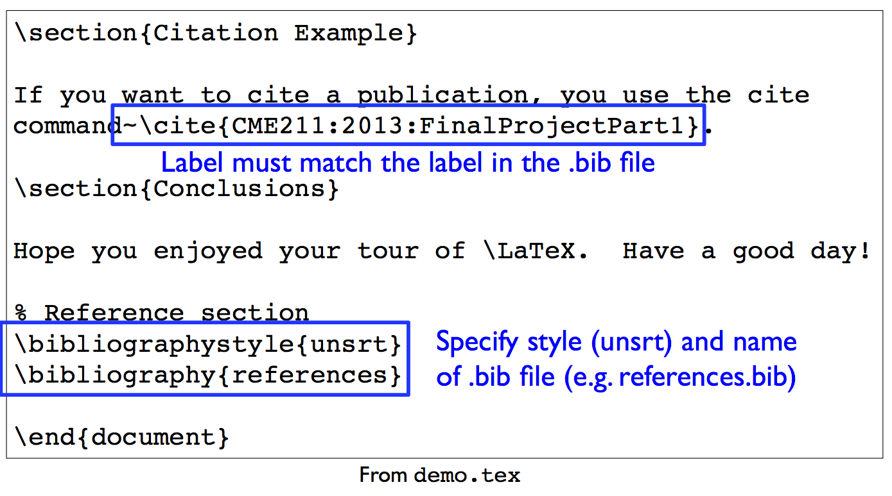

Resulting PDF:

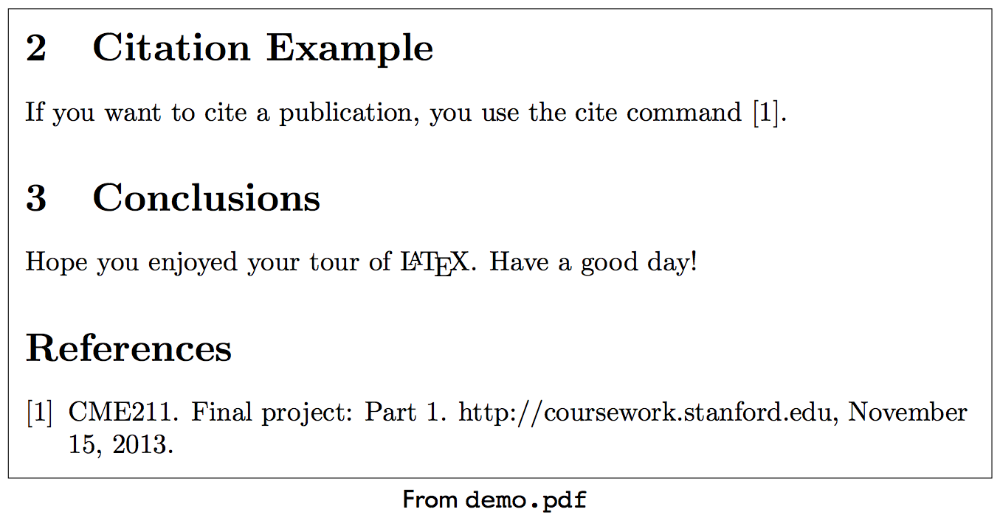

### A note on LaTeX errors

LaTeX will dump error messages and start a prompt on errors:

```
$ pwd
/Users/nwh/Dropbox/courses/2015-Q4-cme211/lecture-prep/lecture-13-work/tex
nwh-mbpro:tex nwh$ pdflatex demo
This is pdfTeX, Version 3.14159265-2.6-1.40.16 (TeX Live 2015) (preloaded format=pdflatex)
.....
) (./demo.aux) (/usr/local/texlive/2015/texmf-dist/tex/latex/base/omscmr.fd)
! Undefined control sequence.
l.35 \includegraphics
                     [width=0.85\linewidth]{../fig/maze.pdf}
?
```

LaTeX is wanting you to guide the typesetting at this point.  I have no idea
what to do here.  I input a capital `X` to get back to the shell.  I then fix
the error in the `.tex` file.  In this case, I forgot `\usepackage{graphicx}` in
the preamble.

### LaTeX references

* Google

* Guide to LaTeX by Kopka and Daly:  
  <http://proquest.safaribooksonline.com/book/graphic-design/9780321617736>

* **Detexify**: a web tool to go from symbol drawing to TeX command:  
  <http://detexify.kirelabs.org/classify.html>

* LaTeX Wikibook:
  <https://en.wikibooks.org/wiki/LaTeX>
