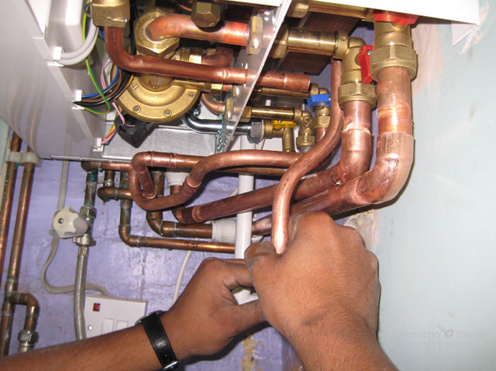

# CME 211: Lecture 16

Wednesday, October 27, 2015

Announcements:
68% of class will get A- or above

Topics:

* conditionals
* basic file operations in C++

## Conditional statements in C++

C++ has three conditional statements:

* `if`

* `switch`

* C++ ternary operator: `(x == y) ? a : b`

## C++ `if`

```cpp
#include <iostream>

int main() {
  int n = 2;

  std::cout << "n = " << n << std::endl;
  if (n > 0) {
    std::cout << "n is positive" << std::endl;
  }

  return 0;
}
```

Output:

```
$ ./if1
n = 2
n is positive
$
```

Note: brackets `{...}` are not needed for a single line `if` block.  However, I
recommend always putting them in.

### `else if`

```cpp
#include <iostream>

int main() {
  int n = -3;

  std::cout << "n = " << n << std::endl;

  if (n > 0) {
    std::cout << "n is positive" << std::endl;
  }
  else if (n < 0) {
    std::cout << "n is negative" << std::endl;
  }

  return 0;
}
```

```
$ ./if2
n = -3
n is negative
$
```

### `else`
This is executed if none of the other blocks are executed (last case)
```cpp
#include <iostream>

int main() {
  int n = 0;

  std::cout << "n = " << n << std::endl;

  if (n > 0) {
    std::cout << "n is positive" << std::endl;
  }
  else if (n < 0) {
    std::cout << "n is negative" << std::endl;
  }
  else {
    std::cout << "n is zero" << std::endl;
  }

  return 0;
}
```

```
$ ./if3
n = 0
n is zero
$
```

### Common mistakes

Empty `if` due to extraneous semi-colon:

```
if (n < 0);
  std::cout << "n is negative" << std::endl;
```

Assignment in the conditional expression:
This gives an compiler error if assigned for a conditional
If no error, code may not run properly
```
if (n = 0)
  std::cout << "n is zero" << std::endl;
```
Can also switch order of variable to force noncompile (ex: if(0 == n)), called a yoda condition
Note: some people recommend always putting the 'literal' before the variable.
This is known as a
[Yoda Condition](https://en.wikipedia.org/wiki/Yoda_conditions).

### `break`

The `break` keyword breaks out of the current loop.

```cpp
#include <iostream>

int main() {

  for (unsigned int n = 0; n < 10; n++) {
    std::cout << n << std::endl;
    if (n > 3) break;
  }

  return 0;
}
```

```
$ ./break
0
1
2
3
4
$
```

### `continue`

The `continue` keyword moves to the next loop iteration.

```
#include <iostream>

int main() {
  for (unsigned int n = 0; n < 10; n++) {
    if (n < 7) continue;
    std::cout << n << std::endl;
  }

  return 0;
}
```

```
$ ./continue
7
8
9
$
```

### Logical operators

* C++ has two choices for logical operators

  * Newer style `and`, `or`, `not`

  * Older style `&&`, `||`,'!'

* Latter are backwards compatible with C

### Logical AND

```cpp
#include <iostream>

int main() {
  int a = 7;
  int b = 42;

  // the following are equivalent

  if (a == 7 and b == 42)
    std::cout << "a == 7 and b == 42 is true" << std::endl;

  if (a == 7 && b == 42)
    std::cout << "a == 7 && b == 42 is true" << std::endl;

  return 0;
}
```

```
$ ./logical1
a == 7 and b == 42 is true
a == 7 && b == 42 is true
$
```

### `0` is false, everything else is true
use cpp.reference to see how to print format with precision

```cpp
#include <iostream>

int main() {
  int a[] = {-1, 0, 1, 2};

  for (int n = 0; n < 4; n++) {
    if (a[n])
      std::cout << a[n] << " is true" << std::endl;
    else
      std::cout << a[n] << " is false" << std::endl;
  }

  return 0;
}
```

```
$ ./logical2
-1 is true
0 is false
1 is true
2 is true
$
```

### Bitwise results
common mistake: doing bitwise and instead of logical


```cpp
#include <iostream>

int main() {
  int a = 1;
  int b = 2;

  if (a)
    std::cout << "a is true" << std::endl;
  else
    std::cout << "a is false" << std::endl;

  if (b)
    std::cout << "b is true" << std::endl;
  else
    std::cout << "b is false" << std::endl;

  if (a & b)
    std::cout << "a & b is true" << std::endl;
  else
    std::cout << "a & b is false" << std::endl;

  return 0;
}
```

Bitwise and of 1 (01) and 2 (10) becomes (00), so it becomes false
```
$ g++ -Wall -Wconversion -Wextra logical3.cpp -o logical3
$ ./logical3
a is true
b is true
a & b is false
$
```

### `switch`

* `if`, `else if`, `else`, etc. gets verbose if you have many paths of execution

* Can use a switch statement instead:

```cpp
if (choice == `C')
  clearRecord();
else if (choice == `D')
  deleteRecord();
else if (choice == `A')
  addRecord();
else if (choice == `P')
  printRecord();
else
  std::cout << "Bad choice\n";
```

Becomes:
each case needs to end with a break
say we're in case C, execute function, then break goes to end of switch block
if neglected to put break, control would keep going down and execute other cases
default is executed if choice is not equal to any of the other cases
```
switch (choice) {
  case `C': clearRecord(); break;
  case `D': deleteRecord(); break;
  case `A': addRecord(); break;
  case `P': printRecord(); break;
  default: std::cout << "Bad choice\n";
}
```

### `switch` and `enum` example
enum is a new type that has text values; makes code more readable
might have enum for days of the week, months, anything that we often think of enumerated with text (not numbers)

```cpp
enum direction {
  left,
  right,
  up,
  down
};

//Can also do this and assign a keyword to some integer:
// can also define inside of a function
enum direction {
  left=100,
  right=123,
  up=32,
  down=88
};

int main() {
  direction d = right;

  std::string txt = "you are going ";
  switch (d) {
    case left:
      txt += "left"; break;
    case right:
      txt += "right"; break;
    case up:
      txt += "up"; break;
    case down:
      txt += "down"; break;
  }
  std::cout << txt << std::endl;
  return 0;
}
```

```
$ ./switch1
you are going right
$
```

### Advantage

Compiler warnings will tell you if you are missing some cases.

```cpp
switch (d)
{
  case left:
    txt += "left"; break;
  case right:
    txt += "right"; break;
  case down:
    txt += "down"; break;
}
```

```
$ g++ -Wall -Wconversion -Wextra switch2.cpp -o switch2
switch2.cpp: In function 'int main()':
switch2.cpp:16:10: warning: enumeration value 'up' not handled in switch [-Wswitch]
switch (d)
^
$
```

### Common mistake

Neglecting to add `break` in each case.

```cpp
std::string txt = "you are going ";
switch (d) {
  case left:
    txt += "left";
  case right:
    txt += "right";
  case up:
    txt += "up";
  case down:
    txt += "down";
}
std::cout << txt << std::endl;
```

```
$ g++ -Wall -Wconversion -Wextra switch3.cpp -o switch3
$ ./switch3
you are going rightupdown
$
```

### Ternary operator

This is called the "ternary" operator:

-b returned if b<0 is true
b returned if b<0 is false

```
a = b < 0 ? -b : b;
```

Equivalent code:

```
if (b < 0)
  a = -b;
else
  a = b;
```

Anatomy:

```
[conditional] ? [return expression if true] : [return expression if false];
```

### `goto`

"If you find yourself using a `goto` statement within a program, then you have not
thought about the problem and its implementation for long enough"

See: <http://xkcd.com/292/>


## File I/O

File I/O in Python:


File I/O in C++:




### C++ file I/O

* Like outputting to the screen, file I/O is also handled via streams

* Three stream options:

  * `ofstream`: output file stream (i.e. write)

  * `ifstream`: input file stream (i.e. read)

  * `fstream`: file stream (i.e. read or write)

### `ofstream`

```cpp
#include <iostream>
#include <fstream>

int main() {
  std::ofstream f; //this stream is specifically for output

  f.open("hello.txt");
  if (f.is_open()) { //test to make sure file is open
    f << "Hello" << std::endl; //normally, we put stdcout
    f.close();
  }
  else {
    std::cout << "Failed to open file" << std::endl;
  }

  return 0;
}
```

```
$ g++ -Wall -Wconversion -Wextra ofstream1.cpp -o ofstream1
$ rm -f hello.txt
$ ./ofstream1
$ cat hello.txt
```

### Using a variable for the filename

Code:

```cpp
#include <iostream>
#include <fstream>
#include <string>

int main() {
  std::string filename = "file.txt";

  std::ofstream f;
  f.open(filename);
  if (f.is_open()) {
    f << "Hello" << std::endl;
    f.close();
  }
  else {
    std::cout << "Failed to open file" << std::endl;
  }

  return 0;
}
```

Output:
open method doesn't support (new feature in C++ 11)
can convert back to older one by using .cstr()
```
$ g++ -Wall -Wconversion -Wextra ofstream2.cpp -o ofstream2
ofstream2.cpp: In function 'int main()':
ofstream2.cpp:10:18: error: no matching function for call to
'std::basic_ofstream<char>::open(std::string&)'
f.open(filename);
^
ofstream2.cpp:10:18: note: candidate is:
In file included from ofstream2.cpp:2:0:
/usr/include/c++/4.8/fstream:713:7: note: void std::basic_ofstream<_CharT,
_Traits>::open(const char*, std::ios_base::openmode) [with _CharT = char; _Traits =
std::char_traits<char>; std::ios_base::openmode = std::_Ios_Openmode]
open(const char* __s,
^
/usr/include/c++/4.8/fstream:713:7: note:
no known conversion for argument 1 from
'std::string {aka std::basic_string<char>}' to 'const char*'
$
```

Change to:

```cpp
  f.open(filename.c_str());
```
Or see below, convert to C++ 2011 standard
```
$ g++ -Wall -Wconversion -Wextra ofstream3.cpp -o ofstream3
$ rm -f file.txt
$ ./ofstream3
$ cat file.txt
```

### C++ 2011 standard
Our homeworks will all be in C++ 2011

Specify usage of the C++ 2011 standard.  Passing an `std::string` to `f.open` is supported:

```
g++ -std=c++11 -Wall -Wconversion -Wextra ofstream2.cpp -o ofstream2
rm -f file.txt
./ofstream2
cat file.txt
```

### Writing an array of values

```
#include <iostream>

//  Define constants to size the static array
#define ni 2  // anytime you see a "ni", replace it with a 2
#define nj 3  // anytime you see a "nj", replace it with a 3

int main() {
  int a[ni][nj];

  // Initialize the array values
  int n = 0;
  for (int i = 0; i < ni; i++) {
    for (int j = 0; j < nj; j++) {
      a[i][j] = n;
      n++;
    }
  }

  // Store the array values in a file
  std::ofstream f("array.txt");
  if (f.is_open()) {
    f << ni << " " << nj << std::endl;
      for (int i = 0; i < ni; i++) {
        f << a[i][0];
        for (int j = 1; j < nj; j++) {
          f << " " << a[i][j];
        }
        f << std::endl;
      }
    f.close();
  }
  return 0;
}
```

### `fstream`

Can read and write using fstream

```cpp
#include <iostream>
#include <fstream>

int main() {
  std::fstream f;

  // specify output mode with second argument
  f.open("hello.txt", std::ios::out); // need to pass in what you want to do (read? or write?)
  if (f.is_open()) {
    f << "Hello" << std::endl;
    f.close();
  }
  else {
    std::cout << "Failed to open file" << std::endl;
  }

  return 0;
}
```

### Reading from a file

* Not as easy or convenient as in Python

* We will start by looking at how to read the simple array file we previously
wrote

### `ifstream`

```
#include <iostream>
#include <fstream>

int main() {
  // Read the array values from the file
  std::ifstream f("array.txt"); //creates object and opens it in the same line
  if (f.is_open()) {
    int i;
    while (f >> i) { // Stream extraction operator
      std::cout << i << std::endl;
    }
    f.close();
  }
  return 0;
}
```

Output:

```
$ g++ -std=c++11 -Wall -Wconversion -Wextra ifstream1.cpp -o ifstream1
$ ./ifstream1
2
3
0
1
2
3
4
5
$
```

### Reading the array

```cpp
// Read the array values from the file
std::ifstream f("array.txt");

if (f.is_open()) {
  // Read the size of the data and make sure storage is sufficient
  int nif, njf; // Values of ni and nj read to be read from file
  f >> nif >> njf; // read in size of the file to make sure we have enough storage for the size of that array
  if (nif > ni or njf > nj) {
    std::cout << "Not enough storage available" << std::endl;
    return 0; // quit the program
  }

  // Read the data and populate the array
  for (int i = 0; i < nif; i++) {
    for (int j = 0; j < njf; j++) {
      f >> a[i][j]; // reads in data from file into the array
    }
  }
  f.close();
}
```

## Reading

* **C++ Primer, Fifth Edition** by Lippman et al.

* Chapter 1: Conditional Statements: Sections 5.3 - 5.5

* Chapter 8: The IO Library: Section 8.2
