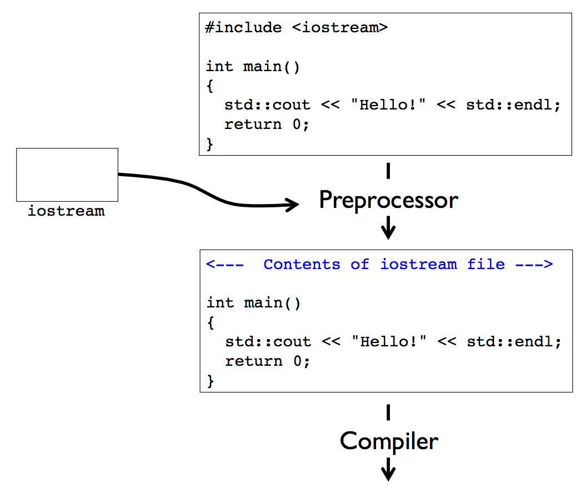

# CME 211: Lecture 18

Wednesday, November 4, 2015

Topics:

* Functions
* Preprocessor & `#include` statements

## Functions

* Functions allow us to decompose a program into smaller components

* It is easier to implement, test, and debug portions of a program in isolation

* Allows work to be spread among many people working mostly independently

* If done properly it can make your program easier to understand and maintain

  * Eliminate duplicated code

  * Reuse functions across multiple programs

### C/C++ function

Example:

```c++
int sum(int a, int b) { //need to specify return type and parameter type
  int c = a + b;
  return c;
}
```

Components:

```c++
return_type function_name(argument_type1 argument_var1, ...) {
   // function body
   return return_var; // return_var must have return_type
}
```

### `sum` function in use

`src/sum1.cpp`

```c++
#include <iostream>

int sum(int a, int b) {
  int c = a + b;
  return c;
}

int main() {
  int a = 2, b = 3;

  int c = sum(a,b);
  std::cout << "c = " << c << std::endl;

  return 0;
}
```

Output:

```
$ g++ -Wall -Wextra -Wconversion sum1.cpp -o sum1
$ ./sum1
c = 5
$
```

### Order matters

`src/sum2.cpp`:

The order in which the function appears matters. Sum function should show up before the main function.

```c++
#include <iostream>

int main() {
  int a = 2, b = 3;

  // the compiler does not yet know about sum()
  int c = sum(a,b);
  std::cout << "c = " << c << std::endl;

  return 0;
}

int sum(int a, int b) {
  int c = a + b;
  return c;
}
```

Output:

```
$ g++ -Wall -Wextra -Wconversion sum2.cpp -o sum2
sum2.cpp: In function 'int main()':
sum2.cpp:7:18: error: 'sum' was not declared in this scope
  int c = sum(a,b);
                 ^
$
```

### Function declarations and definitions

* A function *definition* is the code that implements the function

* It is legal to call a function if it has been defined or *declared* previously (in the same C++ source file)

* See example below: A function *declaration* specifies the function name, input argument type(s),
  and output type.  The function *declaration* need not specify the
  implementation (code) for the function.

`src/sum3.cpp`:

```c++
#include <iostream>

// Forward declaration or prototype
int sum(int a, int b); // tells compiler that there is an implementation for this function and it exists somewhere

int main() {
  int a = 2, b = 3;

  int c = sum(a,b);
  std::cout << "c = " << c << std::endl;

  return 0;
}

// Function definition
int sum(int a, int b) {
  int c = a + b;
  return c;
}
```

Output:

```
$ g++ -Wall -Wextra -Wconversion sum3.cpp -o sum3
$ ./sum3
c = 5
$
```

### Data types

`src/datatypes1.cpp`

```c++
#include <iostream>

int sum(int a, int b) {
  int c;
  c = a + b;
  return c;
}

int main() {
  double a = 2.7, b = 3.8;

  int c = sum(a,b);
  std::cout << "c = " << c << std::endl;

  return 0;
}
```

Output:

```
$ g++ -Wall -Wextra -Wconversion datatypes1.cpp -o datatypes1
datatypes1.cpp: In function 'int main()':
datatypes1.cpp:14:18: warning: conversion to 'int' from 'double' may alter its value [-Wconversion]
  int c = sum(a,b);
              ^
datatypes1.cpp:14:18: warning: conversion to 'int' from 'double' may alter its value [-Wconversion]
$ ./datatypes1
c = 5
$
```

### Implicit casting

`src/datatypes2.cpp`:

```c++
#include <iostream>

int sum(int a, int b) {
  double c = a + b;
  return c; // we are not returning the correct type (since this rounds c up or down to an int)

}

int main() {
  double a = 2.7, b = 3.8;

  int c = sum(a,b);
  std::cout << "c = " << c << std::endl;

  return 0;
}
```

Output:

```
$ g++ -Wall -Wextra -Wconversion datatypes2.cpp -o datatypes2
datatypes2.cpp: In function 'int sum(int, int)':
datatypes2.cpp:6:10: warning: conversion to 'int' from 'double' may alter its value [-Wconversion]
  return c;
         ^
datatypes2.cpp: In function 'int main()':
datatypes2.cpp:13:18: warning: conversion to 'int' from 'double' may alter its value [-Wconversion]
  int c = sum(a,b);
              ^
datatypes2.cpp:13:18: warning: conversion to 'int' from 'double' may alter its value [-Wconversion]
$ ./datatypes2
c = 5
$
```

### Explicit casting

`src/datatypes3.cpp`

```c++
#include <iostream>

int sum(int a, int b) {
  double c = a + b;
  return (int)c;
}

int main() {
  double a = 2.7, b = 3.8;

  int c = sum((int)a,(int)b); // can also do int(a), but (int)a used to be compatible with C
  std::cout << "c = " << c << std::endl;

  return 0;
}
```

Output:
This returns c = 5

```
$ g++ -Wall -Wextra -Wconversion datatypes3.cpp -o datatypes3
$
```


### `void`

* Use the `void` keyword to indicate absence of data

* `src/void1.cpp`

```c++
#include <iostream>

void printHeader(void) { //the input argument doesn't need to have anything (it's optional to put void or not)
  std::cout << "-------------------------" << std::endl;
  std::cout << "      MySolver v1.0      " << std::endl;
  std::cout << "-------------------------" << std::endl;
}

int main() {
  printHeader();
  return 0;
}
```

Output:

```
$ g++ -Wall -Wextra -Wconversion void1.cpp -o void1
$ ./void1
-------------------------
      MySolver v1.0
-------------------------
$
```

### `void` and `return`

`src/void2.cpp`:

```c++
#include <iostream>

//returning 0 gives compiler error since the return is void
void printHeader(void) {
  std::cout << "-------------------------" << std::endl;
  std::cout << "      MySolver v1.0      " << std::endl;
  std::cout << "-------------------------" << std::endl;
  return 0;
}


int main() {
  printHeader();
  return 0;
}
```

Output:

```
$ g++ -Wall -Wextra -Wconversion void2.cpp -o void2
void2.cpp: In function 'void printHeader()':
void2.cpp:8:10: error: return-statement with a value, in function returning 'void' [-fpermissive]
  return 0;
         ^
$
```

### `void` and `return`

`src/void3.cpp`:

```c++
#include <iostream>

// use return keyword to get back to main
void printHeader(void) {
  std::cout << "-------------------------" << std::endl;
  std::cout << "      MySolver v1.0      " << std::endl;
  std::cout << "-------------------------" << std::endl;
  return;
}

int main() {
  printHeader();
  return 0;
}
```

Output:

```
$ g++ -Wall -Wextra -Wconversion void3.cpp -o void3
$
```
and it gives
```
-------------------------
      MySolver v1.0      
-------------------------
```

### Ignoring return value

`src/ignore.cpp`:

```c++
#include <iostream>

int sum(int a, int b) {
  int c = a + b;
  return c;
}

int main() {
  int a = 2, b = 3;

  sum(a,b); // legal to ignore return value if you want

  return 0;
}
```

Output:

```
$ g++ -Wall -Wextra -Wconversion ignore.cpp -o ignore
$ ./ignore
$
```

### Function scope

`src/scope1.cpp`:

```c++
#include <iostream>

int sum(void) {
  // a and b are not in the function scope
  int c = a + b;
  return c;
}

int main() {
  int a = 2, b = 3;

  int c = sum();
  std::cout << "c = " << c << std::endl;

  return 0;
}
```

Output:

In this case, a,b exist in scope of main but not in sum, so it gives a compile time error

```
$ g++ -Wall -Wextra -Wconversion scope1.cpp -o scope1
scope1.cpp: In function 'int sum()':
scope1.cpp:5:11: error: 'a' was not declared in this scope
  int c = a + b;
          ^
scope1.cpp:5:15: error: 'b' was not declared in this scope
  int c = a + b;
              ^
...
```

### Global scope

`src/scope2.cpp`:

```c++
#include <iostream>

// an be accessed from anywhere in the file (bad, bad, bad)
int a;

void increment(void) {
  a++;
}

int main() {
  a = 2;

  std::cout << "a = " << a << std::endl;
  increment();
  std::cout << "a = " << a << std::endl;

  return 0;
}
```

Output:

```
$ g++ -Wall -Wextra -Wconversion scope2.cpp -o scope2
$ ./scope2
a = 2
a = 3
$
```

### Passing arguments

`src/passing1.cpp`:

```c++
#include <iostream>

void increment(int a) {
  a++;
  std::cout << "a = " << a << std::endl;
}

int main() {
  int a = 2;

  increment(a);
  std::cout << "a = " << a << std::endl;

  return 0;
}
```

Output:

```
$ g++ -Wall -Wextra -Wconversion passing1.cpp -o passing1
$ ./passing1
a = 3
a = 2
$
```

### Passing arguments

`src/passing2.cpp`:

```c++
#include <iostream>

void increment(int a[2]) {
  a[0]++;
  a[1]++;
  std::cout << "a[0] = " << a[0] << ", " << "a[1] = " << a[1]<< std::endl;

}

int main() {
  int a[2] = {2, 3};

  std::cout << "a[0] = " << a[0] << ", " << "a[1] = " << a[1]<< std::endl;
  increment(a); // passes a pointer so that we can still modify this array
  std::cout << "a[0] = " << a[0] << ", " << "a[1] = " << a[1]<< std::endl;

  return 0;
}
```

Output:

```
$ g++ -Wall -Wextra -Wconversion passing2.cpp -o passing2
$ ./passing2
a[0] = 2, a[1] = 3
a[0] = 3, a[1] = 4
a[0] = 3, a[1] = 4
$
```

### Pass by value

* C/C++ default to pass by value, which means that when calling a function the
arguments are copied

* However, you need to be careful and recognize what is being copied

* In the case of a number like `int a`, what is being copied is the value of the
  number

* For a static array like `int a[2]`, what is being passed and copied is the
**location in memory** where the array data is stored

* Will discuss pass by reference when we get to data structures


### Towards modularity
Takes source file and compiles them independently
Compiler operates in stages:
1. preprocess
2. compile
3. link
g++ -Wall -Wextra -Wconversion main4.cpp sum4.cpp -o sum4
this command links  main4.cpp sum4.cpp  together
if don't include one of the program, this gives a "linker" or "link" error


`src/main4.cpp`:

```c++
#include <iostream>

int sum(int a, int b);

int main() {
  int a = 2, b = 3;

  int c = sum(a,b);
  std::cout << "c = " << c << std::endl;

  return 0;
}
```

`src/sum4.cpp`:

```c++
int sum(int a, int b) {
  int c = a + b;
  return c;
}
```

Output:

```
$ g++ -Wall -Wextra -Wconversion main4.cpp sum4.cpp -o sum4
$ ./sum4
c = 5
$
```

### Maintaining consistency

`src/main5.cpp`:

```c++
#include <iostream>

int sum(int a, int b);

int main() {
  int a = 2, b = 3;

  int c = sum(a,b);
  std::cout << "c = " << c << std::endl;

  return 0;
}
```

`src/sum5.cpp`:

```c++
double sum(double a, double b) {
  double c = a + b;
  return c;
}
```

Output:

```
$ g++ -Wall -Wextra -Wconversion main5.cpp sum5.cpp -o sum5
/tmp/ccCKlsvX.o: In function main':
main5.cpp:(.text+0x21): undefined reference to sum(int, int)'
collect2: error: ld returned 1 exit status
$
```

Can overload a function based on input arguments, not output

## The preprocessor and `#include`

* We have used functionality from the C++ standard library for output to the
screen using `cout`, performing I/O with files, using the string object, etc.

* A library is a collection of functions, data types, constants, class
definitions, etc.

* Somewhat analogous to a Python module

* At a minimum, accessing the functionality of a library requires `#include`
statements

### `#include`

* So what actually happens when you put something like `#include <iostream>` in
your file?

* `<iostream>` is a way of referring to a file called iostream that is part of
the compiler installation and on the corn machines is found at
`/usr/include/c++/4.8/iostream`

* These types of files are called include or header files and contains forward
declarations (prototypes) of functions, class definitions, constants, etc.

### Preprocessor

* Before files are processed by the compiler, they are run through the C
preprocessor, `cpp`

* What does the preprocessor do?

* For one thing it processes those `#include` statements
    - "#include" copy pastes into code

### Hacking the preprocessor

```
$ cpp -P goodbye.txt
Hello!

Goodbye!


$ cat hello.txt
Hello!
$ cat goodbye.txt
#include "hello.txt"
Goodbye!

$ cpp -P goodbye.txt
Hello!

Goodbye!
```


### Compilation process



### Standard decomposition

* Function (and type) *declarations* go in header (`.hpp`) files

* Function *definitions* go in source (`.cpp`) files

* Source files that want to use the functions must `#include` the header

`src/main6.cpp`:

```c++
```

`src/sum6.hpp`

```c++
double sum(double a, double b);
```

`src/sum6.cpp`:

```c++
#include "sum6.hpp"

double sum(double a, double b) {
  double c = a + b;
  return c;
}
```

Output:

```
$ g++ -Wall -Wextra -Wconversion main6.cpp sum6.cpp -o sum6
$ ./sum6
c = 5
$
```

### `#include` syntax


* The `.hpp` file extension denotes a C++ header file

* `<` `>` around the file name means that the preprocessor should search for an
include file in a system dependent or default directory

* These are typically include files that come with the compiler like `iostream`,
`fstream`, `string`, etc.

* Usually these files are somewhere in `/usr/include` with the GNU compilers on
Linux

* `"header.hpp"` means that the preprocessor should first search in the user directory,
followed by a search in a system dependent or default directory if necessary
*  Quotes within the same file
* Brackets for system directory


### `#define`

- Will replace any instance of ni or nj with 16
- Use this for constants

`src/define1.cpp`:

```c++
// define ni and nj to be 16

#define ni 16
#define nj 16

int main() {
  int a[ni][nj];

  for(int i = 0; i < ni; i++) {
    for(int j = 0; j < nj; j++) {
      a[i][j] = 1;
    }
  }

  return 0;
}
```

Pass the code through the preprocessor:

```
$ cpp -P define1.cpp
// define ni and nj to be 16

int main() {
  int a[16][16];

  for(int i = 0; i < 16; i++) {
    for(int j = 0; j < 16; j++) {
      a[i][j] = 1;
    }
  }

  return 0;
}
$
```

### Macros

* Real power of `#define` is in setting up macros

* Similar to functions but handled by the preprocessor

### `#define` macro

`src/define2.cpp`

```c++
#include <iostream>

#define sqr(n) (n)*(n) // take instances of sqr(n) and replace it with (n)*(n), so do this for generic types

int main() {
  int a = 2;

  int b = sqr(a);
  std::cout << "b = " << b << std::endl;

  return 0;
}
```

Output:

```
$ g++ -Wall -Wextra -Wconversion define2.cpp -o define2
$ ./define2
b = 4
$
```

### Be careful

`src/define3.cpp`:

```c++
#include <iostream>

#define sqr(n) n*n // need to bracket variables!! otherwise get weird outputs  

int main() {
  int a = 2;

  int b = sqr(a+3);
  std::cout << "b = " << b << std::endl;

  return 0;
}
```

Output:

```
$ g++ -Wall -Wextra -Wconversion define3.cpp -o define3
$ ./define3
b = 11
$
```

### Predefined macros

`src/define4.cpp`:


```c++
#include <iostream>

int main() {
  std::cout << "This line is in file " << __FILE__
            << ", line " << __LINE__ << std::endl;
  return 0;
}
```

Output:

```
$ g++ -Wall -Wextra -Wconversion define4.cpp -o define4
$ ./define4
This line is in file define4.cpp, line 5
$
```

### Conditional compilation

`src/conditional.cpp`:

```c++
#include <iostream>

#define na 4

int main() {
  int a[na];

  a[0] = 2;
  for (int n = 1; n < na; n++) a[n] = a[n-1] + 1;

#ifdef DEBUG // if DEBUG is defined in the preprocessor, then include this code. This is a debugging flag
  // Only kept by preprocessor if DEBUG defined
  for (int n = 0; n < na; n++) {
    std::cout << "a[" << n << "] = " << a[n] << std::endl;
  }
#endif

  return 0;
}
```

Output:

```
$ g++ -Wall -Wextra -Wconversion conditional.cpp -o conditional
$ ./conditional
$ g++ -Wall -Wextra -Wconversion conditional.cpp -o conditional -DDEBUG
$ ./conditional
a[0] = 2
a[1] = 3
a[2] = 4
a[3] = 5
$
```

### Reading

* **C++ Primer, Fifth Edition** by Lippman et al.

* Chapter 6: Functions: Sections 6.1 - 6.3
