# CME 211: Lecture 25

Friday, November 20, 2015

Topic: C++ memory management

## Python memory management

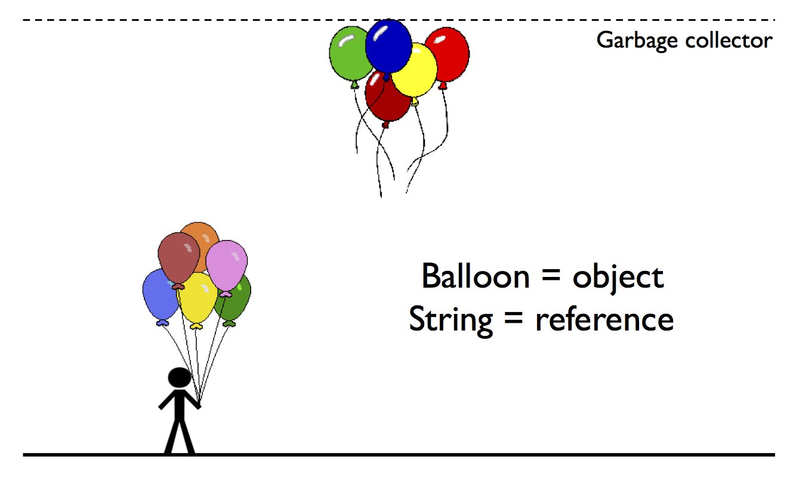

## C/C++ memory model

* All data in your application is stored in the same physical memory

* The memory used by each application is logically divided into the *stack* and
the *heap*

## Stack

* managed by compiler (heap is managed by programmer)

* Fixed memory allocation provided to your application

* It is the operating system that specifies the size of the stack

* Stack memory is automatically managed for you by the compiler / processor

* Limited to local variables of fixed size

### Stack example
Fixed set of memory, so it's possible to get a seg fault (or stack overflow)
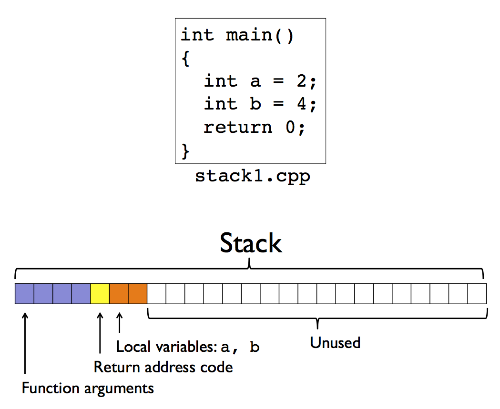

### Function call

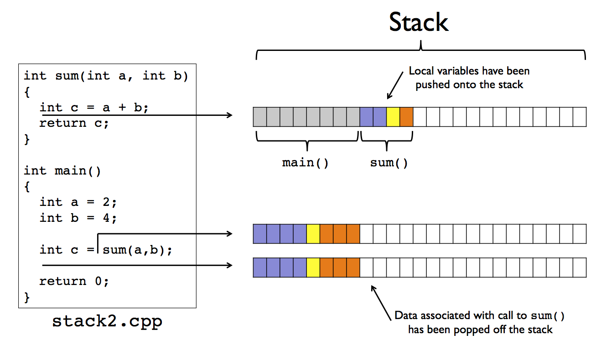

### Static arrays

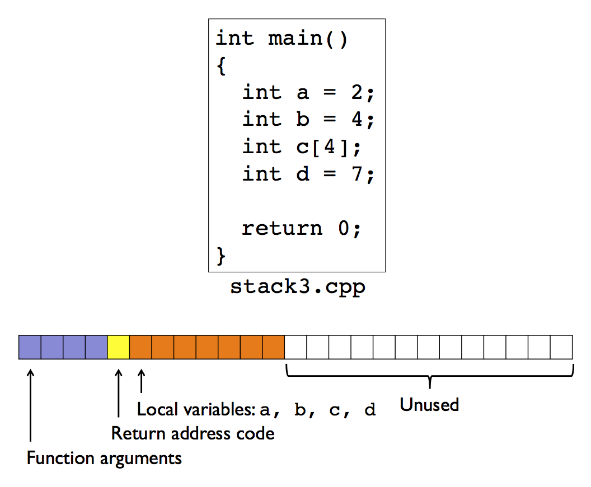

### Static array example

`src/stack4.cpp`:

```c++
#include <iostream>

int main() {
  int a[2048][2048];
  a[0][0] = 42;
  std::cout << "a[0][0] = " << a[0][0] << std::endl;
  return 0;
}
```

Output:

```
$ g++ -Wall -Wextra -Wconversion src/stack4.cpp -o src/stack4
$ ./src/stack4
Segmentation fault (core dumped)
```


### Static size limit
stack size is only 4096
this command, ulimit -a tells you all the properties you might be interested in
max memory size is usually set on clusters
cpu time is interesting- tells you in seconds
Output:

```
$ ulimit -a
core file size          (blocks, -c) 0
data seg size           (kbytes, -d) unlimited
file size               (blocks, -f) unlimited
max locked memory       (kbytes, -l) unlimited
max memory size         (kbytes, -m) unlimited
open files                      (-n) 256
pipe size            (512 bytes, -p) 1
stack size              (kbytes, -s) 8515
cpu time               (seconds, -t) unlimited
max user processes              (-u) 709
virtual memory          (kbytes, -v) unlimited
```

### Modifying the stack size limit
sometimes may not be able to change on corn
only modifies for whatever session you're in (close terminal, thne it goes back)

```
$ ulimit -s unlimited
-bash: ulimit: stack size: cannot modify limit: Operation not permitted
$ ulimit -s 16384
-bash: ulimit: stack size: cannot modify limit: Operation not permitted
$ ulimit -s 4096
$
```

* On `corn` we cannot make the stack size larger, but we can make it smaller!

### Stack size
We're pushing a ton of data back- they get managed on the heap;
They run just fine even though they are huge just because these containers manage data on the heap
`src/stack5.cpp`:

```c++
#include <vector>

#include "boost/multi_array.hpp"

int main() {
  std::vector<unsigned int> a;
  for(unsigned int i = 0; i < 8192*8192; i++)
    a.push_back(i);

  boost::multi_array<unsigned int, 2> b(boost::extents[8192][8192]);

  return 0;
}
```

### Stack size

Output:

```
$ ulimit -a
core file size          (blocks, -c) 0
data seg size           (kbytes, -d) unlimited
file size               (blocks, -f) unlimited
max locked memory       (kbytes, -l) unlimited
max memory size         (kbytes, -m) unlimited
open files                      (-n) 256
pipe size            (512 bytes, -p) 1
stack size              (kbytes, -s) 8515
cpu time               (seconds, -t) unlimited
max user processes              (-u) 709
virtual memory          (kbytes, -v) unlimited
$ g++ -std=c++11 -Wall -Wextra -Wconversion src/stack5.cpp -o src/stack5
$ ./src/stack5
```

## Heap

* worry about impacts of memory leaks (short programs, doesn't matter since program cleans up)

* Can contain data of arbitrary size (subject to available computer resources
like total memory)

* Accessible by any function (global scope)

* Has the life of the program

* *Managed by programmer*

### Using heap memory

* You need to allocate heap memory (get a pointer to memory that has been allocated, usu a contiguous block. when you're done with that memory, you need to free it up)

* The location of the allocated memory is stored in a pointer, a special
variable which stores a memory address

* When you are done using the memory you need to free the memory

### Pointers

Declaration of a pointer is denoted by a `*` in front of the variable name
  (after the type)

* `int a;`: variable `a` will contain an integer (memory on the stack)

* `int *b;`: variable `b` will contain a memory address where an integer is (declares a pointer)
  stored

* `int* b;`: equivalent to `int *b;`.  This is my prefered style.  I would read
  it as: "`b` is a variable containing a pointer to an int".  Hint: read C and
  C++ type declarations backwards.

### Pointers contain addresses
& returns memory address (give me the address of the data stored at a)
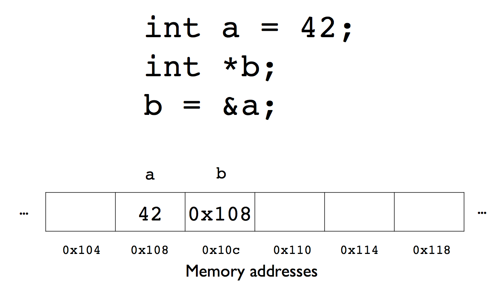

### Many roles of the `*`

* We've already seen that the asterisk is used to denote the declaration of a
pointer

* The asterisk is also used to access the data at the memory address stored in a
pointer

* This operation is typically call *dereferencing*

### Dereferencing a pointer

`src/pointer1.cpp`:

```c++
#include <iostream>

int main() {
  int a = 42;
  int* b; // b is a pointer to an int

  std::cout << " a = " << a << std::endl;
  std::cout << "&a = " << &a << std::endl;

  b = &a; // here & is the "address of" operator

  // show the value of the pointer
  std::cout << " b = " << b << std::endl;

  // dereference the pointer, give us value that is stored at the memory address
  std::cout << "*b = " << *b << std::endl;

  return 0;
}
```

Output:

```
$ g++ -std=c++11 -Wall -Wextra -Wconversion src/pointer1.cpp -o src/pointer1
$ ./src/pointer1
 a = 42
<<<<<<< HEAD
&a = 0x7ffdf7b3efa4 //address of a
 b = 0x7ffdf7b3efa4 //assign address of a to b
*b = 42 //dereference b, returns value stored at this memory address
=======
&a = 0x7fff5a43fad8
 b = 0x7fff5a43fad8
*b = 42
>>>>>>> upstream/master
```

### Store a value at a memory address

The asterisk in front of a pointer has a different meaning when it appears on
the left of the assignment operator (`=`)

```c++
int a = 42;
int *b;
b = &a;
// store the value 7 at the memory address in b
*b = 7;
```

### Storing a value

You can have a pointer to a pointer, but cannot get an address to an address

`src/pointer2.cpp`:

```c++
#include <iostream>

int main() {
  int a = 42;
  int *b;
  b = &a;

  std::cout << " a = " << a << std::endl;
  std::cout << "&a = " << &a << std::endl;
  std::cout << " b = " << b << std::endl;
  std::cout << "*b = " << *b << std::endl;

  // Store the value 7 at the
  // memory address stored in b
  *b = 7;

  std::cout << " a = " << a << std::endl;
  std::cout << "&a = " << &a << std::endl;
  std::cout << " b = " << b << std::endl;
  std::cout << "*b = " << *b << std::endl;

  return 0;
}
```

Output:

```
$ g++ -std=c++11 -Wall -Wextra -Wconversion src/pointer2.cpp -o src/pointer2
$ ./src/pointer2
 a = 42
&a = 0x7fff5ebc9a98
 b = 0x7fff5ebc9a98
*b = 42
 a = 7
&a = 0x7fff5ebc9a98
 b = 0x7fff5ebc9a98
*b = 7
```

### Increment
we have a pointer to an int and want to increment

`src/increment.cpp`:

```c++
#include <iostream>

void increment(int *a) {
  // Value at the memory
  // address is incremented
  (*a)++; //based on order operation
}

int main() {
  int a = 2;
  std::cout << "a = " << a << std::endl;

  // increment() receives copy of memory address for a
  increment(&a);
  std::cout << "a = " << a << std::endl;

  return 0;
}
```

Output:

```
$ g++ -std=c++11 -Wall -Wextra -Wconversion src/increment.cpp -o src/increment
$ ./src/increment
a = 2
a = 3
```

### Increment
as we exit functions, memory used on stack goes back down (since we arent using the functions)
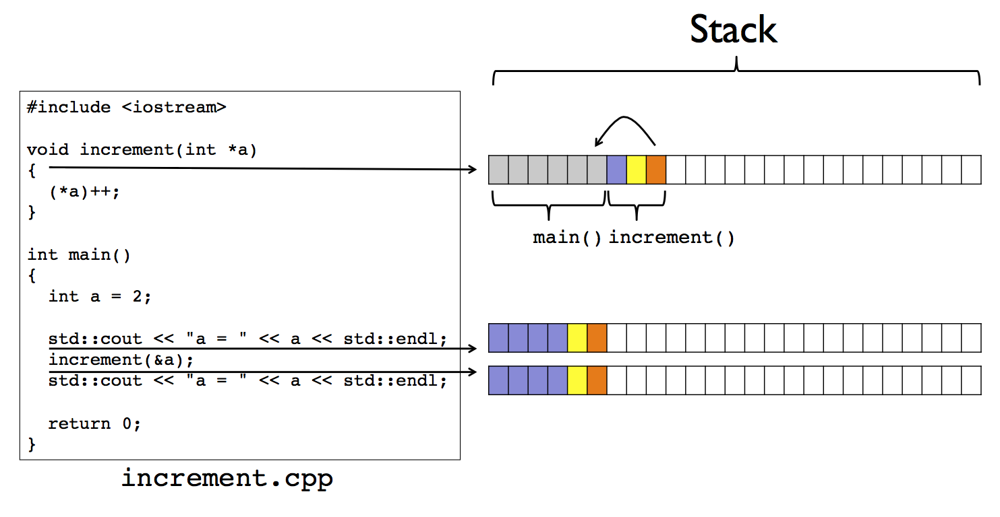

### Returning pointers
Cant return a pointer to a local variable of a function (since after you exit function, the pointer goes away). memory for the function has been elimated, so we get undefined behavior

`src/func.cpp`:

```c++
#include <iostream>

int* func(void) {
  int b = 2;
  return &b;
}

int main() {
  int *a = func();

  std::cout << " a = " << a << std::endl;
  std::cout << "*a = " << *a << std::endl;

  return 0;
}
```

Output:

```
$ g++ -std=c++11 -Wall -Wextra -Wconversion src/func.cpp -o src/func
src/func.cpp:5:11: warning: address of stack memory associated with local variable 'b' returned [-Wreturn-stack-address]
  return &b;
          ^
1 warning generated.
$ ./src/func
 a = 0x7fff5bcf4acc
*a = 32767
```

### Returning pointers

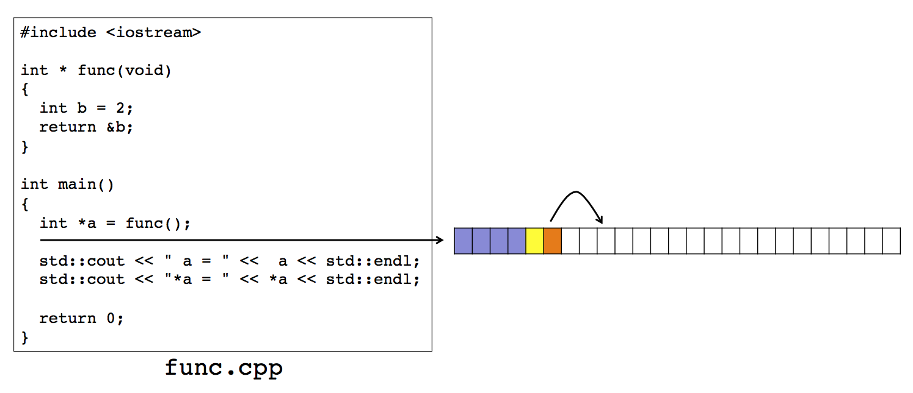

### Common mistake: pointer declaration

(There are many!)

`double *a, b;`

* `a` is a pointer to a double

* `b` is a double

`double *a, *b;`

* `a` is a pointer to a double

* `b` is a pointer to a double

`double* a, b;`

* `a` is a pointer to a double

* `b` is a **double**

### Many uses of `*`
Dereferencing, multiplication, and storage
`src/pointer3.cpp`:

```c++
#include <iostream>

int main() {
  int a = 4;
  int *b = &a;

  // * used for dereferencing, multiplication, and storage
  *b = *b**b; //deref b to get value (twice), then multiply -> (*b) * (*b)

  std::cout << "a = " << a << std::endl;

  return 0;
}
```

Output:

```
$ g++ -std=c++11 -Wall -Wextra -Wconversion src/pointer3.cpp -o src/pointer3
$ ./src/pointer3
a = 16
```

### Common mistake: uninitialized pointer

`src/pointer4.cpp`:

```c++
#include <iostream>

int main() {
  int *a;
  std::cout << "*a = " << *a << std::endl; //this accesses data and a random location in memory
  return 0;
}
```

Output:
This is an undefined behavior and could cause a seg fault
```
$ g++ -std=c++11 -Wall -Wextra -Wconversion src/pointer4.cpp -o src/pointer4
src/pointer4.cpp:5:28: warning: variable 'a' is uninitialized when used here [-Wuninitialized]
  std::cout << "*a = " << *a << std::endl;
                           ^
src/pointer4.cpp:4:9: note: initialize the variable 'a' to silence this warning
  int *a;
        ^
         = nullptr
1 warning generated.
$ ./src/pointer4
/bin/sh: line 1: 61024 Segmentation fault: 11  ./src/pointer4
```

### Suggestion
better to initialize to null pointer
essentially says a points to nothing

`src/pointer5.cpp`:

```c++
#include <iostream>

int main() {
  int *a = nullptr;
  std::cout << "*a = " << *a << std::endl;
  return 0;
}
```

Output:
if you dereference a null pointer, you get a seg fault (should show that below)
```
$ g++ -std=c++11 -Wall -Wextra -Wconversion src/pointer5.cpp -o src/pointer5
$ ./src/pointer5
/bin/sh: line 1: 61031 Segmentation fault: 11  ./src/pointer5
```

### `new`

* the `new` keyword *allocates* dynamic memory in the *heap*
* keyword "delete" frees the dynamic memory in the heap

* Works by setting aside a specified amount of *contiguous memory* and returning
the *starting address* (returns a pointer)

* No guarantees about the state of initialization (i.e. the memory will have
"random" data in it), but don't use as random number generator (it's pseudo random)

### Memory allocation

`src/new1.cpp`:

```c++
#include <iostream>
#include <string>

int main(int argc, char *argv[]) {
  if (argc < 2) return 1;
  unsigned int n = std::stoi(argv[1]);

  // Allocate storage for n double values and
  // store the starting address in a
  double *a = new double[n]; //type, pointer type to a variable type *a (new keyword) then number of items we want to allocate memory for (allocates memory for n doubles) 
  std::cout << "a = " << a << std::endl; //this is a pointer (mem address)

  for (unsigned int i = 0; i < n; i++)
    a[i] = i+3; 

  for (unsigned int i = 0; i < n; i++)
    std::cout << "a[" << i << "] = " << a[i] << std::endl;

  // Free the memory
  delete[] a;
  std::cout << "a = " << a << std::endl;
                  
  return 0;
}
```
If we only want to allocate memory for a single item (not n numbers), here's the syntax
```
double *a = new double;
delete a; //free mem
```

Output:

```
$ g++ -std=c++11 -Wall -Wextra -Wconversion src/new1.cpp -o src/new1
<<<<<<< HEAD
$ ./src/new1 2 //declared memory for 2 items
a = 0x8f5040
=======
src/new1.cpp:6:20: warning: implicit conversion changes signedness: 'int' to 'unsigned int' [-Wsign-conversion]
  unsigned int n = std::stoi(argv[1]);
               ~   ^~~~~~~~~~~~~~~~~~
1 warning generated.
$ ./src/new1 2 
a = 0x7fb562e00000
>>>>>>> upstream/master
a[0] = 3
a[1] = 4
a = 0x7fb562e00000
$ ./src/new1 4
a = 0x7fc033c031a0
a[0] = 3
a[1] = 4
a[2] = 5
a[3] = 6
a = 0x7fc033c031a0
```

### Memory allocation sequence

Step 1:

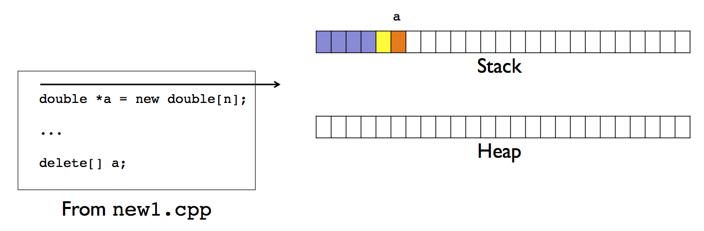

Step 2:
a now is a pointer to that memory on the heap
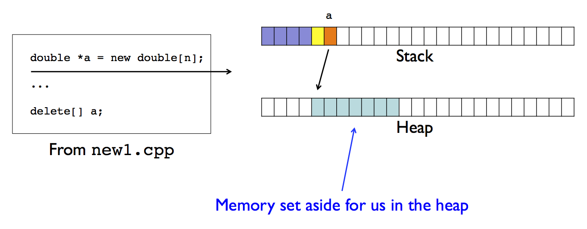

Step 3:
variable a still contains memory address allocated for us by the new command
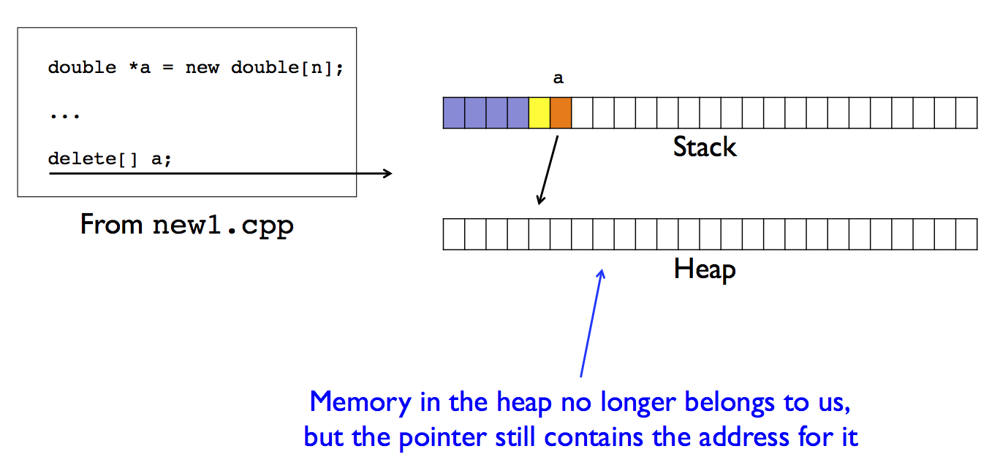

### Out of bounds access
Delete memory then try to access it (gives out of bounds error since the memory at pointer a is no longer allocated for our program)
`src/new2.cpp`:

```c++
#include <iostream>
#include <string>

int main(int argc, char *argv[]) {
  if (argc < 2) return 1;
  unsigned int n = std::stoi(argv[1]);

  double *a = new double[n];
  std::cout << "a = " << a << std::endl;

  delete[] a;
  std::cout << "a = " << a << std::endl;

  for (unsigned int i = 0; i < n; i++)
    a[i] = i+3; 

  for (unsigned int i = 0; i < n; i++)
    std::cout << "a[" << i << "] = " << a[i] << std::endl;

  return 0;
}
```

Output:

```
$ g++ -std=c++11 -Wall -Wextra -Wconversion src/new2.cpp -o src/new2
$ ./src/new2 2
a = 0xe98040
a = 0xe98040
a[0] = 3
a[1] = 4 // no issue for small sizes
$ ./src/new2 1048576
a = 0x7f8bf1c0b010
a = 0x7f8bf1c0b010
Segmentation fault (core dumped) // core dumped for larger sizes, undefined behavior based on size- > this is bad
```

### Use valgrind

* compile with `-g` flag

* run with `valgrind`

Give us invalid writes, good for finding out of bounds memory access and memory leaks

Output:

```
$ g++ -g -std=c++11 -Wall -Wextra -Wconversion src/new2.cpp -o src/new2
src/new2.cpp:6:20: warning: implicit conversion changes signedness: 'int' to 'unsigned int' [-Wsign-conversion]
  unsigned int n = std::stoi(argv[1]);
               ~   ^~~~~~~~~~~~~~~~~~
1 warning generated.
$ valgrind ./src/new2 4
==61046== Memcheck, a memory error detector
==61046== Copyright (C) 2002-2015, and GNU GPL'd, by Julian Seward et al.
==61046== Using Valgrind-3.11.0 and LibVEX; rerun with -h for copyright info
==61046== Command: ./src/new2 4
==61046== 
a = 0x100a72ea0
a = 0x100a72ea0
==61046== Invalid write of size 8
==61046==    at 0x100001099: main (new2.cpp:15)
==61046==  Address 0x100a72ea0 is 0 bytes inside a block of size 32 free'd
==61046==    at 0x10000B2F7: free (in /usr/local/Cellar/valgrind/3.11.0/lib/valgrind/vgpreload_memcheck-amd64-darwin.so)
==61046==    by 0x10000101E: main (new2.cpp:11)
==61046==  Block was alloc'd at
==61046==    at 0x10000AEBB: malloc (in /usr/local/Cellar/valgrind/3.11.0/lib/valgrind/vgpreload_memcheck-amd64-darwin.so)
==61046==    by 0x10004E7DD: operator new(unsigned long) (in /usr/lib/libc++.1.dylib)
==61046==    by 0x100000FAB: main (new2.cpp:8)
==61046== 
==61046== Invalid read of size 8
==61046==    at 0x10000112F: main (new2.cpp:18)
==61046==  Address 0x100a72ea0 is 0 bytes inside a block of size 32 free'd
==61046==    at 0x10000B2F7: free (in /usr/local/Cellar/valgrind/3.11.0/lib/valgrind/vgpreload_memcheck-amd64-darwin.so)
==61046==    by 0x10000101E: main (new2.cpp:11)
==61046==  Block was alloc'd at
==61046==    at 0x10000AEBB: malloc (in /usr/local/Cellar/valgrind/3.11.0/lib/valgrind/vgpreload_memcheck-amd64-darwin.so)
==61046==    by 0x10004E7DD: operator new(unsigned long) (in /usr/lib/libc++.1.dylib)
==61046==    by 0x100000FAB: main (new2.cpp:8)
==61046== 
a[0] = 3
a[1] = 4
a[2] = 5
a[3] = 6
==61046== 
==61046== HEAP SUMMARY:
==61046==     in use at exit: 38,600 bytes in 193 blocks
==61046==   total heap usage: 258 allocs, 65 frees, 44,344 bytes allocated
==61046== 
==61046== LEAK SUMMARY:
==61046==    definitely lost: 80 bytes in 1 blocks
==61046==    indirectly lost: 68 bytes in 2 blocks
==61046==      possibly lost: 0 bytes in 0 blocks
==61046==    still reachable: 16,384 bytes in 1 blocks
==61046==         suppressed: 22,068 bytes in 189 blocks
==61046== Rerun with --leak-check=full to see details of leaked memory
==61046== 
==61046== For counts of detected and suppressed errors, rerun with: -v
==61046== ERROR SUMMARY: 8 errors from 2 contexts (suppressed: 0 from 0)
```

### Suggestion

`src/new3.cpp`:

```c++
#include <iostream>
#include <string>

int main(int argc, char *argv[]) {
  if (argc < 2) return 1;
  unsigned int n = std::stoi(argv[1]);

  double *a = new double[n];

  delete[] a; // still contains memory address
  a = nullptr; //program will crash now, so easy for programmer to clean up

  for (unsigned int i = 0; i < n; i++)
    a[i] = i+3; 

  for (unsigned int i = 0; i < n; i++)
    std::cout << "a[" << i << "] = " << a[i] << std::endl;

  return 0;
}
```

```
$ g++ -std=c++11 -Wall -Wextra -Wconversion src/new3.cpp -o src/new3
$ ./src/new3 2
Segmentation fault (core dumped)
```

### Memory allocation in a function

`src/new4.cpp`:

```c++
#include <iostream>
#include <string>

double * AllocateArray(unsigned int n) {
  //Memory allocated, accessed, and pointer to it returned
  double *a = new double[n];
  for (unsigned int i = 0; i < n; i++) a[i] = 0.;
  return a;
}

int main(int argc, char *argv[]) {
  if (argc < 2) return 1;
  unsigned int n = std::stoi(argv[1]);

  // Returned memory address stored in stack variable
  double *a = AllocateArray(n);

  // Memory is now used by main()
  for (unsigned int i = 0; i < n; i++)
    a[i] = i+3; 
  for (unsigned int i = 0; i < n; i++)
    std::cout << "a[" << i << "] = " << a[i] << std::endl;

  delete[] a; // Memory is freed; memory leaks occur when you forget to free up memory
  a = NULL;

  return 0;
}
```

Output:

NOTE: nick doesnt know why theres a memory leak below. Should be freed and no problem (should be zero lost memory)
It is advised to used nullptr instead of NULL

```
$ g++ -std=c++11 -g -Wall -Wextra -Wconversion src/new4.cpp -o src/new4
src/new4.cpp:13:20: warning: implicit conversion changes signedness: 'int' to 'unsigned int' [-Wsign-conversion]
  unsigned int n = std::stoi(argv[1]);
               ~   ^~~~~~~~~~~~~~~~~~
1 warning generated.
$ valgrind ./src/new4 4
==61053== Memcheck, a memory error detector
==61053== Copyright (C) 2002-2015, and GNU GPL'd, by Julian Seward et al.
==61053== Using Valgrind-3.11.0 and LibVEX; rerun with -h for copyright info
==61053== Command: ./src/new4 4
==61053== 
a[0] = 3
a[1] = 4
a[2] = 5
a[3] = 6
==61053== 
==61053== HEAP SUMMARY:
==61053==     in use at exit: 38,600 bytes in 193 blocks
==61053==   total heap usage: 258 allocs, 65 frees, 44,344 bytes allocated
==61053== 
==61053== LEAK SUMMARY:
==61053==    definitely lost: 80 bytes in 1 blocks
==61053==    indirectly lost: 68 bytes in 2 blocks
==61053==      possibly lost: 0 bytes in 0 blocks
==61053==    still reachable: 16,384 bytes in 1 blocks
==61053==         suppressed: 22,068 bytes in 189 blocks
==61053== Rerun with --leak-check=full to see details of leaked memory
==61053== 
==61053== For counts of detected and suppressed errors, rerun with: -v
==61053== ERROR SUMMARY: 0 errors from 0 contexts (suppressed: 0 from 0)
```

### Memory leaks

`src/new5.cpp`:

```c++
#include <iostream>
#include <string>

void ProcessData(double *a, unsigned int n) {
  // temporary allocation for processing a
  // Memory is allocated but never freed
  double *tmp = new double[n]; 
  for (unsigned int i = 0; i < n; i++) tmp[i] = 0.;

  // Process a
  a[0] = tmp[0];
  
  return;
}

int main(int argc, char *argv[]) {
  if (argc < 2) return 1;
  unsigned int n = std::stoi(argv[1]);

  double *a = new double[n];

  // Process a
  ProcessData(a, n);

  delete[] a;
  a = nullptr;//this is good since it finds the segmentation fault very quickly

  return 0;
}
```

Output:
we never freed tmp memory

```
$ g++ -std=c++11 -g -Wall -Wextra -Wconversion src/new5.cpp -o src/new5
src/new5.cpp:18:20: warning: implicit conversion changes signedness: 'int' to 'unsigned int' [-Wsign-conversion]
  unsigned int n = std::stoi(argv[1]);
               ~   ^~~~~~~~~~~~~~~~~~
1 warning generated.
$ valgrind ./src/new5 4
==61060== Memcheck, a memory error detector
==61060== Copyright (C) 2002-2015, and GNU GPL'd, by Julian Seward et al.
==61060== Using Valgrind-3.11.0 and LibVEX; rerun with -h for copyright info
==61060== Command: ./src/new5 4
==61060== 
==61060== 
==61060== HEAP SUMMARY:
==61060==     in use at exit: 22,100 bytes in 190 blocks
==61060==   total heap usage: 255 allocs, 65 frees, 27,844 bytes allocated
==61060== 
==61060== LEAK SUMMARY:
==61060==    definitely lost: 32 bytes in 1 blocks
==61060==    indirectly lost: 0 bytes in 0 blocks
==61060==      possibly lost: 0 bytes in 0 blocks
==61060==    still reachable: 0 bytes in 0 blocks
==61060==         suppressed: 22,068 bytes in 189 blocks
==61060== Rerun with --leak-check=full to see details of leaked memory
==61060== 
==61060== For counts of detected and suppressed errors, rerun with: -v
==61060== ERROR SUMMARY: 0 errors from 0 contexts (suppressed: 0 from 0)
```

### C++ memory management

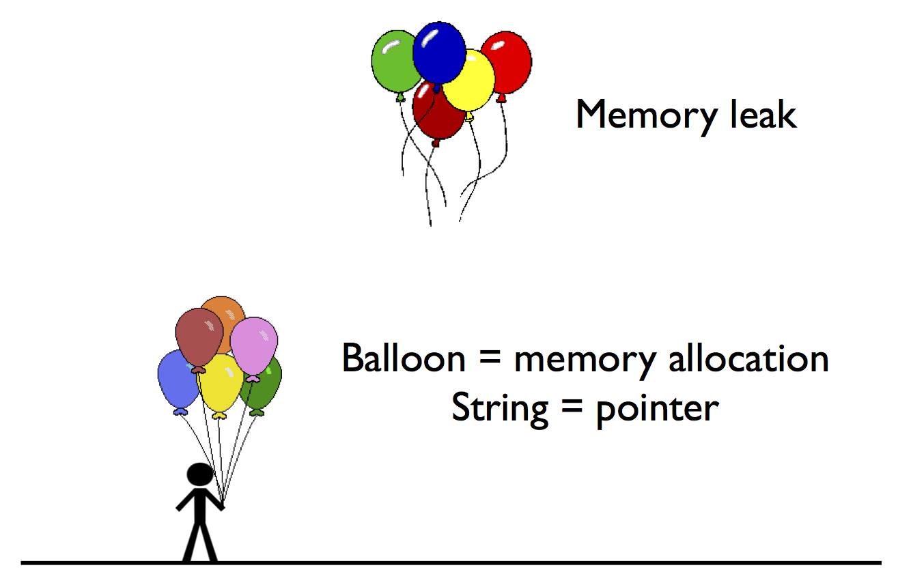

## Containers

* Object is a stack variable

* One (or more) data attributes point to heap memory

### Vector implementation

`src/MyVector1.hpp`:

```c++
#pragma once

class MyVector
{
 private:
  int *data;
  unsigned int size;
  unsigned int capacity;
 public:
  MyVector(); // constructor
  void push_back(int val);
  void print(void);
};
```

`src/MyVector1.cpp`:

```c++
#include <iostream>

#include "MyVector1.hpp"

MyVector::MyVector() {
  size = 0;
  capacity = 10;
  data = new int[capacity];
}

void MyVector::push_back(int val) {
  if (size < capacity) {
    data[size] = val;
    size++;
  }
  else {
    // A real implementation would resize the capacity
    std::cerr << "Vector is full" << std::endl;
    exit(1); 
  }
}

void MyVector::print() {
  using std::cout;
  using std::endl;
  cout << "[";
  bool comma = false;
  for (unsigned int i = 0; i < size; ++i) {
    if (comma) {
      cout << ", ";
    }
    else {
      comma = true;
    }
    cout << data[i];
  }
  cout << ']';
}
```

`src/main1.cpp`:

```c++
#include <iostream>
#include "MyVector1.hpp"

void func(void) {
  // Create an instance of the MyVector class
  MyVector v;
  v.push_back(7);
  v.push_back(42);
  v.print();
  std::cout << std::endl;
}

int main() {
  func();
  return 0;
}
```

Output:

```
$ g++ -g -std=c++11 -Wall -Wextra -Wconversion src/main1.cpp src/MyVector1.cpp -o src/main1
$ ./src/main1
[7, 42]
```

### Memory leak

we did not free up memory that was allocated in constructor (need a destructor)

Output:

```
$ valgrind ./src/main1
==61070== Memcheck, a memory error detector
==61070== Copyright (C) 2002-2015, and GNU GPL'd, by Julian Seward et al.
==61070== Using Valgrind-3.11.0 and LibVEX; rerun with -h for copyright info
==61070== Command: ./src/main1
==61070== 
[7, 42]
==61070== 
==61070== HEAP SUMMARY:
==61070==     in use at exit: 38,492 bytes in 191 blocks
==61070==   total heap usage: 255 allocs, 64 frees, 44,204 bytes allocated
==61070== 
==61070== LEAK SUMMARY:
==61070==    definitely lost: 40 bytes in 1 blocks
==61070==    indirectly lost: 0 bytes in 0 blocks
==61070==      possibly lost: 0 bytes in 0 blocks
==61070==    still reachable: 16,384 bytes in 1 blocks
==61070==         suppressed: 22,068 bytes in 189 blocks
==61070== Rerun with --leak-check=full to see details of leaked memory
==61070== 
==61070== For counts of detected and suppressed errors, rerun with: -v
==61070== ERROR SUMMARY: 0 errors from 0 contexts (suppressed: 0 from 0)
```

## Destructor

Need to declare as ~<class Name>
here is where we delete memory allocation to avoid memory leaks


`src/MyVector2.hpp`:

```c++
#pragma once

class MyVector
{
 private:
  int *data;
  unsigned int size;
  unsigned int capacity;
 public:
  MyVector();
  void push_back(int val);
  void print(void);
  ~MyVector();
};
```

From `src/MyVector2.cpp`:

```c++
MyVector::~MyVector() {
  delete[] data;
  data = nullptr;
}
```

Output:

```
$ g++ -g -std=c++11 -Wall -Wextra -Wconversion src/main2.cpp src/MyVector2.cpp -o src/main2
$ ./src/main2
[7, 42]
$ valgrind ./src/main2
==61080== Memcheck, a memory error detector
==61080== Copyright (C) 2002-2015, and GNU GPL'd, by Julian Seward et al.
==61080== Using Valgrind-3.11.0 and LibVEX; rerun with -h for copyright info
==61080== Command: ./src/main2
==61080== 
[7, 42]
==61080== 
==61080== HEAP SUMMARY:
==61080==     in use at exit: 38,452 bytes in 190 blocks
==61080==   total heap usage: 255 allocs, 65 frees, 44,204 bytes allocated
==61080== 
==61080== LEAK SUMMARY:
==61080==    definitely lost: 0 bytes in 0 blocks
==61080==    indirectly lost: 0 bytes in 0 blocks
==61080==      possibly lost: 0 bytes in 0 blocks
==61080==    still reachable: 16,384 bytes in 1 blocks
==61080==         suppressed: 22,068 bytes in 189 blocks
==61080== Rerun with --leak-check=full to see details of leaked memory
==61080== 
==61080== For counts of detected and suppressed errors, rerun with: -v
==61080== ERROR SUMMARY: 0 errors from 0 contexts (suppressed: 0 from 0)
```

### C++ memory management

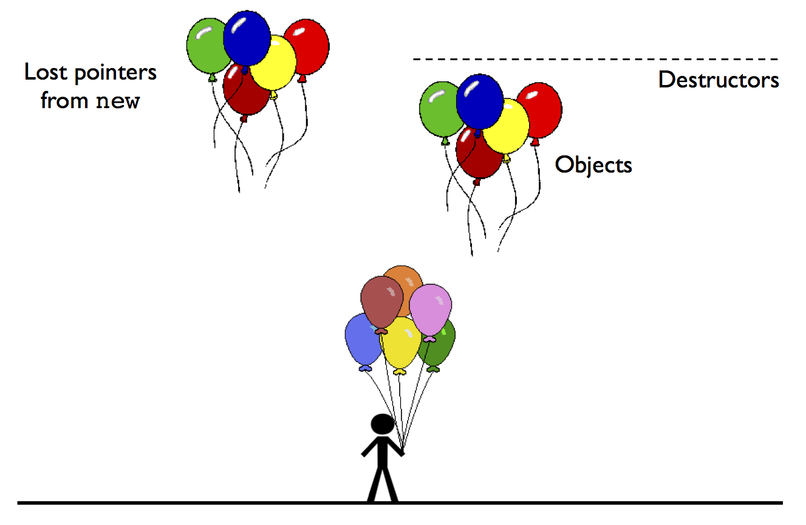

## Reading

**C++ Primer, Fifth Edition** by Lippman et al:

* Section 2.3.2: Pointers

* Section 12.2: Dynamic Arrays

* Section 7.1.5: Destruction


## Monday 11/30 Notes
when adding two vectors,
-pass by ref input vectors
-dont push back
-pass c=a+b, and pass vector c by ref too

ex: void add_vec(const vec &a, const vec &b, vec &c), then do c=a + b (const says that a and b would not change)
and make the fuction void
can do c.resize(a.size())
if (a.size() != b.size()) //handle error

3 short questions with 5 parts for C++
1 num python (vectorized operations), 1 C++
NO memory management


numpy operations
b[:] = 0 //initialize vector b 
q[:] = g[:]
np.dot(P,b) //dot product

c = a + b is a vectorized operation for doing addition
np.sum
np.min
np.linalg.norm() gives 2-norm of vector


matrix A... do A = np.random.rand(5,5)
to zero out 3rd column, do
A[:,2] = 0

to sum across rows, do A.sum(axis=1) #to sum over columns, axis = 0

A[row,col] 

to sum all entries greater than .5, can do A>= 0.5 to get a 2D boolean array, so A[A>=0.5] will give an array that fulfills this criteria 
