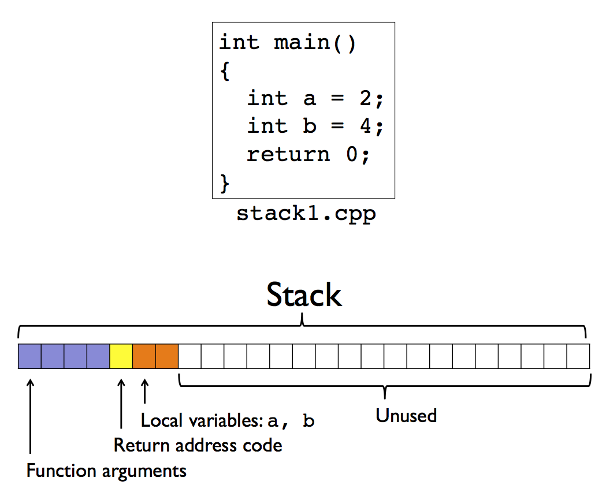
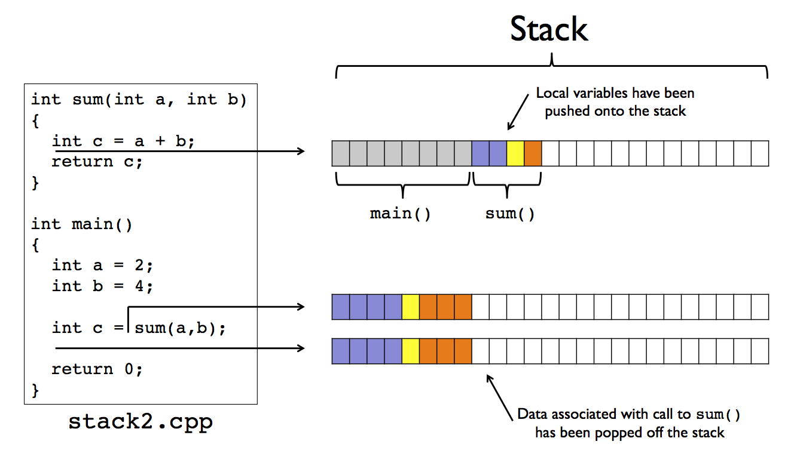

# CME 211: Lecture 25

Friday, November 20, 2015

Topic: C++ memory management

## Python memory management


## C/C++ memory model

* All data in your application is stored in the same physical memory

* The memory used by each application is logically divided into the *stack* and
the *heap*

## Stack

* Fixed memory allocation provided to your application

* It is the operating system that specifies the size of the stack

* Stack memory is automatically managed for you by the compiler / processor

* Limited to local variables of fixed size

### Stack example



### Function call



### Static arrays


### Static array example

!include src/stack4.cpp c++

Output:

```
$ g++ -Wall -Wextra -Wconversion src/stack4.cpp -o src/stack4
$ ./src/stack4
Segmentation fault (core dumped)
```


### Static size limit

!run
ulimit -a
!end

### Modifying the stack size limit

```
$ ulimit -s unlimited
-bash: ulimit: stack size: cannot modify limit: Operation not permitted
$ ulimit -s 16384
-bash: ulimit: stack size: cannot modify limit: Operation not permitted
$ ulimit -s 4096
$
```

* On `corn` we cannot make the stack size larger, but we can make it smaller!

### Stack size

!include src/stack5.cpp c++

### Stack size

!run
ulimit -a
g++ -std=c++11 -Wall -Wextra -Wconversion src/stack5.cpp -o src/stack5
./src/stack5
!end

## Heap

* Can contain data of arbitrary size (subject to available computer resources
like total memory)

* Accessible by any function (global scope)

* Has the life of the program

* *Managed by programmer*

### Using heap memory

* You need to allocate heap memory

* The location of the allocated memory is stored in a pointer, a special
variable which stores a memory address

* When you are done using the memory you need to free the memory

### Pointers

Declaration of a pointer is denoted by a `*` in front of the variable name
  (after the type)

* `int a;`: variable `a` will contain an integer

* `int *b;`: variable `b` will contain a memory address where an integer is
  stored

* `int* b;`: equivalent to `int *b;`.  This is my prefered style.  I would read
  it as: "`b` is a variable containing a pointer to an int".  Hint: read C and
  C++ type declarations backwards.

### Pointers contain addresses


### Many roles of the `*`

* We've already seen that the asterisk is used to denote the declaration of a
pointer

* The asterisk is also used to access the data at the memory address stored in a
pointer

* This operation is typically call *dereferencing*

### Dereferencing a pointer

!include src/pointer1.cpp c++

!run
g++ -std=c++11 -Wall -Wextra -Wconversion src/pointer1.cpp -o src/pointer1
./src/pointer1
!end

### Store a value at a memory address

The asterisk in front of a pointer has a different meaning when it appears on
the left of the assignment operator (`=`)

```c++
int a = 42;
int *b;
b = &a;
// store the value 7 at the memory address in b
*b = 7;
```

### Storing a value

!include src/pointer2.cpp c++

!run
g++ -std=c++11 -Wall -Wextra -Wconversion src/pointer2.cpp -o src/pointer2
./src/pointer2
!end

### Increment

!include src/increment.cpp c++

!run
g++ -std=c++11 -Wall -Wextra -Wconversion src/increment.cpp -o src/increment
./src/increment
!end

### Increment


### Returning pointers

!include src/func.cpp c++

!run
g++ -std=c++11 -Wall -Wextra -Wconversion src/func.cpp -o src/func
./src/func
!end

### Returning pointers


### Common mistake: pointer declaration

(There are many!)

`double *a, b;`

* `a` is a pointer to a double

* `b` is a double

`double *a, *b;`

* `a` is a pointer to a double

* `b` is a pointer to a double

`double* a, b;`

* `a` is a pointer to a double

* `b` is a **double**

### Many uses of `*`

!include src/pointer3.cpp c++

!run
g++ -std=c++11 -Wall -Wextra -Wconversion src/pointer3.cpp -o src/pointer3
./src/pointer3
!end

### Common mistake: uninitialized pointer

!include src/pointer4.cpp c++

!run
g++ -std=c++11 -Wall -Wextra -Wconversion src/pointer4.cpp -o src/pointer4
./src/pointer4
!end

### Suggestion

!include src/pointer5.cpp c++

!run
g++ -std=c++11 -Wall -Wextra -Wconversion src/pointer5.cpp -o src/pointer5
./src/pointer5
!end

### `new`

* the `new` keyword *allocates* dynamic memory in the *heap*

* Works by setting aside a specified amount of *contiguous memory* and returning
the *starting address*

* No guarantees about the state of initialization (i.e. the memory will have
"random" data in it)

### Memory allocation

!include src/new1.cpp c++

!run
g++ -std=c++11 -Wall -Wextra -Wconversion src/new1.cpp -o src/new1
./src/new1 2
./src/new1 4
!end

### Memory allocation sequence

Step 1:


Step 2:


Step 3:


### Out of bounds access

!include src/new2.cpp c++

Output:

```
$ g++ -std=c++11 -Wall -Wextra -Wconversion src/new2.cpp -o src/new2
$ ./src/new2 2
a = 0xe98040
a = 0xe98040
a[0] = 3
a[1] = 4
$ ./src/new2 1048576
a = 0x7f8bf1c0b010
a = 0x7f8bf1c0b010
Segmentation fault (core dumped)
```

### Use valgrind

* compile with `-g` flag

* run with `valgrind`

!run
g++ -g -std=c++11 -Wall -Wextra -Wconversion src/new2.cpp -o src/new2
valgrind ./src/new2 4
!end

### Suggestion

!include src/new3.cpp c++

```
$ g++ -std=c++11 -Wall -Wextra -Wconversion src/new3.cpp -o src/new3
$ ./src/new3 2
Segmentation fault (core dumped)
```

### Memory allocation in a function

!include src/new4.cpp c++

!run
g++ -std=c++11 -g -Wall -Wextra -Wconversion src/new4.cpp -o src/new4
valgrind ./src/new4 4
!end

### Memory leaks

!include src/new5.cpp c++

!run
g++ -std=c++11 -g -Wall -Wextra -Wconversion src/new5.cpp -o src/new5
valgrind ./src/new5 4
!end

### C++ memory management


## Containers

* Object is a stack variable

* One (or more) data attributes point to heap memory

### Vector implementation

!include src/MyVector1.hpp c++

!include src/MyVector1.cpp c++

!include src/main1.cpp c++

!run
g++ -g -std=c++11 -Wall -Wextra -Wconversion src/main1.cpp src/MyVector1.cpp -o src/main1
./src/main1
!end

### Memory leak

!run
valgrind ./src/main1
!end

## Destructor

!include src/MyVector2.hpp c++

From `src/MyVector2.cpp`:

```c++
MyVector::~MyVector() {
  delete[] data;
  data = nullptr;
}
```

!run
g++ -g -std=c++11 -Wall -Wextra -Wconversion src/main2.cpp src/MyVector2.cpp -o src/main2
./src/main2
valgrind ./src/main2
!end

### C++ memory management


## Reading

**C++ Primer, Fifth Edition** by Lippman et al:

* Section 2.3.2: Pointers

* Section 12.2: Dynamic Arrays

* Section 7.1.5: Destruction
